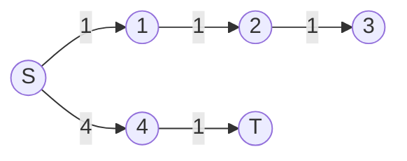
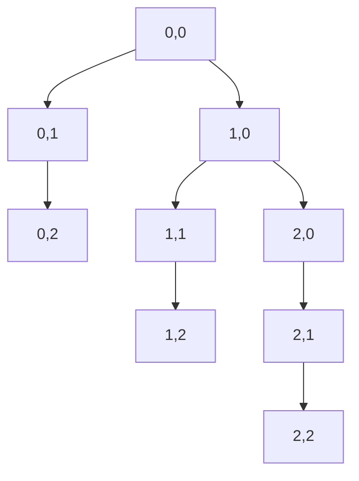

# A*搜索算法


## 一、问题背景

在游戏寻路、地图导航等场景中，我们需要在巨大地图中**快速找到一条接近最短的路线**。

- Dijkstra 算法能保证最短路径，但搜索方向"盲目"，在超大图上效率低
- 实际应用中，往往不需要**绝对最短**，只需**次优但足够快**

**A\* 算法**就是对 Dijkstra 的启发式改进：引入"终点方向估计"，让搜索不再跑偏。

## 二、从 Dijkstra 到 A*

### 2.1 Dijkstra 的"跑偏"问题

Dijkstra 按 `g(i)`（起点到当前点的实际距离）选择下一个扩展点。在地图场景中，这导致搜索可能朝远离终点的方向扩展。



> 上图中，Dijkstra 会先扩展 1→2→3（离 S 近），但终点 T 在另一侧。

### 2.2 A* 的改进：引入启发函数

A\* 综合考虑两个因素：

| 符号 | 含义 |
|------|------|
| g(i) | 起点到顶点 i 的**实际路径长度** |
| h(i) | 顶点 i 到终点的**估计距离**（启发函数） |
| f(i) = g(i) + h(i) | **估价函数**，决定扩展优先级 |

每次从优先队列中取 **f 值最小**的顶点扩展，搜索方向被"拉向"终点。

## 三、启发函数设计

### 3.1 曼哈顿距离（推荐）

```text
h(i) = |x_i - x_t| + |y_i - y_t|
```

- 只涉及加减法和绝对值，计算极快
- 适用于四方向移动的网格地图

### 3.2 欧几里得距离

```text
h(i) = sqrt((x_i - x_t)² + (y_i - y_t)²)
```

- 更精确，但涉及开方运算，较慢
- 适用于任意方向移动的场景

### 3.3 启发函数的约束

> h(i) 必须 ≤ 实际最短距离（**可采纳性**），否则 A\* 退化为贪心搜索，可能找不到较优解。

## 四、算法实现

### 4.1 与 Dijkstra 的三点区别

| 对比项 | Dijkstra | A* |
|--------|----------|-----|
| 优先队列排序依据 | g(i) | f(i) = g(i) + h(i) |
| 更新顶点时 | 只更新 dist | 同步更新 f 值 |
| 终止条件 | 终点**出队列**时结束 | **遍历到终点**即结束 |

### 4.2 代码实现

```java tab
public void astar(int s, int t, int[][] coords) {
    int n = graph.length;
    int[] dist = new int[n];
    int[] f = new int[n];
    int[] prev = new int[n];
    Arrays.fill(dist, Integer.MAX_VALUE);
    Arrays.fill(f, Integer.MAX_VALUE);

    // 按 f 值排序的小顶堆
    PriorityQueue<int[]> pq = new PriorityQueue<>((a, b) -> a[1] - b[1]);
    dist[s] = 0;
    f[s] = heuristic(coords[s], coords[t]);
    pq.offer(new int[]{s, f[s]});

    while (!pq.isEmpty()) {
        int[] cur = pq.poll();
        int u = cur[0];

        if (u == t) break; // 到达终点即结束

        for (int[] edge : graph[u]) {
            int v = edge[0], w = edge[1];
            if (dist[u] + w < dist[v]) {
                dist[v] = dist[u] + w;
                f[v] = dist[v] + heuristic(coords[v], coords[t]);
                prev[v] = u;
                pq.offer(new int[]{v, f[v]});
            }
        }
    }
    // 通过 prev 数组还原路径
}

private int heuristic(int[] a, int[] b) {
    return Math.abs(a[0] - b[0]) + Math.abs(a[1] - b[1]);
}
```

```python tab
import heapq

def astar(graph, coords, s, t):
    n = len(graph)
    dist = [float('inf')] * n
    f = [float('inf')] * n
    prev = [-1] * n

    def h(i):
        return abs(coords[i][0] - coords[t][0]) + abs(coords[i][1] - coords[t][1])

    dist[s] = 0
    f[s] = h(s)
    pq = [(f[s], s)]

    while pq:
        _, u = heapq.heappop(pq)
        if u == t:
            break
        for v, w in graph[u]:
            if dist[u] + w < dist[v]:
                dist[v] = dist[u] + w
                f[v] = dist[v] + h(v)
                prev[v] = u
                heapq.heappush(pq, (f[v], v))

    # 还原路径
    path = []
    cur = t
    while cur != -1:
        path.append(cur)
        cur = prev[cur]
    return path[::-1]
```

## 五、网格地图寻路

游戏中的地图通常抽象为**网格图**：

- 每个格子 = 一个顶点
- 相邻格子之间连边，权值为 1（或带地形权重）
- 障碍物对应的顶点不可通行



> 在网格图上，A\* 用曼哈顿距离作为启发函数，搜索效率远高于 BFS/Dijkstra。

## 六、A* 的正确性与局限

### 6.1 为什么不保证最短路径？

A\* 在**遍历到终点时立即结束**，此时终点的 dist 值未必是全局最小。它利用贪心思路，只找"看起来最好"的路径。

### 6.2 何时退化为 Dijkstra？

当 h(i) = 0（即不使用启发函数）时，f(i) = g(i)，A\* 完全退化为 Dijkstra。

### 6.3 何时找到最短路径？

如果 h(i) 满足**一致性**（consistency）：h(u) ≤ w(u,v) + h(v)，且终点**出队列**时才结束，则 A\* 也能保证最短路径。

## 七、应用场景

| 场景 | 说明 |
|------|------|
| 游戏 NPC 寻路 | 魔兽、仙剑等 MMRPG 自动寻路 |
| 地图导航 | 高德/Google Maps 路线规划 |
| 机器人路径规划 | 仓储机器人避障 |
| 迷宫求解 | 比 BFS 更快找到出口 |
| 拼图/八数码问题 | IDA* 变体 |

## 八、相关算法族

| 算法 | 特点 |
|------|------|
| Dijkstra | 保证最短，无启发 |
| A* | 启发式，速度快，次优解 |
| IDA* | 迭代加深 A*，省内存 |
| D* Lite | 动态环境增量搜索 |
| JPS | 跳点搜索，网格图加速 |

## 九、总结

A\* 的核心公式：**f(i) = g(i) + h(i)**

- g(i)：已走过的路（确定值）
- h(i)：估计还要走的路（启发值）
- 两者结合，让搜索"有方向感"

设计启发函数时的权衡：h 越大搜索越快，但越容易偏离最优解；h = 0 退化为 Dijkstra。
