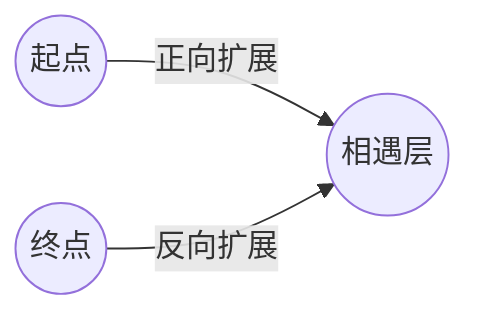
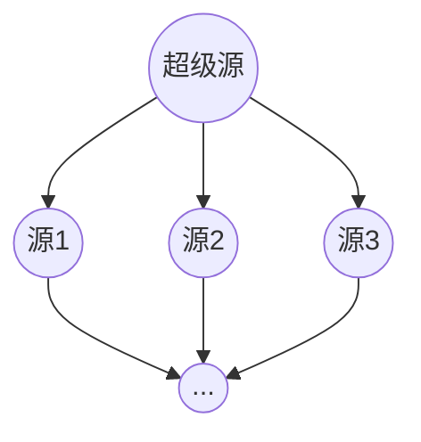
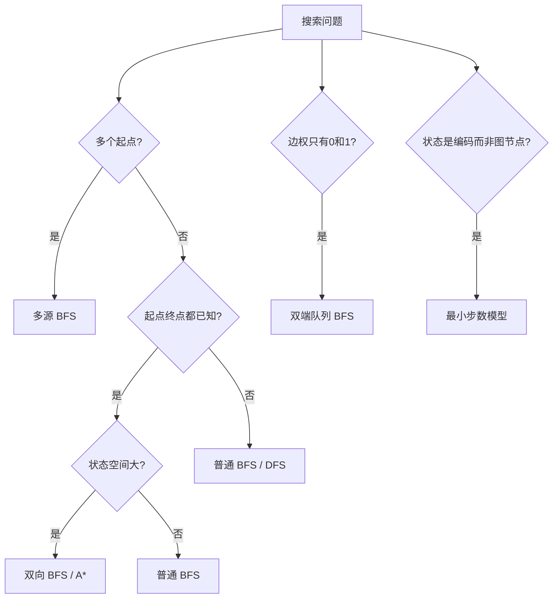

# 高级 BFS 专题：双向搜索、多源扩散与最小步数模型


## 一、为什么需要"高级 BFS"

基础 BFS 从单一起点逐层扩展，能解决无权图最短路。但面试中有三类变体让朴素 BFS 力不从心：

| 场景 | 痛点 | 解法 |
|------|------|------|
| 起点→终点最短路（状态空间巨大） | 单向扩展节点数指数爆炸 | **双向 BFS** |
| 多个起点同时扩散（腐烂橘子、01矩阵） | 对每个源点跑一次 BFS 太慢 | **多源 BFS** |
| 状态变换最少步数（转盘锁、单词接龙） | 状态不是图节点而是"编码" | **最小步数模型** |

## 二、双向 BFS

### 2.1 核心思想

从起点和终点**同时扩展**，每次选节点数更少的一端扩展一层。当两端"相遇"（出现交集）时，步数之和即为最短路。



**为什么快？** 设分支因子为 b、最短距离为 d：
- 单向 BFS：O(b^d)
- 双向 BFS：O(b^(d/2)) + O(b^(d/2)) = O(b^(d/2))

当 b=10, d=6 时，单向需 10^6 节点，双向仅需 2×10^3。

### 2.2 适用条件

- 起点和终点**都已知**
- 扩展规则**对称**（正向能走的路，反向也能走）
- 状态可用 HashSet 存储（支持 O(1) 判交）

### 2.3 模板

```java tab
int bidirectionalBFS(String start, String end, Set<String> dict) {
    if (start.equals(end)) return 0;
    Set<String> head = new HashSet<>(), tail = new HashSet<>();
    Set<String> visited = new HashSet<>();
    head.add(start);
    tail.add(end);
    int step = 0;

    while (!head.isEmpty() && !tail.isEmpty()) {
        // 优化：每次扩展更小的一端
        if (head.size() > tail.size()) {
            Set<String> tmp = head; head = tail; tail = tmp;
        }
        Set<String> next = new HashSet<>();
        for (String cur : head) {
            for (String nb : expand(cur, dict)) {
                if (tail.contains(nb)) return step + 1;  // 相遇
                if (!visited.contains(nb)) {
                    visited.add(nb);
                    next.add(nb);
                }
            }
        }
        head = next;
        step++;
    }
    return -1;  // 不可达
}
```

```typescript tab
function bidirectionalBFS(
  start: string, end: string,
  expand: (s: string) => string[]
): number {
  if (start === end) return 0;
  let head = new Set([start]);
  let tail = new Set([end]);
  const visited = new Set<string>();
  let step = 0;

  while (head.size > 0 && tail.size > 0) {
    if (head.size > tail.size) [head, tail] = [tail, head];
    const next = new Set<string>();
    for (const cur of head) {
      for (const nb of expand(cur)) {
        if (tail.has(nb)) return step + 1;
        if (!visited.has(nb)) {
          visited.add(nb);
          next.add(nb);
        }
      }
    }
    head = next;
    step++;
  }
  return -1;
}
```

```python tab
from collections import deque

def bidirectional_bfs(start, end, expand):
    if start == end:
        return 0
    head, tail = {start}, {end}
    visited = set()
    step = 0
    while head and tail:
        if len(head) > len(tail):
            head, tail = tail, head
        nxt = set()
        for cur in head:
            for nb in expand(cur):
                if nb in tail:
                    return step + 1
                if nb not in visited:
                    visited.add(nb)
                    nxt.add(nb)
        head = nxt
        step += 1
    return -1
```

### 2.4 经典例题

| 题目 | 状态 | 扩展方式 |
|------|------|----------|
| LC 127. 单词接龙 | 单词字符串 | 逐位替换 a-z |
| LC 752. 打开转盘锁 | 4位数字串 | 每位 ±1 |
| LC 773. 滑动谜题 | 棋盘编码 | 空格与相邻交换 |

## 三、多源 BFS

### 3.1 核心思想

将**所有源点同时入队**作为第 0 层，然后正常 BFS。等价于添加一个"超级源点"连接所有源点。



### 3.2 模板

```java tab
int multiSourceBFS(int[][] grid) {
    int m = grid.length, n = grid[0].length;
    int[][] dist = new int[m][n];
    Deque<int[]> q = new ArrayDeque<>();

    // 所有源点同时入队
    for (int i = 0; i < m; i++)
        for (int j = 0; j < n; j++)
            if (grid[i][j] == SOURCE) {
                q.offer(new int[]{i, j});
                dist[i][j] = 0;
            } else {
                dist[i][j] = -1;  // 未访问
            }

    int[][] dirs = {{1,0},{-1,0},{0,1},{0,-1}};
    int maxDist = 0;
    while (!q.isEmpty()) {
        int[] cell = q.poll();
        for (int[] d : dirs) {
            int ni = cell[0] + d[0], nj = cell[1] + d[1];
            if (ni >= 0 && ni < m && nj >= 0 && nj < n && dist[ni][nj] == -1) {
                dist[ni][nj] = dist[cell[0]][cell[1]] + 1;
                maxDist = Math.max(maxDist, dist[ni][nj]);
                q.offer(new int[]{ni, nj});
            }
        }
    }
    return maxDist;
}
```

```typescript tab
function multiSourceBFS(grid: number[][], SOURCE: number): number {
  const m = grid.length, n = grid[0].length;
  const dist = Array.from({ length: m }, () => Array(n).fill(-1));
  const q: [number, number][] = [];

  for (let i = 0; i < m; i++)
    for (let j = 0; j < n; j++)
      if (grid[i][j] === SOURCE) { q.push([i, j]); dist[i][j] = 0; }

  const dirs = [[1,0],[-1,0],[0,1],[0,-1]];
  let maxDist = 0;
  let head = 0;
  while (head < q.length) {
    const [r, c] = q[head++];
    for (const [dr, dc] of dirs) {
      const nr = r + dr, nc = c + dc;
      if (nr >= 0 && nr < m && nc >= 0 && nc < n && dist[nr][nc] === -1) {
        dist[nr][nc] = dist[r][c] + 1;
        maxDist = Math.max(maxDist, dist[nr][nc]);
        q.push([nr, nc]);
      }
    }
  }
  return maxDist;
}
```

```python tab
from collections import deque

def multi_source_bfs(grid, source_val):
    m, n = len(grid), len(grid[0])
    dist = [[-1] * n for _ in range(m)]
    q = deque()
    for i in range(m):
        for j in range(n):
            if grid[i][j] == source_val:
                q.append((i, j))
                dist[i][j] = 0
    dirs = [(1,0),(-1,0),(0,1),(0,-1)]
    max_dist = 0
    while q:
        r, c = q.popleft()
        for dr, dc in dirs:
            nr, nc = r + dr, c + dc
            if 0 <= nr < m and 0 <= nc < n and dist[nr][nc] == -1:
                dist[nr][nc] = dist[r][c] + 1
                max_dist = max(max_dist, dist[nr][nc])
                q.append((nr, nc))
    return max_dist
```

### 3.3 经典例题

| 题目 | 源点 | 求什么 |
|------|------|--------|
| LC 994. 腐烂的橘子 | 所有腐烂橘子 | 全部腐烂的最短时间 |
| LC 542. 01 矩阵 | 所有 0 | 每个 1 到最近 0 的距离 |
| LC 1765. 地图中的最高点 | 所有水域 | 满足约束的最高海拔 |
| LC 1162. 地图分析 | 所有陆地 | 海洋离最近陆地的距离 |

## 四、最小步数模型

### 4.1 问题特征

- 状态不是"图上的节点"，而是某种**编码**（字符串、数字、棋盘布局）
- 每次操作将状态变换为另一个状态
- 求从初始状态到目标状态的**最少操作次数**

本质：在**隐式图**上跑 BFS，节点是状态，边是一次操作。

### 4.2 解题框架

```
1. 编码：将状态表示为可哈希的对象（String / int / tuple）
2. 扩展：枚举当前状态的所有合法下一步
3. BFS：用 HashSet 记录已访问，逐层扩展直到命中目标
4. 优化：状态空间大时用双向 BFS 或 A*
```

### 4.3 例题：打开转盘锁（LC 752）

状态：4 位数字字符串 "0000"~"9999"
操作：某一位 +1 或 -1（共 8 种下一步）
目标：从 "0000" 到 target，避开 deadends

```java tab
int openLock(String[] deadends, String target) {
    Set<String> dead = new HashSet<>(Arrays.asList(deadends));
    if (dead.contains("0000")) return -1;
    if ("0000".equals(target)) return 0;

    Set<String> head = Set.of("0000"), tail = Set.of(target);
    Set<String> visited = new HashSet<>(dead);
    int step = 0;

    while (!head.isEmpty() && !tail.isEmpty()) {
        if (head.size() > tail.size()) {
            Set<String> tmp = head; head = tail; tail = tmp;
        }
        Set<String> next = new HashSet<>();
        for (String cur : head) {
            for (String nb : getNeighbors(cur)) {
                if (tail.contains(nb)) return step + 1;
                if (!visited.contains(nb)) {
                    visited.add(nb);
                    next.add(nb);
                }
            }
        }
        head = next;
        step++;
    }
    return -1;
}

List<String> getNeighbors(String s) {
    List<String> res = new ArrayList<>();
    char[] arr = s.toCharArray();
    for (int i = 0; i < 4; i++) {
        char orig = arr[i];
        arr[i] = (char)('0' + (orig - '0' + 1) % 10);
        res.add(new String(arr));
        arr[i] = (char)('0' + (orig - '0' + 9) % 10);
        res.add(new String(arr));
        arr[i] = orig;
    }
    return res;
}
```

```typescript tab
function openLock(deadends: string[], target: string): number {
  const dead = new Set(deadends);
  if (dead.has('0000')) return -1;
  if (target === '0000') return 0;

  const getNeighbors = (s: string): string[] => {
    const res: string[] = [];
    const arr = s.split('');
    for (let i = 0; i < 4; i++) {
      const orig = arr[i];
      arr[i] = String((Number(orig) + 1) % 10);
      res.push(arr.join(''));
      arr[i] = String((Number(orig) + 9) % 10);
      res.push(arr.join(''));
      arr[i] = orig;
    }
    return res;
  };

  let head = new Set(['0000']);
  let tail = new Set([target]);
  const visited = new Set(dead);
  let step = 0;

  while (head.size > 0 && tail.size > 0) {
    if (head.size > tail.size) [head, tail] = [tail, head];
    const next = new Set<string>();
    for (const cur of head) {
      for (const nb of getNeighbors(cur)) {
        if (tail.has(nb)) return step + 1;
        if (!visited.has(nb)) {
          visited.add(nb);
          next.add(nb);
        }
      }
    }
    head = next;
    step++;
  }
  return -1;
}
```

```python tab
def openLock(deadends, target):
    dead = set(deadends)
    if '0000' in dead:
        return -1
    if target == '0000':
        return 0

    def neighbors(s):
        for i in range(4):
            d = int(s[i])
            yield s[:i] + str((d + 1) % 10) + s[i+1:]
            yield s[:i] + str((d + 9) % 10) + s[i+1:]

    head, tail = {'0000'}, {target}
    visited = dead.copy()
    step = 0
    while head and tail:
        if len(head) > len(tail):
            head, tail = tail, head
        nxt = set()
        for cur in head:
            for nb in neighbors(cur):
                if nb in tail:
                    return step + 1
                if nb not in visited:
                    visited.add(nb)
                    nxt.add(nb)
        head = nxt
        step += 1
    return -1
```

### 4.4 更多最小步数题目

| 题目 | 状态编码 | 扩展方式 |
|------|----------|----------|
| LC 127. 单词接龙 | 单词字符串 | 逐位替换 26 字母 |
| LC 773. 滑动谜题 | 棋盘字符串 | 空格与相邻交换 |
| LC 847. 访问所有节点的最短路径 | (节点, 访问掩码) | 走向邻居 |
| LC 2059. 转化数字的最小运算数 | 当前数值 | +x / -x / ^x |

## 五、双端队列 BFS（0-1 BFS）

当边权只有 0 和 1 时，用**双端队列**代替普通队列：
- 边权 0 → 插入队头（同层）
- 边权 1 → 插入队尾（下一层）

时间复杂度 O(V + E)，无需优先队列。

```java tab
int[] zeroOneBFS(List<int[]>[] graph, int src, int n) {
    int[] dist = new int[n];
    Arrays.fill(dist, Integer.MAX_VALUE);
    Deque<Integer> dq = new ArrayDeque<>();
    dist[src] = 0;
    dq.offerFirst(src);

    while (!dq.isEmpty()) {
        int u = dq.pollFirst();
        for (int[] edge : graph[u]) {
            int v = edge[0], w = edge[1];  // w ∈ {0, 1}
            if (dist[u] + w < dist[v]) {
                dist[v] = dist[u] + w;
                if (w == 0) dq.offerFirst(v);
                else dq.offerLast(v);
            }
        }
    }
    return dist;
}
```

```typescript tab
function zeroOneBFS(graph: [number, number][][], src: number): number[] {
  const n = graph.length;
  const dist = Array(n).fill(Infinity);
  const dq: number[] = [];
  dist[src] = 0;
  dq.unshift(src);

  while (dq.length > 0) {
    const u = dq.shift()!;
    for (const [v, w] of graph[u]) {
      if (dist[u] + w < dist[v]) {
        dist[v] = dist[u] + w;
        if (w === 0) dq.unshift(v);
        else dq.push(v);
      }
    }
  }
  return dist;
}
```

```python tab
from collections import deque

def zero_one_bfs(graph, src):
    n = len(graph)
    dist = [float('inf')] * n
    dist[src] = 0
    dq = deque([src])
    while dq:
        u = dq.popleft()
        for v, w in graph[u]:
            if dist[u] + w < dist[v]:
                dist[v] = dist[u] + w
                if w == 0:
                    dq.appendleft(v)
                else:
                    dq.append(v)
    return dist
```

## 六、方法选择决策树



## 七、复杂度对比

| 方法 | 时间 | 空间 | 适用 |
|------|------|------|------|
| 普通 BFS | O(V+E) | O(V) | 单源无权最短路 |
| 双向 BFS | O(b^(d/2)) | O(b^(d/2)) | 起终点已知的最短路 |
| 多源 BFS | O(V+E) | O(V) | 多源同时扩散 |
| 0-1 BFS | O(V+E) | O(V) | 边权仅 0/1 |
| A* | O(E) 最坏 | O(V) | 有启发函数的最短路 |

## 八、面试注意事项

1. **先判断模型再写代码**：看到"最少步数/操作次数"→ 最小步数模型；看到"多个起点扩散"→ 多源 BFS
2. **双向 BFS 的交换技巧**：每次扩展更小的一端，这是面试加分点
3. **状态去重是关键**：HashSet 判重比 dist 数组更通用（状态不一定是整数）
4. **0-1 BFS 别用 Dijkstra**：边权只有 0/1 时双端队列更简洁、更快
