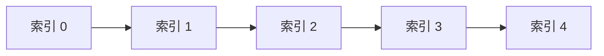

# 数组：最基础也最重要的数据结构


## 一、什么是数组

**数组（Array）** 是一种用**连续内存**存储相同类型元素的线性数据结构。它支持通过下标在 **O(1)** 时间内随机访问任意元素。

| 操作 | 时间复杂度 | 说明 |
|------|-----------|------|
| 按下标访问 | O(1) | 地址 = 基址 + 下标 × 元素大小 |
| 尾部插入/删除 | O(1) | 均摊 |
| 中间插入/删除 | O(n) | 需要移动元素 |
| 查找（无序） | O(n) | 线性扫描 |
| 查找（有序） | O(log n) | 二分查找 |



> 数组是所有数据结构的基石——栈、队列、堆、哈希表的底层都离不开它。

## 二、数组 vs 链表

| 维度 | 数组 | 链表 |
|------|------|------|
| 内存 | 连续，缓存友好 | 分散，缓存不友好 |
| 随机访问 | O(1) | O(n) |
| 头部插入 | O(n) | O(1) |
| 空间开销 | 无额外指针 | 每个节点多存指针 |
| 扩容 | 需要复制（O(n)） | 无需扩容 |

**选择原则**：
- 频繁随机访问 → 数组
- 频繁头部/中间插入删除 → 链表
- 不确定大小时 → 动态数组（ArrayList）

## 三、动态数组（ArrayList）

### 3.1 扩容机制

Java `ArrayList` 默认容量 10，满时扩容为 **1.5 倍**：

```java tab
class DynamicArray {
    private int[] data;
    private int size;

    public DynamicArray() {
        data = new int[4];
        size = 0;
    }

    public void add(int val) {
        if (size == data.length) resize();
        data[size++] = val;
    }

    private void resize() {
        int[] newData = new int[data.length * 2];
        System.arraycopy(data, 0, newData, 0, size);
        data = newData;
    }

    public int get(int index) {
        if (index < 0 || index >= size) throw new IndexOutOfBoundsException();
        return data[index];
    }
}
```
```typescript tab
class DynamicArray {
    private data: number[];
    private size: number;

    constructor() {
        this.data = new Array(4);
        this.size = 0;
    }

    add(val: number): void {
        if (this.size === this.data.length) this.resize();
        this.data[this.size++] = val;
    }

    private resize(): void {
        const newData = new Array(this.data.length * 2);
        for (let i = 0; i < this.size; i++) newData[i] = this.data[i];
        this.data = newData;
    }

    get(index: number): number {
        if (index < 0 || index >= this.size) throw new RangeError();
        return this.data[index];
    }
}
```
```python tab
class DynamicArray:
    def __init__(self):
        self._data = [0] * 4
        self._size = 0

    def add(self, val: int):
        if self._size == len(self._data):
            self._resize()
        self._data[self._size] = val
        self._size += 1

    def _resize(self):
        new_data = [0] * (len(self._data) * 2)
        for i in range(self._size):
            new_data[i] = self._data[i]
        self._data = new_data

    def get(self, index: int) -> int:
        if index < 0 or index >= self._size:
            raise IndexError()
        return self._data[index]
```

- **均摊插入**：O(1)（虽然偶尔 O(n) 扩容，但平摊到每次操作是常数）

## 四、数组经典操作

### 4.1 原地反转

```java tab
public void reverse(int[] arr) {
    int left = 0, right = arr.length - 1;
    while (left < right) {
        int tmp = arr[left];
        arr[left] = arr[right];
        arr[right] = tmp;
        left++;
        right--;
    }
}
```
```typescript tab
function reverse(arr: number[]): void {
    let left = 0, right = arr.length - 1;
    while (left < right) {
        [arr[left], arr[right]] = [arr[right], arr[left]];
        left++;
        right--;
    }
}
```
```python tab
def reverse(arr: list[int]) -> None:
    left, right = 0, len(arr) - 1
    while left < right:
        arr[left], arr[right] = arr[right], arr[left]
        left += 1
        right -= 1
```

### 4.2 原地去重（有序数组）

```java tab
public int removeDuplicates(int[] nums) {
    if (nums.length == 0) return 0;
    int slow = 0;
    for (int fast = 1; fast < nums.length; fast++) {
        if (nums[fast] != nums[slow]) {
            slow++;
            nums[slow] = nums[fast];
        }
    }
    return slow + 1;
}
```
```typescript tab
function removeDuplicates(nums: number[]): number {
    if (nums.length === 0) return 0;
    let slow = 0;
    for (let fast = 1; fast < nums.length; fast++) {
        if (nums[fast] !== nums[slow]) {
            slow++;
            nums[slow] = nums[fast];
        }
    }
    return slow + 1;
}
```
```python tab
def remove_duplicates(nums: list[int]) -> int:
    if not nums:
        return 0
    slow = 0
    for fast in range(1, len(nums)):
        if nums[fast] != nums[slow]:
            slow += 1
            nums[slow] = nums[fast]
    return slow + 1
```

### 4.3 旋转数组

```java tab
public void rotate(int[] nums, int k) {
    int n = nums.length;
    k %= n;
    reverse(nums, 0, n - 1);
    reverse(nums, 0, k - 1);
    reverse(nums, k, n - 1);
}

private void reverse(int[] nums, int lo, int hi) {
    while (lo < hi) {
        int tmp = nums[lo]; nums[lo] = nums[hi]; nums[hi] = tmp;
        lo++; hi--;
    }
}
```
```typescript tab
function rotate(nums: number[], k: number): void {
    const n = nums.length;
    k %= n;
    reverse(nums, 0, n - 1);
    reverse(nums, 0, k - 1);
    reverse(nums, k, n - 1);
}

function reverse(nums: number[], lo: number, hi: number): void {
    while (lo < hi) {
        [nums[lo], nums[hi]] = [nums[hi], nums[lo]];
        lo++; hi--;
    }
}
```
```python tab
def rotate(nums: list[int], k: int) -> None:
    n = len(nums)
    k %= n
    reverse(nums, 0, n - 1)
    reverse(nums, 0, k - 1)
    reverse(nums, k, n - 1)

def reverse(nums: list[int], lo: int, hi: int) -> None:
    while lo < hi:
        nums[lo], nums[hi] = nums[hi], nums[lo]
        lo += 1
        hi -= 1
```

### 4.4 前缀和

```java tab
int[] prefix = new int[n + 1];
for (int i = 0; i < n; i++) {
    prefix[i + 1] = prefix[i] + nums[i];
}
// 区间 [l, r] 的和 = prefix[r+1] - prefix[l]
```
```typescript tab
const prefix = new Array(n + 1).fill(0);
for (let i = 0; i < n; i++) {
    prefix[i + 1] = prefix[i] + nums[i];
}
// 区间 [l, r] 的和 = prefix[r+1] - prefix[l]
```
```python tab
prefix = [0] * (n + 1)
for i in range(n):
    prefix[i + 1] = prefix[i] + nums[i]
# 区间 [l, r] 的和 = prefix[r+1] - prefix[l]
```

## 五、二维数组（矩阵）

### 5.1 遍历方式

```java tab
// 行优先遍历
for (int i = 0; i < m; i++)
    for (int j = 0; j < n; j++)
        process(matrix[i][j]);

// 列优先遍历
for (int j = 0; j < n; j++)
    for (int i = 0; i < m; i++)
        process(matrix[i][j]);
```
```typescript tab
// 行优先遍历
for (let i = 0; i < m; i++)
    for (let j = 0; j < n; j++)
        process(matrix[i][j]);

// 列优先遍历
for (let j = 0; j < n; j++)
    for (let i = 0; i < m; i++)
        process(matrix[i][j]);
```
```python tab
# 行优先遍历
for i in range(m):
    for j in range(n):
        process(matrix[i][j])

# 列优先遍历
for j in range(n):
    for i in range(m):
        process(matrix[i][j])
```

### 5.2 螺旋遍历

```java tab
public List<Integer> spiralOrder(int[][] matrix) {
    List<Integer> res = new ArrayList<>();
    int top = 0, bottom = matrix.length - 1;
    int left = 0, right = matrix[0].length - 1;

    while (top <= bottom && left <= right) {
        for (int j = left; j <= right; j++) res.add(matrix[top][j]);
        top++;
        for (int i = top; i <= bottom; i++) res.add(matrix[i][right]);
        right--;
        if (top <= bottom)
            for (int j = right; j >= left; j--) res.add(matrix[bottom][j]);
        bottom--;
        if (left <= right)
            for (int i = bottom; i >= top; i--) res.add(matrix[i][left]);
        left++;
    }
    return res;
}
```
```typescript tab
function spiralOrder(matrix: number[][]): number[] {
    const res: number[] = [];
    let top = 0, bottom = matrix.length - 1;
    let left = 0, right = matrix[0].length - 1;

    while (top <= bottom && left <= right) {
        for (let j = left; j <= right; j++) res.push(matrix[top][j]);
        top++;
        for (let i = top; i <= bottom; i++) res.push(matrix[i][right]);
        right--;
        if (top <= bottom)
            for (let j = right; j >= left; j--) res.push(matrix[bottom][j]);
        bottom--;
        if (left <= right)
            for (let i = bottom; i >= top; i--) res.push(matrix[i][left]);
        left++;
    }
    return res;
}
```
```python tab
def spiral_order(matrix: list[list[int]]) -> list[int]:
    res = []
    top, bottom = 0, len(matrix) - 1
    left, right = 0, len(matrix[0]) - 1

    while top <= bottom and left <= right:
        for j in range(left, right + 1): res.append(matrix[top][j])
        top += 1
        for i in range(top, bottom + 1): res.append(matrix[i][right])
        right -= 1
        if top <= bottom:
            for j in range(right, left - 1, -1): res.append(matrix[bottom][j])
        bottom -= 1
        if left <= right:
            for i in range(bottom, top - 1, -1): res.append(matrix[i][left])
        left += 1
    return res
```

## 六、数组相关技巧

| 技巧 | 适用场景 | 示例 |
|------|----------|------|
| 双指针 | 有序数组、原地操作 | 两数之和、去重 |
| 滑动窗口 | 连续子数组/子串 | 最长无重复子串 |
| 前缀和 | 区间查询 | 子数组和为 K |
| 差分 | 区间修改 | 航班预订 |
| 原地哈希 | 找缺失/重复 | `nums[i]` 放到索引 `i` |

### 原地哈希（找所有消失的数字）

```java tab
public List<Integer> findDisappearedNumbers(int[] nums) {
    for (int i = 0; i < nums.length; i++) {
        int idx = Math.abs(nums[i]) - 1;
        if (nums[idx] > 0) nums[idx] = -nums[idx];
    }
    List<Integer> res = new ArrayList<>();
    for (int i = 0; i < nums.length; i++) {
        if (nums[i] > 0) res.add(i + 1);
    }
    return res;
}
```
```typescript tab
function findDisappearedNumbers(nums: number[]): number[] {
    for (let i = 0; i < nums.length; i++) {
        const idx = Math.abs(nums[i]) - 1;
        if (nums[idx] > 0) nums[idx] = -nums[idx];
    }
    const res: number[] = [];
    for (let i = 0; i < nums.length; i++) {
        if (nums[i] > 0) res.push(i + 1);
    }
    return res;
}
```
```python tab
def find_disappeared_numbers(nums: list[int]) -> list[int]:
    for i in range(len(nums)):
        idx = abs(nums[i]) - 1
        if nums[idx] > 0:
            nums[idx] = -nums[idx]
    return [i + 1 for i in range(len(nums)) if nums[i] > 0]
```

## 七、面试常见题

- 🟢 两数之和、最大子数组和、合并有序数组、移动零
- 🟡 三数之和、螺旋矩阵、旋转数组、除自身以外数组的乘积
- 🟠 缺失的第一个正数、接雨水、盛最多水的容器
- 🔴 滑动窗口最大值、最短子数组和、子数组异或查询

## 八、调试技巧

1. **边界**：空数组、单元素、全相同元素。
2. **下标越界**：`left <= right` 还是 `left < right`？画小例子验证。
3. **原地修改**：修改前是否需要保存原值？
4. **整数溢出**：求和时考虑用 `long`。

## 九、多语言对照：两数之和

```java tab
public int[] twoSum(int[] nums, int target) {
    Map<Integer, Integer> seen = new HashMap<>();
    for (int i = 0; i < nums.length; i++) {
        int need = target - nums[i];
        if (seen.containsKey(need)) return new int[]{seen.get(need), i};
        seen.put(nums[i], i);
    }
    return new int[]{};
}
```
```typescript tab
function twoSum(nums: number[], target: number): number[] {
    const seen = new Map<number, number>();
    for (let i = 0; i < nums.length; i++) {
        const need = target - nums[i];
        if (seen.has(need)) return [seen.get(need)!, i];
        seen.set(nums[i], i);
    }
    return [];
}
```
```python tab
def two_sum(nums: list[int], target: int) -> list[int]:
    seen = {}
    for i, num in enumerate(nums):
        if target - num in seen:
            return [seen[target - num], i]
        seen[num] = i
    return []
```
