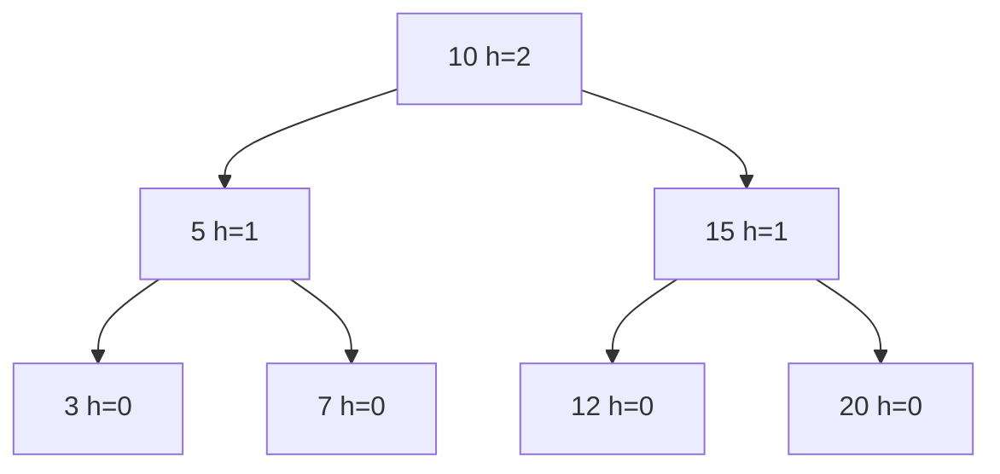

# AVL 树与平衡二叉搜索树


## 一、为什么需要平衡

普通 BST 在有序数据插入时会退化为**链表**，查找从 O(log n) 退化到 O(n)。

**平衡 BST** 通过限制左右子树高度差，保证树高始终为 O(log n)。

| 平衡方案 | 平衡条件 | 代表 |
|----------|----------|------|
| 严格平衡 | 左右子树高度差 ≤ 1 | AVL 树 |
| 近似平衡 | 最长路径 ≤ 2×最短路径 | 红黑树 |
| 多路平衡 | 节点可有多个 key | B 树 / B+ 树 |

> AVL 查询更快（树更矮），红黑树插入删除更快（旋转更少）。

## 二、AVL 树定义

AVL 树是一棵 BST，且满足：**每个节点的左右子树高度差（平衡因子）的绝对值 ≤ 1**。

```text
平衡因子 BF(node) = height(left) - height(right)
合法值：-1, 0, 1
```



> 每个节点的 BF 都是 -1、0 或 1，合法 AVL。

## 三、四种旋转

当插入/删除导致 BF 变为 ±2 时，需要旋转恢复平衡：

| 失衡类型 | 条件 | 旋转方式 |
|----------|------|----------|
| LL | BF=2 且左子 BF≥0 | 右旋 |
| RR | BF=-2 且右子 BF≤0 | 左旋 |
| LR | BF=2 且左子 BF<0 | 先左旋再右旋 |
| RL | BF=-2 且右子 BF>0 | 先右旋再左旋 |

### 3.1 右旋（LL 情况）

```java tab
private Node rotateRight(Node y) {
    Node x = y.left;
    Node T2 = x.right;
    x.right = y;
    y.left = T2;
    updateHeight(y);
    updateHeight(x);
    return x;   // 新根
}
```

```typescript tab
function rotateRight(y: AVLNode): AVLNode {
    const x = y.left!;
    const T2 = x.right;
    x.right = y;
    y.left = T2;
    updateHeight(y);
    updateHeight(x);
    return x;   // 新根
}
```

```python tab
def rotate_right(y: AVLNode) -> AVLNode:
    x = y.left
    t2 = x.right
    x.right = y
    y.left = t2
    update_height(y)
    update_height(x)
    return x  # 新根
```

### 3.2 左旋（RR 情况）

```java tab
private Node rotateLeft(Node x) {
    Node y = x.right;
    Node T2 = y.left;
    y.left = x;
    x.right = T2;
    updateHeight(x);
    updateHeight(y);
    return y;   // 新根
}
```

```typescript tab
function rotateLeft(x: AVLNode): AVLNode {
    const y = x.right!;
    const T2 = y.left;
    y.left = x;
    x.right = T2;
    updateHeight(x);
    updateHeight(y);
    return y;   // 新根
}
```

```python tab
def rotate_left(x: AVLNode) -> AVLNode:
    y = x.right
    t2 = y.left
    y.left = x
    x.right = t2
    update_height(x)
    update_height(y)
    return y  # 新根
```

### 3.3 LR / RL

```java tab
// LR：先对左子左旋，再对当前节点右旋
node.left = rotateLeft(node.left);
return rotateRight(node);

// RL：先对右子右旋，再对当前节点左旋
node.right = rotateRight(node.right);
return rotateLeft(node);
```

```typescript tab
// LR：先对左子左旋，再对当前节点右旋
node.left = rotateLeft(node.left!);
return rotateRight(node);

// RL：先对右子右旋，再对当前节点左旋
node.right = rotateRight(node.right!);
return rotateLeft(node);
```

```python tab
# LR：先对左子左旋，再对当前节点右旋
node.left = rotate_left(node.left)
return rotate_right(node)

# RL：先对右子右旋，再对当前节点左旋
node.right = rotate_right(node.right)
return rotate_left(node)
```

## 四、AVL 树完整实现

```java tab
class AVLTree {
    class Node {
        int val, height;
        Node left, right;
        Node(int v) { val = v; height = 1; }
    }

    private Node root;

    private int height(Node n) { return n == null ? 0 : n.height; }
    private int balanceFactor(Node n) { return n == null ? 0 : height(n.left) - height(n.right); }
    private void updateHeight(Node n) { n.height = 1 + Math.max(height(n.left), height(n.right)); }

    public void insert(int val) { root = insert(root, val); }

    private Node insert(Node node, int val) {
        if (node == null) return new Node(val);
        if (val < node.val) node.left = insert(node.left, val);
        else if (val > node.val) node.right = insert(node.right, val);
        else return node;   // 不允许重复

        updateHeight(node);
        return balance(node);
    }

    private Node balance(Node node) {
        int bf = balanceFactor(node);
        // LL
        if (bf > 1 && balanceFactor(node.left) >= 0) return rotateRight(node);
        // LR
        if (bf > 1 && balanceFactor(node.left) < 0) {
            node.left = rotateLeft(node.left);
            return rotateRight(node);
        }
        // RR
        if (bf < -1 && balanceFactor(node.right) <= 0) return rotateLeft(node);
        // RL
        if (bf < -1 && balanceFactor(node.right) > 0) {
            node.right = rotateRight(node.right);
            return rotateLeft(node);
        }
        return node;
    }
}
```

```typescript tab
class AVLTree {
    root: AVLNode | null = null;

    private height(n: AVLNode | null): number { return n ? n.height : 0; }
    private balanceFactor(n: AVLNode | null): number { return n ? this.height(n.left) - this.height(n.right) : 0; }
    private updateHeight(n: AVLNode): void { n.height = 1 + Math.max(this.height(n.left), this.height(n.right)); }

    insert(val: number): void { this.root = this.insertNode(this.root, val); }

    private insertNode(node: AVLNode | null, val: number): AVLNode {
        if (!node) return new AVLNode(val);
        if (val < node.val) node.left = this.insertNode(node.left, val);
        else if (val > node.val) node.right = this.insertNode(node.right, val);
        else return node;

        this.updateHeight(node);
        return this.balance(node);
    }

    private balance(node: AVLNode): AVLNode {
        const bf = this.balanceFactor(node);
        if (bf > 1 && this.balanceFactor(node.left) >= 0) return rotateRight(node);
        if (bf > 1 && this.balanceFactor(node.left) < 0) {
            node.left = rotateLeft(node.left!);
            return rotateRight(node);
        }
        if (bf < -1 && this.balanceFactor(node.right) <= 0) return rotateLeft(node);
        if (bf < -1 && this.balanceFactor(node.right) > 0) {
            node.right = rotateRight(node.right!);
            return rotateLeft(node);
        }
        return node;
    }
}
```

```python tab
class AVLTree:
    def __init__(self):
        self.root = None

    def _height(self, n) -> int:
        return n.height if n else 0

    def _balance_factor(self, n) -> int:
        return self._height(n.left) - self._height(n.right) if n else 0

    def _update_height(self, n) -> None:
        n.height = 1 + max(self._height(n.left), self._height(n.right))

    def insert(self, val: int) -> None:
        self.root = self._insert(self.root, val)

    def _insert(self, node, val: int):
        if node is None:
            return AVLNode(val)
        if val < node.val:
            node.left = self._insert(node.left, val)
        elif val > node.val:
            node.right = self._insert(node.right, val)
        else:
            return node

        self._update_height(node)
        return self._balance(node)

    def _balance(self, node):
        bf = self._balance_factor(node)
        if bf > 1 and self._balance_factor(node.left) >= 0:
            return rotate_right(node)
        if bf > 1 and self._balance_factor(node.left) < 0:
            node.left = rotate_left(node.left)
            return rotate_right(node)
        if bf < -1 and self._balance_factor(node.right) <= 0:
            return rotate_left(node)
        if bf < -1 and self._balance_factor(node.right) > 0:
            node.right = rotate_right(node.right)
            return rotate_left(node)
        return node
```

- **插入/删除/查找**：O(log n)
- **空间**：O(n)

## 五、AVL vs 红黑树

| 维度 | AVL | 红黑树 |
|------|-----|--------|
| 平衡严格度 | 严格（高度差≤1） | 宽松（最长≤2×最短） |
| 树高 | 更矮 | 稍高 |
| 查找速度 | 更快 | 略慢 |
| 插入/删除 | 旋转多（可能多次） | 旋转少（最多 3 次） |
| 适用场景 | 读多写少（数据库索引） | 写多读多均衡（Map/Set） |

> Java `TreeMap`/`TreeSet` 用红黑树；数据库索引用 B+ 树。

## 六、面试中的平衡树

面试中很少要求手写 AVL，但需要：
1. **理解旋转原理**（画图说明 LL/RR/LR/RL）
2. **知道 AVL 和红黑树的区别与选型**
3. **能手写判断 BST 是否平衡**

### 判断二叉树是否平衡

```java tab
public boolean isBalanced(TreeNode root) {
    return checkHeight(root) != -1;
}

private int checkHeight(TreeNode node) {
    if (node == null) return 0;
    int left = checkHeight(node.left);
    if (left == -1) return -1;
    int right = checkHeight(node.right);
    if (right == -1) return -1;
    if (Math.abs(left - right) > 1) return -1;
    return 1 + Math.max(left, right);
}
```

```typescript tab
function isBalanced(root: TreeNode | null): boolean {
    const check = (node: TreeNode | null): number => {
        if (!node) return 0;
        const left = check(node.left);
        if (left === -1) return -1;
        const right = check(node.right);
        if (right === -1) return -1;
        if (Math.abs(left - right) > 1) return -1;
        return 1 + Math.max(left, right);
    };
    return check(root) !== -1;
}
```

```python tab
def is_balanced(root) -> bool:
    def check(node):
        if not node:
            return 0
        left = check(node.left)
        if left == -1:
            return -1
        right = check(node.right)
        if right == -1:
            return -1
        if abs(left - right) > 1:
            return -1
        return 1 + max(left, right)
    return check(root) != -1
```

## 七、面试常见题

- 🟢 平衡二叉树（判断是否平衡）
- 🟡 将有序数组转换为平衡 BST
- 🟠 有序链表转换为平衡 BST
- 🔴 手写 AVL 插入/删除（竞赛/系统设计）

## 八、调试技巧

1. **画图**：每次旋转前后画出树结构，验证 BST 性质不变。
2. **高度更新**：旋转后**先更新原根**，再更新新根。
3. **递归返回**：balance 函数必须返回新的子树根。
4. **边界**：空树、单节点、两节点。
