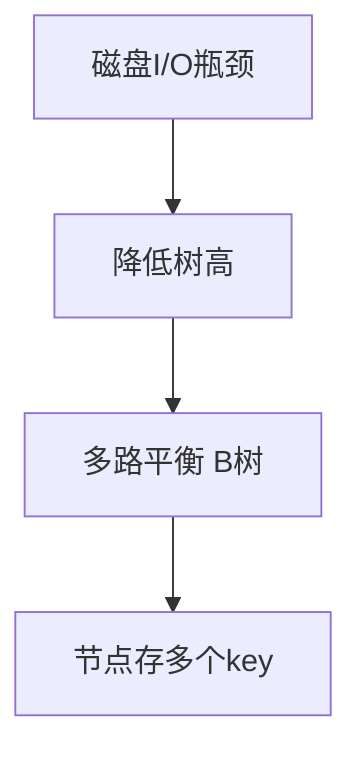

# B 树与 B+ 树

B 树（B-Tree）和 B+ 树是专为磁盘 I/O 优化的多路平衡搜索树，是数据库索引和文件系统的核心数据结构。

## 一、为什么需要 B 树？



BST/AVL/红黑树的高度为 O(log₂n)，当 n = 10 亿时高度约 30。但每次节点访问可能触发一次磁盘 I/O（~10ms），30 次 I/O 不可接受。

B 树通过增大分支数（m 路）降低树高：
- m = 1000 时，log₁₀₀₀(10⁹) ≈ 3 层
- 3 次磁盘 I/O 即可定位任意记录

**磁盘 I/O 的代价对比**：

| 操作 | 耗时 |
|------|------|
| L1 缓存访问 | ~1 ns |
| 内存随机访问 | ~100 ns |
| SSD 随机读 | ~100 μs |
| 机械硬盘寻道 | ~10 ms |

结论：**减少磁盘访问次数**比减少比较次数重要得多。B 树的设计哲学就是"用一次 I/O 读入尽可能多的信息"。

## 二、B 树定义

一棵 m 阶 B 树满足：

1. 每个节点最多 m 个子节点
2. 除根节点外，每个节点至少 ⌈m/2⌉ 个子节点
3. 根节点至少 2 个子节点（非叶）
4. 所有叶节点在同一层（绝对平衡）
5. 含 k 个关键字的节点有 k+1 个子节点

```
4阶B树（2-3-4树）示例：

        [30 | 60]
       /    |    \
  [10|20] [40|50] [70|80|90]

性质验证：
- 每个节点最多4个子 ✓
- 非根节点至少2个子 ✓（[10|20]有2个子...叶节点无子）
- 所有叶节点同层 ✓
```

**高度与数据量的关系**（m 阶 B 树，n 个关键字）：

```
最小高度：h ≥ log_m(n+1)         （每个节点都满）
最大高度：h ≤ log_⌈m/2⌉((n+1)/2) （每个节点都半满）

实际数据库场景：m ≈ 1000+，n = 10⁹ → h = 3~4
```

## 三、B 树操作

### 查找

从根开始，在节点内二分定位关键字或确定子节点方向：

```java tab
public BTreeNode search(BTreeNode node, int key) {
    int i = 0;
    while (i < node.keyCount && key > node.keys[i]) i++;
    if (i < node.keyCount && key == node.keys[i]) return node;
    if (node.isLeaf) return null;
    return search(node.children[i], key);
}
```

```typescript tab
function search(node: BTreeNode, key: number): BTreeNode | null {
    let i = 0;
    while (i < node.keyCount && key > node.keys[i]) i++;
    if (i < node.keyCount && key === node.keys[i]) return node;
    if (node.isLeaf) return null;
    return search(node.children[i], key);
}
```

```python tab
def search(node: BTreeNode, key: int) -> BTreeNode | None:
    i = 0
    while i < node.key_count and key > node.keys[i]:
        i += 1
    if i < node.key_count and key == node.keys[i]:
        return node
    if node.is_leaf:
        return None
    return search(node.children[i], key)
```

### 插入（分裂）

B 树采用**预分裂**策略：沿路径下行时，遇到满节点就提前分裂，保证父节点永远不满，分裂只需修改一个节点。

以 4 阶 B 树插入 `[10, 20, 30, 40, 50, 60, 70]` 为例：

```
插入10,20:  [10|20]                    （根未满）

插入30:      [10|20|30] 满了！分裂：
             取中间值20上移
                [20]
               /    \
            [10]    [30]

插入40,50:      [20]
               /    \
            [10]    [30|40|50] 满了！分裂：
                [20|40]
               /   |   \
            [10] [30]  [50]

插入60,70:      [20|40]
               /   |   \
            [10] [30]  [50|60|70] 满了！分裂：
                  [20|40|60]  根也满了！再次分裂：
                     [40]
                    /    \
                [20]      [60]
               /   \     /   \
            [10]  [30] [50] [70]
```

```java tab
public void insertNonFull(BTreeNode node, int key) {
    int i = node.keyCount - 1;
    if (node.isLeaf) {
        // 叶节点：腾出位置插入
        while (i >= 0 && key < node.keys[i]) {
            node.keys[i + 1] = node.keys[i];
            i--;
        }
        node.keys[i + 1] = key;
        node.keyCount++;
    } else {
        // 内部节点：找到子节点位置
        while (i >= 0 && key < node.keys[i]) i--;
        i++;
        if (node.children[i].keyCount == maxKeys) {
            splitChild(node, i);          // 预分裂
            if (key > node.keys[i]) i++;  // 判断插入哪一侧
        }
        insertNonFull(node.children[i], key);
    }
}

private void splitChild(BTreeNode parent, int index) {
    BTreeNode full = parent.children[index];
    BTreeNode right = new BTreeNode();
    int mid = full.keyCount / 2;
    // 右半部分移入新节点
    right.keyCount = full.keyCount - mid - 1;
    for (int j = 0; j < right.keyCount; j++)
        right.keys[j] = full.keys[mid + 1 + j];
    if (!full.isLeaf)
        for (int j = 0; j <= right.keyCount; j++)
            right.children[j] = full.children[mid + 1 + j];
    int upKey = full.keys[mid];  // 中间值上移
    full.keyCount = mid;
    // 父节点插入上移的 key 和新的子指针
    // ...（移动父节点的 keys 和 children）
}
```

### 删除（借/合并）

删除比插入复杂，需要维护"每个非根节点至少 ⌈m/2⌉-1 个关键字"的约束：

```
情况1：关键字在叶节点 → 直接删除，若下溢则处理

情况2：关键字在内部节点：
  a. 左子树有富余（≥ ⌈m/2⌉ 个key）→ 用前驱替换，转为删前驱
  b. 右子树有富余 → 用后继替换，转为删后继
  c. 都刚好最少 → 合并左右子树 + 该关键字，递归删除

情况3：删除导致叶节点下溢（key数 < ⌈m/2⌉-1）：
  a. 兄弟有富余 → 向父"借"：父的分隔值下来，兄弟的一个值上去
  b. 兄弟也紧 → 与兄弟合并（父的分隔值下来参与合并）
```

**"借"的图解**（4阶B树，删除导致叶节点下溢为 0 个 key）：

```
删除前:       [20]
             /    \
         [10]     [30|40]      ← 左节点只有 1 个 key

删除 10 后:   [20]
             /    \
           [ ]     [30|40]     ← 左节点 0 个 key，下溢！

向兄弟借:     [30]             父的 20 下来，兄弟的 30 上去：
             /    \
         [20]     [40]        ✓ 每节点 ≥1 个 key
```

## 四、B+ 树

B+ 树是 B 树的变体，**所有数据存储在叶节点**，内部节点只存索引：

```
        [30 | 60]          ← 仅索引（不存数据）
       /    |    \
  [10→20→30] → [40→50→60] → [70→80→90]  ← 数据+双向链表
```

### B+ 树的结构特点

1. **内部节点**：只存关键字和子指针，不存数据 → 同样大小的页能装更多索引 → 扇出更大 → 树更矮
2. **叶节点**：存储所有关键字+数据指针，且通过链表串联
3. **查询路径等长**：任何查找都走到叶节点，性能可预测
4. **关键字冗余**：内部节点的关键字在叶节点中重复出现（作为索引）

### B+ 树 vs B 树

| 维度 | B 树 | B+ 树 |
|------|------|-------|
| 数据存储 | 所有节点 | 仅叶节点 |
| 范围查询 | 需中序遍历 | 叶节点链表顺序扫 |
| 查询稳定性 | 不稳定（深度不同） | 稳定（都到叶） |
| 扇出 | 较小 | 更大（内部节点不存数据） |
| 磁盘IO | 可能中途命中 | 固定走到底 |
| 典型应用 | MongoDB | MySQL InnoDB、文件系统 |

### 范围查询对比

```
查询 WHERE key BETWEEN 25 AND 65：

B树：找到25后需要中序遍历整棵树（上下跳跃，随机IO）
     25 → 30 → 40 → 50 → 60 → 65（跨层访问）

B+树：找到25所在叶节点，沿链表顺序扫描（顺序IO）
     [20→25→30] → [40→50→60] → [65→70]
     只需 1次树查找 + k/B 次顺序页读取
```

## 五、MySQL InnoDB 索引

### 聚簇索引与二级索引

```sql
-- 聚簇索引（主键）：叶节点存完整行数据
-- 二级索引：叶节点存主键值 → 回表查询

CREATE INDEX idx_name ON users(name);
-- B+ 树：[name → pk]，查到 pk 后再去聚簇索引取行
```

```
聚簇索引（按主键 id 组织）：
        [3 | 7]
       /   |   \
  [1,2,3行数据] → [4,5,6,7行数据] → [8,9,10行数据]

二级索引（按 name 组织）：
        [Jack | Tom]
       /     |      \
  [Amy→pk2, Bob→pk8] → [Jack→pk1, Lucy→pk5] → [Tom→pk3, Zoe→pk9]
  
查询 SELECT * FROM users WHERE name='Tom':
1. 二级索引找到 Tom → pk=3
2. 回表：聚簇索引找 pk=3 的完整行（额外一次 B+ 树查找）
```

### 覆盖索引

```sql
-- 如果查询的列都在索引中，无需回表
CREATE INDEX idx_name_age ON users(name, age);

SELECT name, age FROM users WHERE name = 'Tom';
-- ✓ 覆盖索引：直接从二级索引返回，省一次回表 IO

SELECT name, email FROM users WHERE name = 'Tom';
-- ✗ email 不在索引中，必须回表
```

### 最左前缀原则

```sql
联合索引 (a, b, c) 的 B+ 树按 a → b → c 顺序排列：

WHERE a = 1 AND b = 2 AND c = 3  → ✓ 完整使用索引
WHERE a = 1 AND b = 2            → ✓ 使用前两列
WHERE a = 1                      → ✓ 使用第一列
WHERE b = 2 AND c = 3            → ✗ 缺少最左列，索引失效
WHERE a = 1 AND c = 3            → △ 只用 a，c 无法利用（b 断了）
WHERE a > 1 AND b = 2            → △ a 用范围后，b 无法利用
```

### 为什么用 B+ 树而不用哈希？

- 哈希不支持范围查询（`WHERE age > 20`）
- 哈希不支持排序（`ORDER BY`）
- 哈希不支持最左前缀匹配
- 哈希冲突时退化

### 为什么不用红黑树/跳表？

```
红黑树：n = 2000万时高度 ≈ 24 → 最坏24次磁盘IO
B+树：  内部节点扇出 ~1170 → 3层可索引 1170³ ≈ 16 亿行

InnoDB 页大小 16KB：
- 内部节点：8字节指针 + 6字节key ≈ 1170个/页
- 叶节点：一行 ~200B ≈ 80行/页
- 3层 B+ 树：1170 × 1170 × 80 ≈ 1.09 亿行，只需3次IO
```

## 六、B 树的变体家族

| 变体 | 特点 | 应用 |
|------|------|------|
| B+ 树 | 数据仅在叶节点 + 叶链表 | MySQL、PostgreSQL |
| B* 树 | 节点至少 2/3 满，兄弟间共享分裂 | 早期文件系统 |
| 2-3 树 | 3阶B树，每个节点2或3个子 | 红黑树的等价形式 |
| 2-3-4 树 | 4阶B树 | 自顶向下红黑树 |
| Bw-Tree | 无锁 B 树（微软） | Hekaton 内存数据库 |
| LSM-Tree | 非B树系，写优化的有序结构 | LevelDB、RocksDB、HBase |

**2-3 树与红黑树的关系**：2-3 树中一个 3-节点 对应红黑树中一个黑节点+一个红色子节点。红黑树本质是 2-3-4 树的二叉表示。

## 七、面试要点

1. **B 树的阶**：m 阶 B 树每个节点最多 m 个子、m-1 个关键字
2. **B+ 树优势**：范围查询 O(log n + k)、查询路径等长、缓存友好
3. **为什么不用红黑树做索引**：树高太大 → 磁盘 I/O 次数多
4. **页大小**：InnoDB 默认 16KB 一页，一个内部节点可存 ~1200 个指针
5. **分裂策略**：预分裂保证父节点不满，分裂只需修改一个节点
6. **插入顺序的影响**：顺序插入 B+ 树只在尾部追加（高效）；随机插入导致频繁页分裂和空间浪费

### 面试高频问答

**Q: 为什么 MySQL 主键推荐自增？**

顺序插入 → 每次都在最右叶节点追加 → 页利用率高、无页分裂。随机主键（如 UUID）→ 随机位置插入 → 频繁页分裂 + 碎片。

**Q: 一棵 3 层 B+ 树能存多少数据？**

假设主键 8 字节、指针 6 字节、行 200 字节、页 16KB：
- 内部节点容量：16KB / 14B ≈ 1170 个指针
- 叶节点容量：16KB / 200B ≈ 80 行
- 3 层总量：1170 × 1170 × 80 ≈ **1.09 亿行**

**Q: MongoDB 为什么用 B 树而不是 B+ 树？**

文档数据库按 _id 单点查询为主，B 树内部节点就能命中 → 平均 IO 更少。而关系型数据库范围查询多 → B+ 树更优。
