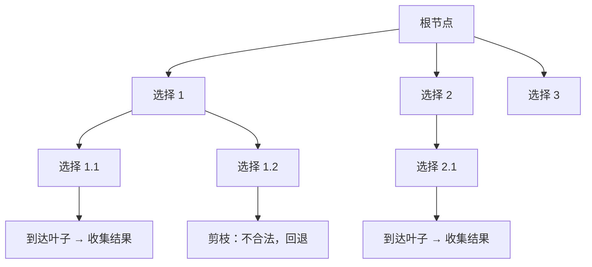

# 回溯算法：暴力搜索的艺术


## 一、什么是回溯

**回溯（Backtracking）** 是一种通过**逐步构建候选解**来搜索所有（或部分）可行解的算法策略。当发现当前路径不可能产生有效解时，立即**撤销上一步选择**（回退），尝试其他分支。

核心思想：**选择 → 探索 → 撤销 → 换一条路**。



> 回溯本质是**深度优先遍历决策树**，配合**剪枝**避免无效搜索。

## 二、回溯三要素

| 要素 | 含义 | 面试问法 |
|------|------|----------|
| 路径（Path） | 已经做出的选择 | "当前选了哪些？" |
| 选择列表（Choices） | 当前还能做的选择 | "下一步能选什么？" |
| 结束条件（Base Case） | 到达决策树底部 | "什么时候停？" |

## 三、通用模板

```java tab
void backtrack(List<Integer> path, List<List<Integer>> result, /* 其他参数 */) {
    // 1. 结束条件：收集结果
    if (/* 满足条件 */) {
        result.add(new ArrayList<>(path));   // 注意拷贝！
        return;
    }
    // 2. 遍历选择列表
    for (int choice : choices) {
        if (!isValid(choice)) continue;      // 剪枝
        path.add(choice);                    // 做选择
        backtrack(path, result, /* 更新参数 */);  // 递归
        path.remove(path.size() - 1);        // 撤销选择（回溯）
    }
}
```

```typescript tab
function backtrack(path: number[], result: number[][], /* 其他参数 */): void {
    // 1. 结束条件：收集结果
    if (/* 满足条件 */) {
        result.push([...path]);   // 注意拷贝！
        return;
    }
    // 2. 遍历选择列表
    for (const choice of choices) {
        if (!isValid(choice)) continue;      // 剪枝
        path.push(choice);                   // 做选择
        backtrack(path, result, /* 更新参数 */);  // 递归
        path.pop();                          // 撤销选择（回溯）
    }
}
```

```python tab
def backtrack(path: list, result: list, /* 其他参数 */):
    # 1. 结束条件：收集结果
    if /* 满足条件 */:
        result.append(path[:])   # 注意拷贝！
        return
    # 2. 遍历选择列表
    for choice in choices:
        if not is_valid(choice):
            continue             # 剪枝
        path.append(choice)      # 做选择
        backtrack(path, result, /* 更新参数 */)  # 递归
        path.pop()               # 撤销选择（回溯）
```

> **关键**：`path.remove(...)` 是回溯的灵魂——没有它，路径会越积越多。

## 四、经典题型

### 4.1 全排列（Permutations）

**问题**：给定不含重复数字的数组 `nums`，返回所有全排列。

```java tab
public List<List<Integer>> permute(int[] nums) {
    List<List<Integer>> res = new ArrayList<>();
    boolean[] used = new boolean[nums.length];
    backtrack(nums, used, new ArrayList<>(), res);
    return res;
}

private void backtrack(int[] nums, boolean[] used,
                       List<Integer> path, List<List<Integer>> res) {
    if (path.size() == nums.length) {
        res.add(new ArrayList<>(path));
        return;
    }
    for (int i = 0; i < nums.length; i++) {
        if (used[i]) continue;
        used[i] = true;
        path.add(nums[i]);
        backtrack(nums, used, path, res);
        path.remove(path.size() - 1);
        used[i] = false;
    }
}
```

```typescript tab
function permute(nums: number[]): number[][] {
    const res: number[][] = [];
    const used = new Array(nums.length).fill(false);
    const backtrack = (path: number[]) => {
        if (path.length === nums.length) {
            res.push([...path]);
            return;
        }
        for (let i = 0; i < nums.length; i++) {
            if (used[i]) continue;
            used[i] = true;
            path.push(nums[i]);
            backtrack(path);
            path.pop();
            used[i] = false;
        }
    };
    backtrack([]);
    return res;
}
```

```python tab
def permute(nums: list[int]) -> list[list[int]]:
    res = []
    used = [False] * len(nums)

    def backtrack(path):
        if len(path) == len(nums):
            res.append(path[:])
            return
        for i in range(len(nums)):
            if used[i]:
                continue
            used[i] = True
            path.append(nums[i])
            backtrack(path)
            path.pop()
            used[i] = False

    backtrack([])
    return res
```

- **时间**：O(n × n!)，**空间**：O(n)

### 4.2 子集（Subsets）

**问题**：返回数组所有可能的子集。

```java tab
public List<List<Integer>> subsets(int[] nums) {
    List<List<Integer>> res = new ArrayList<>();
    backtrack(nums, 0, new ArrayList<>(), res);
    return res;
}

private void backtrack(int[] nums, int start,
                       List<Integer> path, List<List<Integer>> res) {
    res.add(new ArrayList<>(path));          // 每个节点都是合法子集
    for (int i = start; i < nums.length; i++) {
        path.add(nums[i]);
        backtrack(nums, i + 1, path, res);   // i+1 避免重复
        path.remove(path.size() - 1);
    }
}
```

```typescript tab
function subsets(nums: number[]): number[][] {
    const res: number[][] = [];
    const backtrack = (start: number, path: number[]) => {
        res.push([...path]);
        for (let i = start; i < nums.length; i++) {
            path.push(nums[i]);
            backtrack(i + 1, path);
            path.pop();
        }
    };
    backtrack(0, []);
    return res;
}
```

```python tab
def subsets(nums: list[int]) -> list[list[int]]:
    res = []
    def backtrack(start, path):
        res.append(path[:])
        for i in range(start, len(nums)):
            path.append(nums[i])
            backtrack(i + 1, path)
            path.pop()
    backtrack(0, [])
    return res
```

- **时间**：O(n × 2ⁿ)，**空间**：O(n)

### 4.3 组合总和（Combination Sum）

**问题**：`candidates` 无重复，每个数可无限次使用，找出和为 `target` 的所有组合。

```java tab
public List<List<Integer>> combinationSum(int[] candidates, int target) {
    List<List<Integer>> res = new ArrayList<>();
    Arrays.sort(candidates);
    backtrack(candidates, target, 0, new ArrayList<>(), res);
    return res;
}

private void backtrack(int[] nums, int remain, int start,
                       List<Integer> path, List<List<Integer>> res) {
    if (remain == 0) {
        res.add(new ArrayList<>(path));
        return;
    }
    for (int i = start; i < nums.length; i++) {
        if (nums[i] > remain) break;         // 排序后剪枝
        path.add(nums[i]);
        backtrack(nums, remain - nums[i], i, path, res);  // i 不是 i+1，可重复选
        path.remove(path.size() - 1);
    }
}
```

```typescript tab
function combinationSum(candidates: number[], target: number): number[][] {
    const res: number[][] = [];
    candidates.sort((a, b) => a - b);
    const backtrack = (remain: number, start: number, path: number[]) => {
        if (remain === 0) {
            res.push([...path]);
            return;
        }
        for (let i = start; i < candidates.length; i++) {
            if (candidates[i] > remain) break;         // 排序后剪枝
            path.push(candidates[i]);
            backtrack(remain - candidates[i], i, path);  // i 不是 i+1，可重复选
            path.pop();
        }
    };
    backtrack(target, 0, []);
    return res;
}
```

```python tab
def combination_sum(candidates: list[int], target: int) -> list[list[int]]:
    res = []
    candidates.sort()

    def backtrack(remain, start, path):
        if remain == 0:
            res.append(path[:])
            return
        for i in range(start, len(candidates)):
            if candidates[i] > remain:
                break         # 排序后剪枝
            path.append(candidates[i])
            backtrack(remain - candidates[i], i, path)  # i 不是 i+1，可重复选
            path.pop()

    backtrack(target, 0, [])
    return res
```

### 4.4 N 皇后

**问题**：在 n×n 棋盘放 n 个皇后，使任意两个不互相攻击。

```java tab
public List<List<String>> solveNQueens(int n) {
    List<List<String>> res = new ArrayList<>();
    char[][] board = new char[n][n];
    for (char[] row : board) Arrays.fill(row, '.');
    backtrack(board, 0, res);
    return res;
}

private void backtrack(char[][] board, int row, List<List<String>> res) {
    if (row == board.length) {
        res.add(toList(board));
        return;
    }
    for (int col = 0; col < board.length; col++) {
        if (!isValid(board, row, col)) continue;
        board[row][col] = 'Q';
        backtrack(board, row + 1, res);
        board[row][col] = '.';
    }
}

private boolean isValid(char[][] board, int row, int col) {
    int n = board.length;
    for (int i = 0; i < row; i++) {
        if (board[i][col] == 'Q') return false;
        if (col - (row - i) >= 0 && board[i][col - (row - i)] == 'Q') return false;
        if (col + (row - i) < n && board[i][col + (row - i)] == 'Q') return false;
    }
    return true;
}
```

```typescript tab
function solveNQueens(n: number): string[][] {
    const res: string[][] = [];
    const board: string[][] = Array.from({ length: n }, () => Array(n).fill('.'));

    const isValid = (row: number, col: number): boolean => {
        for (let i = 0; i < row; i++) {
            if (board[i][col] === 'Q') return false;
            if (col - (row - i) >= 0 && board[i][col - (row - i)] === 'Q') return false;
            if (col + (row - i) < n && board[i][col + (row - i)] === 'Q') return false;
        }
        return true;
    };

    const backtrack = (row: number) => {
        if (row === n) {
            res.push(board.map(r => r.join('')));
            return;
        }
        for (let col = 0; col < n; col++) {
            if (!isValid(row, col)) continue;
            board[row][col] = 'Q';
            backtrack(row + 1);
            board[row][col] = '.';
        }
    };

    backtrack(0);
    return res;
}
```

```python tab
def solve_n_queens(n: int) -> list[list[str]]:
    res = []
    board = [['.'] * n for _ in range(n)]

    def is_valid(row, col):
        for i in range(row):
            if board[i][col] == 'Q':
                return False
            if col - (row - i) >= 0 and board[i][col - (row - i)] == 'Q':
                return False
            if col + (row - i) < n and board[i][col + (row - i)] == 'Q':
                return False
        return True

    def backtrack(row):
        if row == n:
            res.append([''.join(r) for r in board])
            return
        for col in range(n):
            if not is_valid(row, col):
                continue
            board[row][col] = 'Q'
            backtrack(row + 1)
            board[row][col] = '.'

    backtrack(0)
    return res
```

- **时间**：O(n!)，**空间**：O(n²)

## 五、剪枝技巧

剪枝是回溯从"暴力"变"高效"的关键：

| 技巧 | 适用场景 | 示例 |
|------|----------|------|
| 排序 + 提前 break | 组合/子集求和 | `if (nums[i] > remain) break` |
| 跳过重复元素 | 含重复数组的全排列 | `if (i > 0 && nums[i] == nums[i-1] && !used[i-1]) continue` |
| 可行性预判 | N 皇后、数独 | 检查列/对角线冲突 |
| 对称性剪枝 | N 皇后 | 只搜一半，镜像翻转 |
| 上下界剪枝 | 最优解搜索 | 当前路径已超最优值则返回 |

### 含重复元素的全排列

```java tab
Arrays.sort(nums);   // 必须先排序
// 在 for 循环中：
if (i > 0 && nums[i] == nums[i - 1] && !used[i - 1]) continue;
```

```typescript tab
nums.sort((a, b) => a - b);   // 必须先排序
// 在 for 循环中：
if (i > 0 && nums[i] === nums[i - 1] && !used[i - 1]) continue;
```

```python tab
nums.sort()   # 必须先排序
# 在 for 循环中：
if i > 0 and nums[i] == nums[i - 1] and not used[i - 1]:
    continue
```

> 原理：相同值只在第一个未被使用时才选，避免生成重复排列。

## 六、回溯 vs 其他算法

| 对比维度 | 回溯 | DP | BFS | 贪心 |
|----------|------|----|-----|------|
| 搜索方式 | DFS + 撤销 | 状态转移 | 层序遍历 | 局部最优 |
| 目标 | 所有方案/可行解 | 最优值 | 最短路径 | 最优值 |
| 空间 | O(路径深度) | O(状态数) | O(队列) | O(1) |
| 能否求所有解 | ✅ | ❌（只求值） | ✅ | ❌ |

## 七、复杂度分析

回溯的时间复杂度通常是**指数级**的：

- 全排列：O(n!)
- 子集：O(2ⁿ)
- 组合：O(C(n,k))
- N 皇后：O(n!)

> 面试中说明"最坏是指数级，但剪枝后实际远小于上界"即可。

## 八、面试常见题

- 🟢 子集、全排列、电话号码的字母组合
- 🟡 组合总和、括号生成、单词搜索
- 🟠 N 皇后、解数独、分割回文串
- 🔴 火柴拼正方形、优美的排列 II、单词搜索 II

## 九、调试技巧

1. **画决策树**：n=3 时手动画出所有分支，确认剪枝逻辑。
2. **打印 path**：在递归入口打印当前路径，观察回溯是否正确。
3. **验证对称性**：结果数量是否符合数学公式（如 n=3 全排列应为 6）。
4. **拷贝陷阱**：`result.add(path)` 必须 `new ArrayList<>(path)`，否则引用被后续修改。
