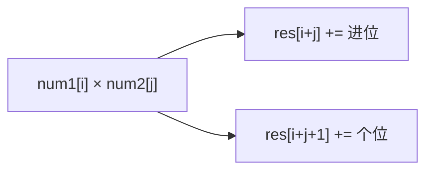

# 高精度运算：大数加减乘除


## 一、为什么需要高精度

编程语言内置的整数类型有上限（Java long 最大约 9.2×10^18）。当数字超过这个范围时（如 100 位的大数），必须用**数组/字符串模拟竖式运算**。

面试高频题：
| 题目 | 操作 | 难度 |
|------|------|------|
| LC 415. 字符串相加 | 大数加法 | Easy |
| LC 43. 字符串相乘 | 大数乘法 | Medium |
| LC 2. 两数相加 | 链表加法 | Medium |
| LC 67. 二进制求和 | 二进制加法 | Easy |
| 剑指 16. 数值的整数次方 | 快速幂 | Medium |

## 二、高精度加法

### 2.1 核心思路

模拟竖式：从最低位开始逐位相加，维护进位。

```
    9 9 9
+     1 1
---------
  1 0 1 0
```

### 2.2 模板

```java tab
String addStrings(String num1, String num2) {
    StringBuilder sb = new StringBuilder();
    int i = num1.length() - 1, j = num2.length() - 1, carry = 0;

    while (i >= 0 || j >= 0 || carry > 0) {
        int sum = carry;
        if (i >= 0) sum += num1.charAt(i--) - '0';
        if (j >= 0) sum += num2.charAt(j--) - '0';
        sb.append(sum % 10);
        carry = sum / 10;
    }
    return sb.reverse().toString();
}
```

```typescript tab
function addStrings(num1: string, num2: string): string {
  let i = num1.length - 1, j = num2.length - 1, carry = 0;
  const res: number[] = [];

  while (i >= 0 || j >= 0 || carry > 0) {
    let sum = carry;
    if (i >= 0) sum += Number(num1[i--]);
    if (j >= 0) sum += Number(num2[j--]);
    res.push(sum % 10);
    carry = Math.floor(sum / 10);
  }
  return res.reverse().join('');
}
```

```python tab
def addStrings(num1: str, num2: str) -> str:
    i, j = len(num1) - 1, len(num2) - 1
    carry = 0
    res = []
    while i >= 0 or j >= 0 or carry:
        s = carry
        if i >= 0:
            s += ord(num1[i]) - ord('0'); i -= 1
        if j >= 0:
            s += ord(num2[j]) - ord('0'); j -= 1
        res.append(str(s % 10))
        carry = s // 10
    return ''.join(reversed(res))
```

### 2.3 链表版（LC 2）

链表天然从低位开始，无需反转：

```java tab
ListNode addTwoNumbers(ListNode l1, ListNode l2) {
    ListNode dummy = new ListNode(0), cur = dummy;
    int carry = 0;
    while (l1 != null || l2 != null || carry > 0) {
        int sum = carry;
        if (l1 != null) { sum += l1.val; l1 = l1.next; }
        if (l2 != null) { sum += l2.val; l2 = l2.next; }
        cur.next = new ListNode(sum % 10);
        carry = sum / 10;
        cur = cur.next;
    }
    return dummy.next;
}
```

```typescript tab
function addTwoNumbers(l1: ListNode | null, l2: ListNode | null): ListNode | null {
  const dummy = new ListNode(0);
  let cur = dummy, carry = 0;
  while (l1 || l2 || carry) {
    let sum = carry;
    if (l1) { sum += l1.val; l1 = l1.next; }
    if (l2) { sum += l2.val; l2 = l2.next; }
    cur.next = new ListNode(sum % 10);
    carry = Math.floor(sum / 10);
    cur = cur.next;
  }
  return dummy.next;
}
```

```python tab
def addTwoNumbers(l1, l2):
    dummy = ListNode(0)
    cur, carry = dummy, 0
    while l1 or l2 or carry:
        s = carry
        if l1: s += l1.val; l1 = l1.next
        if l2: s += l2.val; l2 = l2.next
        cur.next = ListNode(s % 10)
        carry = s // 10
        cur = cur.next
    return dummy.next
```

## 三、高精度减法

与加法类似，但需要处理**借位**和**结果符号**。

```java tab
// 假设 a >= b >= 0，返回 a - b
String subtract(String a, String b) {
    StringBuilder sb = new StringBuilder();
    int i = a.length() - 1, j = b.length() - 1, borrow = 0;

    while (i >= 0) {
        int diff = (a.charAt(i--) - '0') - borrow;
        if (j >= 0) diff -= (b.charAt(j--) - '0');
        if (diff < 0) { diff += 10; borrow = 1; }
        else borrow = 0;
        sb.append(diff);
    }
    // 去前导零
    while (sb.length() > 1 && sb.charAt(sb.length() - 1) == '0')
        sb.deleteCharAt(sb.length() - 1);
    return sb.reverse().toString();
}
```

```typescript tab
function subtract(a: string, b: string): string {
  // 假设 a >= b >= 0
  let i = a.length - 1, j = b.length - 1, borrow = 0;
  const res: number[] = [];
  while (i >= 0) {
    let diff = Number(a[i--]) - borrow;
    if (j >= 0) diff -= Number(b[j--]);
    if (diff < 0) { diff += 10; borrow = 1; }
    else borrow = 0;
    res.push(diff);
  }
  while (res.length > 1 && res[res.length - 1] === 0) res.pop();
  return res.reverse().join('');
}
```

```python tab
def subtract(a: str, b: str) -> str:
    # 假设 a >= b >= 0
    i, j = len(a) - 1, len(b) - 1
    borrow = 0
    res = []
    while i >= 0:
        diff = int(a[i]) - borrow
        i -= 1
        if j >= 0:
            diff -= int(b[j]); j -= 1
        if diff < 0:
            diff += 10; borrow = 1
        else:
            borrow = 0
        res.append(str(diff))
    while len(res) > 1 and res[-1] == '0':
        res.pop()
    return ''.join(reversed(res))
```

## 四、高精度乘法

### 4.1 核心思路

模拟竖式：num1 的第 i 位 × num2 的第 j 位 → 贡献到结果的第 `i+j` 和 `i+j+1` 位。



### 4.2 模板

```java tab
String multiply(String num1, String num2) {
    if ("0".equals(num1) || "0".equals(num2)) return "0";
    int m = num1.length(), n = num2.length();
    int[] res = new int[m + n];

    for (int i = m - 1; i >= 0; i--) {
        for (int j = n - 1; j >= 0; j--) {
            int mul = (num1.charAt(i) - '0') * (num2.charAt(j) - '0');
            int p1 = i + j, p2 = i + j + 1;
            int sum = mul + res[p2];
            res[p2] = sum % 10;
            res[p1] += sum / 10;
        }
    }

    StringBuilder sb = new StringBuilder();
    for (int d : res) {
        if (!(sb.length() == 0 && d == 0)) sb.append(d);
    }
    return sb.length() == 0 ? "0" : sb.toString();
}
```

```typescript tab
function multiply(num1: string, num2: string): string {
  if (num1 === '0' || num2 === '0') return '0';
  const m = num1.length, n = num2.length;
  const res = Array(m + n).fill(0);

  for (let i = m - 1; i >= 0; i--) {
    for (let j = n - 1; j >= 0; j--) {
      const mul = Number(num1[i]) * Number(num2[j]);
      const p1 = i + j, p2 = i + j + 1;
      const sum = mul + res[p2];
      res[p2] = sum % 10;
      res[p1] += Math.floor(sum / 10);
    }
  }

  const s = res.join('').replace(/^0+/, '');
  return s || '0';
}
```

```python tab
def multiply(num1: str, num2: str) -> str:
    if num1 == '0' or num2 == '0':
        return '0'
    m, n = len(num1), len(num2)
    res = [0] * (m + n)

    for i in range(m - 1, -1, -1):
        for j in range(n - 1, -1, -1):
            mul = int(num1[i]) * int(num2[j])
            p1, p2 = i + j, i + j + 1
            s = mul + res[p2]
            res[p2] = s % 10
            res[p1] += s // 10

    result = ''.join(map(str, res)).lstrip('0')
    return result or '0'
```

### 4.3 关键洞察

- 结果最多 `m + n` 位（如 99 × 99 = 9801，2+2=4 位）
- `res[i+j]` 存进位，`res[i+j+1]` 存个位
- 最后去前导零

## 五、高精度除法（大数 ÷ 小数）

面试中较少出现，但思路是**逐位试商**：

```java tab
// 大数 num ÷ 小数 divisor，返回商和余数
String divide(String num, int divisor) {
    StringBuilder quotient = new StringBuilder();
    int remainder = 0;
    for (int i = 0; i < num.length(); i++) {
        int cur = remainder * 10 + (num.charAt(i) - '0');
        quotient.append(cur / divisor);
        remainder = cur % divisor;
    }
    // 去前导零
    String result = quotient.toString().replaceFirst("^0+", "");
    return result.isEmpty() ? "0" : result;
}
```

```typescript tab
function divide(num: string, divisor: number): string {
  let remainder = 0;
  const quotient: number[] = [];
  for (let i = 0; i < num.length; i++) {
    const cur = remainder * 10 + Number(num[i]);
    quotient.push(Math.floor(cur / divisor));
    remainder = cur % divisor;
  }
  const result = quotient.join('').replace(/^0+/, '');
  return result || '0';
}
```

```python tab
def divide(num: str, divisor: int) -> str:
    remainder = 0
    quotient = []
    for ch in num:
        cur = remainder * 10 + int(ch)
        quotient.append(str(cur // divisor))
        remainder = cur % divisor
    result = ''.join(quotient).lstrip('0')
    return result or '0'
```

## 六、二进制加法（LC 67）

把十进制换成二进制，进位条件从 `>= 10` 变为 `>= 2`：

```java tab
String addBinary(String a, String b) {
    StringBuilder sb = new StringBuilder();
    int i = a.length() - 1, j = b.length() - 1, carry = 0;
    while (i >= 0 || j >= 0 || carry > 0) {
        int sum = carry;
        if (i >= 0) sum += a.charAt(i--) - '0';
        if (j >= 0) sum += b.charAt(j--) - '0';
        sb.append(sum % 2);
        carry = sum / 2;
    }
    return sb.reverse().toString();
}
```

```typescript tab
function addBinary(a: string, b: string): string {
  let i = a.length - 1, j = b.length - 1, carry = 0;
  const res: number[] = [];
  while (i >= 0 || j >= 0 || carry) {
    let sum = carry;
    if (i >= 0) sum += Number(a[i--]);
    if (j >= 0) sum += Number(b[j--]);
    res.push(sum % 2);
    carry = Math.floor(sum / 2);
  }
  return res.reverse().join('');
}
```

```python tab
def addBinary(a: str, b: str) -> str:
    i, j = len(a) - 1, len(b) - 1
    carry = 0
    res = []
    while i >= 0 or j >= 0 or carry:
        s = carry
        if i >= 0: s += int(a[i]); i -= 1
        if j >= 0: s += int(b[j]); j -= 1
        res.append(str(s % 2))
        carry = s // 2
    return ''.join(reversed(res))
```

## 七、面试注意事项

1. **边界处理**：结果为 0 时不要返回空串；去前导零
2. **不要转整数**：题目要求就是不能用 BigInteger / BigInt
3. **乘法数组大小**：`m + n` 足够，不需要更大
4. **链表加法**：注意链表是逆序存储（低位在前），天然适合逐位相加
5. **符号处理**：如果题目可能有负数，先比较绝对值大小，再决定用加法还是减法
