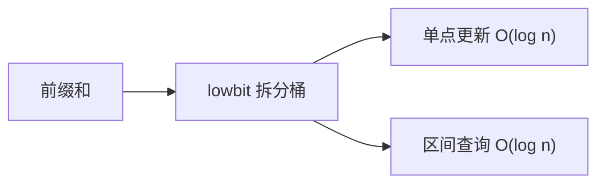

# 树状数组（Binary Indexed Tree）

树状数组（BIT / Fenwick Tree）是一种用于**单点更新 + 前缀和查询**的高效数据结构，两种操作均为 O(log n)，且代码极简、常数极小。

## 一、核心思想



树状数组利用二进制 **lowbit** 将前缀和拆分为若干"桶"：

- `lowbit(x) = x & (-x)`：取 x 最低位的 1
- `tree[i]` 存储区间 `(i - lowbit(i), i]` 的和
- 查询前缀和：从 i 不断减去 lowbit，累加 tree[i]
- 更新：从 i 不断加上 lowbit，更新沿途 tree[i]

## 二、代码实现

```java tab
public class BinaryIndexedTree {
    private final int[] tree;
    private final int n;

    public BinaryIndexedTree(int n) {
        this.n = n;
        this.tree = new int[n + 1]; // 下标从 1 开始
    }

    // 单点更新：index 位置加 delta
    public void update(int index, int delta) {
        for (int i = index + 1; i <= n; i += i & (-i)) {
            tree[i] += delta;
        }
    }

    // 前缀和查询：[0, index] 的和
    public int query(int index) {
        int sum = 0;
        for (int i = index + 1; i > 0; i -= i & (-i)) {
            sum += tree[i];
        }
        return sum;
    }

    // 区间和查询：[left, right]
    public int rangeQuery(int left, int right) {
        return query(right) - (left > 0 ? query(left - 1) : 0);
    }

    // 用原数组 O(n) 建树
    public static BinaryIndexedTree build(int[] arr) {
        BinaryIndexedTree bit = new BinaryIndexedTree(arr.length);
        for (int i = 0; i < arr.length; i++) {
            bit.update(i, arr[i]);
        }
        return bit;
    }
}
```

```typescript tab
class BinaryIndexedTree {
    private tree: number[];
    private n: number;

    constructor(n: number) {
        this.n = n;
        this.tree = new Array(n + 1).fill(0); // 下标从 1 开始
    }

    // 单点更新：index 位置加 delta
    update(index: number, delta: number): void {
        for (let i = index + 1; i <= this.n; i += i & (-i)) {
            this.tree[i] += delta;
        }
    }

    // 前缀和查询：[0, index] 的和
    query(index: number): number {
        let sum = 0;
        for (let i = index + 1; i > 0; i -= i & (-i)) {
            sum += this.tree[i];
        }
        return sum;
    }

    // 区间和查询：[left, right]
    rangeQuery(left: number, right: number): number {
        return this.query(right) - (left > 0 ? this.query(left - 1) : 0);
    }

    // 用原数组 O(n) 建树
    static build(arr: number[]): BinaryIndexedTree {
        const bit = new BinaryIndexedTree(arr.length);
        for (let i = 0; i < arr.length; i++) {
            bit.update(i, arr[i]);
        }
        return bit;
    }
}
```

```python tab
class BinaryIndexedTree:
    def __init__(self, n: int):
        self.n = n
        self.tree = [0] * (n + 1)  # 下标从 1 开始

    # 单点更新：index 位置加 delta
    def update(self, index: int, delta: int) -> None:
        i = index + 1
        while i <= self.n:
            self.tree[i] += delta
            i += i & (-i)

    # 前缀和查询：[0, index] 的和
    def query(self, index: int) -> int:
        s = 0
        i = index + 1
        while i > 0:
            s += self.tree[i]
            i -= i & (-i)
        return s

    # 区间和查询：[left, right]
    def range_query(self, left: int, right: int) -> int:
        return self.query(right) - (self.query(left - 1) if left > 0 else 0)

    # 用原数组 O(n) 建树
    @staticmethod
    def build(arr: list[int]) -> "BinaryIndexedTree":
        bit = BinaryIndexedTree(len(arr))
        for i, val in enumerate(arr):
            bit.update(i, val)
        return bit
```

## 三、lowbit 原理图解

```
下标(十进制)  下标(二进制)  lowbit  管辖范围
1            0001         1       [1,1]
2            0010         2       [1,2]
3            0011         1       [3,3]
4            0100         4       [1,4]
5            0101         1       [5,5]
6            0110         2       [5,6]
7            0111         1       [7,7]
8            1000         8       [1,8]
```

查询 `prefix(7)` = tree[7] + tree[6] + tree[4]（7→6→4→0）

## 四、复杂度

| 操作 | 时间复杂度 |
|------|-----------|
| 单点更新 | O(log n) |
| 前缀和查询 | O(log n) |
| 建树 | O(n log n) 或 O(n) |
| 空间 | O(n) |

## 五、树状数组 vs 线段树

| 维度 | 树状数组 | 线段树 |
|------|---------|--------|
| 代码量 | ~15 行 | ~50 行 |
| 常数 | 极小 | 较大（递归） |
| 区间修改 | 需差分技巧 | 原生支持（lazy） |
| 区间最值 | ❌ 不支持 | ✅ 支持 |
| 适用场景 | 前缀和 / 逆序对 | 通用区间操作 |

## 六、经典应用

### 1. 逆序对计数

```java tab
// 离散化 + 树状数组求逆序对
public long countInversions(int[] nums) {
    // 离散化
    int[] sorted = nums.clone();
    Arrays.sort(sorted);
    Map<Integer, Integer> rank = new HashMap<>();
    for (int i = 0; i < sorted.length; i++) {
        rank.putIfAbsent(sorted[i], i + 1);
    }

    BinaryIndexedTree bit = new BinaryIndexedTree(sorted.length);
    long inversions = 0;
    for (int i = nums.length - 1; i >= 0; i--) {
        int r = rank.get(nums[i]);
        inversions += bit.query(r - 1); // 右边比当前小的个数
        bit.update(r, 1);
    }
    return inversions;
}
```

```typescript tab
// 离散化 + 树状数组求逆序对
function countInversions(nums: number[]): number {
    // 离散化
    const sorted = [...nums].sort((a, b) => a - b);
    const rank = new Map<number, number>();
    for (let i = 0; i < sorted.length; i++) {
        if (!rank.has(sorted[i])) {
            rank.set(sorted[i], i + 1);
        }
    }

    const bit = new BinaryIndexedTree(sorted.length);
    let inversions = 0;
    for (let i = nums.length - 1; i >= 0; i--) {
        const r = rank.get(nums[i])!;
        inversions += bit.query(r - 1); // 右边比当前小的个数
        bit.update(r, 1);
    }
    return inversions;
}
```

```python tab
# 离散化 + 树状数组求逆序对
def count_inversions(nums: list[int]) -> int:
    # 离散化
    sorted_nums = sorted(nums)
    rank = {}
    for i, val in enumerate(sorted_nums):
        if val not in rank:
            rank[val] = i + 1

    bit = BinaryIndexedTree(len(sorted_nums))
    inversions = 0
    for i in range(len(nums) - 1, -1, -1):
        r = rank[nums[i]]
        inversions += bit.query(r - 1)  # 右边比当前小的个数
        bit.update(r, 1)
    return inversions
```

### 2. 二维树状数组

将一维扩展为二维，支持矩阵区域的求和与更新，常用于二维平面统计问题。

## 七、面试要点

1. **lowbit 的含义**：`x & (-x)` 取最低位 1，是树状数组的核心
2. **为什么下标从 1 开始**：避免 lowbit(0) = 0 导致死循环
3. **与线段树的选择**：只需前缀和 → 树状数组；需要区间修改/最值 → 线段树
4. **LeetCode 高频**：307（区域和检索）、493（翻转对）、315（右侧小于当前）

## 八、update / query 过程模拟

以 `n = 8`，依次插入 `[1, 2, 3, 4, 5, 6, 7, 8]` 为例：

```
树状数组的管辖关系（由 lowbit 决定）：

c[1] = a[1]                        (lowbit(1)=1, 管 1 个)
c[2] = a[1]+a[2]                   (lowbit(2)=2, 管 2 个)
c[3] = a[3]                        (lowbit(3)=1)
c[4] = a[1]+a[2]+a[3]+a[4]         (lowbit(4)=4, 管 4 个)
c[5] = a[5]
c[6] = a[5]+a[6]
c[7] = a[7]
c[8] = a[1]+...+a[8]               (lowbit(8)=8, 管 8 个)

update(3, +5) 的传播路径：
  i=3 → c[3]+=5 → i=3+lowbit(3)=4 → c[4]+=5 → i=4+4=8 → c[8]+=5 → 结束
  恰好覆盖了所有"包含 a[3] 的区间"

query(6) 的收集路径：
  i=6 → 收 c[6] → i=6-lowbit(6)=4 → 收 c[4] → i=4-4=0 → 结束
  c[6]+c[4] = (a[5]+a[6]) + (a[1..4]) = 前缀和[1..6] ✓
```

**核心直觉**：每个 `c[i]` 负责一段以 `i` 结尾、长度为 `lowbit(i)` 的区间。update 向上"汇报"，query 向下"拆分"，两条路径都只走 O(log n) 个节点。

## 九、区间修改 + 单点查询（差分技巧）

树状数组原生只支持"单点修改 + 前缀查询"，但借助**差分数组**可以互换角色：

```python tab
# 区间 [l, r] 整体加 v：在差分数组上单点修改
def range_add(bit, l, r, v):
    bit.update(l, v)
    bit.update(r + 1, -v)

# 单点查询 a[i]：差分的前缀和
def point_query(bit, i):
    return bit.query(i)
```

若需要"区间修改 + 区间查询"，维护两个树状数组（对差分序列 `d[i]` 和 `i*d[i]` 各建一个）即可，这是 LC 307 进阶版的经典解法。

## 十、面试真题

| 题目 | 难度 | 核心思路 |
|------|------|----------|
| 区域和检索 - 数组可修改（LC 307） | 🟡 Medium | BIT 模板题 |
| 计算右侧小于当前元素的个数（LC 315） | 🔴 Hard | 离散化 + BIT 统计 |
| 翻转对（LC 493） | 🔴 Hard | 归并 or BIT + 离散化 |
| 创建目标数组需要的插入次数（LC 1649） | 🔴 Hard | BIT 求前后更小元素 |

## 十一、思考题

1. 为什么 `query` 是不断减去 lowbit，而 `update` 是不断加上 lowbit？两者方向相反的本质原因是什么？（提示：管辖区间的包含关系）
2. 如果数组下标可能为 0 或负数，应该如何处理？（提示：整体平移）
3. 树状数组能否支持"区间最值查询"？为什么前缀和可以而最值不行？（提示：最值不满足可减性）

> 练习推荐：先做 LC 307 熟悉模板，再挑战逆序对类题目巩固离散化技巧。
