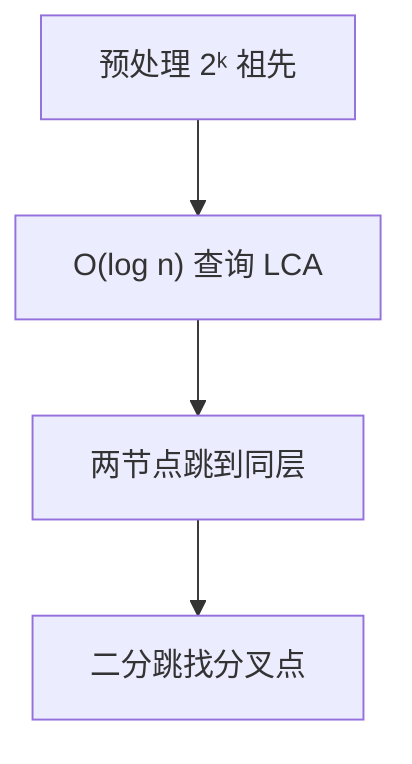

# 倍增法与 LCA

倍增法（Binary Lifting）通过预处理每个节点的 2^k 级祖先，实现 O(log n) 查询任意两节点的最近公共祖先（LCA），是树上查询的基础工具。

## 一、LCA 问题



给定有根树，多次查询两个节点 u, v 的最近公共祖先。

```
        1
       / \
      2   3
     / \
    4   5

LCA(4, 5) = 2
LCA(4, 3) = 1
```

## 二、倍增预处理

`up[u][k]` = 节点 u 的第 2^k 级祖先

```java tab
int LOG = 20; // 2^20 > 10^6
int[][] up; // up[n][LOG]
int[] depth;

void preprocess(int root, List<Integer>[] adj) {
    int n = adj.length;
    up = new int[n][LOG];
    depth = new int[n];
    dfs(root, 0, adj);
}

void dfs(int u, int parent, List<Integer>[] adj) {
    up[u][0] = parent;
    for (int k = 1; k < LOG; k++) {
        up[u][k] = up[up[u][k - 1]][k - 1]; // 2^k = 2^(k-1) + 2^(k-1)
    }
    for (int v : adj[u]) {
        if (v == parent) continue;
        depth[v] = depth[u] + 1;
        dfs(v, u, adj);
    }
}
```

```typescript tab
const LOG = 20; // 2^20 > 10^6
let up: number[][]; // up[n][LOG]
let depth: number[];

function preprocess(root: number, adj: number[][]): void {
    const n = adj.length;
    up = Array.from({ length: n }, () => new Array(LOG).fill(0));
    depth = new Array(n).fill(0);
    dfs(root, 0, adj);
}

function dfs(u: number, parent: number, adj: number[][]): void {
    up[u][0] = parent;
    for (let k = 1; k < LOG; k++) {
        up[u][k] = up[up[u][k - 1]][k - 1]; // 2^k = 2^(k-1) + 2^(k-1)
    }
    for (const v of adj[u]) {
        if (v === parent) continue;
        depth[v] = depth[u] + 1;
        dfs(v, u, adj);
    }
}
```

```python tab
LOG = 20  # 2^20 > 10^6
up = []  # up[n][LOG]
depth = []

def preprocess(root: int, adj: list) -> None:
    global up, depth
    n = len(adj)
    up = [[0] * LOG for _ in range(n)]
    depth = [0] * n
    dfs(root, 0, adj)

def dfs(u: int, parent: int, adj: list) -> None:
    up[u][0] = parent
    for k in range(1, LOG):
        up[u][k] = up[up[u][k - 1]][k - 1]  # 2^k = 2^(k-1) + 2^(k-1)
    for v in adj[u]:
        if v == parent:
            continue
        depth[v] = depth[u] + 1
        dfs(v, u, adj)
```

## 三、LCA 查询

### 步骤

1. 将较深节点跳到与另一个同深
2. 如果相同 → 返回
3. 从大到小尝试：如果 up[u][k] ≠ up[v][k]，同时跳
4. 最后返回 up[u][0]

```java tab
int lca(int u, int v) {
    if (depth[u] < depth[v]) { int tmp = u; u = v; v = tmp; }

    // 1. u 跳到与 v 同深
    int diff = depth[u] - depth[v];
    for (int k = 0; k < LOG; k++) {
        if ((diff & (1 << k)) != 0) {
            u = up[u][k];
        }
    }

    if (u == v) return u;

    // 2. 同时向上跳
    for (int k = LOG - 1; k >= 0; k--) {
        if (up[u][k] != up[v][k]) {
            u = up[u][k];
            v = up[v][k];
        }
    }

    return up[u][0];
}
```

```typescript tab
function lca(u: number, v: number): number {
    if (depth[u] < depth[v]) [u, v] = [v, u];

    // 1. u 跳到与 v 同深
    let diff = depth[u] - depth[v];
    for (let k = 0; k < LOG; k++) {
        if ((diff & (1 << k)) !== 0) {
            u = up[u][k];
        }
    }

    if (u === v) return u;

    // 2. 同时向上跳
    for (let k = LOG - 1; k >= 0; k--) {
        if (up[u][k] !== up[v][k]) {
            u = up[u][k];
            v = up[v][k];
        }
    }

    return up[u][0];
}
```

```python tab
def lca(u: int, v: int) -> int:
    if depth[u] < depth[v]:
        u, v = v, u

    # 1. u 跳到与 v 同深
    diff = depth[u] - depth[v]
    for k in range(LOG):
        if diff & (1 << k):
            u = up[u][k]

    if u == v:
        return u

    # 2. 同时向上跳
    for k in range(LOG - 1, -1, -1):
        if up[u][k] != up[v][k]:
            u = up[u][k]
            v = up[v][k]

    return up[u][0]
```

## 四、树上路径距离

```java tab
int distance(int u, int v) {
    int ancestor = lca(u, v);
    return depth[u] + depth[v] - 2 * depth[ancestor];
}
```

```typescript tab
function distance(u: number, v: number): number {
    const ancestor = lca(u, v);
    return depth[u] + depth[v] - 2 * depth[ancestor];
}
```

```python tab
def distance(u: int, v: int) -> int:
    ancestor = lca(u, v)
    return depth[u] + depth[v] - 2 * depth[ancestor]
```

## 五、树上 k 级祖先

```java tab
int kthAncestor(int u, int k) {
    for (int i = 0; i < LOG; i++) {
        if ((k & (1 << i)) != 0) {
            u = up[u][i];
        }
    }
    return u;
}
```

```typescript tab
function kthAncestor(u: number, k: number): number {
    for (let i = 0; i < LOG; i++) {
        if ((k & (1 << i)) !== 0) {
            u = up[u][i];
        }
    }
    return u;
}
```

```python tab
def kth_ancestor(u: int, k: int) -> int:
    for i in range(LOG):
        if k & (1 << i):
            u = up[u][i]
    return u
```

## 六、其他 LCA 方法对比

| 方法 | 预处理 | 查询 | 特点 |
|------|--------|------|------|
| 倍增 | O(n log n) | O(log n) | 最通用 |
| Tarjan 离线 | O(n) | O(α(n)) | 只能离线 |
| 树链剖分 | O(n) | O(log n) | 可附带路径操作 |
| RMQ（欧拉序） | O(n log n) | O(1) | 查询最快 |
| 暴力爬 | O(1) | O(n) | 不可接受 |

## 七、应用

| 场景 | 说明 |
|------|------|
| 树上路径距离 | depth[u]+depth[v]-2×depth[lca] |
| 树上路径最大边权 | 倍增时附带 max 信息 |
| 判断祖先关系 | lca(u,v)==u → u 是 v 的祖先 |
| 虚拟树 | 按 DFS 序排序 + LCA 构建 |
| 树上差分 | 路径修改转化为端点差分 |

## 八、面试要点

1. **预处理**：`up[u][k] = up[up[u][k-1]][k-1]`
2. **查询三步**：对齐深度 → 同时跳 → 返回父节点
3. **LOG 取值**：⌈log₂(n)⌉ + 1
4. **根节点处理**：`up[root][k] = root`（自环）
5. **LeetCode**：235/236（BST/二叉树 LCA）、1483（树节点的第 K 个祖先）、124（二叉树最大路径和，思想相关）
