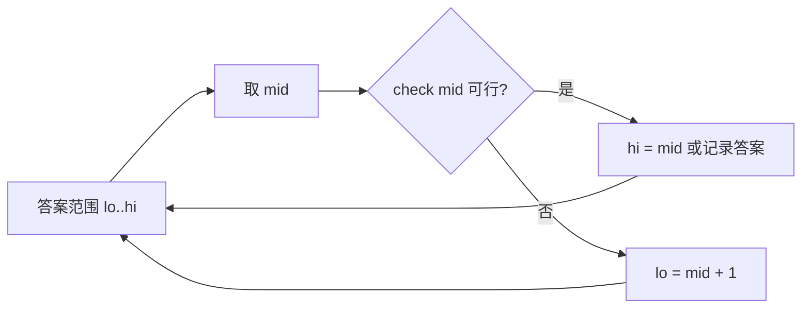

# 二分查找进阶


## 一、什么是二分答案

**二分答案**不是在一个数组里找某个值，而是**在答案的可能范围内二分**，通过一个验证函数（check）判断当前猜测是否可行，从而逐步缩小答案范围。

> 核心条件：答案具有**单调性**——如果 x 可行，那么所有 ≤ x（或 ≥ x）的值也可行。



## 二、两种模板

### 2.1 找最小可行值（左边界）

```java tab
int lo = minVal, hi = maxVal;
while (lo < hi) {
    int mid = lo + (hi - lo) / 2;
    if (check(mid)) {
        hi = mid;
    } else {
        lo = mid + 1;
    }
}
return lo;
```
```typescript tab
let lo = minVal, hi = maxVal;
while (lo < hi) {
    const mid = lo + Math.floor((hi - lo) / 2);
    if (check(mid)) hi = mid;
    else lo = mid + 1;
}
return lo;
```
```python tab
lo, hi = min_val, max_val
while lo < hi:
    mid = lo + (hi - lo) // 2
    if check(mid):
        hi = mid
    else:
        lo = mid + 1
return lo
```

### 2.2 找最大可行值（右边界）

```java tab
int lo = minVal, hi = maxVal;
while (lo < hi) {
    int mid = lo + (hi - lo + 1) / 2;
    if (check(mid)) {
        lo = mid;
    } else {
        hi = mid - 1;
    }
}
return lo;
```
```typescript tab
let lo = minVal, hi = maxVal;
while (lo < hi) {
    const mid = lo + Math.floor((hi - lo + 1) / 2);
    if (check(mid)) lo = mid;
    else hi = mid - 1;
}
return lo;
```
```python tab
lo, hi = min_val, max_val
while lo < hi:
    mid = lo + (hi - lo + 1) // 2
    if check(mid):
        lo = mid
    else:
        hi = mid - 1
return lo
```

> **防死循环**：当 `lo + 1 == hi` 时，若 `mid = lo`（不加 1），且 check 为 true → `lo = mid = lo`，死循环。

## 三、经典案例

### 3.1 分割数组的最大值最小化

**问题**：将数组分成 k 段，使各段之和的最大值最小。

```java tab
public int splitArray(int[] nums, int k) {
    int lo = 0, hi = 0;
    for (int x : nums) { lo = Math.max(lo, x); hi += x; }
    while (lo < hi) {
        int mid = lo + (hi - lo) / 2;
        if (canSplit(nums, k, mid)) hi = mid;
        else lo = mid + 1;
    }
    return lo;
}

private boolean canSplit(int[] nums, int k, int maxSum) {
    int count = 1, curSum = 0;
    for (int x : nums) {
        if (curSum + x > maxSum) { count++; curSum = 0; }
        curSum += x;
    }
    return count <= k;
}
```
```typescript tab
function splitArray(nums: number[], k: number): number {
    let lo = Math.max(...nums), hi = nums.reduce((a, b) => a + b, 0);
    while (lo < hi) {
        const mid = lo + Math.floor((hi - lo) / 2);
        if (canSplit(nums, k, mid)) hi = mid;
        else lo = mid + 1;
    }
    return lo;
}

function canSplit(nums: number[], k: number, maxSum: number): boolean {
    let count = 1, curSum = 0;
    for (const x of nums) {
        if (curSum + x > maxSum) { count++; curSum = 0; }
        curSum += x;
    }
    return count <= k;
}
```
```python tab
def split_array(nums: list[int], k: int) -> int:
    lo, hi = max(nums), sum(nums)
    while lo < hi:
        mid = lo + (hi - lo) // 2
        if can_split(nums, k, mid):
            hi = mid
        else:
            lo = mid + 1
    return lo

def can_split(nums: list[int], k: int, max_sum: int) -> bool:
    count, cur_sum = 1, 0
    for x in nums:
        if cur_sum + x > max_sum:
            count += 1
            cur_sum = 0
        cur_sum += x
    return count <= k
```

- **时间**：O(n log(sum))

### 3.2 在 D 天内送达包裹的能力

**问题**：求最低运载能力，使所有包裹在 D 天内送达。

```java tab
public int shipWithinDays(int[] weights, int days) {
    int lo = 0, hi = 0;
    for (int w : weights) { lo = Math.max(lo, w); hi += w; }
    while (lo < hi) {
        int mid = lo + (hi - lo) / 2;
        if (canShip(weights, days, mid)) hi = mid;
        else lo = mid + 1;
    }
    return lo;
}

private boolean canShip(int[] weights, int days, int capacity) {
    int need = 1, cur = 0;
    for (int w : weights) {
        if (cur + w > capacity) { need++; cur = 0; }
        cur += w;
    }
    return need <= days;
}
```
```typescript tab
function shipWithinDays(weights: number[], days: number): number {
    let lo = Math.max(...weights), hi = weights.reduce((a, b) => a + b, 0);
    while (lo < hi) {
        const mid = lo + Math.floor((hi - lo) / 2);
        if (canShip(weights, days, mid)) hi = mid;
        else lo = mid + 1;
    }
    return lo;
}

function canShip(weights: number[], days: number, capacity: number): boolean {
    let need = 1, cur = 0;
    for (const w of weights) {
        if (cur + w > capacity) { need++; cur = 0; }
        cur += w;
    }
    return need <= days;
}
```
```python tab
def ship_within_days(weights: list[int], days: int) -> int:
    lo, hi = max(weights), sum(weights)
    while lo < hi:
        mid = lo + (hi - lo) // 2
        if can_ship(weights, days, mid):
            hi = mid
        else:
            lo = mid + 1
    return lo

def can_ship(weights: list[int], days: int, capacity: int) -> bool:
    need, cur = 1, 0
    for w in weights:
        if cur + w > capacity:
            need += 1
            cur = 0
        cur += w
    return need <= days
```

### 3.3 求平方根（整数二分）

```java tab
public int mySqrt(int x) {
    if (x < 2) return x;
    int lo = 1, hi = x / 2;
    while (lo < hi) {
        int mid = lo + (hi - lo + 1) / 2;
        if (mid <= x / mid) lo = mid;
        else hi = mid - 1;
    }
    return lo;
}
```
```typescript tab
function mySqrt(x: number): number {
    if (x < 2) return x;
    let lo = 1, hi = Math.floor(x / 2);
    while (lo < hi) {
        const mid = lo + Math.floor((hi - lo + 1) / 2);
        if (mid <= Math.floor(x / mid)) lo = mid;
        else hi = mid - 1;
    }
    return lo;
}
```
```python tab
def my_sqrt(x: int) -> int:
    if x < 2:
        return x
    lo, hi = 1, x // 2
    while lo < hi:
        mid = (lo + hi + 1) // 2
        if mid <= x // mid:
            lo = mid
        else:
            hi = mid - 1
    return lo
```

### 3.4 爱吃香蕉的珂珂

```java tab
public int minEatingSpeed(int[] piles, int h) {
    int lo = 1, hi = 0;
    for (int p : piles) hi = Math.max(hi, p);
    while (lo < hi) {
        int mid = lo + (hi - lo) / 2;
        if (canFinish(piles, h, mid)) hi = mid;
        else lo = mid + 1;
    }
    return lo;
}

private boolean canFinish(int[] piles, int h, int speed) {
    int hours = 0;
    for (int p : piles) hours += (p + speed - 1) / speed;
    return hours <= h;
}
```
```typescript tab
function minEatingSpeed(piles: number[], h: number): number {
    let lo = 1, hi = Math.max(...piles);
    while (lo < hi) {
        const mid = lo + Math.floor((hi - lo) / 2);
        if (canFinish(piles, h, mid)) hi = mid;
        else lo = mid + 1;
    }
    return lo;
}

function canFinish(piles: number[], h: number, speed: number): boolean {
    let hours = 0;
    for (const p of piles) hours += Math.ceil(p / speed);
    return hours <= h;
}
```
```python tab
def min_eating_speed(piles: list[int], h: int) -> int:
    lo, hi = 1, max(piles)
    while lo < hi:
        mid = lo + (hi - lo) // 2
        if can_finish(piles, h, mid):
            hi = mid
        else:
            lo = mid + 1
    return lo

def can_finish(piles: list[int], h: int, speed: int) -> bool:
    hours = sum((p + speed - 1) // speed for p in piles)
    return hours <= h
```

## 四、二分答案的识别信号

看到以下关键词，考虑二分答案：

| 信号 | 示例 |
|------|------|
| "最大值最小" / "最小值最大" | 分割数组最大值最小化 |
| "最少/最多需要多少" | 最少运载能力 |
| "能否在 X 内完成" | D 天内送达 |
| 答案有明确上下界 | 速度 ∈ [1, max] |
| 验证某个答案是否可行很容易 | check 函数 O(n) |

## 五、二分答案 vs 二分查找

| 维度 | 二分查找 | 二分答案 |
|------|----------|----------|
| 搜索对象 | 数组中的元素 | 答案的数值范围 |
| 前提 | 数组有序 | 答案具有单调性 |
| check | 比较大小 | 自定义验证函数 |
| 典型题 | 查找目标值 | 分割数组、运载能力 |

## 六、常见陷阱

| 陷阱 | 解决 |
|------|------|
| 死循环 | 右边界模板 mid 要 `+1` |
| 整数溢出 | `mid = lo + (hi - lo) / 2` |
| 边界遗漏 | 先验证 lo 和 hi 是否可行 |
| check 方向搞反 | 明确"可行时缩哪边" |
| 浮点二分 | 用 `while (hi - lo > 1e-7)` 控制精度 |

### 浮点二分（求精度答案）

```java tab
double lo = 0, hi = 1e9;
while (hi - lo > 1e-7) {
    double mid = (lo + hi) / 2;
    if (check(mid)) hi = mid;
    else lo = mid;
}
return lo;
```
```typescript tab
let lo = 0, hi = 1e9;
while (hi - lo > 1e-7) {
    const mid = (lo + hi) / 2;
    if (check(mid)) hi = mid;
    else lo = mid;
}
return lo;
```
```python tab
lo, hi = 0, 1e9
while hi - lo > 1e-7:
    mid = (lo + hi) / 2
    if check(mid):
        hi = mid
    else:
        lo = mid
return lo
```

## 七、面试常见题

- 🟢 求平方根、猜数字大小
- 🟡 爱吃香蕉的珂珂、D 天送达、分割数组最大值
- 🟠 制作花束的最少天数、最小化最大值
- 🔴 第 K 小的数对距离、有序矩阵中第 K 小

## 八、调试技巧

1. **先写 check**：确保验证函数正确，再套二分框架。
2. **手算边界**：用最小数据验证 lo/hi 初始值。
3. **打印 mid**：观察收敛方向是否正确。
4. **单调性验证**：确认"如果 x 可行，x+1 一定可行"（或反向）。

## 九、多语言对照：求平方根

```java tab
public int mySqrt(int x) {
    if (x < 2) return x;
    int lo = 1, hi = x / 2;
    while (lo < hi) {
        int mid = lo + (hi - lo + 1) / 2;
        if (mid <= x / mid) lo = mid;
        else hi = mid - 1;
    }
    return lo;
}
```
```typescript tab
function mySqrt(x: number): number {
    if (x < 2) return x;
    let lo = 1, hi = Math.floor(x / 2);
    while (lo < hi) {
        const mid = lo + Math.floor((hi - lo + 1) / 2);
        if (mid <= Math.floor(x / mid)) lo = mid;
        else hi = mid - 1;
    }
    return lo;
}
```
```python tab
def my_sqrt(x: int) -> int:
    if x < 2:
        return x
    lo, hi = 1, x // 2
    while lo < hi:
        mid = (lo + hi + 1) // 2
        if mid <= x // mid:
            lo = mid
        else:
            hi = mid - 1
    return lo
```
