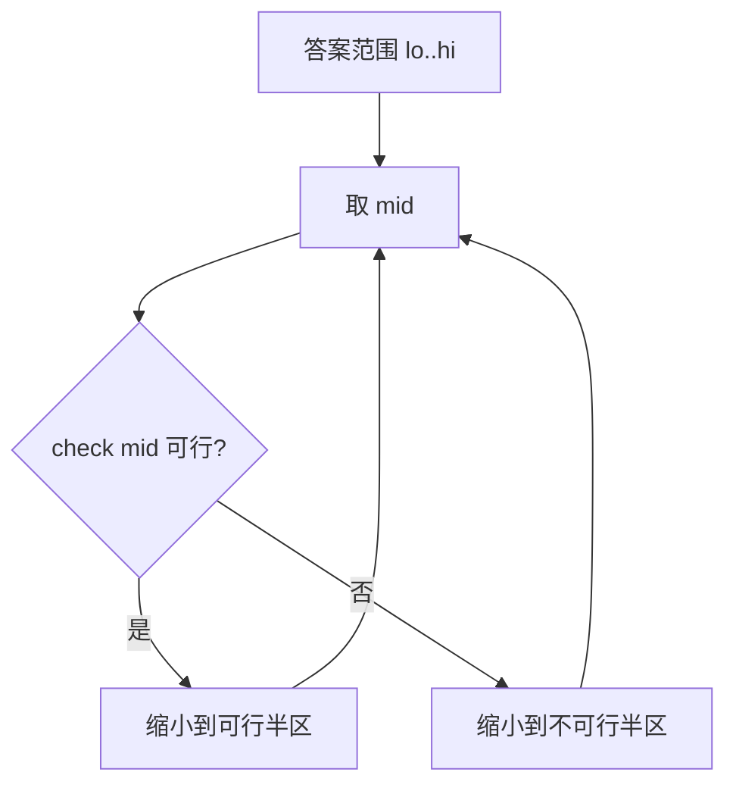

# 二分答案

二分答案是一种将"求最优值"问题转化为"判定可行性"问题的通用技巧。只要答案具有单调性（满足/不满足某条件），就可以用二分将 O(n) 的搜索优化为 O(log n) 次判定。

## 一、核心思想



```
求满足条件的最大/最小值
→ 二分答案 mid
→ 判定 check(mid) 是否可行
→ 根据结果缩小搜索范围
```

## 二、模板

### 求最小满足值（左边界）

```java tab
int binarySearchMin(int lo, int hi) {
    while (lo < hi) {
        int mid = lo + (hi - lo) / 2;
        if (check(mid)) {
            hi = mid;
        } else {
            lo = mid + 1;
        }
    }
    return lo;
}
```
```typescript tab
function binarySearchMin(lo: number, hi: number): number {
    while (lo < hi) {
        const mid = lo + Math.floor((hi - lo) / 2);
        if (check(mid)) hi = mid;
        else lo = mid + 1;
    }
    return lo;
}
```
```python tab
def binary_search_min(lo: int, hi: int) -> int:
    while lo < hi:
        mid = lo + (hi - lo) // 2
        if check(mid):
            hi = mid
        else:
            lo = mid + 1
    return lo
```

### 求最大满足值（右边界）

```java tab
int binarySearchMax(int lo, int hi) {
    while (lo < hi) {
        int mid = lo + (hi - lo + 1) / 2;
        if (check(mid)) {
            lo = mid;
        } else {
            hi = mid - 1;
        }
    }
    return lo;
}
```
```typescript tab
function binarySearchMax(lo: number, hi: number): number {
    while (lo < hi) {
        const mid = lo + Math.floor((hi - lo + 1) / 2);
        if (check(mid)) lo = mid;
        else hi = mid - 1;
    }
    return lo;
}
```
```python tab
def binary_search_max(lo: int, hi: int) -> int:
    while lo < hi:
        mid = lo + (hi - lo + 1) // 2
        if check(mid):
            lo = mid
        else:
            hi = mid - 1
    return lo
```

## 三、经典例题

### 分割数组的最大值（LeetCode 410）

将数组分成 m 段，使各段和的最大值最小。

```java tab
int splitArray(int[] nums, int m) {
    int lo = 0, hi = 0;
    for (int n : nums) { lo = Math.max(lo, n); hi += n; }
    while (lo < hi) {
        int mid = lo + (hi - lo) / 2;
        if (canSplit(nums, m, mid)) hi = mid;
        else lo = mid + 1;
    }
    return lo;
}

boolean canSplit(int[] nums, int m, int maxSum) {
    int count = 1, curSum = 0;
    for (int n : nums) {
        if (curSum + n > maxSum) {
            count++;
            curSum = n;
            if (count > m) return false;
        } else {
            curSum += n;
        }
    }
    return true;
}
```
```typescript tab
function splitArray(nums: number[], m: number): number {
    let lo = Math.max(...nums), hi = nums.reduce((a, b) => a + b, 0);
    while (lo < hi) {
        const mid = lo + Math.floor((hi - lo) / 2);
        if (canSplit(nums, m, mid)) hi = mid;
        else lo = mid + 1;
    }
    return lo;
}

function canSplit(nums: number[], m: number, maxSum: number): boolean {
    let count = 1, curSum = 0;
    for (const n of nums) {
        if (curSum + n > maxSum) {
            count++;
            curSum = n;
            if (count > m) return false;
        } else {
            curSum += n;
        }
    }
    return true;
}
```
```python tab
def split_array(nums: list[int], m: int) -> int:
    lo, hi = max(nums), sum(nums)
    while lo < hi:
        mid = lo + (hi - lo) // 2
        if can_split(nums, m, mid):
            hi = mid
        else:
            lo = mid + 1
    return lo

def can_split(nums: list[int], m: int, max_sum: int) -> bool:
    count, cur_sum = 1, 0
    for n in nums:
        if cur_sum + n > max_sum:
            count += 1
            cur_sum = n
            if count > m:
                return False
        else:
            cur_sum += n
    return True
```

### 爱吃香蕉的珂珂（LeetCode 875）

```java tab
int minEatingSpeed(int[] piles, int h) {
    int lo = 1, hi = Arrays.stream(piles).max().getAsInt();
    while (lo < hi) {
        int mid = lo + (hi - lo) / 2;
        if (canFinish(piles, h, mid)) hi = mid;
        else lo = mid + 1;
    }
    return lo;
}

boolean canFinish(int[] piles, int h, int speed) {
    int hours = 0;
    for (int p : piles) hours += (p + speed - 1) / speed;
    return hours <= h;
}
```
```typescript tab
function minEatingSpeed(piles: number[], h: number): number {
    let lo = 1, hi = Math.max(...piles);
    while (lo < hi) {
        const mid = lo + Math.floor((hi - lo) / 2);
        if (canFinish(piles, h, mid)) hi = mid;
        else lo = mid + 1;
    }
    return lo;
}

function canFinish(piles: number[], h: number, speed: number): boolean {
    let hours = 0;
    for (const p of piles) hours += Math.ceil(p / speed);
    return hours <= h;
}
```
```python tab
def min_eating_speed(piles: list[int], h: int) -> int:
    lo, hi = 1, max(piles)
    while lo < hi:
        mid = lo + (hi - lo) // 2
        if can_finish(piles, h, mid):
            hi = mid
        else:
            lo = mid + 1
    return lo

def can_finish(piles: list[int], h: int, speed: int) -> bool:
    hours = sum((p + speed - 1) // speed for p in piles)
    return hours <= h
```

### 在 D 天内送达包裹的能力（LeetCode 1011）

```java tab
int shipWithinDays(int[] weights, int days) {
    int lo = 0, hi = 0;
    for (int w : weights) { lo = Math.max(lo, w); hi += w; }
    while (lo < hi) {
        int mid = lo + (hi - lo) / 2;
        if (canShip(weights, days, mid)) hi = mid;
        else lo = mid + 1;
    }
    return lo;
}
```
```typescript tab
function shipWithinDays(weights: number[], days: number): number {
    let lo = Math.max(...weights), hi = weights.reduce((a, b) => a + b, 0);
    while (lo < hi) {
        const mid = lo + Math.floor((hi - lo) / 2);
        if (canShip(weights, days, mid)) hi = mid;
        else lo = mid + 1;
    }
    return lo;
}
```
```python tab
def ship_within_days(weights: list[int], days: int) -> int:
    lo, hi = max(weights), sum(weights)
    while lo < hi:
        mid = lo + (hi - lo) // 2
        if can_ship(weights, days, mid):
            hi = mid
        else:
            lo = mid + 1
    return lo
```

## 四、适用场景

| 场景 | 判定函数 |
|------|---------|
| 最大值最小化 | 能否在限制内完成 |
| 最小值最大化 | 能否满足最低要求 |
| 第 k 小/大 | 有多少个 ≤ mid |
| 浮点精度 | 误差 < ε |

### 浮点二分

```java tab
double sqrt(double x) {
    double lo = 0, hi = x;
    while (hi - lo > 1e-9) {
        double mid = (lo + hi) / 2;
        if (mid * mid < x) lo = mid;
        else hi = mid;
    }
    return lo;
}
```
```typescript tab
function sqrt(x: number): number {
    let lo = 0, hi = x;
    while (hi - lo > 1e-9) {
        const mid = (lo + hi) / 2;
        if (mid * mid < x) lo = mid;
        else hi = mid;
    }
    return lo;
}
```
```python tab
def sqrt(x: float) -> float:
    lo, hi = 0, x
    while hi - lo > 1e-9:
        mid = (lo + hi) / 2
        if mid * mid < x:
            lo = mid
        else:
            hi = mid
    return lo
```

## 五、面试要点

1. **确定搜索范围**：lo 和 hi 的初始值
2. **写 check 函数**：判定 mid 是否可行
3. **防死循环**：求最大值时 mid = lo + (hi-lo+1)/2
4. **单调性**：答案必须满足"小于某值全不可行，大于某值全可行"
5. **LeetCode**：410、875、1011、4、153、33、69、162
