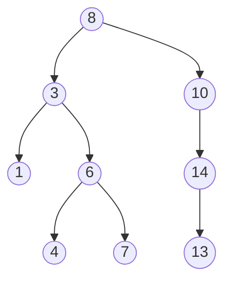

# 二分搜索树


## 一、什么是 BST？

**二分搜索树（Binary Search Tree，BST）** 是满足以下性质的二叉树：

- 左子树所有节点值 **<** 当前节点值
- 右子树所有节点值 **>** 当前节点值
- 左右子树也分别是 BST



中序遍历：1, 3, 4, 6, 7, 8, 10, 13, 14   ← 一定有序

## 二、性质

1. **中序遍历**得到升序序列。
2. **查找/插入/删除**在平均情况下 O(log n)。
3. **最坏情况**退化为链表（数据有序插入）→ O(n)。

## 三、基本操作

### 3.1 查找

```java tab
private boolean search(TreeNode node, int val) {
    if (node == null) return false;
    if (val == node.val) return true;
    return val < node.val ? search(node.left, val) : search(node.right, val);
}
```

```typescript tab
function search(node: TreeNode | null, val: number): boolean {
    if (node === null) return false;
    if (val === node.val) return true;
    return val < node.val ? search(node.left, val) : search(node.right, val);
}
```

```python tab
def search(node, val):
    if node is None:
        return False
    if val == node.val:
        return True
    return search(node.left, val) if val < node.val else search(node.right, val)
```

### 3.2 插入

```java tab
private TreeNode insert(TreeNode node, int val) {
    if (node == null) return new TreeNode(val);
    if (val < node.val) node.left = insert(node.left, val);
    else if (val > node.val) node.right = insert(node.right, val);
    return node;   // 注意：重复值不插入（取决于业务）
}
```

```typescript tab
function insert(node: TreeNode | null, val: number): TreeNode {
    if (node === null) return new TreeNode(val);
    if (val < node.val) node.left = insert(node.left, val);
    else if (val > node.val) node.right = insert(node.right, val);
    return node;   // 注意：重复值不插入（取决于业务）
}
```

```python tab
def insert(node, val):
    if node is None:
        return TreeNode(val)
    if val < node.val:
        node.left = insert(node.left, val)
    elif val > node.val:
        node.right = insert(node.right, val)
    return node  # 注意：重复值不插入（取决于业务）
```

### 3.3 删除（最复杂）

分三种情况：

| 情况 | 操作 |
|------|------|
| 叶子节点 | 直接删 |
| 只有一个孩子 | 孩子替代 |
| 有两个孩子 | 用**中序后继**（右子树最小）或**前驱**（左子树最大）替代 |

```java tab
private TreeNode delete(TreeNode node, int val) {
    if (node == null) return null;
    if (val < node.val) node.left = delete(node.left, val);
    else if (val > node.val) node.right = delete(node.right, val);
    else {
        if (node.left == null) return node.right;
        if (node.right == null) return node.left;
        // 两个孩子：用中序后继（右子树最小）替代
        TreeNode successor = findMin(node.right);
        successor.right = deleteMin(node.right);
        successor.left = node.left;
        return successor;
    }
    return node;
}

private TreeNode findMin(TreeNode node) {
    while (node.left != null) node = node.left;
    return node;
}

private TreeNode deleteMin(TreeNode node) {
    if (node.left == null) return node.right;
    node.left = deleteMin(node.left);
    return node;
}
```

```typescript tab
function deleteNode(node: TreeNode | null, val: number): TreeNode | null {
    if (node === null) return null;
    if (val < node.val) node.left = deleteNode(node.left, val);
    else if (val > node.val) node.right = deleteNode(node.right, val);
    else {
        if (node.left === null) return node.right;
        if (node.right === null) return node.left;
        // 两个孩子：用中序后继（右子树最小）替代
        const successor = findMin(node.right);
        successor.right = deleteMin(node.right);
        successor.left = node.left;
        return successor;
    }
    return node;
}

function findMin(node: TreeNode): TreeNode {
    while (node.left !== null) node = node.left;
    return node;
}

function deleteMin(node: TreeNode): TreeNode | null {
    if (node.left === null) return node.right;
    node.left = deleteMin(node.left);
    return node;
}
```

```python tab
def delete_node(node, val):
    if node is None:
        return None
    if val < node.val:
        node.left = delete_node(node.left, val)
    elif val > node.val:
        node.right = delete_node(node.right, val)
    else:
        if node.left is None:
            return node.right
        if node.right is None:
            return node.left
        # 两个孩子：用中序后继（右子树最小）替代
        successor = find_min(node.right)
        successor.right = delete_min(node.right)
        successor.left = node.left
        return successor
    return node

def find_min(node):
    while node.left is not None:
        node = node.left
    return node

def delete_min(node):
    if node.left is None:
        return node.right
    node.left = delete_min(node.left)
    return node
```

## 四、遍历方式

### 4.1 深度优先

```java tab
// 前序：根 → 左 → 右
void preOrder(TreeNode n) {
    if (n == null) return;
    visit(n);
    preOrder(n.left);
    preOrder(n.right);
}

// 中序：左 → 根 → 右   → BST 得到升序
void inOrder(TreeNode n) {
    if (n == null) return;
    inOrder(n.left);
    visit(n);
    inOrder(n.right);
}

// 后序：左 → 右 → 根   → 子树信息收集
void postOrder(TreeNode n) {
    if (n == null) return;
    postOrder(n.left);
    postOrder(n.right);
    visit(n);
}
```

```typescript tab
// 前序：根 → 左 → 右
function preOrder(n: TreeNode | null): void {
    if (n === null) return;
    visit(n);
    preOrder(n.left);
    preOrder(n.right);
}

// 中序：左 → 根 → 右   → BST 得到升序
function inOrder(n: TreeNode | null): void {
    if (n === null) return;
    inOrder(n.left);
    visit(n);
    inOrder(n.right);
}

// 后序：左 → 右 → 根   → 子树信息收集
function postOrder(n: TreeNode | null): void {
    if (n === null) return;
    postOrder(n.left);
    postOrder(n.right);
    visit(n);
}
```

```python tab
# 前序：根 → 左 → 右
def pre_order(n):
    if n is None:
        return
    visit(n)
    pre_order(n.left)
    pre_order(n.right)

# 中序：左 → 根 → 右   → BST 得到升序
def in_order(n):
    if n is None:
        return
    in_order(n.left)
    visit(n)
    in_order(n.right)

# 后序：左 → 右 → 根   → 子树信息收集
def post_order(n):
    if n is None:
        return
    post_order(n.left)
    post_order(n.right)
    visit(n)
```

### 4.2 广度优先（层序）

```java tab
void levelOrder(TreeNode root) {
    if (root == null) return;
    Deque<TreeNode> q = new ArrayDeque<>();
    q.offer(root);
    while (!q.isEmpty()) {
        TreeNode u = q.poll();
        visit(u);
        if (u.left != null) q.offer(u.left);
        if (u.right != null) q.offer(u.right);
    }
}
```

```typescript tab
function levelOrder(root: TreeNode | null): void {
    if (root === null) return;
    const q: TreeNode[] = [root];
    while (q.length > 0) {
        const u = q.shift()!;
        visit(u);
        if (u.left !== null) q.push(u.left);
        if (u.right !== null) q.push(u.right);
    }
}
```

```python tab
def level_order(root):
    from collections import deque
    if root is None:
        return
    q = deque([root])
    while q:
        u = q.popleft()
        visit(u)
        if u.left:
            q.append(u.left)
        if u.right:
            q.append(u.right)
```

## 五、BST 的高级操作

### 5.1 第 K 小元素

```java tab
// 方法 1：中序遍历，计数器
int kthSmallest(TreeNode root, int k) {
    Deque<TreeNode> stack = new ArrayDeque<>();
    TreeNode cur = root;
    while (cur != null || !stack.isEmpty()) {
        while (cur != null) { stack.push(cur); cur = cur.left; }
        cur = stack.pop();
        if (--k == 0) return cur.val;
        cur = cur.right;
    }
    return -1;
}
```

```typescript tab
// 方法 1：中序遍历，计数器
function kthSmallest(root: TreeNode | null, k: number): number {
    const stack: TreeNode[] = [];
    let cur: TreeNode | null = root;
    while (cur !== null || stack.length > 0) {
        while (cur !== null) { stack.push(cur); cur = cur.left; }
        cur = stack.pop()!;
        if (--k === 0) return cur.val;
        cur = cur.right;
    }
    return -1;
}
```

```python tab
# 方法 1：中序遍历，计数器
def kth_smallest(root, k):
    stack = []
    cur = root
    while cur or stack:
        while cur:
            stack.append(cur)
            cur = cur.left
        cur = stack.pop()
        k -= 1
        if k == 0:
            return cur.val
        cur = cur.right
    return -1
```

### 5.2 验证 BST

```java tab
boolean isValidBST(TreeNode root) {
    return validate(root, Long.MIN_VALUE, Long.MAX_VALUE);
}

boolean validate(TreeNode n, long min, long max) {
    if (n == null) return true;
    if (n.val <= min || n.val >= max) return false;
    return validate(n.left, min, n.val) && validate(n.right, n.val, max);
}
```

```typescript tab
function isValidBST(root: TreeNode | null): boolean {
    return validate(root, -Infinity, Infinity);
}

function validate(n: TreeNode | null, min: number, max: number): boolean {
    if (n === null) return true;
    if (n.val <= min || n.val >= max) return false;
    return validate(n.left, min, n.val) && validate(n.right, n.val, max);
}
```

```python tab
def is_valid_bst(root):
    return validate(root, float('-inf'), float('inf'))

def validate(n, min_val, max_val):
    if n is None:
        return True
    if n.val <= min_val or n.val >= max_val:
        return False
    return validate(n.left, min_val, n.val) and validate(n.right, n.val, max_val)
```

> **注意**：单纯比较父与子不够，要比较每个节点和它**所有祖先**的约束。

### 5.3 BST 范围和

求 BST 中 L ≤ x ≤ R 的节点值之和：

```java tab
int rangeSumBST(TreeNode root, int L, int R) {
    if (root == null) return 0;
    if (root.val < L) return rangeSumBST(root.right, L, R);
    if (root.val > R) return rangeSumBST(root.left, L, R);
    return root.val + rangeSumBST(root.left, L, R) + rangeSumBST(root.right, L, R);
}
```

```typescript tab
function rangeSumBST(root: TreeNode | null, L: number, R: number): number {
    if (root === null) return 0;
    if (root.val < L) return rangeSumBST(root.right, L, R);
    if (root.val > R) return rangeSumBST(root.left, L, R);
    return root.val + rangeSumBST(root.left, L, R) + rangeSumBST(root.right, L, R);
}
```

```python tab
def range_sum_bst(root, L, R):
    if root is None:
        return 0
    if root.val < L:
        return range_sum_bst(root.right, L, R)
    if root.val > R:
        return range_sum_bst(root.left, L, R)
    return root.val + range_sum_bst(root.left, L, R) + range_sum_bst(root.right, L, R)
```

利用 BST 的有序性可以**剪枝**，跳过整棵子树。

### 5.4 BST 转累加树

每个节点 = 自身 + 所有大于自身的节点值之和：

```java tab
int sum = 0;
TreeNode convertBST(TreeNode root) {
    if (root != null) {
        convertBST(root.right);          // 右 → 中 → 左（中序倒序）
        sum += root.val;
        root.val = sum;
        convertBST(root.left);
    }
    return root;
}
```

```typescript tab
let sum = 0;
function convertBST(root: TreeNode | null): TreeNode | null {
    if (root !== null) {
        convertBST(root.right);          // 右 → 中 → 左（中序倒序）
        sum += root.val;
        root.val = sum;
        convertBST(root.left);
    }
    return root;
}
```

```python tab
_sum = 0

def convert_bst(root):
    global _sum
    if root is not None:
        convert_bst(root.right)          # 右 → 中 → 左（中序倒序）
        _sum += root.val
        root.val = _sum
        convert_bst(root.left)
    return root
```

## 六、BST 的退化问题

### 6.1 退化成链表

```text
依次插入 1, 2, 3, 4, 5：

1
 \
  2
   \
    3
     \
      ...
```

树高 = n，操作退化为 O(n)。

### 6.2 解决方案

| 方案 | 特点 |
|------|------|
| **AVL 树** | 严格平衡，查询更快，插入删除旋转多 |
| **红黑树** | 近似平衡，工业标准（TreeMap / std::map） |
| **Treap / Splay** | 概率平衡，实现简单 |
| **跳表** | 替代方案，Redis ZSet 使用 |
| **B 树** | 外存场景，数据库索引 |

## 七、BST vs 哈希表

| 维度 | BST | 哈希表 |
|------|------|--------|
| 查找 | O(log n) | O(1) 平均 |
| 范围查询 | ✅ O(log n + k) | ❌ |
| 顺序输出 | ✅ 中序 O(n) | ❌ |
| 最值 | ✅ O(log n) | ❌ O(n) |
| 内存 | 指针开销 | 哈希桶 |

> **选 BST**：需要顺序访问、范围查询、有序遍历。  
> **选哈希表**：只要快速查找。

## 八、代码实现（TreeMap / TreeSet）

基于红黑树实现，提供 O(log n) 的有序操作：

```java tab
TreeMap<Integer, String> map = new TreeMap<>();
map.put(3, "C"); map.put(1, "A"); map.put(2, "B");

map.firstKey();      // 1
map.lastKey();       // 3
map.ceilingKey(2);   // 2  (≥ 2 的最小键)
map.floorKey(2);     // 2  (≤ 2 的最大键)
map.subMap(1, 3);    // {1, 2} (范围视图)
```

```typescript tab
// TypeScript 没有内置 TreeMap，可用第三方库（如 @datastructures-js/sorted-map）
// 这里用排序数组模拟核心操作
const entries: [number, string][] = [];
entries.push([3, "C"], [1, "A"], [2, "B"]);
entries.sort((a, b) => a[0] - b[0]);

entries[0][0];                    // 1 (firstKey)
entries[entries.length - 1][0];   // 3 (lastKey)
// ceilingKey(2): 找 ≥ 2 的最小键
entries.find(([k]) => k >= 2)?.[0];  // 2
// floorKey(2): 找 ≤ 2 的最大键
[...entries].reverse().find(([k]) => k <= 2)?.[0]; // 2
```

```python tab
# Python 没有内置 TreeMap，可用 sortedcontainers 库
# from sortedcontainers import SortedDict
# 这里用 dict + sorted 模拟核心操作
d = {3: "C", 1: "A", 2: "B"}
keys = sorted(d.keys())

keys[0]       # 1 (firstKey)
keys[-1]      # 3 (lastKey)
# ceilingKey(2): ≥ 2 的最小键
next(k for k in keys if k >= 2)   # 2
# floorKey(2): ≤ 2 的最大键
next(k for k in reversed(keys) if k <= 2)  # 2
# subMap(1, 3): 范围 [1, 3)
{k: d[k] for k in keys if 1 <= k < 3}  # {1: 'A', 2: 'B'}
```

## 九、复杂度分析

| 操作 | 平均 | 最坏 |
|------|------|------|
| 查找 | O(log n) | O(n) |
| 插入 | O(log n) | O(n) |
| 删除 | O(log n) | O(n) |
| 中序遍历 | O(n) | O(n) |

> 平衡树能保证**最坏 O(log n)**。

## 十、易错点

1. **验证 BST 边界**：用 `(min, max)` 区间递归，不是简单比左右孩子。
2. **删除两个孩子**：用**后继/前驱**，别忘了递归删除被移动的节点。
3. **重复值处理**：BST 通常不存重复值，或者存到固定子树（需在文档中明确）。
4. **空指针**：叶子节点的子指针是 null，递归时注意判空。
5. **平衡问题**：写业务用现成的 TreeMap，不要自己写裸 BST。

## 十一、刷题清单

| 难度 | 题目 | 关键 |
|------|------|------|
| 🟢 | 验证 BST | 区间递归 |
| 🟢 | BST 第 K 小元素 | 中序遍历 |
| 🟡 | BST 范围和 | 剪枝 |
| 🟡 | 把 BST 转累加树 | 逆中序 |
| 🟡 | 二叉搜索树迭代器 | 栈模拟中序 |
| 🟠 | 不同的 BST II | 递归枚举 |
| 🟠 | BST 中第 K 大的元素 | 迭代逆中序 |
| 🔴 | 恢复 BST（两个节点错位） | 中序 + 扫描 |

## 十二、心法

> **BST 的核心是"中序有序"**。  
> 任何 BST 问题，**先想中序遍历**能解决一半。  
> 需要范围、最值、排名 → BST。  
> 平衡的 BST 才能保证 O(log n)，所以生产用红黑树（TreeMap）。
