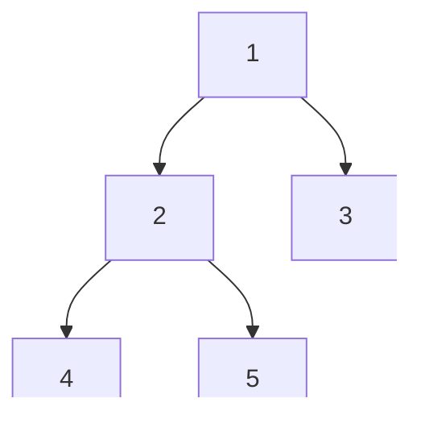

# 二叉树遍历与递归

二叉树遍历是树形结构的基础操作，前序、中序、后序、层序四种遍历方式各有用途。掌握递归与迭代两种实现，是解决所有树形问题的起点。

## 一、四种遍历

```
        1
       / \
      2   3
     / \
    4   5

前序（根左右）: 1 2 4 5 3
中序（左根右）: 4 2 5 1 3
后序（左右根）: 4 5 2 3 1
层序（BFS）:    1 2 3 4 5
```



## 二、递归实现

```java tab
void preorder(TreeNode root, List<Integer> res) {
    if (root == null) return;
    res.add(root.val);       // 根
    preorder(root.left, res);  // 左
    preorder(root.right, res); // 右
}

void inorder(TreeNode root, List<Integer> res) {
    if (root == null) return;
    inorder(root.left, res);   // 左
    res.add(root.val);       // 根
    inorder(root.right, res); // 右
}

void postorder(TreeNode root, List<Integer> res) {
    if (root == null) return;
    postorder(root.left, res);  // 左
    postorder(root.right, res); // 右
    res.add(root.val);        // 根
}
```

```typescript tab
function preorder(root: TreeNode | null, res: number[]): void {
    if (root === null) return;
    res.push(root.val);       // 根
    preorder(root.left, res);  // 左
    preorder(root.right, res); // 右
}

function inorder(root: TreeNode | null, res: number[]): void {
    if (root === null) return;
    inorder(root.left, res);   // 左
    res.push(root.val);       // 根
    inorder(root.right, res); // 右
}

function postorder(root: TreeNode | null, res: number[]): void {
    if (root === null) return;
    postorder(root.left, res);  // 左
    postorder(root.right, res); // 右
    res.push(root.val);        // 根
}
```

```python tab
def preorder(root, res):
    if root is None:
        return
    res.append(root.val)       # 根
    preorder(root.left, res)   # 左
    preorder(root.right, res)  # 右

def inorder(root, res):
    if root is None:
        return
    inorder(root.left, res)    # 左
    res.append(root.val)       # 根
    inorder(root.right, res)   # 右

def postorder(root, res):
    if root is None:
        return
    postorder(root.left, res)  # 左
    postorder(root.right, res) # 右
    res.append(root.val)       # 根
```

## 三、迭代实现

### 前序（栈）

```java tab
List<Integer> preorderIterative(TreeNode root) {
    List<Integer> res = new ArrayList<>();
    Deque<TreeNode> stack = new ArrayDeque<>();
    if (root != null) stack.push(root);
    while (!stack.isEmpty()) {
        TreeNode node = stack.pop();
        res.add(node.val);
        if (node.right != null) stack.push(node.right);
        if (node.left != null) stack.push(node.left);
    }
    return res;
}
```

```typescript tab
function preorderIterative(root: TreeNode | null): number[] {
    const res: number[] = [];
    const stack: TreeNode[] = [];
    if (root !== null) stack.push(root);
    while (stack.length > 0) {
        const node = stack.pop()!;
        res.push(node.val);
        if (node.right !== null) stack.push(node.right);
        if (node.left !== null) stack.push(node.left);
    }
    return res;
}
```

```python tab
def preorder_iterative(root):
    res = []
    stack = []
    if root:
        stack.append(root)
    while stack:
        node = stack.pop()
        res.append(node.val)
        if node.right:
            stack.append(node.right)
        if node.left:
            stack.append(node.left)
    return res
```

### 中序（栈 + 指针）

```java tab
List<Integer> inorderIterative(TreeNode root) {
    List<Integer> res = new ArrayList<>();
    Deque<TreeNode> stack = new ArrayDeque<>();
    TreeNode cur = root;
    while (cur != null || !stack.isEmpty()) {
        while (cur != null) { // 一路向左
            stack.push(cur);
            cur = cur.left;
        }
        cur = stack.pop();
        res.add(cur.val);
        cur = cur.right;
    }
    return res;
}
```

```typescript tab
function inorderIterative(root: TreeNode | null): number[] {
    const res: number[] = [];
    const stack: TreeNode[] = [];
    let cur: TreeNode | null = root;
    while (cur !== null || stack.length > 0) {
        while (cur !== null) { // 一路向左
            stack.push(cur);
            cur = cur.left;
        }
        cur = stack.pop()!;
        res.push(cur.val);
        cur = cur.right;
    }
    return res;
}
```

```python tab
def inorder_iterative(root):
    res = []
    stack = []
    cur = root
    while cur or stack:
        while cur:  # 一路向左
            stack.append(cur)
            cur = cur.left
        cur = stack.pop()
        res.append(cur.val)
        cur = cur.right
    return res
```

### 后序（双栈 / 反转前序）

```java tab
// 技巧：前序(根左右) → 改为(根右左) → 反转 = (左右根) = 后序
List<Integer> postorderIterative(TreeNode root) {
    LinkedList<Integer> res = new LinkedList<>();
    Deque<TreeNode> stack = new ArrayDeque<>();
    if (root != null) stack.push(root);
    while (!stack.isEmpty()) {
        TreeNode node = stack.pop();
        res.addFirst(node.val); // 头插
        if (node.left != null) stack.push(node.left);
        if (node.right != null) stack.push(node.right);
    }
    return res;
}
```

```typescript tab
// 技巧：前序(根左右) → 改为(根右左) → 反转 = (左右根) = 后序
function postorderIterative(root: TreeNode | null): number[] {
    const res: number[] = [];
    const stack: TreeNode[] = [];
    if (root !== null) stack.push(root);
    while (stack.length > 0) {
        const node = stack.pop()!;
        res.unshift(node.val); // 头插
        if (node.left !== null) stack.push(node.left);
        if (node.right !== null) stack.push(node.right);
    }
    return res;
}
```

```python tab
# 技巧：前序(根左右) → 改为(根右左) → 反转 = (左右根) = 后序
def postorder_iterative(root):
    res = []
    stack = []
    if root:
        stack.append(root)
    while stack:
        node = stack.pop()
        res.insert(0, node.val)  # 头插
        if node.left:
            stack.append(node.left)
        if node.right:
            stack.append(node.right)
    return res
```

### 层序（BFS）

```java tab
List<List<Integer>> levelOrder(TreeNode root) {
    List<List<Integer>> res = new ArrayList<>();
    if (root == null) return res;
    Queue<TreeNode> queue = new LinkedList<>();
    queue.offer(root);
    while (!queue.isEmpty()) {
        int size = queue.size();
        List<Integer> level = new ArrayList<>();
        for (int i = 0; i < size; i++) {
            TreeNode node = queue.poll();
            level.add(node.val);
            if (node.left != null) queue.offer(node.left);
            if (node.right != null) queue.offer(node.right);
        }
        res.add(level);
    }
    return res;
}
```

```typescript tab
function levelOrder(root: TreeNode | null): number[][] {
    const res: number[][] = [];
    if (root === null) return res;
    const queue: TreeNode[] = [root];
    while (queue.length > 0) {
        const size = queue.length;
        const level: number[] = [];
        for (let i = 0; i < size; i++) {
            const node = queue.shift()!;
            level.push(node.val);
            if (node.left !== null) queue.push(node.left);
            if (node.right !== null) queue.push(node.right);
        }
        res.push(level);
    }
    return res;
}
```

```python tab
def level_order(root):
    from collections import deque
    res = []
    if root is None:
        return res
    queue = deque([root])
    while queue:
        size = len(queue)
        level = []
        for _ in range(size):
            node = queue.popleft()
            level.append(node.val)
            if node.left:
                queue.append(node.left)
            if node.right:
                queue.append(node.right)
        res.append(level)
    return res
```

## 四、由遍历序列重建树

| 已知 | 能否唯一确定 |
|------|------------|
| 前序 + 中序 | ✅ |
| 后序 + 中序 | ✅ |
| 前序 + 后序 | ❌（不唯一，除非满二叉树） |
| 层序 + 中序 | ✅ |

```java tab
// 前序 + 中序 → 建树（LeetCode 105）
TreeNode build(int[] pre, int[] in, int preL, int preR, int inL, int inR) {
    if (preL > preR) return null;
    TreeNode root = new TreeNode(pre[preL]);
    int rootIdx = inMap.get(pre[preL]); // 中序中根的位置
    int leftSize = rootIdx - inL;
    root.left = build(pre, in, preL+1, preL+leftSize, inL, rootIdx-1);
    root.right = build(pre, in, preL+leftSize+1, preR, rootIdx+1, inR);
    return root;
}
```

```typescript tab
// 前序 + 中序 → 建树（LeetCode 105）
function build(pre: number[], inorder: number[], preL: number, preR: number, inL: number, inR: number): TreeNode | null {
    if (preL > preR) return null;
    const root = new TreeNode(pre[preL]);
    const rootIdx = inMap.get(pre[preL])!; // 中序中根的位置
    const leftSize = rootIdx - inL;
    root.left = build(pre, inorder, preL + 1, preL + leftSize, inL, rootIdx - 1);
    root.right = build(pre, inorder, preL + leftSize + 1, preR, rootIdx + 1, inR);
    return root;
}
```

```python tab
# 前序 + 中序 → 建树（LeetCode 105）
def build(pre, inorder, preL, preR, inL, inR):
    if preL > preR:
        return None
    root = TreeNode(pre[preL])
    root_idx = in_map[pre[preL]]  # 中序中根的位置
    left_size = root_idx - inL
    root.left = build(pre, inorder, preL + 1, preL + left_size, inL, root_idx - 1)
    root.right = build(pre, inorder, preL + left_size + 1, preR, root_idx + 1, inR)
    return root
```

## 五、Morris 遍历（O(1) 空间）

利用叶子节点的空指针（线索）避免栈：

- 中序 Morris：找到左子树最右节点，临时连回当前节点
- 时间 O(n)，空间 O(1)

## 六、面试要点

1. **递归三行**：根的位置决定前/中/后序
2. **迭代中序**：栈 + 指针一路向左
3. **层序**：BFS + 按层分组
4. **重建树**：前/后序定根，中序分左右
5. **LeetCode**：94/144/145（三种遍历）、102（层序）、105/106（重建树）、230（BST 第 k 小）
