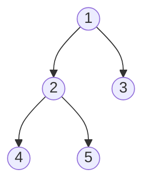

# 二叉树

**二叉树（Binary Tree）** 是计算机科学中一种基本而重要的数据结构，由节点（Node）组成，每个节点最多有两个子节点，分别称为**左子节点**和**右子节点**。



## 一、相关概念

1. **节点（Node）**：存储数据值，包含左子节点和右子节点指针
2. **根节点（Root）**：二叉树的起点，没有父节点
3. **叶子节点（Leaf）**：没有子节点的节点
4. **深度（Depth）**：从根节点到某个节点的路径长度（根节点的深度为 0）
5. **高度（Height）**：从某个节点到叶子节点的最长路径长度

**基本性质**：

```
性质1：第 i 层最多有 2^i 个节点（i 从 0 开始）
性质2：高度为 h 的树最多有 2^(h+1) - 1 个节点
性质3：n 个节点的完全二叉树高度 = ⌊log₂n⌋
性质4：叶子数 = 度为2的节点数 + 1（n₀ = n₂ + 1）

证明性质4：
总边数 = n - 1（每个非根节点贡献一条边）
总边数 = n₁ + 2n₂（度为1的贡献1条，度为2的贡献2条）
∴ n - 1 = n₁ + 2n₂
∴ n₀ + n₁ + n₂ - 1 = n₁ + 2n₂
∴ n₀ = n₂ + 1
```

## 二、二叉树的类型

1. **满二叉树（Full Binary Tree）**：每个节点都有 0 个或 2 个子节点
2. **完全二叉树（Complete Binary Tree）**：除最后一层外，其他层都是满的，且最后一层节点靠左排列
3. **平衡二叉树（Balanced Binary Tree）**：左右子树的高度差不超过 1
4. **二叉搜索树（BST）**：左子树所有节点小于根节点，右子树所有节点大于根节点

```
满二叉树:        完全二叉树:      平衡但非完全:     不平衡:
    1                1                1               1
   / \              / \              / \               \
  2   3            2   3            2   3              2
 / \ / \          / \                \                  \
4  5 6  7        4   5                4                  3
```

**为什么"平衡"重要**：BST 的查找效率取决于树高。平衡 → O(log n)；退化为链 → O(n)。AVL 树和红黑树就是通过旋转操作维持平衡。

## 三、二叉树的遍历

1. **前序遍历（Preorder）**：根 → 左 → 右
2. **中序遍历（Inorder）**：左 → 根 → 右（对于 BST 可得有序序列）
3. **后序遍历（Postorder）**：左 → 右 → 根
4. **层序遍历（Level Order）**：按层次从上到下、从左到右

**遍历过程模拟**：

```
        1
       / \
      2   3
     / \
    4   5

前序（根左右）: 1 → 2 → 4 → 5 → 3
中序（左根右）: 4 → 2 → 5 → 1 → 3
后序（左右根）: 4 → 5 → 2 → 3 → 1
层序（逐层）:   1 → 2 → 3 → 4 → 5

记忆技巧：前/中/后序的"前中后"指的是【根】的访问时机
- 前序：根在最前  1,2,4,5,3
- 中序：根在中间  4,2,5,1,3
- 后序：根在最后  4,5,2,3,1
```

**由遍历序列重建树**：
- 前序 + 中序 → 唯一确定一棵树（前序第一个是根，中序划分左右）
- 后序 + 中序 → 唯一确定
- 前序 + 后序 → 不能唯一确定（无法区分左右子树边界）

## 四、代码实现

```java tab
class TreeNode {
    int value;
    TreeNode left, right;
    
    public TreeNode(int value) {
        this.value = value;
        this.left = null;
        this.right = null;
    }
}

class BinaryTree {
    TreeNode root;
    
    // 前序遍历
    public void preorder(TreeNode node) {
        if (node == null) return;
        System.out.print(node.value + " ");
        preorder(node.left);
        preorder(node.right);
    }
    
    // 中序遍历
    public void inorder(TreeNode node) {
        if (node == null) return;
        inorder(node.left);
        System.out.print(node.value + " ");
        inorder(node.right);
    }
    
    // 后序遍历
    public void postorder(TreeNode node) {
        if (node == null) return;
        postorder(node.left);
        postorder(node.right);
        System.out.print(node.value + " ");
    }
    
    // 层序遍历
    public void levelOrder() {
        if (root == null) return;
        Queue<TreeNode> queue = new LinkedList<>();
        queue.add(root);
        while (!queue.isEmpty()) {
            TreeNode current = queue.poll();
            System.out.print(current.value + " ");
            if (current.left != null) queue.add(current.left);
            if (current.right != null) queue.add(current.right);
        }
    }
}
```

```typescript tab
class TreeNode {
    value: number;
    left: TreeNode | null;
    right: TreeNode | null;

    constructor(value: number) {
        this.value = value;
        this.left = null;
        this.right = null;
    }
}

class BinaryTree {
    root: TreeNode | null = null;

    // 前序遍历
    preorder(node: TreeNode | null): void {
        if (node === null) return;
        console.log(node.value);
        this.preorder(node.left);
        this.preorder(node.right);
    }

    // 中序遍历
    inorder(node: TreeNode | null): void {
        if (node === null) return;
        this.inorder(node.left);
        console.log(node.value);
        this.inorder(node.right);
    }

    // 后序遍历
    postorder(node: TreeNode | null): void {
        if (node === null) return;
        this.postorder(node.left);
        this.postorder(node.right);
        console.log(node.value);
    }

    // 层序遍历
    levelOrder(): void {
        if (this.root === null) return;
        const queue: TreeNode[] = [this.root];
        while (queue.length > 0) {
            const current = queue.shift()!;
            console.log(current.value);
            if (current.left !== null) queue.push(current.left);
            if (current.right !== null) queue.push(current.right);
        }
    }
}
```

```python tab
class TreeNode:
    def __init__(self, value: int):
        self.value = value
        self.left = None
        self.right = None


class BinaryTree:
    def __init__(self):
        self.root = None

    # 前序遍历
    def preorder(self, node):
        if node is None:
            return
        print(node.value, end=" ")
        self.preorder(node.left)
        self.preorder(node.right)

    # 中序遍历
    def inorder(self, node):
        if node is None:
            return
        self.inorder(node.left)
        print(node.value, end=" ")
        self.inorder(node.right)

    # 后序遍历
    def postorder(self, node):
        if node is None:
            return
        self.postorder(node.left)
        self.postorder(node.right)
        print(node.value, end=" ")

    # 层序遍历
    def level_order(self):
        if self.root is None:
            return
        from collections import deque
        queue = deque([self.root])
        while queue:
            current = queue.popleft()
            print(current.value, end=" ")
            if current.left:
                queue.append(current.left)
            if current.right:
                queue.append(current.right)
```

## 五、迭代遍历（用栈模拟递归）

面试高频考点——中序遍历的迭代写法：

```java tab
public List<Integer> inorderIterative(TreeNode root) {
    List<Integer> result = new ArrayList<>();
    Deque<TreeNode> stack = new ArrayDeque<>();
    TreeNode cur = root;
    while (cur != null || !stack.isEmpty()) {
        while (cur != null) {   // 一路向左压栈
            stack.push(cur);
            cur = cur.left;
        }
        cur = stack.pop();      // 弹出 = 访问
        result.add(cur.value);
        cur = cur.right;        // 转向右子树
    }
    return result;
}
```
```python tab
def inorder_iterative(root: TreeNode | None) -> list[int]:
    result = []
    stack = []
    cur = root
    while cur or stack:
        while cur:          # 一路向左压栈
            stack.append(cur)
            cur = cur.left
        cur = stack.pop()   # 弹出 = 访问
        result.append(cur.value)
        cur = cur.right     # 转向右子树
    return result
```

**模拟过程**（对上面的树）：

```
栈的变化: [] → [1] → [1,2] → [1,2,4] → 弹出4 → [1,2] → 弹出2
         → [1,5]... 不对，2的右孩子是5:
         → [1] → push 5 → [1,5] → 弹出5 → [1] → 弹出1 → [3] → 弹出3
结果: 4, 2, 5, 1, 3 ✓
```

## 六、树的递归思维框架

几乎所有树的题目都可以用两种递归思路解决：

### 思路一：遍历（Traversal）

维护外部变量，遍历整棵树过程中更新答案：

```python tab
# 例：求最大深度（遍历思路）
max_depth = 0

def traverse(node, depth):
    global max_depth
    if not node:
        return
    max_depth = max(max_depth, depth)
    traverse(node.left, depth + 1)
    traverse(node.right, depth + 1)
```

### 思路二：分解问题（Divide & Conquer）

将问题分解为"左右子树的答案 + 当前节点的处理"：

```python tab
# 例：求最大深度（分解思路）
def max_depth(node):
    if not node:
        return 0
    return 1 + max(max_depth(node.left), max_depth(node.right))

# 例：判断平衡二叉树
def is_balanced(node):
    def height(n):
        if not n:
            return 0
        lh = height(n.left)
        rh = height(n.right)
        if lh == -1 or rh == -1 or abs(lh - rh) > 1:
            return -1  # -1 表示不平衡（剪枝）
        return 1 + max(lh, rh)
    return height(node) != -1
```

**选择原则**：需要"子树信息汇总"的用分解（深度、直径、路径和）；需要"全局状态追踪"的用遍历（BST 验证、路径记录）。

## 七、面试真题

| 题目 | 难度 | 核心思路 |
|------|------|----------|
| 二叉树的最大深度（LC 104） | 🟢 Easy | 分解：1 + max(左, 右) |
| 对称二叉树（LC 101） | 🟢 Easy | 双指针同步遍历 |
| 翻转二叉树（LC 226） | 🟢 Easy | 分解：交换左右 |
| 二叉树的直径（LC 543） | 🟢 Easy | 后序：经过节点的最长路径 = 左高+右高 |
| 验证二叉搜索树（LC 98） | 🟡 Medium | 中序递增 or 上下界递归 |
| 二叉树的最近公共祖先（LC 236） | 🟡 Medium | 后序：左右都找到则当前是 LCA |
| 从前序与中序构造二叉树（LC 105） | 🟡 Medium | 前序首元素是根，中序划分左右 |
| 二叉树中的最大路径和（LC 124） | 🔴 Hard | 后序 + 全局变量记录最大"拐弯"路径 |
| 二叉树的序列化与反序列化（LC 297） | 🔴 Hard | 前序 + null 标记 |

## 八、易错点分析

**1. 深度 vs 高度混淆**

深度从上往下数（根=0），高度从下往上数（叶=0）。求"最大深度"和"树的高度"代码相同，但概念不同。

**2. 直径不经过根节点**

LC 543 的直径可能完全在某个子树内部。必须在每个节点都计算"左高+右高"并更新全局最大值，而不是只算根的左右高度之和。

**3. 层序遍历中 shift() 的性能**

TypeScript 中 `queue.shift()` 是 O(n) 操作。大数据量时用双指针模拟队列或 `unshift/pop` 交替。

## 九、思考题

1. 为什么只知道前序和后序遍历不能唯一确定一棵二叉树？构造一个反例。
2. 如何 O(1) 空间遍历二叉树？（提示：Morris 遍历利用叶子节点的空指针）
3. n 个节点能构成多少种不同形态的二叉树？（提示：卡特兰数）

> 练习推荐：按 [二叉树遍历](/tutorials/binary-tree-traversal) 的顺序刷完四种遍历，再挑战 LC 124。
