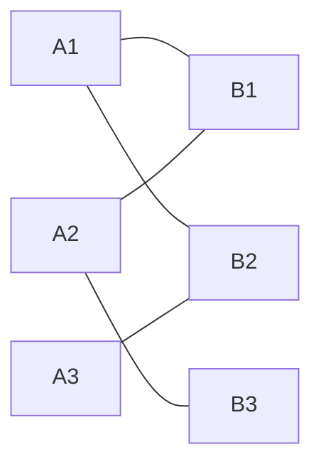

# 二分图：匹配、染色与网络流


## 一、什么是二分图

**二分图（Bipartite Graph）** 是一种特殊的无向图，其顶点可以分成两个互不相交的集合 A 和 B，使得每条边都连接 A 中的一个顶点和 B 中的一个顶点。

> 等价定义：图中**不含奇数长度的环**。



> 左边 {A1, A2, A3}，右边 {B1, B2, B3}，所有边跨两侧。

## 二、判断二分图（染色法）

用 BFS/DFS 给节点染两种颜色，相邻节点颜色不同：

```java tab
public boolean isBipartite(int[][] graph) {
    int n = graph.length;
    int[] color = new int[n];   // 0=未染色, 1=红, -1=蓝

    for (int i = 0; i < n; i++) {
        if (color[i] != 0) continue;
        Queue<Integer> queue = new LinkedList<>();
        queue.offer(i);
        color[i] = 1;
        while (!queue.isEmpty()) {
            int u = queue.poll();
            for (int v : graph[u]) {
                if (color[v] == 0) {
                    color[v] = -color[u];
                    queue.offer(v);
                } else if (color[v] == color[u]) {
                    return false;   // 同色相邻 → 不是二分图
                }
            }
        }
    }
    return true;
}
```

```typescript tab
function isBipartite(graph: number[][]): boolean {
    const n = graph.length;
    const color = new Array(n).fill(0);
    for (let i = 0; i < n; i++) {
        if (color[i] !== 0) continue;
        color[i] = 1;
        const queue = [i];
        while (queue.length) {
            const u = queue.shift()!;
            for (const v of graph[u]) {
                if (color[v] === 0) { color[v] = -color[u]; queue.push(v); }
                else if (color[v] === color[u]) return false;
            }
        }
    }
    return true;
}
```

```python tab
from collections import deque

def is_bipartite(graph: list[list[int]]) -> bool:
    n = len(graph)
    color = [0] * n
    for i in range(n):
        if color[i] != 0:
            continue
        color[i] = 1
        queue = deque([i])
        while queue:
            u = queue.popleft()
            for v in graph[u]:
                if color[v] == 0:
                    color[v] = -color[u]
                    queue.append(v)
                elif color[v] == color[u]:
                    return False
    return True
```

- **时间**：O(V + E)

## 三、二分图最大匹配

### 3.1 问题定义

在二分图中选最多的边，使得没有两条边共享端点。

### 3.2 匈牙利算法

核心思想：为每个左部节点尝试找匹配，如果冲突则尝试让已匹配的节点"让位"（增广路）。

```java tab
public int hungarian(List<Integer>[] graph, int nLeft, int nRight) {
    int[] matchR = new int[nRight];   // 右部节点的匹配对象
    Arrays.fill(matchR, -1);
    int result = 0;

    for (int u = 0; u < nLeft; u++) {
        boolean[] visited = new boolean[nRight];
        if (dfs(graph, u, visited, matchR)) {
            result++;
        }
    }
    return result;
}

private boolean dfs(List<Integer>[] graph, int u, boolean[] visited, int[] matchR) {
    for (int v : graph[u]) {
        if (visited[v]) continue;
        visited[v] = true;
        // v 未匹配，或者 v 的当前匹配对象能找到别的
        if (matchR[v] == -1 || dfs(graph, matchR[v], visited, matchR)) {
            matchR[v] = u;
            return true;
        }
    }
    return false;
}
```

```typescript tab
function hungarian(graph: number[][], nLeft: number, nRight: number): number {
    const matchR = new Array(nRight).fill(-1);   // 右部节点的匹配对象
    let result = 0;

    for (let u = 0; u < nLeft; u++) {
        const visited = new Array(nRight).fill(false);
        if (dfs(graph, u, visited, matchR)) {
            result++;
        }
    }
    return result;
}

function dfs(graph: number[][], u: number, visited: boolean[], matchR: number[]): boolean {
    for (const v of graph[u]) {
        if (visited[v]) continue;
        visited[v] = true;
        // v 未匹配，或者 v 的当前匹配对象能找到别的
        if (matchR[v] === -1 || dfs(graph, matchR[v], visited, matchR)) {
            matchR[v] = u;
            return true;
        }
    }
    return false;
}
```

```python tab
def hungarian(graph: list[list[int]], n_left: int, n_right: int) -> int:
    match_r = [-1] * n_right  # 右部节点的匹配对象
    result = 0

    for u in range(n_left):
        visited = [False] * n_right
        if dfs(graph, u, visited, match_r):
            result += 1
    return result

def dfs(graph: list[list[int]], u: int, visited: list[bool], match_r: list[int]) -> bool:
    for v in graph[u]:
        if visited[v]:
            continue
        visited[v] = True
        # v 未匹配，或者 v 的当前匹配对象能找到别的
        if match_r[v] == -1 or dfs(graph, match_r[v], visited, match_r):
            match_r[v] = u
            return True
    return False
```

- **时间**：O(V × E)

### 3.3 增广路

> 从未匹配的左部节点出发，沿"非匹配边→匹配边→非匹配边..."交替走，到达未匹配的右部节点，就找到一条**增广路**。翻转增广路上的匹配状态，匹配数 +1。

## 四、重要定理

| 定理 | 内容 |
|------|------|
| König 定理 | 最大匹配数 = 最小顶点覆盖数 |
| Hall 定理 | 存在完美匹配 ⟺ 对 A 的任意子集 S，|N(S)| ≥ |S| |
| 最大独立集 | = 顶点总数 - 最大匹配数 |
| 最小路径覆盖 | = 顶点数 - 最大匹配数（DAG） |

## 五、经典应用

### 5.1 可能的二分法（LeetCode 886）

**问题**：n 个人，某些人互相讨厌，能否分成两组使讨厌的人不在同组？→ 判断二分图。

### 5.2 课程安排 / 任务分配

将任务和工人建模为二分图，最大匹配 = 最多能分配的任务数。

### 5.3 棋盘覆盖

在棋盘上放多米诺骨牌（1×2），黑白染色后建模为二分图匹配。

## 六、二分图 vs 网络流

最大匹配也可以用**最大流**求解：
1. 源点 S 连所有左部节点（容量 1）
2. 左部连右部（容量 1）
3. 所有右部节点连汇点 T（容量 1）
4. 最大流 = 最大匹配

| 方法 | 时间 | 适用 |
|------|------|------|
| 匈牙利 | O(VE) | 小规模、实现简单 |
| Hopcroft-Karp | O(E√V) | 大规模二分图 |
| 最大流（Dinic） | O(E√V) | 带权匹配、通用 |

## 七、面试常见题

- 🟢 判断二分图（LeetCode 785）
- 🟡 可能的二分法、课程安排
- 🟠 最大匹配、棋盘覆盖
- 🔴 带权二分图匹配（KM 算法）、最小路径覆盖

## 八、调试技巧

1. **染色初始化**：图可能不连通，需要遍历所有节点。
2. **匈牙利 visited**：每轮 DFS 重置 visited 数组。
3. **建图方向**：匈牙利只从左部出发，graph 只存左→右的边。
4. **匹配数组**：`matchR[v] = u` 表示右部 v 匹配了左部 u。
