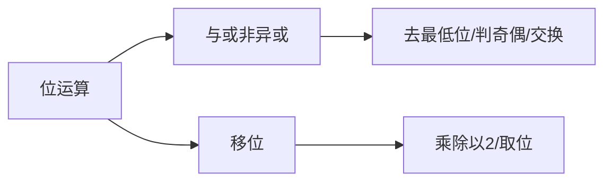

# 位运算：从底层到面试


## 一、为什么学位运算？



位运算直接操作二进制位，是计算机最底层的运算方式。在算法面试中，位运算题目考查：
1. **对二进制表示的理解**
2. **用 O(1) 空间解决看似复杂的问题**
3. **代码简洁性与思维灵活性**

> 掌握 6~8 个核心技巧，就能覆盖 90% 的位运算面试题。

## 二、基本运算速查

| 运算 | 符号 | 示例（Java） | 结果 |
|------|------|-------------|------|
| 与 AND | `&` | `5 & 3` → `101 & 011` | `001` = 1 |
| 或 OR | `\|` | `5 \| 3` → `101 \| 011` | `111` = 7 |
| 异或 XOR | `^` | `5 ^ 3` → `101 ^ 011` | `110` = 6 |
| 取反 NOT | `~` | `~5` | -6 |
| 左移 | `<<` | `1 << 3` | 8 |
| 右移 | `>>` | `8 >> 2` | 2 |
| 无符号右移 | `>>>` | `-1 >>> 28` | 15 |

### 异或的核心性质

```text
a ^ a = 0       // 自身异或为 0
a ^ 0 = a       // 与 0 异或不变
a ^ b = b ^ a   // 交换律
(a ^ b) ^ c = a ^ (b ^ c)  // 结合律
```

> 异或是位运算题的**绝对核心**——"出现两次就消掉"。

## 三、六大核心技巧

### 3.1 判断奇偶

```java tab
// n & 1 == 0 → 偶数；n & 1 == 1 → 奇数
boolean isOdd = (n & 1) == 1;
```

```typescript tab
// n & 1 === 0 → 偶数；n & 1 === 1 → 奇数
const isOdd = (n & 1) === 1;
```

```python tab
# n & 1 == 0 → 偶数；n & 1 == 1 → 奇数
is_odd = (n & 1) == 1
```

### 3.2 乘除 2 的幂

```java tab
int doubled = n << 1;    // n * 2
int halved  = n >> 1;    // n / 2（向下取整）
int times8  = n << 3;    // n * 8
```

```typescript tab
const doubled = n << 1;    // n * 2
const halved  = n >> 1;    // n / 2（向下取整）
const times8  = n << 3;    // n * 8
```

```python tab
doubled = n << 1    # n * 2
halved  = n >> 1    # n // 2（向下取整）
times8  = n << 3    # n * 8
```

### 3.3 取最低位的 1（lowbit）

```java tab
int lowbit = n & (-n);   // 等价于 n & (~n + 1)
```

```typescript tab
const lowbit = n & (-n);   // 等价于 n & (~n + 1)
```

```python tab
lowbit = n & (-n)   # 等价于 n & (~n + 1)
```

**应用**：树状数组（BIT）的核心操作。

### 3.4 去掉最低位的 1

```java tab
n = n & (n - 1);   // 清除最右边的 1
```

```typescript tab
n = n & (n - 1);   // 清除最右边的 1
```

```python tab
n = n & (n - 1)   # 清除最右边的 1
```

**应用**：统计二进制中 1 的个数（Brian Kernighan 算法）。

```java tab
public int hammingWeight(int n) {
    int count = 0;
    while (n != 0) {
        n &= (n - 1);
        count++;
    }
    return count;
}
```

```typescript tab
function hammingWeight(n: number): number {
    let count = 0;
    while (n !== 0) {
        n &= (n - 1);
        count++;
    }
    return count;
}
```

```python tab
def hamming_weight(n: int) -> int:
    count = 0
    while n != 0:
        n &= (n - 1)
        count += 1
    return count
```

### 3.5 判断 2 的幂

```java tab
boolean isPowerOfTwo = n > 0 && (n & (n - 1)) == 0;
```

```typescript tab
const isPowerOfTwo = n > 0 && (n & (n - 1)) === 0;
```

```python tab
is_power_of_two = n > 0 and (n & (n - 1)) == 0
```

> 原理：2 的幂的二进制只有一个 1。

### 3.6 交换两数（无需临时变量）

```java tab
a ^= b;
b ^= a;
a ^= b;
```

```typescript tab
a ^= b;
b ^= a;
a ^= b;
```

```python tab
a ^= b
b ^= a
a ^= b
```

> 面试中了解即可，工程中不推荐（可读性差，且对同一变量/同一数组下标做 XOR 交换会清零）。

## 四、经典面试题

### 4.1 只出现一次的数字

**问题**：数组中只有一个元素出现一次，其余出现两次。找出它。

```java tab
public int singleNumber(int[] nums) {
    int xor = 0;
    for (int num : nums) xor ^= num;
    return xor;
}
```

```typescript tab
function singleNumber(nums: number[]): number {
    let xor = 0;
    for (const num of nums) xor ^= num;
    return xor;
}
```

```python tab
def single_number(nums: list[int]) -> int:
    xor = 0
    for num in nums:
        xor ^= num
    return xor
```

- **时间**：O(n)，**空间**：O(1)
- **原理**：成对的异或消为 0，剩下的就是答案。

### 4.2 只出现一次的数字 II

**问题**：其余元素出现**三次**，找一个出现一次的。

```java tab
public int singleNumber(int[] nums) {
    int ones = 0, twos = 0;
    for (int num : nums) {
        ones = (ones ^ num) & ~twos;
        twos = (twos ^ num) & ~ones;
    }
    return ones;
}
```

```typescript tab
function singleNumber(nums: number[]): number {
    let ones = 0, twos = 0;
    for (const num of nums) {
        ones = (ones ^ num) & ~twos;
        twos = (twos ^ num) & ~ones;
    }
    return ones;
}
```

```python tab
def single_number(nums: list[int]) -> int:
    ones = twos = 0
    for num in nums:
        ones = (ones ^ num) & ~twos
        twos = (twos ^ num) & ~ones
    return ones
```

- **思路**：用两个变量模拟三进制计数器。

### 4.3 两个只出现一次的数字

**问题**：恰好两个元素各出现一次，其余出现两次。

```java tab
public int[] singleNumber(int[] nums) {
    int xorAll = 0;
    for (int num : nums) xorAll ^= num;
    // 取最低位的 1，将数组分成两组
    int diff = xorAll & (-xorAll);
    int a = 0, b = 0;
    for (int num : nums) {
        if ((num & diff) == 0) a ^= num;
        else b ^= num;
    }
    return new int[]{a, b};
}
```

```typescript tab
function singleNumber(nums: number[]): number[] {
    let xorAll = 0;
    for (const num of nums) xorAll ^= num;
    // 取最低位的 1，将数组分成两组
    const diff = xorAll & (-xorAll);
    let a = 0, b = 0;
    for (const num of nums) {
        if ((num & diff) === 0) a ^= num;
        else b ^= num;
    }
    return [a, b];
}
```

```python tab
def single_number(nums: list[int]) -> list[int]:
    xor_all = 0
    for num in nums:
        xor_all ^= num
    # 取最低位的 1，将数组分成两组
    diff = xor_all & (-xor_all)
    a = b = 0
    for num in nums:
        if (num & diff) == 0:
            a ^= num
        else:
            b ^= num
    return [a, b]
```

- **关键**：`xorAll` 中为 1 的位说明两个答案在该位不同，据此分组。

### 4.4 缺失数字

**问题**：`[0, n]` 中缺了一个数，找出来。

```java tab
public int missingNumber(int[] nums) {
    int xor = nums.length;
    for (int i = 0; i < nums.length; i++) {
        xor ^= i ^ nums[i];
    }
    return xor;
}
```

```typescript tab
function missingNumber(nums: number[]): number {
    let xor = nums.length;
    for (let i = 0; i < nums.length; i++) {
        xor ^= i ^ nums[i];
    }
    return xor;
}
```

```python tab
def missing_number(nums: list[int]) -> int:
    xor = len(nums)
    for i in range(len(nums)):
        xor ^= i ^ nums[i]
    return xor
```

### 4.5 二进制中 1 的个数

```java tab
// 方法一：Brian Kernighan
public int hammingWeight(int n) {
    int count = 0;
    while (n != 0) { n &= (n - 1); count++; }
    return count;
}

// 方法二：逐位检查
public int hammingWeight2(int n) {
    int count = 0;
    for (int i = 0; i < 32; i++) {
        count += (n >> i) & 1;
    }
    return count;
}
```

```typescript tab
// 方法一：Brian Kernighan
function hammingWeight(n: number): number {
    let count = 0;
    while (n !== 0) { n &= (n - 1); count++; }
    return count;
}

// 方法二：逐位检查
function hammingWeight2(n: number): number {
    let count = 0;
    for (let i = 0; i < 32; i++) {
        count += (n >> i) & 1;
    }
    return count;
}
```

```python tab
# 方法一：Brian Kernighan
def hamming_weight(n: int) -> int:
    count = 0
    while n != 0:
        n &= (n - 1)
        count += 1
    return count

# 方法二：逐位检查
def hamming_weight2(n: int) -> int:
    count = 0
    for i in range(32):
        count += (n >> i) & 1
    return count
```

## 五、位掩码（Bitmask）

用整数的每一位表示一个布尔状态，常用于**状态压缩 DP** 和**集合操作**：

```java tab
int mask = 0;
mask |= (1 << i);       // 加入第 i 个元素
mask &= ~(1 << i);      // 移除第 i 个元素
boolean has = (mask & (1 << i)) != 0;  // 检查第 i 个
mask ^= (1 << i);       // 切换第 i 个元素
```

```typescript tab
let mask = 0;
mask |= (1 << i);       // 加入第 i 个元素
mask &= ~(1 << i);      // 移除第 i 个元素
const has = (mask & (1 << i)) !== 0;  // 检查第 i 个
mask ^= (1 << i);       // 切换第 i 个元素
```

```python tab
mask = 0
mask |= (1 << i)       # 加入第 i 个元素
mask &= ~(1 << i)      # 移除第 i 个元素
has = (mask & (1 << i)) != 0  # 检查第 i 个
mask ^= (1 << i)       # 切换第 i 个元素
```

**应用**：
- 旅行商问题（TSP）状态压缩
- 子集枚举：`for (int sub = mask; sub > 0; sub = (sub - 1) & mask)`

## 六、Java 中的注意事项

| 问题 | 说明 |
|------|------|
| int 是 32 位有符号 | 最高位是符号位 |
| `>>` vs `>>>` | `>>` 保留符号，`>>>` 补 0 |
| 负数的补码 | `-n = ~n + 1` |
| 溢出 | `1 << 31` 是 `Integer.MIN_VALUE` |

## 七、面试常见题

- 🟢 2 的幂、4 的幂、位 1 的个数、缺失数字
- 🟡 只出现一次的数字 I/II/III、二进制加法
- 🟠 最大异或值、子集异或总和、最短超串
- 🔴 最大单词长度乘积（位掩码）、状态压缩 DP

## 八、调试技巧

1. **打印二进制**：`Integer.toBinaryString(n)` 观察位模式。
2. **小数据手算**：n≤8 时手动画出二进制验证。
3. **注意符号**：Java 中负数右移用 `>>>` 避免死循环。
4. **边界**：`Integer.MIN_VALUE` 取反加一仍为自身（溢出）。
