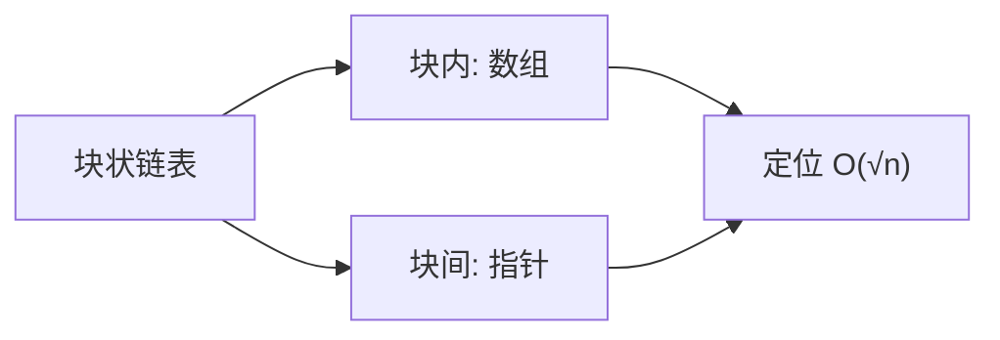

# 块状链表 Block List

## 一、概念：把链表「分块」



普通链表在**任意位置插入 / 删除 / 按索引访问**都是 O(n)。块状链表把链表按**块（block）**组织：每个块内用数组存若干元素，块与块之间仍用指针相连。约定每块大小不超过 **S = ⌈√n⌉**。

> 这样，定位第 k 个元素只需先 O(√n) 找到所在块，再 O(√n) 在块内定位——总复杂度 **O(√n)**，而空间仍是线性的。

## 二、核心操作

| 操作 | 步骤 | 复杂度 |
|---|---|---|
| **定位 locate(k)** | 顺序遍历块累加长度，找到第 k 个元素所在块与块内偏移 | O(√n) |
| **插入 insert(k, v)** | 定位后在块内 splice 插入；若块超 S，从中点**分裂**成两块 | O(√n) |
| **删除 erase(k)** | 定位后块内 splice 删除；若相邻块都偏小可**合并** | O(√n) |
| **get(k)** | 定位后返回块内元素 | O(√n) |

```typescript tab
const S = 3; // 块容量上限，实际按 ⌈√n⌉ 取值

function locate(k: number): [number, number] {
  let acc = 0;
  for (let bi = 0; bi < blocks.length; bi++) {
    if (acc + blocks[bi].length >= k) return [bi, k - acc];
    acc += blocks[bi].length;
  }
  return [blocks.length - 1, blocks[blocks.length - 1].length];
}

function insert(k: number, v: number) {
  const [bi, off] = locate(k);
  blocks[bi].splice(off, 0, v);
  if (blocks[bi].length > S) {
    const mid = Math.ceil(blocks[bi].length / 2);
    const right = blocks[bi].splice(mid); // 后半部分
    blocks.splice(bi + 1, 0, right);      // 分裂成两块
  }
}
```

```java tab
static final int S = 3; // 块容量上限

static int[] locate(int k) {
    int acc = 0;
    for (int bi = 0; bi < blocks.size(); bi++) {
        if (acc + blocks.get(bi).size() >= k) return new int[]{bi, k - acc};
        acc += blocks.get(bi).size();
    }
    return new int[]{blocks.size() - 1, blocks.get(blocks.size() - 1).size()};
}

static void insert(int k, int v) {
    int[] pos = locate(k);
    List<Integer> blk = blocks.get(pos[0]);
    blk.add(pos[1], v);
    if (blk.size() > S) {
        int mid = (int) Math.ceil(blk.size() / 2.0);
        List<Integer> right = new ArrayList<>(blk.subList(mid, blk.size()));
        blk.subList(mid, blk.size()).clear();
        blocks.add(pos[0] + 1, right);
    }
}
```

```python tab
S = 3  # 块容量上限

def locate(k):
    acc = 0
    for bi, blk in enumerate(blocks):
        if acc + len(blk) >= k:
            return bi, k - acc
        acc += len(blk)
    return len(blocks) - 1, len(blocks[-1])

def insert(k, v):
    bi, off = locate(k)
    blocks[bi].insert(off, v)
    if len(blocks[bi]) > S:
        mid = (len(blocks[bi]) + 1) // 2
        right = blocks[bi][mid:]
        blocks[bi] = blocks[bi][:mid]
        blocks.insert(bi + 1, right)
```

## 三、分裂与合并

- **分裂（split）**：当某块长度超过 S，从中点切成两块，插入到相邻位置。保持每块 ≤ S。
- **合并（merge）**：删除后若相邻两块总大小 ≤ S，合并成一块，避免块过多拖慢定位。

## 四、复杂度

| 操作 | 复杂度 |
|---|---|
| 任意位置插入 / 删除 / 访问 | O(√n) |
| 空间 | O(n) |

> 相比纯数组 O(n) 的插入，块状链表把代价降到 O(√n)；相比平衡树 O(log n) 但实现复杂，块状链表**代码极短**，在「允许 √n 而非 log n」的场景（文本编辑器、序列维护）非常实用。

## 五、应用场景

- **文本编辑器 / 记事本**：维护长字符串，支持光标处插入、删除、区间复制。
- **序列维护类竞赛题**：如「维护一个序列，频繁在中间插入删除并查询第 k 个」。
- **数据库页管理**：页（page）可看作块，溢出分裂、空闲合并。
