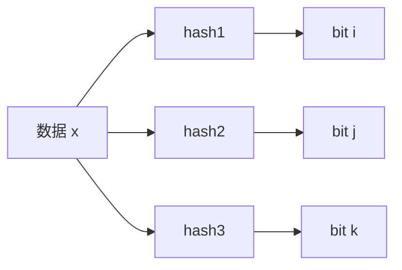

# 位图与布隆过滤器


## 一、问题背景

在海量数据处理场景中，我们经常需要解决**判重**问题：

- 爬虫爬取 10 亿网页，如何避免重复爬取？
- 统计网站日活 UV，如何对重复用户去重？
- 缓存系统中，如何快速判断数据是否一定不存在？

用散列表存储 10 亿条 URL（平均 64 字节），需要 **100GB+** 内存。有没有更省空间的方案？

## 二、位图（BitMap）

### 2.1 核心思想

用一个**二进制位**表示一个数字是否存在，以数组下标定位数据。

> 1 千万个整数，范围 1~1 亿：
> - 散列表：至少 40MB（每个 int 4 字节）
> - 位图：1 亿个 bit ≈ **12MB**

### 2.2 实现原理

借助 int/long 等类型的**位运算**，用其中某一位表示某个数字：

```java tab
public class BitMap {
    private long[] bits;
    private int nbits;

    public BitMap(int nbits) {
        this.nbits = nbits;
        this.bits = new long[nbits / 64 + 1];
    }

    public void set(int k) {
        if (k > nbits) return;
        int wordIndex = k / 64;
        int bitIndex = k % 64;
        bits[wordIndex] |= (1L << bitIndex);
    }

    public boolean get(int k) {
        if (k > nbits) return false;
        int wordIndex = k / 64;
        int bitIndex = k % 64;
        return (bits[wordIndex] & (1L << bitIndex)) != 0;
    }
}
```

```python tab
class BitMap:
    def __init__(self, nbits):
        self.nbits = nbits
        self.bits = [0] * (nbits // 64 + 1)

    def set(self, k):
        if k > self.nbits:
            return
        word_index = k // 64
        bit_index = k % 64
        self.bits[word_index] |= (1 << bit_index)

    def get(self, k):
        if k > self.nbits:
            return False
        word_index = k // 64
        bit_index = k % 64
        return (self.bits[word_index] & (1 << bit_index)) != 0
```

### 2.3 适用场景与局限

| 优点 | 局限 |
|------|------|
| 访问效率极高（O(1)） | 数据范围必须有限 |
| 极度节省内存 | 范围 1~10 亿 → 120MB，反而更大 |
| 天然支持去重 | 只能处理整数映射 |

## 三、布隆过滤器（Bloom Filter）

### 3.1 核心思想

对位图的改进：使用 **K 个哈希函数**将数据映射到位图中，解决数据范围过大的问题。



**插入**：对数据 x 计算 K 个哈希值，将位图中对应位置全部设为 1。

**查询**：对数据 x 计算 K 个哈希值，检查位图中对应位置：
- 有任何一位为 0 → **一定不存在**
- 全部为 1 → **可能存在**（有误判）

### 3.2 误判特性

| 判断结果 | 准确性 |
|----------|--------|
| 不存在 | 100% 准确 |
| 存在 | 可能误判（false positive） |

误判率与三个因素相关：
- 位图大小 m（越大误判越少）
- 哈希函数个数 K（越多误判越少，但计算越慢）
- 已插入数据量 n（越多误判越高）

> 经验公式：m ≈ 10n，K ≈ 7 时，误判率约 1%。

### 3.3 代码实现

```java tab
public class BloomFilter {
    private BitMap bitMap;
    private int k; // 哈希函数个数

    public BloomFilter(int nbits, int k) {
        this.bitMap = new BitMap(nbits);
        this.k = k;
    }

    public void add(String data) {
        for (int i = 0; i < k; i++) {
            int hash = hash(data, i) % bitMap.nbits;
            bitMap.set(Math.abs(hash));
        }
    }

    public boolean mightContain(String data) {
        for (int i = 0; i < k; i++) {
            int hash = hash(data, i) % bitMap.nbits;
            if (!bitMap.get(Math.abs(hash))) {
                return false;
            }
        }
        return true;
    }

    // 模拟 K 个不同哈希函数
    private int hash(String data, int seed) {
        int h = seed * 31;
        for (char c : data.toCharArray()) {
            h = h * 131 + c;
        }
        return h & 0x7FFFFFFF;
    }
}
```

```python tab
class BloomFilter:
    def __init__(self, nbits, k):
        self.bits = [0] * (nbits // 64 + 1)
        self.nbits = nbits
        self.k = k

    def _hash(self, data, seed):
        h = seed * 31
        for c in data:
            h = h * 131 + ord(c)
        return h & 0x7FFFFFFF

    def add(self, data):
        for i in range(self.k):
            pos = self._hash(data, i) % self.nbits
            self.bits[pos // 64] |= (1 << (pos % 64))

    def might_contain(self, data):
        for i in range(self.k):
            pos = self._hash(data, i) % self.nbits
            if not (self.bits[pos // 64] & (1 << (pos % 64))):
                return False
        return True
```

### 3.4 空间对比

以 10 亿条 URL 去重为例：

| 方案 | 内存消耗 | 准确性 |
|------|----------|--------|
| 散列表 | ~100GB | 100% |
| 布隆过滤器（10 倍位图） | ~1.2GB | 存在约 1% 误判 |

## 四、典型应用场景

| 场景 | 说明 |
|------|------|
| 爬虫 URL 去重 | 允许极小概率漏爬 |
| 缓存穿透防护 | 拦截一定不存在的 key |
| 垃圾邮件黑名单 | 快速初筛，再精确判断 |
| 分布式系统去重 | HBase/Cassandra 的 RowKey 判重 |
| 日活 UV 统计 | 对用户 ID 去重计数 |

## 五、工程实践要点

### 5.1 自动扩容

当数据量持续增长，位图中 1 的比例越来越高，误判率上升。解决方案：

- 监控填充率，超过阈值时创建新位图
- 查询时需检查多个位图（类似分段锁思想）

### 5.2 现成工具

| 语言/框架 | 实现 |
|-----------|------|
| Java | `java.util.BitSet`、Guava `BloomFilter` |
| Redis | `SETBIT` / `GETBIT` 命令 |
| Python | `pybloom_live` 库 |
| Go | `github.com/bits-and-blooms/bloom` |

## 六、面试高频题

**Q：布隆过滤器能否支持删除？**

标准布隆过滤器**不支持删除**（无法确定某位是否被其他元素共享）。如需删除，使用**计数布隆过滤器**（Counting Bloom Filter）：将每位替换为计数器（通常 4 位），插入时 +1，删除时 -1。

**Q：如何估算位图大小和哈希函数个数？**

给定 n（预期数据量）和 p（期望误判率）：
- 位图大小：m = -n × ln(p) / (ln2)²
- 哈希函数数：K = (m/n) × ln2

## 七、总结

| 数据结构 | 核心优势 | 适用条件 |
|----------|----------|----------|
| 位图 | 极致省空间、O(1) 访问 | 数据范围有限、整数 |
| 布隆过滤器 | 省空间、支持任意数据 | 允许 false positive |

核心取舍：**用极小的误判率换取数量级的空间节省**。
