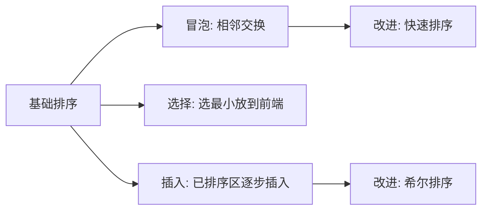
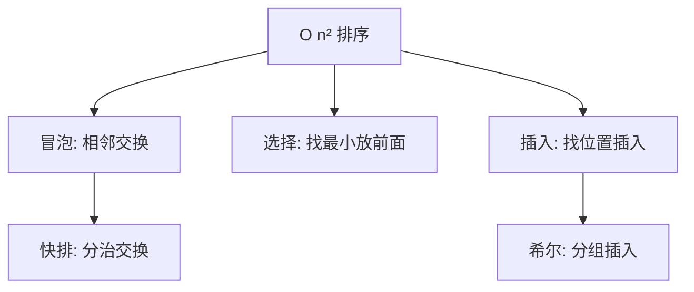

# 基础排序：冒泡、选择与插入


## 一、为什么要学基础排序？

虽然工程中很少直接使用 O(n²) 排序，但它们是：
1. **理解排序思想的起点**（交换、选择、插入）
2. **高级排序的基石**（快排 = 冒泡的改进，希尔 = 插入的改进）
3. **小规模数据的最优选择**（Java Arrays.sort 在 n<47 时用插入排序）
4. **面试手撕高频题**



| 算法 | 时间（平均） | 时间（最坏） | 空间 | 稳定 |
|------|------------|------------|------|------|
| 冒泡排序 | O(n²) | O(n²) | O(1) | ✅ |
| 选择排序 | O(n²) | O(n²) | O(1) | ❌ |
| 插入排序 | O(n²) | O(n²) | O(1) | ✅ |

## 二、冒泡排序（Bubble Sort）

### 2.1 思想

反复**比较相邻元素**，如果顺序错误就交换。每轮将最大值"冒泡"到末尾。

### 2.2 实现

```java tab
public void bubbleSort(int[] arr) {
    int n = arr.length;
    for (int i = 0; i < n - 1; i++) {
        boolean swapped = false;
        for (int j = 0; j < n - 1 - i; j++) {
            if (arr[j] > arr[j + 1]) {
                int tmp = arr[j]; arr[j] = arr[j + 1]; arr[j + 1] = tmp;
                swapped = true;
            }
        }
        if (!swapped) break;
    }
}
```
```typescript tab
function bubbleSort(arr: number[]): void {
    const n = arr.length;
    for (let i = 0; i < n - 1; i++) {
        let swapped = false;
        for (let j = 0; j < n - 1 - i; j++) {
            if (arr[j] > arr[j + 1]) {
                [arr[j], arr[j + 1]] = [arr[j + 1], arr[j]];
                swapped = true;
            }
        }
        if (!swapped) break;
    }
}
```
```python tab
def bubble_sort(arr: list[int]) -> None:
    n = len(arr)
    for i in range(n - 1):
        swapped = False
        for j in range(n - 1 - i):
            if arr[j] > arr[j + 1]:
                arr[j], arr[j + 1] = arr[j + 1], arr[j]
                swapped = True
        if not swapped:
            break
```

- **最好**：O(n)（已有序，一轮无交换）
- **最坏**：O(n²)（逆序）
- **稳定**：✅（相等时不交换）

## 三、选择排序（Selection Sort）

### 3.1 思想

每轮从未排序部分选出**最小值**，放到已排序部分的末尾。

### 3.2 实现

```java tab
public void selectionSort(int[] arr) {
    int n = arr.length;
    for (int i = 0; i < n - 1; i++) {
        int minIdx = i;
        for (int j = i + 1; j < n; j++) {
            if (arr[j] < arr[minIdx]) {
                minIdx = j;
            }
        }
        if (minIdx != i) {
            int tmp = arr[i]; arr[i] = arr[minIdx]; arr[minIdx] = tmp;
        }
    }
}
```
```typescript tab
function selectionSort(arr: number[]): void {
    const n = arr.length;
    for (let i = 0; i < n - 1; i++) {
        let minIdx = i;
        for (let j = i + 1; j < n; j++) {
            if (arr[j] < arr[minIdx]) minIdx = j;
        }
        if (minIdx !== i) {
            [arr[i], arr[minIdx]] = [arr[minIdx], arr[i]];
        }
    }
}
```
```python tab
def selection_sort(arr: list[int]) -> None:
    n = len(arr)
    for i in range(n - 1):
        min_idx = i
        for j in range(i + 1, n):
            if arr[j] < arr[min_idx]:
                min_idx = j
        if min_idx != i:
            arr[i], arr[min_idx] = arr[min_idx], arr[i]
```

- **时间**：始终 O(n²)（无论数据是否有序）
- **稳定**：❌（跳跃交换可能打乱相等元素的相对顺序）
- **交换次数**：最多 n-1 次（比冒泡少）

## 四、插入排序（Insertion Sort）

### 4.1 思想

像打扑克牌整理手牌：每次取一张新牌，**插入到已排序部分的正确位置**。

### 4.2 实现

```java tab
public void insertionSort(int[] arr) {
    for (int i = 1; i < arr.length; i++) {
        int key = arr[i];
        int j = i - 1;
        while (j >= 0 && arr[j] > key) {
            arr[j + 1] = arr[j];
            j--;
        }
        arr[j + 1] = key;
    }
}
```
```typescript tab
function insertionSort(arr: number[]): void {
    for (let i = 1; i < arr.length; i++) {
        const key = arr[i];
        let j = i - 1;
        while (j >= 0 && arr[j] > key) {
            arr[j + 1] = arr[j];
            j--;
        }
        arr[j + 1] = key;
    }
}
```
```python tab
def insertion_sort(arr: list[int]) -> None:
    for i in range(1, len(arr)):
        key = arr[i]
        j = i - 1
        while j >= 0 and arr[j] > key:
            arr[j + 1] = arr[j]
            j -= 1
        arr[j + 1] = key
```

- **最好**：O(n)（已有序，每次只比较一次）
- **最坏**：O(n²)（逆序）
- **稳定**：✅
- **特点**：对**近乎有序**的数据极快，常用作高级排序的子过程

### 4.3 为什么小规模用插入排序？

| n 范围 | 最优选择 | 原因 |
|--------|----------|------|
| n < 10~50 | 插入排序 | 常数因子小，无递归开销 |
| 50 < n < 10⁵ | 快排/归并 | O(n log n) 优势显现 |
| n > 10⁶ | 基数/桶排序 | 线性时间 |

## 五、希尔排序（Shell Sort）

插入排序的改进版：先对**间隔 gap** 的元素做插入排序，逐步缩小 gap。

```java tab
public void shellSort(int[] arr) {
    int n = arr.length;
    for (int gap = n / 2; gap > 0; gap /= 2) {
        for (int i = gap; i < n; i++) {
            int key = arr[i];
            int j = i - gap;
            while (j >= 0 && arr[j] > key) {
                arr[j + gap] = arr[j];
                j -= gap;
            }
            arr[j + gap] = key;
        }
    }
}
```
```typescript tab
function shellSort(arr: number[]): void {
    const n = arr.length;
    for (let gap = Math.floor(n / 2); gap > 0; gap = Math.floor(gap / 2)) {
        for (let i = gap; i < n; i++) {
            const key = arr[i];
            let j = i - gap;
            while (j >= 0 && arr[j] > key) {
                arr[j + gap] = arr[j];
                j -= gap;
            }
            arr[j + gap] = key;
        }
    }
}
```
```python tab
def shell_sort(arr: list[int]) -> None:
    n = len(arr)
    gap = n // 2
    while gap > 0:
        for i in range(gap, n):
            key = arr[i]
            j = i - gap
            while j >= 0 and arr[j] > key:
                arr[j + gap] = arr[j]
                j -= gap
            arr[j + gap] = key
        gap //= 2
```

- **时间**：取决于 gap 序列，约 O(n^1.3) ~ O(n²)
- **稳定**：❌

## 六、三种排序对比



| 维度 | 冒泡 | 选择 | 插入 |
|------|------|------|------|
| 核心操作 | 相邻交换 | 选最小 | 后移+插入 |
| 最好情况 | O(n) | O(n²) | O(n) |
| 交换次数 | 多 | 少（≤n） | 无（用赋值） |
| 稳定性 | ✅ | ❌ | ✅ |
| 实际性能 | 最慢 | 中等 | 最快 |

## 七、面试常见题

- 🟢 手写冒泡/选择/插入排序
- 🟡 排序链表（插入排序思想）、对几乎有序的数组排序
- 🟠 希尔排序的 gap 序列选择
- 🔴 证明比较排序下界 Ω(n log n)

## 八、调试技巧

1. **边界**：空数组、单元素、已有序、逆序。
2. **冒泡优化**：加 `swapped` 标志，最好情况 O(n)。
3. **插入排序的 while 条件**：`j >= 0 && arr[j] > key`，别忘 `j >= 0`。
4. **稳定性验证**：用 `(value, id)` 对排序，检查相同 value 的 id 顺序。

## 九、多语言对照：插入排序

```java tab
public void insertionSort(int[] arr) {
    for (int i = 1; i < arr.length; i++) {
        int key = arr[i];
        int j = i - 1;
        while (j >= 0 && arr[j] > key) {
            arr[j + 1] = arr[j];
            j--;
        }
        arr[j + 1] = key;
    }
}
```
```typescript tab
function insertionSort(arr: number[]): void {
    for (let i = 1; i < arr.length; i++) {
        const key = arr[i];
        let j = i - 1;
        while (j >= 0 && arr[j] > key) {
            arr[j + 1] = arr[j];
            j--;
        }
        arr[j + 1] = key;
    }
}
```
```python tab
def insertion_sort(arr: list[int]) -> None:
    for i in range(1, len(arr)):
        key = arr[i]
        j = i - 1
        while j >= 0 and arr[j] > key:
            arr[j + 1] = arr[j]
            j -= 1
        arr[j + 1] = key
```
