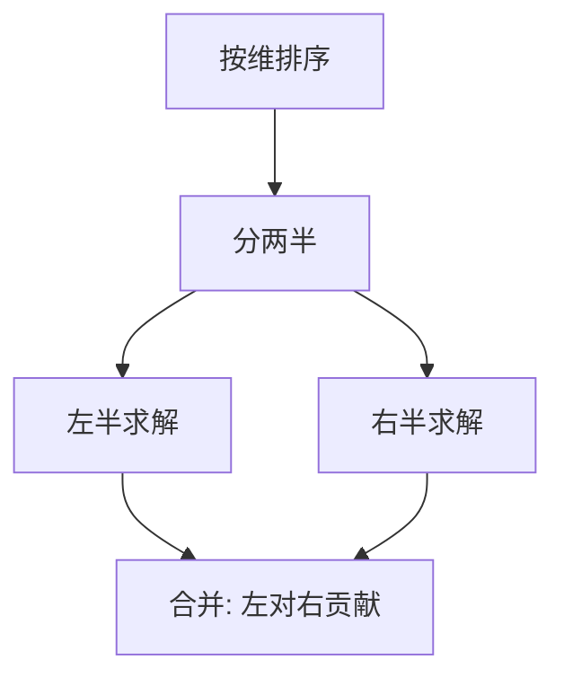

# CDQ 分治

CDQ 分治是一种离线算法框架，通过"分治 + 归并"的思想，将三维偏序等复杂计数问题降维处理，时间复杂度 O(n log²n)。

## 一、核心思想



普通分治：将问题分成两半，分别求解，合并。
CDQ 分治：将问题按某一维排序后分成两半，**左半对右半的贡献**在合并时计算。

关键区别：CDQ 关注的是"左半部分对右半部分的影响"，而非简单的子问题合并。

## 二、三维偏序问题

给定 n 个三元组 (aᵢ, bᵢ, cᵢ)，对每个 i 求满足 aⱼ ≤ aᵢ, bⱼ ≤ bᵢ, cⱼ ≤ cᵢ 的 j 的个数。

### 思路

1. 第一维：排序（预处理）
2. 第二维：CDQ 分治时归并排序
3. 第三维：树状数组

```java tab
// 三维偏序模板
void cdq(int l, int r) {
    if (l >= r) return;
    int mid = (l + r) / 2;
    cdq(l, mid);
    cdq(mid + 1, r);

    // 归并：按 b 排序，左半对右半的贡献
    int i = l, j = mid + 1, k = 0;
    while (i <= mid && j <= r) {
        if (arr[i].b <= arr[j].b) {
            bit.add(arr[i].c, 1); // 左半元素加入 BIT
            tmp[k++] = arr[i++];
        } else {
            ans[arr[j].id] += bit.query(arr[j].c); // 查询 ≤ c 的个数
            tmp[k++] = arr[j++];
        }
    }
    while (i <= mid) tmp[k++] = arr[i++];
    while (j <= r) {
        ans[arr[j].id] += bit.query(arr[j].c);
        tmp[k++] = arr[j++];
    }

    // 清除 BIT
    for (int p = l; p <= mid; p++) bit.add(arr[p].c, -1);

    // 回写（归并排序）
    System.arraycopy(tmp, 0, arr, l, k);
}
```

```typescript tab
// 三维偏序模板
function cdq(l: number, r: number): void {
    if (l >= r) return;
    const mid = (l + r) >> 1;
    cdq(l, mid);
    cdq(mid + 1, r);

    // 归并：按 b 排序，左半对右半的贡献
    let i = l, j = mid + 1, k = 0;
    while (i <= mid && j <= r) {
        if (arr[i].b <= arr[j].b) {
            bit.add(arr[i].c, 1); // 左半元素加入 BIT
            tmp[k++] = arr[i++];
        } else {
            ans[arr[j].id] += bit.query(arr[j].c); // 查询 ≤ c 的个数
            tmp[k++] = arr[j++];
        }
    }
    while (i <= mid) tmp[k++] = arr[i++];
    while (j <= r) {
        ans[arr[j].id] += bit.query(arr[j].c);
        tmp[k++] = arr[j++];
    }

    // 清除 BIT
    for (let p = l; p <= mid; p++) bit.add(arr[p].c, -1);

    // 回写（归并排序）
    for (let p = 0; p < k; p++) arr[l + p] = tmp[p];
}
```

```python tab
# 三维偏序模板
def cdq(l: int, r: int) -> None:
    if l >= r:
        return
    mid = (l + r) // 2
    cdq(l, mid)
    cdq(mid + 1, r)

    # 归并：按 b 排序，左半对右半的贡献
    i, j, k = l, mid + 1, 0
    while i <= mid and j <= r:
        if arr[i].b <= arr[j].b:
            bit.add(arr[i].c, 1)  # 左半元素加入 BIT
            tmp[k] = arr[i]
            i += 1
        else:
            ans[arr[j].id] += bit.query(arr[j].c)  # 查询 ≤ c 的个数
            tmp[k] = arr[j]
            j += 1
        k += 1
    while i <= mid:
        tmp[k] = arr[i]
        i += 1
        k += 1
    while j <= r:
        ans[arr[j].id] += bit.query(arr[j].c)
        tmp[k] = arr[j]
        j += 1
        k += 1

    # 清除 BIT
    for p in range(l, mid + 1):
        bit.add(arr[p].c, -1)

    # 回写（归并排序）
    arr[l:l + k] = tmp[:k]
```

## 三、经典应用

### 1. 逆序对（二维偏序）

一维排序 + CDQ 统计 = 归并排序求逆序对。

### 2. 二维前缀和（离线）

将修改和查询按时间排序，CDQ 处理"时间在前、坐标满足"的贡献。

### 3. 动态 LIS

按位置分治，跨区间的贡献用 BIT 统计。

### 4. 平面最近点对

按 x 分治，跨区间的用 y 排序 + 带状区域检查。

## 四、CDQ 分治 vs 其他

| 方法 | 适用 | 时间 |
|------|------|------|
| CDQ 分治 | 离线、多维偏序 | O(n log²n) |
| 树套树 | 在线、二维 | O(n log²n) |
| 分块 | 万能但慢 | O(n√n) |
| 归并排序 | 二维逆序对 | O(n log n) |

## 五、使用条件

1. **离线**：所有操作提前已知
2. **贡献可加**：左半对右半的贡献可以独立计算
3. **可排序降维**：至少一维可以通过排序/分治消除

## 六、复杂度

| 操作 | 时间 |
|------|------|
| CDQ + BIT（三维偏序） | O(n log²n) |
| CDQ + 归并（二维） | O(n log n) |
| 空间 | O(n) |

## 七、面试要点

1. **本质**：分治框架 + 跨区间贡献统计
2. **三维偏序**：排序 + CDQ + BIT 三件套
3. **归并时统计**：左半加入 BIT，右半查询
4. **清除操作**：每层结束后撤销 BIT 修改
5. **竞赛常用**：面试较少直接考，但思想（分治+归并）高频

## 八、CDQ 分治求逆序对模拟

以 `[5, 2, 4, 1]` 为例，演示 CDQ 如何统计“左边大于右边”的对数：

```
cdq(l, r): 统计下标在 [l, mid] 且值大于下标在 [mid+1, r] 的对数

[5, 2, 4, 1]
├── cdq([5,2]):
│   ├── 左[5] 右[2]：5 > 2 → +1 对
│   └── 归并后 [2,5]
├── cdq([4,1]):
│   ├── 左[4] 右[1]：4 > 1 → +1 对
│   └── 归并后 [1,4]
└── 合并 [2,5] 和 [1,4]：
    左半[2,5]，右半[1,4]
    右半的 1：左半中 >1 的有 2,5 → +2 对
    右半的 4：左半中 >4 的有 5 → +1 对
    小计 +3

总计：1 + 1 + 3 = 5 个逆序对
验证：(5,2),(5,4),(5,1),(2,1),(4,1) = 5 ✓
```

**CDQ 与归并排序的关系**：CDQ 本质上就是归并排序，只是在“合并”环节额外统计了跨越左右两半的贡献。逆序对、小和等问题都是这个框架的实例。

## 九、三维偏序：CDQ 的完整形态

```
问题：统计满足 aᵢ ≤ aⱼ, bᵢ ≤ bⱼ, cᵢ ≤ cⱼ 的 (i, j) 对数

三件套：
  ① 按第一维 a 排序（消除第一维）
  ② CDQ 分治第二维 b（归并时保证左半 b ≤ 右半 b）
  ③ 树状数组维护第三维 c（左半插入 c，右半查询 ≤ cⱼ 的个数）

为什么不能直接用 BIT 解决三维？
  BIT 只能处理一维前缀；三维需要“排序降一维 + 分治降一维 + BIT 管一维”
```

## 十、思考题

1. CDQ 分治为什么必须在“归并”环节统计贡献，而不是在递归到底时统计？（提示：跨区间的对只能在合并时被看到）
2. 三维偏序中如果第二维用 CDQ，为什么第一维必须先排序？不排序会漏掉什么情况？（提示：保证左半的第一维总 ≤ 右半）
3. CDQ 分治与树套树（嵌套 BIT）都能解三维偏序，各自的优劣势是什么？（提示：CDQ 常数小但离线，树套树可在线）

> 练习推荐：在练习题模块先做 [计算右侧小于当前元素的个数](/problems/reverse-pairs) 体会“分治统计跨越贡献”的思想。
