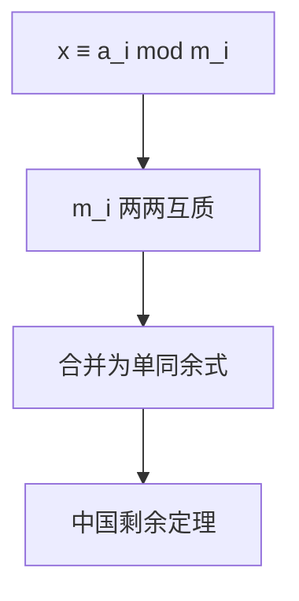

# 中国剩余定理

中国剩余定理（CRT）求解一组两两互质模数下的同余方程组，是数论中最重要的定理之一，广泛应用于密码学、大数计算和竞赛编程。

## 一、问题形式



求解满足以下条件的最小正整数 x：

```
x ≡ a₁ (mod m₁)
x ≡ a₂ (mod m₂)
...
x ≡ aₙ (mod mₙ)
```

其中 m₁, m₂, ..., mₙ 两两互质。

## 二、定理内容

设 M = m₁ × m₂ × ... × mₙ，Mᵢ = M / mᵢ，则：

```
x = Σ aᵢ × Mᵢ × Mᵢ⁻¹ (mod M)
```

其中 Mᵢ⁻¹ 是 Mᵢ 关于 mᵢ 的模逆元。

解在 mod M 意义下唯一。

## 三、代码实现

```java tab
// 中国剩余定理：m[] 两两互质
long crt(long[] a, long[] m, int n) {
    long M = 1;
    for (int i = 0; i < n; i++) M *= m[i];

    long x = 0;
    for (int i = 0; i < n; i++) {
        long Mi = M / m[i];
        long inv = modInverse(Mi, m[i]); // exgcd 求逆元
        x = (x + a[i] * Mi % M * inv) % M;
    }
    return (x % M + M) % M;
}

long modInverse(long a, long mod) {
    long[] res = exgcd(a, mod);
    return (res[1] % mod + mod) % mod;
}

long[] exgcd(long a, long b) {
    if (b == 0) return new long[]{a, 1, 0};
    long[] r = exgcd(b, a % b);
    return new long[]{r[0], r[2], r[1] - (a / b) * r[2]};
}
```

```typescript tab
// 中国剩余定理：m[] 两两互质
function crt(a: bigint[], m: bigint[], n: number): bigint {
    let M = 1n;
    for (let i = 0; i < n; i++) M *= m[i];

    let x = 0n;
    for (let i = 0; i < n; i++) {
        const Mi = M / m[i];
        const inv = modInverse(Mi, m[i]); // exgcd 求逆元
        x = (x + a[i] * Mi % M * inv) % M;
    }
    return (x % M + M) % M;
}

function modInverse(a: bigint, mod: bigint): bigint {
    const res = exgcd(a, mod);
    return (res[1] % mod + mod) % mod;
}

function exgcd(a: bigint, b: bigint): [bigint, bigint, bigint] {
    if (b === 0n) return [a, 1n, 0n];
    const [g, x1, y1] = exgcd(b, a % b);
    return [g, y1, x1 - (a / b) * y1];
}
```

```python tab
# 中国剩余定理：m[] 两两互质
def crt(a: list, m: list, n: int) -> int:
    M = 1
    for i in range(n):
        M *= m[i]

    x = 0
    for i in range(n):
        Mi = M // m[i]
        inv = mod_inverse(Mi, m[i])  # exgcd 求逆元
        x = (x + a[i] * Mi % M * inv) % M
    return (x % M + M) % M

def mod_inverse(a: int, mod: int) -> int:
    g, x, y = exgcd(a, mod)
    return (x % mod + mod) % mod

def exgcd(a: int, b: int) -> tuple:
    if b == 0:
        return a, 1, 0
    g, x1, y1 = exgcd(b, a % b)
    return g, y1, x1 - (a // b) * y1
```

## 四、经典例题：物不知数

```
x ≡ 2 (mod 3)
x ≡ 3 (mod 5)
x ≡ 2 (mod 7)
```

M = 105, M₁=35, M₂=21, M₃=15

- 35 × inv(35,3) = 35 × 2 = 70
- 21 × inv(21,5) = 21 × 1 = 21
- 15 × inv(15,7) = 15 × 1 = 15

x = 2×70 + 3×21 + 2×15 = 140 + 63 + 30 = 233 ≡ 23 (mod 105)

## 五、扩展 CRT（模数不互质）

当模数不两两互质时，逐步合并方程：

```java tab
// 合并 x ≡ a1 (mod m1) 和 x ≡ a2 (mod m2)
// 返回 [新a, 新m]，无解返回 null
long[] merge(long a1, long m1, long a2, long m2) {
    long g = gcd(m1, m2);
    if ((a2 - a1) % g != 0) return null; // 无解

    long lcm = m1 / g * m2;
    long[] ex = exgcd(m1, m2);
    long k = (a2 - a1) / g * ex[1] % (m2 / g);
    long a = (a1 + k * m1) % lcm;
    return new long[]{(a + lcm) % lcm, lcm};
}

long excrt(long[] a, long[] m, int n) {
    long curA = a[0], curM = m[0];
    for (int i = 1; i < n; i++) {
        long[] res = merge(curA, curM, a[i], m[i]);
        if (res == null) return -1; // 无解
        curA = res[0]; curM = res[1];
    }
    return curA;
}
```

```typescript tab
// 合并 x ≡ a1 (mod m1) 和 x ≡ a2 (mod m2)
// 返回 [新a, 新m]，无解返回 null
function merge(a1: bigint, m1: bigint, a2: bigint, m2: bigint): [bigint, bigint] | null {
    const g = gcd(m1, m2);
    if ((a2 - a1) % g !== 0n) return null; // 无解

    const lcm = m1 / g * m2;
    const [, x] = exgcd(m1, m2);
    let k = (a2 - a1) / g * x % (m2 / g);
    const a = (a1 + k * m1) % lcm;
    return [(a + lcm) % lcm, lcm];
}

function excrt(a: bigint[], m: bigint[], n: number): bigint {
    let curA = a[0], curM = m[0];
    for (let i = 1; i < n; i++) {
        const res = merge(curA, curM, a[i], m[i]);
        if (res === null) return -1n; // 无解
        curA = res[0]; curM = res[1];
    }
    return curA;
}
```

```python tab
# 合并 x ≡ a1 (mod m1) 和 x ≡ a2 (mod m2)
# 返回 (新a, 新m)，无解返回 None
def merge(a1: int, m1: int, a2: int, m2: int) -> tuple:
    g = gcd(m1, m2)
    if (a2 - a1) % g != 0:
        return None  # 无解

    lcm = m1 // g * m2
    _, x, _ = exgcd(m1, m2)
    k = (a2 - a1) // g * x % (m2 // g)
    a = (a1 + k * m1) % lcm
    return (a + lcm) % lcm, lcm

def excrt(a: list, m: list, n: int) -> int:
    cur_a, cur_m = a[0], m[0]
    for i in range(1, n):
        res = merge(cur_a, cur_m, a[i], m[i])
        if res is None:
            return -1  # 无解
        cur_a, cur_m = res
    return cur_a
```

**无解的直觉**：两个方程的解集分别是公差 m₁、m₂ 的等差数列，它们有公共项当且仅当 `a₂ - a₁` 能被 gcd(m₁, m₂) 整除。

## 六、应用

| 场景 | 说明 |
|------|------|
| 大数取模 | 分别对小质数取模，CRT 合并 |
| RSA 解密 | 加速模幂运算 |
| 多项式插值 | 在多个点求值后合并 |
| 竞赛 | 模数非质数时的组合数计算 |

## 七、面试要点

1. **前提**：模数两两互质（标准 CRT）
2. **公式**：x = Σ aᵢ × Mᵢ × inv(Mᵢ, mᵢ)
3. **扩展 CRT**：逐步合并，用 exgcd
4. **无解判定**：(a₂-a₁) % gcd(m₁,m₂) ≠ 0
5. **LeetCode**：无直接题，但理解模运算对 372（超级次方）有帮助

## 八、“物不知数”问题模拟

《孙子算经》原题：今有物不知其数，三三数之剩二，五五数之剩三，七七数之剩二，问物几何？

```
方程组：
  x ≡ 2 (mod 3)
  x ≡ 3 (mod 5)
  x ≡ 2 (mod 7)

① 计算总模数 M = 3*5*7 = 105
② 各 Mᵢ = M / mᵢ：
   M₁ = 35,  M₂ = 21,  M₃ = 15
③ 求逆元 tᵢ = inv(Mᵢ, mᵢ)：
   35*t₁ ≡ 1 (mod 3) → 35≡2, 2*t₁≡1 → t₁=2
   21*t₂ ≡ 1 (mod 5) → 21≡1 → t₂=1
   15*t₃ ≡ 1 (mod 7) → 15≡1 → t₃=1
④ 代入公式：
   x = a₁M₁t₁ + a₂M₂t₂ + a₃M₃t₃
     = 2*35*2 + 3*21*1 + 2*15*1
     = 140 + 63 + 30 = 233
⑤ 取最小正整数解：x = 233 mod 105 = 23

验证：23 = 3*7+2 ✓  23 = 5*4+3 ✓  23 = 7*3+2 ✓
口诀：“三人同行七十稀，五树梅花廿一枝，七子团圆正半月，除百零五便得知”
```

## 九、思考题

1. 标准 CRT 为什么要求模数两两互质？如果 m₁ = m₂ = 3 且余数不同会怎样？（提示：矛盾方程无解）
2. 为什么最终答案要对 M = m₁m₂…mₙ 取模？在模 M 意义下解为什么唯一？（提示：任意两个解之差是每个 mᵢ 的倍数）
3. 扩展 CRT 中合并两个方程后，新模数为什么是 lcm(m₁, m₂) 而不是 m₁*m₂？（提示：不互质时乘积不是最小周期）

> 练习推荐：先掌握 [扩展欧几里得](/tutorials/extended-gcd)，再手动推演一遍“物不知数”的完整过程。
