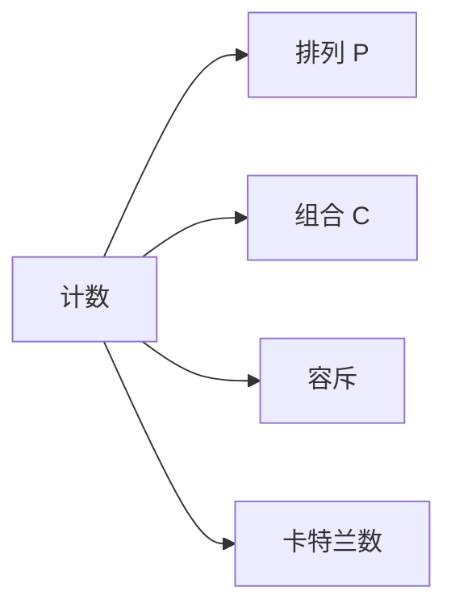

# 组合数学与计数

组合数学是算法竞赛和面试中计数类问题的理论基础。排列、组合、容斥原理、卡特兰数等工具能优雅地解决"有多少种方案"类问题。

## 一、排列与组合



### 公式

```
P(n, k) = n! / (n-k)!     （排列：有序）
C(n, k) = n! / (k!(n-k)!) （组合：无序）
```

### 计算（取模）

```java tab
long MOD = 1_000_000_007;
long[] fact = new long[MAX];
long[] invFact = new long[MAX];

void precompute() {
    fact[0] = 1;
    for (int i = 1; i < MAX; i++) fact[i] = fact[i-1] * i % MOD;
    invFact[MAX-1] = fastPow(fact[MAX-1], MOD-2, MOD);
    for (int i = MAX-2; i >= 0; i--) invFact[i] = invFact[i+1] * (i+1) % MOD;
}

long comb(int n, int k) {
    if (k < 0 || k > n) return 0;
    return fact[n] * invFact[k] % MOD * invFact[n-k] % MOD;
}
```

```typescript tab
const MOD = 1000000007n;
const fact = new Array(MAX).fill(0n);
const invFact = new Array(MAX).fill(0n);

function precompute(): void {
    fact[0] = 1n;
    for (let i = 1; i < MAX; i++) fact[i] = fact[i - 1] * BigInt(i) % MOD;
    invFact[MAX - 1] = fastPow(fact[MAX - 1], MOD - 2n, MOD);
    for (let i = MAX - 2; i >= 0; i--) invFact[i] = invFact[i + 1] * BigInt(i + 1) % MOD;
}

function comb(n: number, k: number): bigint {
    if (k < 0 || k > n) return 0n;
    return fact[n] * invFact[k] % MOD * invFact[n - k] % MOD;
}
```

```python tab
MOD = 10**9 + 7
fact = [0] * MAX
inv_fact = [0] * MAX

def precompute():
    fact[0] = 1
    for i in range(1, MAX):
        fact[i] = fact[i - 1] * i % MOD
    inv_fact[MAX - 1] = fast_pow(fact[MAX - 1], MOD - 2, MOD)
    for i in range(MAX - 2, -1, -1):
        inv_fact[i] = inv_fact[i + 1] * (i + 1) % MOD

def comb(n: int, k: int) -> int:
    if k < 0 or k > n:
        return 0
    return fact[n] * inv_fact[k] % MOD * inv_fact[n - k] % MOD
```

## 二、容斥原理

```
|A ∪ B ∪ C| = |A| + |B| + |C| - |A∩B| - |A∩C| - |B∩C| + |A∩B∩C|
```

### 应用：错排（全错位排列）

n 个元素全不在原位的排列数：

```
D(n) = n! × Σ(-1)^k / k!  (k=0..n)
D(n) = (n-1) × (D(n-1) + D(n-2))
```

## 三、卡特兰数

```
C_n = C(2n, n) / (n+1) = C(2n, n) - C(2n, n+1)
```

前几项：1, 1, 2, 5, 14, 42, 132, 429...

### 卡特兰数的应用

| 问题 | 答案 |
|------|------|
| n 对括号的合法序列数 | C_n |
| n 个节点的不同 BST 数 | C_n |
| n 步不越过对角线的路径数 | C_n |
| 凸 n+2 边形的三角剖分数 | C_n |
| 栈的出栈序列数 | C_n |

## 四、鸽巢原理

n+1 个物体放入 n 个盒子 → 至少一个盒子有 2 个物体。

应用：证明存在性（如数组中必有两个数差为 n 的倍数）。

## 五、二项式定理

```
(a + b)^n = Σ C(n,k) × a^(n-k) × b^k
```

### 杨辉三角（Pascal's Triangle）

```java tab
// LeetCode 118
List<List<Integer>> generate(int numRows) {
    List<List<Integer>> tri = new ArrayList<>();
    for (int i = 0; i < numRows; i++) {
        List<Integer> row = new ArrayList<>();
        for (int j = 0; j <= i; j++) {
            if (j == 0 || j == i) row.add(1);
            else row.add(tri.get(i-1).get(j-1) + tri.get(i-1).get(j));
        }
        tri.add(row);
    }
    return tri;
}
```

```typescript tab
// LeetCode 118
function generate(numRows: number): number[][] {
    const tri: number[][] = [];
    for (let i = 0; i < numRows; i++) {
        const row: number[] = [];
        for (let j = 0; j <= i; j++) {
            if (j === 0 || j === i) row.push(1);
            else row.push(tri[i - 1][j - 1] + tri[i - 1][j]);
        }
        tri.push(row);
    }
    return tri;
}
```

```python tab
# LeetCode 118
def generate(num_rows: int) -> list:
    tri = []
    for i in range(num_rows):
        row = []
        for j in range(i + 1):
            if j == 0 or j == i:
                row.append(1)
            else:
                row.append(tri[i - 1][j - 1] + tri[i - 1][j])
        tri.append(row)
    return tri
```

## 六、Lucas 定理（大组合数 mod 小质数）

```
C(n, m) mod p = C(n/p, m/p) × C(n%p, m%p) mod p
```

适用于 n 很大但 p 较小（如 p = 10⁹+7 不适用，p = 10007 适用）。

## 七、面试要点

1. **组合数取模**：预处理阶乘 + 逆元
2. **卡特兰数**：识别模型（括号、BST、路径）
3. **容斥**：至少/至多问题
4. **杨辉三角**：C(n,k) = C(n-1,k-1) + C(n-1,k)
5. **LeetCode**：118/119（杨辉三角）、96（不同 BST）、22（括号生成）、62（不同路径）

## 八、组合数计算过程模拟

以 C(5, 2) = 10 为例，对比三种计算方式：

```
方式1：公式法 C(n,k) = n! / (k!(n-k)!)
  C(5,2) = 5! / (2!·3!) = 120 / (2·6) = 120/12 = 10 ✓
  问题：除法在取模下不成立，需要逆元

方式2：递推（杨辉三角）C(n,k) = C(n-1,k-1) + C(n-1,k)
  C(5,2) = C(4,1) + C(4,2)
         = [C(3,0)+C(3,1)] + [C(3,1)+C(3,2)]
  逐层展开，适合批量预处理 O(n²)

方式3：阶乘 + 逆元（取模场景）
  C(n,k) = n! · inv(k!) · inv((n-k)!) mod p
  预处理 fact[i] 和 inv_fact[i]，单次查询 O(1)
```

**卡特兰数的识别**：

```
Catalan(n) = C(2n, n) / (n+1)
前几项：1, 1, 2, 5, 14, 42, 132…

经典模型（本质相同）：
  - n 对括号的合法组合数（LC 22）
  - n 个节点的不同 BST 数（LC 96）
  - 不越过对角线的网格路径数
  - n+1 个叶子的满二叉树数
识别信号：“合法序列/不越过某条线/进出栈” → 卡特兰
```

## 九、思考题

1. LC 62 不同路径为什么等于 C(m+n-2, m-1)？如何把网格路径映射为组合问题？（提示：总共走 m-1 次右 + n-1 次下，选哪些步为右）
2. 为什么计算组合数取模不能直接“先算阶乘再除”？逆元如何解决这个问题？（提示：模运算下除法不封闭）
3. 卡特兰数的递推式 Catalan(n) = Σ Catalan(i)·Catalan(n-1-i) 对应 BST 计数时的什么含义？（提示：枚举根节点，左右子树独立）

> 练习推荐：在练习题模块完成 [全排列](/problems/permutations) 体会组合枚举后，再挑战 LC 96 不同 BST。
