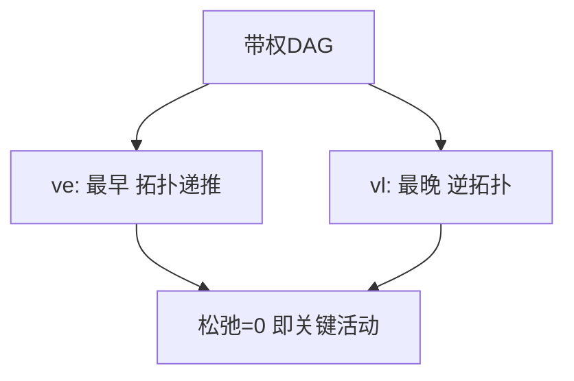

# 关键路径（Critical Path Method, CPM）

## 一、为什么学关键路径？



在**带权 DAG（活动网 AOE）**中，求从源点到汇点的最长路径——它决定整个工程的最短完成时间，路径上的活动"不能拖延"。

## 二、核心量

- `ve[v]`：事件 v 的**最早发生时间** = 最长路径（拓扑序递推）
- `vl[v]`：事件 v 的**最晚发生时间** = 总工期 − 到汇点最长（逆拓扑递推）
- 活动 `(u,v,w)` 的**松弛** = `vl[v] − ve[u] − w`；松弛为 0 即关键活动

## 三、实现

```java tab
// 拓扑序 topo[]，邻接 g，权 w[u][v]
int[] ve = new int[n], vl = new int[n];
Arrays.fill(ve, 0); Arrays.fill(vl, INF);
for (int u : topo) for (var e : g[u]) ve[e.v] = Math.max(ve[e.v], ve[u] + e.w);
int T = ve[sink];
for (int i = topo.length - 1; i >= 0; i--) {
    int u = topo[i];
    if (g[u].isEmpty()) vl[u] = T;
    for (var e : g[u]) vl[u] = Math.min(vl[u], vl[e.v] - e.w);
}
// 关键活动：vl[v] - ve[u] - w == 0
```

```typescript tab
const ve = new Array(n).fill(0), vl = new Array(n).fill(INF);
for (const u of topo) for (const e of g[u]) ve[e.v] = Math.max(ve[e.v], ve[u] + e.w);
const T = ve[sink];
for (let i = topo.length - 1; i >= 0; i--) {
    const u = topo[i];
    vl[u] = g[u].length === 0 ? T : Math.min(...g[u].map(e => vl[e.v] - e.w));
}
```

```python tab
ve = [0] * n
vl = [INF] * n
for u in topo:
    for e in g[u]:
        ve[e.v] = max(ve[e.v], ve[u] + e.w)
T = ve[sink]
for u in reversed(topo):
    vl[u] = T if not g[u] else min(vl[e.v] - e.w for e in g[u])
```

## 四、复杂度

| 项目 | 复杂度 |
|------|--------|
| 求关键路径 | O(V + E)（拓扑排序） |

## 五、面试要点

1. 关键路径 = 最长路径（不是最短！工期由最长决定）
2. 用 ve/vl 差值找关键活动
3. 缩短非关键活动不影响总工期
