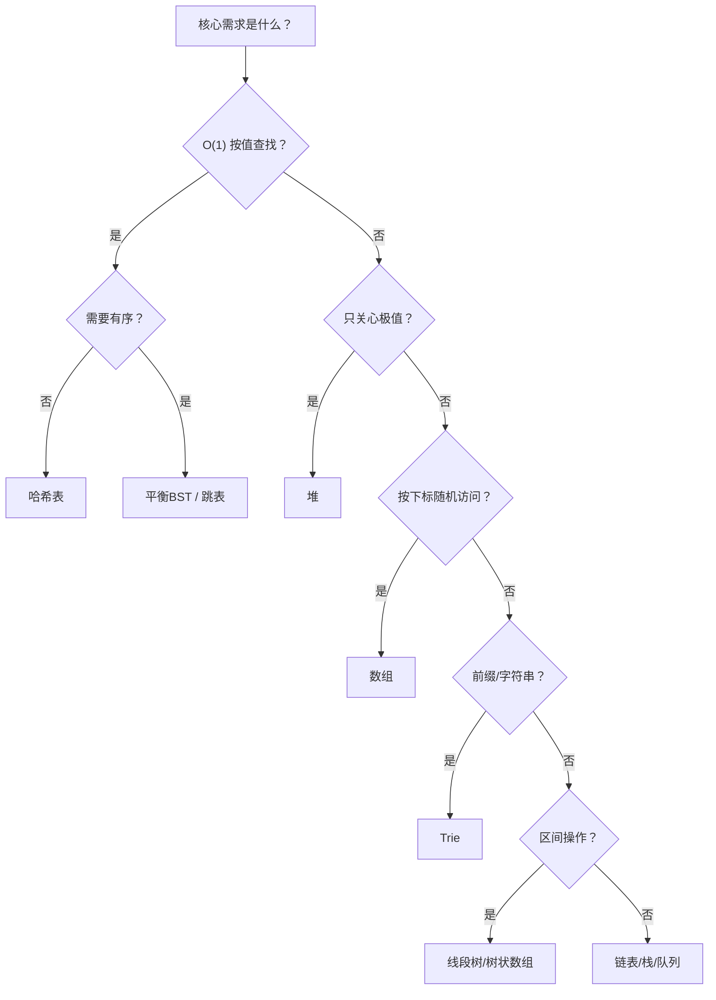

# 数据结构选型策略：什么场景用什么结构

## 一、为什么需要选型框架

面试和工程中最常见的错误不是"不会写代码"，而是**选错数据结构**——用数组做频繁查找，用链表做随机访问，用哈希表做范围查询。

本文提供一个**三步决策框架**：

```text
1. 列出核心操作（查/插/删/遍历/排序）
2. 确定操作频率和复杂度要求
3. 对照选型表匹配结构
```

## 二、核心结构操作复杂度总表

| 结构 | 按下标访问 | 按值查找 | 插入 | 删除 | 有序遍历 | 空间 |
|------|-----------|----------|------|------|----------|------|
| 数组 | O(1) | O(n) | O(n) 尾部O(1) | O(n) 尾部O(1) | 需排序 | 紧凑 |
| 链表 | O(n) | O(n) | O(1)* | O(1)* | 需排序 | 指针开销 |
| 哈希表 | — | O(1) 均摊 | O(1) 均摊 | O(1) 均摊 | ❌ 无序 | 较大 |
| BST（平衡） | O(log n) 排名 | O(log n) | O(log n) | O(log n) | ✅ O(n) | 中等 |
| 堆 | — | O(n) | O(log n) | 删除 O(log n)；取堆顶 O(1) | ❌ | 紧凑 |
| Trie | — | O(L) 前缀 | O(L) | O(L) | ✅ 字典序 | 大 |
| 跳表 | O(log n) 期望 | O(log n) 期望 | O(log n) | O(log n) | ✅ | 中等 |

*O(1) 指已持有节点引用时。

## 三、按需求场景选型

### 3.1 "需要 O(1) 查找"

→ **哈希表**

适用：判重、计数、两数之和、缓存 key 定位。

不适用：需要有序输出、范围查询、前缀匹配。

### 3.2 "需要有序 + 动态增删"

→ **平衡 BST**（Java TreeMap / C++ std::map）

适用：排行榜、滑动窗口中位数、区间查询。

面试手写场景：如果只需"插入时保持有序"，排序数组 + 二分也可。

### 3.3 "只要最大/最小值"

→ **堆（优先队列）**

适用：Top K、合并 K 个有序链表、Dijkstra、任务调度。

关键认知：堆不排序，只保证堆顶极值。需要全序输出时用 BST。

### 3.4 "先进先出 / 后进先出"

→ **队列 / 栈**

| 信号 | 结构 |
|------|------|
| BFS、层序遍历 | 队列 |
| DFS、括号匹配、撤销操作 | 栈 |
| 单调性 + 滑动窗口 | 单调队列/单调栈 |

### 3.5 "前缀匹配 / 字符串集合"

→ **Trie**

适用：自动补全、拼写检查、IP 路由、单词搜索 II。

### 3.6 "区间合并 / 动态连通"

→ **并查集**（连通性）/ **线段树**（区间修改查询）

| 需求 | 结构 |
|------|------|
| 只关心"是否连通" | 并查集 |
| 区间最值/求和 + 单点修改 | 树状数组 |
| 区间修改 + 区间查询 | 线段树（懒标记） |

### 3.7 "频繁头部插入删除 + O(1) 定位"

→ **哈希表 + 双向链表**（LRU 模式）

适用：缓存淘汰、O(1) 移动节点到头部。

## 四、决策流程图



## 五、面试高频"选型"题

| 题目 | 正确选型 | 陷阱 |
|------|----------|------|
| LC 146. LRU 缓存 | 哈希 + 双向链表 | 单链表删除 O(n) |
| LC 295. 数据流的中位数 | 大顶堆 + 小顶堆 | 排序数组插入 O(n) |
| LC 218. 天际线问题 | 有序集合 / 线段树 | 暴力扫描 O(n²) |
| LC 212. 单词搜索 II | Trie + DFS | 逐词 DFS 超时 |
| LC 347. 前 K 个高频元素 | 哈希计数 + 堆 | 全排序 O(n log n) |
| LC 715. Range Module | 有序区间集 / 线段树 | 数组标记 MLE |

## 六、工程选型补充：语言内置结构

| 需求 | Java | Python | TypeScript |
|------|------|--------|------------|
| 哈希表 | HashMap | dict | Map |
| 有序映射 | TreeMap | — (sortedcontainers) | — |
| 堆 | PriorityQueue | heapq | — (手写) |
| 双端队列 | ArrayDeque | deque | — (数组模拟) |
| 并查集 | 手写 | 手写 | 手写 |
| 有序集合 | TreeSet | SortedSet (三方) | — |

**注意**：TypeScript/JS 没有内置堆，面试需要手写（约 30 行）。

## 七、组合模式速查

复杂问题往往需要**结构组合**：

| 组合 | 解决的问题 | 经典题 |
|------|-----------|--------|
| 哈希 + 数组 | O(1) 增删 + 随机访问 | LC 380 |
| 哈希 + 双向链表 | O(1) 查找 + O(1) 移动 | LRU |
| 哈希 + 频率桶链表 | O(1) LFU | LC 460 |
| 双堆 | 动态中位数 | LC 295 |
| 哈希 + 单调栈 | 下一个更大元素 | LC 496 |
| Trie + DFS | 多模式串搜索 | LC 212 |

## 八、选型三问自查

做完题后问自己：

1. **我的结构能支撑最高频的操作吗？**（最高频操作必须是 O(1) 或 O(log n)）
2. **有没有多余的结构？**（两个结构维护同一信息 = bug 温床）
3. **边界情况结构还成立吗？**（空、单元素、全重复）

## 九、实战演练：从需求到结构的完整推理

**需求**：设计一个“实时热榜”，支持：插入文章+点赞数、点赞数动态增加、查询 Top 10。

```
第一步：列出核心操作与频率
  - 插入/更新点赞数：极高频（每次用户点赞）
  - 查询 Top 10：中频（用户刷新页面）

第二步：确定复杂度要求
  - 点赞必须 O(log n) 以内，不能每次全量排序 O(n log n)

第三步：对照选型表
  - “动态更新 + 取极值” → 堆或平衡 BST
  - 但需要按 key(文章) 定位并修改值 → 堆不支持按值修改！
  - → 平衡 BST（TreeMap: 分数 → 文章集）或 哈希+堆(懒删除)

结论：
  方案A：TreeMap<分数, Set<文章>>，点赞 = 旧分数移除+新分数插入，O(log n)
  方案B：哈希<文章,分数> + 大顶堆(懒删除)，查询时弹出过期项
```

**关键教训**：选型不是背表，而是先明确“哪个操作最高频”，再验证候选结构能否支撑它。

## 十、思考题

1. LC 295 用双堆求中位数，如果改为“每次查询时排序”，总复杂度是多少？为什么不可取？（提示：插入 O(1) 但查询 O(n log n)）
2. 为什么 Redis 的有序集合用跳表而不用红黑树？（提示：范围查询、实现复杂度、并发友好）
3. 如果题目要求“O(1) 插入 + O(1) 随机访问 + O(1) 等概率随机删除”，应该用哪两个结构组合？（提示：哈希 + 数组，LC 380）

> 练习推荐：在练习题模块完成 [前 K 个高频元素](/problems/top-k-frequent)（哈希+堆组合）后，再尝试 LRU（LC 146）与 LFU（LC 460）验证组合结构能力。
