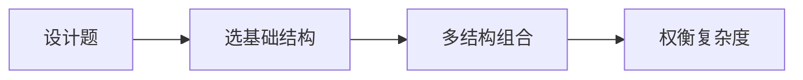

# 设计数据结构：面试高频设计题


## 一、为什么考设计题？



面试中的"设计数据结构"题考查：
1. **组合多种基础结构**实现复杂功能
2. **权衡时间复杂度**（空间换时间）
3. **API 设计能力**（接口清晰、边界处理）

> 核心思路：没有万能结构，只有**组合**。哈希表 + 链表、哈希表 + 堆、数组 + 哈希...

## 二、经典设计题

### 2.1 LRU 缓存（哈希表 + 双向链表）

已在 [LRU 缓存](/tutorials/lru-cache) 中详解。核心：

```java tab
class LRUCache {
    private int capacity;
    private Map<Integer, Node> map;
    private Node head, tail;   // 虚拟头尾

    public int get(int key) { /* 查找 + 移到头部 */ }
    public void put(int key, int value) { /* 插入/更新 + 淘汰尾部 */ }
}
```

```typescript tab
class LRUCache {
    private capacity: number;
    private cache = new Map<number, number>();

    get(key: number): number { /* 查找 + 移到头部 */ }
    put(key: number, value: number): void { /* 插入/更新 + 淘汰尾部 */ }
}
```

```python tab
class LRUCache:
    def __init__(self, capacity: int):
        self.capacity = capacity
        self.cache = OrderedDict()

    def get(self, key: int) -> int: ...  # 查找 + 移到头部
    def put(self, key: int, value: int) -> None: ...  # 插入/更新 + 淘汰尾部
```

- get/put 均 O(1)

### 2.2 LFU 缓存（双哈希 + 双向链表）

**问题**：淘汰使用频率最低的，频率相同淘汰最久未使用的。

```java tab
class LFUCache {
    private int capacity, minFreq;
    private Map<Integer, Node> keyMap;          // key → 节点
    private Map<Integer, LinkedHashSet<Node>> freqMap;  // freq → 节点集合

    public int get(int key) {
        if (!keyMap.containsKey(key)) return -1;
        Node node = keyMap.get(key);
        increaseFreq(node);
        return node.val;
    }

    public void put(int key, int value) {
        if (capacity == 0) return;
        if (keyMap.containsKey(key)) {
            Node node = keyMap.get(key);
            node.val = value;
            increaseFreq(node);
            return;
        }
        if (keyMap.size() >= capacity) {
            // 淘汰 minFreq 中最旧的
            LinkedHashSet<Node> set = freqMap.get(minFreq);
            Node evict = set.iterator().next();
            set.remove(evict);
            keyMap.remove(evict.key);
        }
        Node newNode = new Node(key, value, 1);
        keyMap.put(key, newNode);
        freqMap.computeIfAbsent(1, k -> new LinkedHashSet<>()).add(newNode);
        minFreq = 1;
    }

    private void increaseFreq(Node node) {
        int oldFreq = node.freq;
        freqMap.get(oldFreq).remove(node);
        if (freqMap.get(oldFreq).isEmpty() && oldFreq == minFreq) minFreq++;
        node.freq++;
        freqMap.computeIfAbsent(node.freq, k -> new LinkedHashSet<>()).add(node);
    }
}
```

```typescript tab
class LFUCache {
    private capacity: number;
    private minFreq = 0;
    private keyMap = new Map<number, { val: number; freq: number }>();
    private freqMap = new Map<number, Set<number>>();

    constructor(capacity: number) { this.capacity = capacity; }

    get(key: number): number {
        if (!this.keyMap.has(key)) return -1;
        const node = this.keyMap.get(key)!;
        this.increaseFreq(key, node);
        return node.val;
    }

    put(key: number, value: number): void {
        if (this.capacity === 0) return;
        if (this.keyMap.has(key)) {
            const node = this.keyMap.get(key)!;
            node.val = value;
            this.increaseFreq(key, node);
            return;
        }
        if (this.keyMap.size >= this.capacity) {
            const set = this.freqMap.get(this.minFreq)!;
            const evict = set.values().next().value;
            set.delete(evict);
            this.keyMap.delete(evict);
        }
        this.keyMap.set(key, { val: value, freq: 1 });
        if (!this.freqMap.has(1)) this.freqMap.set(1, new Set());
        this.freqMap.get(1)!.add(key);
        this.minFreq = 1;
    }

    private increaseFreq(key: number, node: { val: number; freq: number }): void {
        const oldFreq = node.freq;
        this.freqMap.get(oldFreq)!.delete(key);
        if (this.freqMap.get(oldFreq)!.size === 0 && oldFreq === this.minFreq) this.minFreq++;
        node.freq++;
        if (!this.freqMap.has(node.freq)) this.freqMap.set(node.freq, new Set());
        this.freqMap.get(node.freq)!.add(key);
    }
}
```

```python tab
class LFUCache:
    def __init__(self, capacity: int):
        self.capacity = capacity
        self.min_freq = 0
        self.key_map = {}  # key -> (val, freq)
        self.freq_map = defaultdict(OrderedDict)

    def get(self, key: int) -> int:
        if key not in self.key_map:
            return -1
        val, freq = self.key_map[key]
        self._increase_freq(key, val, freq)
        return val

    def put(self, key: int, value: int) -> None:
        if self.capacity == 0:
            return
        if key in self.key_map:
            _, freq = self.key_map[key]
            self._increase_freq(key, value, freq)
            return
        if len(self.key_map) >= self.capacity:
            evict_key, _ = self.freq_map[self.min_freq].popitem(last=False)
            del self.key_map[evict_key]
        self.key_map[key] = (value, 1)
        self.freq_map[1][key] = value
        self.min_freq = 1

    def _increase_freq(self, key, val, freq):
        del self.freq_map[freq][key]
        if not self.freq_map[freq] and freq == self.min_freq:
            self.min_freq += 1
        self.key_map[key] = (val, freq + 1)
        self.freq_map[freq + 1][key] = val
```

### 2.3 最小栈（辅助栈）

```java tab
class MinStack {
    private Deque<Integer> stack = new ArrayDeque<>();
    private Deque<Integer> minStack = new ArrayDeque<>();

    public void push(int val) {
        stack.push(val);
        minStack.push(minStack.isEmpty() ? val : Math.min(val, minStack.peek()));
    }

    public void pop() { stack.pop(); minStack.pop(); }
    public int top() { return stack.peek(); }
    public int getMin() { return minStack.peek(); }
}
```

```typescript tab
class MinStack {
    private stack: number[] = [];
    private minStack: number[] = [];

    push(val: number): void {
        this.stack.push(val);
        this.minStack.push(
            this.minStack.length === 0 ? val : Math.min(val, this.minStack[this.minStack.length - 1])
        );
    }

    pop(): void { this.stack.pop(); this.minStack.pop(); }
    top(): number { return this.stack[this.stack.length - 1]; }
    getMin(): number { return this.minStack[this.minStack.length - 1]; }
}
```

```python tab
class MinStack:
    def __init__(self):
        self.stack = []
        self.min_stack = []

    def push(self, val: int) -> None:
        self.stack.append(val)
        self.min_stack.append(val if not self.min_stack else min(val, self.min_stack[-1]))

    def pop(self) -> None:
        self.stack.pop()
        self.min_stack.pop()

    def top(self) -> int:
        return self.stack[-1]

    def get_min(self) -> int:
        return self.min_stack[-1]
```

### 2.4 用栈实现队列

```java tab
class MyQueue {
    private Deque<Integer> in = new ArrayDeque<>();
    private Deque<Integer> out = new ArrayDeque<>();

    public void push(int x) { in.push(x); }

    public int pop() {
        if (out.isEmpty()) transfer();
        return out.pop();
    }

    public int peek() {
        if (out.isEmpty()) transfer();
        return out.peek();
    }

    private void transfer() {
        while (!in.isEmpty()) out.push(in.pop());
    }
}
```

```typescript tab
class MyQueue {
    private inStack: number[] = [];
    private outStack: number[] = [];

    push(x: number): void { this.inStack.push(x); }

    pop(): number {
        if (this.outStack.length === 0) this.transfer();
        return this.outStack.pop()!;
    }

    peek(): number {
        if (this.outStack.length === 0) this.transfer();
        return this.outStack[this.outStack.length - 1];
    }

    private transfer(): void {
        while (this.inStack.length > 0) this.outStack.push(this.inStack.pop()!);
    }
}
```

```python tab
class MyQueue:
    def __init__(self):
        self.in_stack = []
        self.out_stack = []

    def push(self, x: int) -> None:
        self.in_stack.append(x)

    def pop(self) -> int:
        if not self.out_stack:
            self._transfer()
        return self.out_stack.pop()

    def peek(self) -> int:
        if not self.out_stack:
            self._transfer()
        return self.out_stack[-1]

    def _transfer(self) -> None:
        while self.in_stack:
            self.out_stack.append(self.in_stack.pop())
```

- 均摊 O(1)：每个元素最多被转移一次

### 2.5 数据流的中位数（双堆）

```java tab
class MedianFinder {
    private PriorityQueue<Integer> maxHeap = new PriorityQueue<>(Collections.reverseOrder());
    private PriorityQueue<Integer> minHeap = new PriorityQueue<>();

    public void addNum(int num) {
        maxHeap.offer(num);
        minHeap.offer(maxHeap.poll());
        if (minHeap.size() > maxHeap.size()) {
            maxHeap.offer(minHeap.poll());
        }
    }

    public double findMedian() {
        if (maxHeap.size() > minHeap.size()) return maxHeap.peek();
        return (maxHeap.peek() + minHeap.peek()) / 2.0;
    }
}
```

```typescript tab
class MedianFinder {
    private lo = new MaxPriorityQueue();
    private hi = new MinPriorityQueue();

    addNum(num: number): void {
        this.lo.enqueue(num);
        this.hi.enqueue(this.lo.dequeue().element);
        if (this.hi.size() > this.lo.size()) {
            this.lo.enqueue(this.hi.dequeue().element);
        }
    }

    findMedian(): number {
        if (this.lo.size() > this.hi.size()) return this.lo.front().element;
        return (this.lo.front().element + this.hi.front().element) / 2;
    }
}
```

```python tab
class MedianFinder:
    def __init__(self):
        self.lo = []  # 大顶堆（取反）
        self.hi = []  # 小顶堆

    def addNum(self, num: int) -> None:
        heapq.heappush(self.lo, -num)
        heapq.heappush(self.hi, -heapq.heappop(self.lo))
        if len(self.hi) > len(self.lo):
            heapq.heappush(self.lo, -heapq.heappop(self.hi))

    def findMedian(self) -> float:
        if len(self.lo) > len(self.hi):
            return -self.lo[0]
        return (-self.lo[0] + self.hi[0]) / 2
```

- addNum：O(log n)，findMedian：O(1)

### 2.6 前缀树（Trie）

```java tab
class Trie {
    private Trie[] children = new Trie[26];
    private boolean isEnd;

    public void insert(String word) {
        Trie node = this;
        for (char c : word.toCharArray()) {
            int idx = c - 'a';
            if (node.children[idx] == null) node.children[idx] = new Trie();
            node = node.children[idx];
        }
        node.isEnd = true;
    }

    public boolean search(String word) {
        Trie node = searchPrefix(word);
        return node != null && node.isEnd;
    }

    public boolean startsWith(String prefix) {
        return searchPrefix(prefix) != null;
    }

    private Trie searchPrefix(String s) {
        Trie node = this;
        for (char c : s.toCharArray()) {
            int idx = c - 'a';
            if (node.children[idx] == null) return null;
            node = node.children[idx];
        }
        return node;
    }
}
```

```typescript tab
class Trie {
    private children: (Trie | null)[] = new Array(26).fill(null);
    private isEnd = false;

    insert(word: string): void {
        let node: Trie = this;
        for (const c of word) {
            const idx = c.charCodeAt(0) - 97;
            if (!node.children[idx]) node.children[idx] = new Trie();
            node = node.children[idx]!;
        }
        node.isEnd = true;
    }

    search(word: string): boolean {
        const node = this.searchPrefix(word);
        return node !== null && node.isEnd;
    }

    startsWith(prefix: string): boolean {
        return this.searchPrefix(prefix) !== null;
    }

    private searchPrefix(s: string): Trie | null {
        let node: Trie = this;
        for (const c of s) {
            const idx = c.charCodeAt(0) - 97;
            if (!node.children[idx]) return null;
            node = node.children[idx]!;
        }
        return node;
    }
}
```

```python tab
class Trie:
    def __init__(self):
        self.children = [None] * 26
        self.is_end = False

    def insert(self, word: str) -> None:
        node = self
        for c in word:
            idx = ord(c) - ord('a')
            if node.children[idx] is None:
                node.children[idx] = Trie()
            node = node.children[idx]
        node.is_end = True

    def search(self, word: str) -> bool:
        node = self._search_prefix(word)
        return node is not None and node.is_end

    def starts_with(self, prefix: str) -> bool:
        return self._search_prefix(prefix) is not None

    def _search_prefix(self, s: str) -> 'Trie | None':
        node = self
        for c in s:
            idx = ord(c) - ord('a')
            if node.children[idx] is None:
                return None
            node = node.children[idx]
        return node
```

## 三、设计题的思路框架

| 步骤 | 内容 |
|------|------|
| 1. 明确操作 | 列出所有 API 及其期望复杂度 |
| 2. 选基础结构 | 哈希表（O(1)查找）+ 有序结构（链表/堆） |
| 3. 设计关联 | 结构之间如何互相引用 |
| 4. 处理边界 | 容量满、key 不存在、空结构 |

### 常见组合模式

| 需求 | 组合 |
|------|------|
| O(1) 查找 + O(1) 删除 | 哈希表 + 双向链表 |
| O(1) 查找 + 有序 | 哈希表 + 跳表/平衡树 |
| 动态最值 | 堆（优先队列） |
| 前缀匹配 | Trie |
| 区间查询 | 线段树 / 树状数组 |

## 四、面试常见题

- 🟢 最小栈、用栈实现队列、用队列实现栈
- 🟡 LRU 缓存、数据流中位数、前缀树
- 🟠 LFU 缓存、全 O(1) 数据结构、随机化集合
- 🔴 最大频率栈、范围模块、序列化二叉树

## 五、调试技巧

1. **画图**：双向链表操作必须画图，标注指针变化顺序。
2. **虚拟节点**：链表加 dummy head/tail 避免空判断。
3. **一致性**：多个结构必须同步更新（如 map 和链表）。
4. **容量检查**：put 之前先判断是否需要淘汰。
