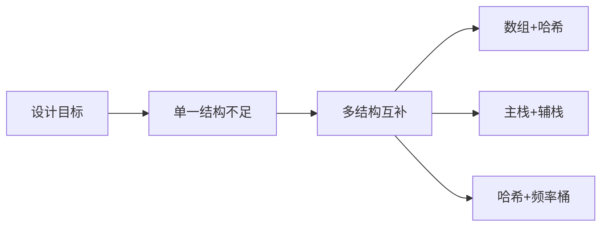

# 构造与设计专题：O(1) 数据结构设计

## 一、设计题的考察本质

面试设计题不考"背 API"，考的是**组合基础结构达成目标复杂度**的能力。核心思路：

> 单一结构无法满足所有操作的复杂度要求时，用**多个结构互补**。

| 题目 | 目标 | 结构组合 |
|------|------|----------|
| LC 380. O(1) 插入/删除/随机获取 | 三个操作均 O(1) | 数组 + 哈希表 |
| LC 155. 最小栈 | push/pop/min 均 O(1) | 主栈 + 辅助栈 |
| LC 460. LFU 缓存 | get/put O(1) | 哈希表 + 频率桶双向链表 |
| LC 232. 用栈实现队列 | 均摊 O(1) | 双栈 |
| LC 225. 用队列实现栈 | 单队列 O(1) push | 队列重排 |



## 二、LC 380：O(1) 时间插入、删除和获取随机元素

### 2.1 难点分析

- 数组：O(1) 随机访问、O(1) 尾部插入，但删除 O(n)
- 哈希表：O(1) 插入删除，但无法随机访问

**组合方案**：数组存值 + 哈希表存「值→数组下标」。删除时把目标元素和**末尾元素交换**，然后弹出末尾。

### 2.2 完整实现

```java tab
class RandomizedSet {
    private List<Integer> nums = new ArrayList<>();
    private Map<Integer, Integer> indexMap = new HashMap<>();
    private Random rand = new Random();

    public boolean insert(int val) {
        if (indexMap.containsKey(val)) return false;
        indexMap.put(val, nums.size());
        nums.add(val);
        return true;
    }

    public boolean remove(int val) {
        Integer idx = indexMap.get(val);
        if (idx == null) return false;

        // 与末尾交换
        int last = nums.get(nums.size() - 1);
        nums.set(idx, last);
        indexMap.put(last, idx);

        nums.remove(nums.size() - 1);
        indexMap.remove(val);
        return true;
    }

    public int getRandom() {
        return nums.get(rand.nextInt(nums.size()));
    }
}
```

```typescript tab
class RandomizedSet {
    private nums: number[] = [];
    private indexMap = new Map<number, number>();

    insert(val: number): boolean {
        if (this.indexMap.has(val)) return false;
        this.indexMap.set(val, this.nums.length);
        this.nums.push(val);
        return true;
    }

    remove(val: number): boolean {
        const idx = this.indexMap.get(val);
        if (idx === undefined) return false;

        const last = this.nums[this.nums.length - 1];
        this.nums[idx] = last;
        this.indexMap.set(last, idx);

        this.nums.pop();
        this.indexMap.delete(val);
        return true;
    }

    getRandom(): number {
        return this.nums[Math.floor(Math.random() * this.nums.length)];
    }
}
```

```python tab
import random

class RandomizedSet:
    def __init__(self):
        self.nums = []
        self.index_map = {}

    def insert(self, val: int) -> bool:
        if val in self.index_map:
            return False
        self.index_map[val] = len(self.nums)
        self.nums.append(val)
        return True

    def remove(self, val: int) -> bool:
        if val not in self.index_map:
            return False
        idx = self.index_map[val]
        last = self.nums[-1]
        self.nums[idx] = last
        self.index_map[last] = idx
        self.nums.pop()
        del self.index_map[val]
        return True

    def getRandom(self) -> int:
        return random.choice(self.nums)
```

**关键细节**：删除时若目标就是末尾元素，交换操作退化为直接弹出，逻辑仍然正确。

## 三、LC 155：最小栈

### 3.1 思路

辅助栈与主栈同步，辅助栈栈顶始终是当前主栈的最小值。

```typescript tab
class MinStack {
    private stack: number[] = [];
    private minStack: number[] = [];

    push(val: number): void {
        this.stack.push(val);
        this.minStack.push(
            this.minStack.length === 0
                ? val
                : Math.min(val, this.minStack[this.minStack.length - 1])
        );
    }

    pop(): void {
        this.stack.pop();
        this.minStack.pop();
    }

    top(): number {
        return this.stack[this.stack.length - 1];
    }

    getMin(): number {
        return this.minStack[this.minStack.length - 1];
    }
}
```

```java tab
class MinStack {
    private Deque<Integer> stack = new ArrayDeque<>();
    private Deque<Integer> minStack = new ArrayDeque<>();

    public void push(int val) {
        stack.push(val);
        minStack.push(minStack.isEmpty() ? val : Math.min(val, minStack.peek()));
    }

    public void pop() {
        stack.pop();
        minStack.pop();
    }

    public int top() { return stack.peek(); }
    public int getMin() { return minStack.peek(); }
}
```

**优化**：辅助栈只在新最小值出现时入栈（但要处理重复最小值的弹出问题）。

## 四、LC 460：LFU 缓存

### 4.1 与 LRU 的区别

| 策略 | 淘汰依据 | 结构 |
|------|----------|------|
| LRU | 最久未使用 | 哈希 + 双向链表 |
| LFU | 使用频率最低（同频取最旧） | 哈希 + 频率桶链表 |

### 4.2 数据结构设计

```text
keyToNode: Map<key, Node>         // O(1) 定位节点
freqToList: Map<freq, DoublyList> // 每个频率一个双向链表
minFreq: number                   // 当前最低频率（淘汰用）
```

### 4.3 完整实现

```typescript tab
class Node {
    key: number; val: number; freq: number;
    prev: Node | null = null; next: Node | null = null;
    constructor(key: number, val: number) {
        this.key = key; this.val = val; this.freq = 1;
    }
}

class DoublyList {
    head = new Node(0, 0);
    tail = new Node(0, 0);
    size = 0;
    constructor() { this.head.next = this.tail; this.tail.prev = this.head; }

    addToHead(node: Node) {
        node.next = this.head.next;
        node.prev = this.head;
        this.head.next!.prev = node;
        this.head.next = node;
        this.size++;
    }
    remove(node: Node) {
        node.prev!.next = node.next;
        node.next!.prev = node.prev;
        this.size--;
    }
    removeLast(): Node | null {
        if (this.size === 0) return null;
        const last = this.tail.prev!;
        this.remove(last);
        return last;
    }
}

class LFUCache {
    private capacity: number;
    private minFreq = 0;
    private keyToNode = new Map<number, Node>();
    private freqToList = new Map<number, DoublyList>();

    constructor(capacity: number) { this.capacity = capacity; }

    get(key: number): number {
        const node = this.keyToNode.get(key);
        if (!node) return -1;
        this.touch(node);
        return node.val;
    }

    put(key: number, value: number): void {
        if (this.capacity <= 0) return;
        const existing = this.keyToNode.get(key);
        if (existing) {
            existing.val = value;
            this.touch(existing);
            return;
        }
        if (this.keyToNode.size >= this.capacity) {
            const list = this.freqToList.get(this.minFreq)!;
            const evicted = list.removeLast()!;
            this.keyToNode.delete(evicted.key);
        }
        const node = new Node(key, value);
        this.keyToNode.set(key, node);
        if (!this.freqToList.has(1)) this.freqToList.set(1, new DoublyList());
        this.freqToList.get(1)!.addToHead(node);
        this.minFreq = 1;
    }

    private touch(node: Node) {
        const oldList = this.freqToList.get(node.freq)!;
        oldList.remove(node);
        if (node.freq === this.minFreq && oldList.size === 0) this.minFreq++;
        node.freq++;
        if (!this.freqToList.has(node.freq)) this.freqToList.set(node.freq, new DoublyList());
        this.freqToList.get(node.freq)!.addToHead(node);
    }
}
```

**复杂度**：get/put 均 O(1)。

## 五、LC 232：用栈实现队列

双栈：输入栈 + 输出栈。输出栈空时把输入栈全部倒入：

```typescript tab
class MyQueue {
    private inStack: number[] = [];
    private outStack: number[] = [];

    push(x: number): void { this.inStack.push(x); }

    pop(): number {
        this.peek();
        return this.outStack.pop()!;
    }

    peek(): number {
        if (this.outStack.length === 0) {
            while (this.inStack.length > 0) {
                this.outStack.push(this.inStack.pop()!);
            }
        }
        return this.outStack[this.outStack.length - 1];
    }

    empty(): boolean {
        return this.inStack.length === 0 && this.outStack.length === 0;
    }
}
```

**均摊分析**：每个元素最多被倒一次，均摊 O(1)。

## 六、LC 225：用队列实现栈

单队列：每次 push 后，把之前的元素全部重新排到新元素后面：

```typescript tab
class MyStack {
    private queue: number[] = [];

    push(x: number): void {
        this.queue.push(x);
        const size = this.queue.length;
        for (let i = 0; i < size - 1; i++) {
            this.queue.push(this.queue.shift()!);
        }
    }

    pop(): number { return this.queue.shift()!; }
    top(): number { return this.queue[0]; }
    empty(): boolean { return this.queue.length === 0; }
}
```

## 七、设计题思维框架

遇到设计题按以下步骤思考：

| 步骤 | 问题 |
|------|------|
| 1. 列操作 | 每个操作的目标复杂度是什么？ |
| 2. 找矛盾 | 哪个操作用单一结构达不到？ |
| 3. 组合结构 | 用什么辅助结构弥补？ |
| 4. 定同步规则 | 两个结构之间何时同步、谁为准？ |
| 5. 验证边界 | 空结构、重复元素、容量满 |

## 八、面试常见题

- 🟡 LC 380. O(1) 时间插入、删除和获取随机元素
- 🟢 LC 155. 最小栈
- 🔴 LC 460. LFU 缓存
- 🟡 LC 146. LRU 缓存（超高频）
- 🟢 LC 232. 用栈实现队列
- 🟢 LC 225. 用队列实现栈
- 🟡 LC 341. 扁平化嵌套列表迭代器
- 🟡 LC 381. O(1) 时间插入、删除和获取随机元素（允许重复）

## 九、易错点

1. **RandomizedSet 删除忘记更新 indexMap**：交换后末尾元素的下标变了。
2. **LFU 的 minFreq 更新**：只在旧频率链表变空且是当前 minFreq 时才 +1。
3. **双栈队列在 pop/peek 时才倒入**：不能每次 push 都倒（破坏顺序）。
4. **LFU put 已有 key 时**：更新值 + 频率提升，不占新容量。
