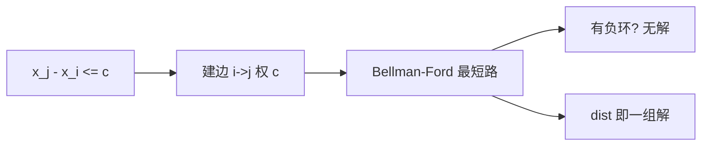

# 差分约束系统

差分约束系统将一组形如 xⱼ - xᵢ ≤ c 的不等式转化为图上的最短路问题，用 Bellman-Ford 或 SPFA 判定可行性并求出一组解。

## 一、问题形式



给定 n 个变量 x₁, x₂, ..., xₙ 和 m 个约束：

```
xⱼ - xᵢ ≤ cₖ
```

问是否存在一组满足所有约束的解。

## 二、转化为最短路

约束 xⱼ - xᵢ ≤ c 等价于：

```
dist[j] ≤ dist[i] + c
```

这正是最短路松弛条件！因此：
- 从 i 向 j 连一条权为 c 的边
- 如果图有负环 → 无解
- 否则 dist[] 就是一组合法解

### 建图规则

| 约束 | 建边 |
|------|------|
| xⱼ - xᵢ ≤ c | i → j，权 c |
| xⱼ - xᵢ ≥ c | 转化为 xᵢ - xⱼ ≤ -c，j → i，权 -c |
| xⱼ = xᵢ | xⱼ-xᵢ≤0 且 xᵢ-xⱼ≤0 |

## 三、代码实现

```java tab
// 差分约束：求 x[n] - x[1] 的最大值
// 约束：x[b] - x[a] <= c
public boolean solve(int n, int[][] constraints) {
    // 建图
    List<int[]>[] adj = new ArrayList[n + 1];
    for (int i = 0; i <= n; i++) adj[i] = new ArrayList<>();

    for (int[] con : constraints) {
        int a = con[0], b = con[1], c = con[2];
        adj[a].add(new int[]{b, c}); // a → b, 权 c
    }

    // 超级源点 0 → 所有点，权 0（保证连通）
    for (int i = 1; i <= n; i++) {
        adj[0].add(new int[]{i, 0});
    }

    // Bellman-Ford / SPFA 判负环
    int[] dist = new int[n + 1];
    Arrays.fill(dist, Integer.MAX_VALUE / 2);
    dist[0] = 0;

    for (int round = 0; round <= n; round++) {
        boolean updated = false;
        for (int u = 0; u <= n; u++) {
            if (dist[u] == Integer.MAX_VALUE / 2) continue;
            for (int[] edge : adj[u]) {
                int v = edge[0], w = edge[1];
                if (dist[v] > dist[u] + w) {
                    dist[v] = dist[u] + w;
                    updated = true;
                    if (round == n) return false; // 负环 → 无解
                }
            }
        }
        if (!updated) break;
    }
    return true; // dist[] 是一组解
}
```

```typescript tab
// 差分约束：求 x[n] - x[1] 的最大值
// 约束：x[b] - x[a] <= c
function solve(n: number, constraints: number[][]): boolean {
    // 建图
    const adj: [number, number][][] = Array.from({ length: n + 1 }, () => []);

    for (const [a, b, c] of constraints) {
        adj[a].push([b, c]); // a → b, 权 c
    }

    // 超级源点 0 → 所有点，权 0（保证连通）
    for (let i = 1; i <= n; i++) {
        adj[0].push([i, 0]);
    }

    // Bellman-Ford 判负环
    const dist = new Array(n + 1).fill(Infinity);
    dist[0] = 0;

    for (let round = 0; round <= n; round++) {
        let updated = false;
        for (let u = 0; u <= n; u++) {
            if (dist[u] === Infinity) continue;
            for (const [v, w] of adj[u]) {
                if (dist[v] > dist[u] + w) {
                    dist[v] = dist[u] + w;
                    updated = true;
                    if (round === n) return false; // 负环 → 无解
                }
            }
        }
        if (!updated) break;
    }
    return true; // dist[] 是一组解
}
```

```python tab
# 差分约束：求 x[n] - x[1] 的最大值
# 约束：x[b] - x[a] <= c
def solve(n: int, constraints: list) -> bool:
    # 建图
    adj = [[] for _ in range(n + 1)]

    for a, b, c in constraints:
        adj[a].append((b, c))  # a → b, 权 c

    # 超级源点 0 → 所有点，权 0（保证连通）
    for i in range(1, n + 1):
        adj[0].append((i, 0))

    # Bellman-Ford 判负环
    INF = float('inf')
    dist = [INF] * (n + 1)
    dist[0] = 0

    for round in range(n + 1):
        updated = False
        for u in range(n + 1):
            if dist[u] == INF:
                continue
            for v, w in adj[u]:
                if dist[v] > dist[u] + w:
                    dist[v] = dist[u] + w
                    updated = True
                    if round == n:
                        return False  # 负环 → 无解
        if not updated:
            break
    return True  # dist[] 是一组解
```

## 四、SPFA 判负环（更高效）

```java tab
boolean spfa(int n, List<int[]>[] adj) {
    int[] dist = new int[n + 1];
    int[] count = new int[n + 1]; // 入队次数
    boolean[] inQueue = new boolean[n + 1];
    Queue<Integer> q = new LinkedList<>();

    q.offer(0); inQueue[0] = true;
    while (!q.isEmpty()) {
        int u = q.poll(); inQueue[u] = false;
        for (int[] edge : adj[u]) {
            int v = edge[0], w = edge[1];
            if (dist[v] > dist[u] + w) {
                dist[v] = dist[u] + w;
                count[v]++;
                if (count[v] > n) return false; // 负环
                if (!inQueue[v]) { q.offer(v); inQueue[v] = true; }
            }
        }
    }
    return true;
}
```

```typescript tab
function spfa(n: number, adj: [number, number][][]): boolean {
    const dist = new Array(n + 1).fill(0);
    const count = new Array(n + 1).fill(0); // 入队次数
    const inQueue = new Array(n + 1).fill(false);
    const q: number[] = [];

    q.push(0); inQueue[0] = true;
    while (q.length > 0) {
        const u = q.shift()!; inQueue[u] = false;
        for (const [v, w] of adj[u]) {
            if (dist[v] > dist[u] + w) {
                dist[v] = dist[u] + w;
                count[v]++;
                if (count[v] > n) return false; // 负环
                if (!inQueue[v]) { q.push(v); inQueue[v] = true; }
            }
        }
    }
    return true;
}
```

```python tab
from collections import deque

def spfa(n: int, adj: list) -> bool:
    dist = [0] * (n + 1)
    count = [0] * (n + 1)  # 入队次数
    in_queue = [False] * (n + 1)
    q = deque()

    q.append(0)
    in_queue[0] = True
    while q:
        u = q.popleft()
        in_queue[u] = False
        for v, w in adj[u]:
            if dist[v] > dist[u] + w:
                dist[v] = dist[u] + w
                count[v] += 1
                if count[v] > n:
                    return False  # 负环
                if not in_queue[v]:
                    q.append(v)
                    in_queue[v] = True
    return True
```

## 五、经典例题

### LeetCode 2589：完成所有任务的最少时间

转化为前缀和差分约束：
- S[i] = 前 i 个时间单位中被选中的数量
- S[b] - S[a-1] ≥ k → S[a-1] - S[b] ≤ -k
- 0 ≤ S[i] - S[i-1] ≤ 1

### 区间选点问题

在数轴上选最少的点，使每个区间 [aᵢ, bᵢ] 至少含 cᵢ 个点。

## 六、最短路 vs 最长路

| 目标 | 转化 | 算法 |
|------|------|------|
| xⱼ - xᵢ ≤ c（求最大值） | 最短路 | Bellman-Ford |
| xⱼ - xᵢ ≥ c（求最小值） | 最长路（或取反变最短路） | SPFA |

## 七、面试要点

1. **核心转化**：xⱼ - xᵢ ≤ c → 边 i→j 权 c → 最短路
2. **负环 = 无解**：约束矛盾
3. **超级源点**：保证所有点可达
4. **前缀和建模**：区间约束 → 前缀和变量的差分
5. **LeetCode**：2589、1057（校园自行车分配，思想类似）
