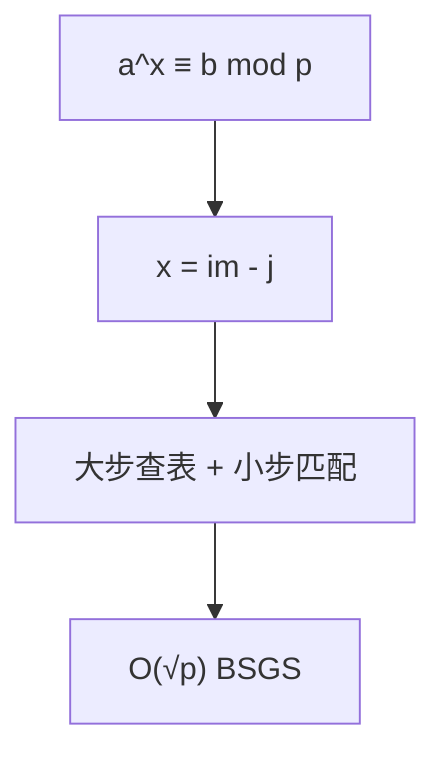

# 离散对数（Discrete Logarithm, BSGS）

## 一、为什么学离散对数？



解 `a^x ≡ b (mod p)` 求最小非负整数 x。应用：

- 密码学（Diffie–Hellman、ElGamal）
- 指数循环节化简
- 与原根配合：把乘法群映射成下标运算

## 二、大步小步法（BSGS）

令 `m = ⌈√p⌉`，`x = i·m − j`（0≤i,j<m）：
`a^(i·m) ≡ b·a^j (mod p)`，两边查哈希表相遇即得解。

```java tab
int bsgs(int a, int b, int p) {
    a %= p; b %= p;
    if (b == 1) return 0;
    int m = (int) Math.sqrt(p) + 1;
    HashMap<Integer, Integer> table = new HashMap<>();
    long e = 1;
    for (int j = 0; j < m; j++) {
        table.put((int) e, j);
        e = e * a % p;
    }
    long am = pow(a, m, p);
    long cur = b;
    for (int i = 0; i <= m; i++) {
        if (table.containsKey((int) cur)) {
            int j = table.get((int) cur);
            int x = i * m - j;
            if (x >= 0) return x;
        }
        cur = cur * am % p;
    }
    return -1; // 无解
}
```

```typescript tab
function bsgs(a: number, b: number, p: number): number {
    a %= p; b %= p;
    if (b === 1) return 0;
    const m = Math.floor(Math.sqrt(p)) + 1;
    const table = new Map<number, number>();
    let e = 1;
    for (let j = 0; j < m; j++) { table.set(e, j); e = e * a % p; }
    const am = pow(a, m, p);
    let cur = b;
    for (let i = 0; i <= m; i++) {
        if (table.has(cur)) {
            const j = table.get(cur)!;
            const x = i * m - j;
            if (x >= 0) return x;
        }
        cur = cur * am % p;
    }
    return -1;
}
```

```python tab
def bsgs(a, b, p):
    a %= p; b %= p
    if b == 1:
        return 0
    m = int(p ** 0.5) + 1
    table = {}
    e = 1
    for j in range(m):
        table[e] = j
        e = e * a % p
    am = pow(a, m, p)
    cur = b
    for i in range(m + 1):
        if cur in table:
            x = i * m - table[cur]
            if x >= 0:
                return x
        cur = cur * am % p
    return -1
```

## 三、扩展 BSGS

当 `gcd(a, p) ≠ 1` 时，先约去公因子 `a^k`，再对剩余部分 BSGS。

## 四、复杂度

| 项目 | 复杂度 |
|------|--------|
| BSGS | O(√p) 时间，O(√p) 空间 |

## 五、面试要点

1. `x = i·m − j` 把指数拆成两块查表
2. p 非素数需扩展 BSGS（约去 gcd）
3. 与 Pohlig–Hellman 配合可加速（p-1 平滑时）
