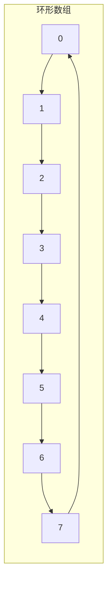
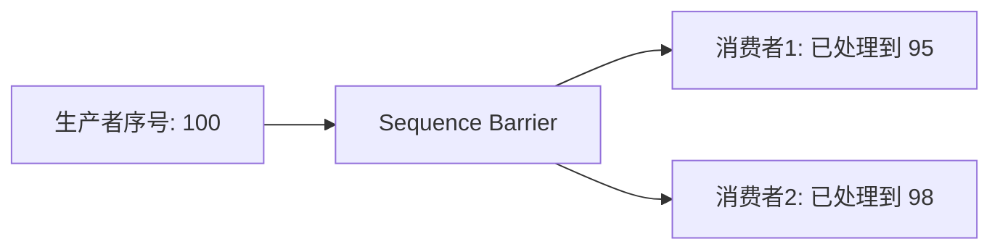

# 算法实战：高性能队列 Disruptor


## 一、问题背景

在高性能系统中（交易系统、日志收集、消息中间件），"生产者-消费者"模型无处不在。

传统方案（`BlockingQueue`）的瓶颈：
- 锁竞争严重（入队/出队都要加锁）
- 内存动态分配（链表节点频繁 new/GC）
- 伪共享（CPU 缓存行失效）

LMAX 的 **Disruptor** 框架实现了单机每秒 **600 万+** 订单处理，核心依赖的数据结构就是**循环队列** + 一系列无锁优化。

## 二、循环队列基础

### 2.1 数组实现



| 要素 | 说明 |
|------|------|
| 数组大小 | 固定，通常为 2 的幂（方便取模） |
| head | 消费者读取位置 |
| tail | 生产者写入位置 |
| 判满 | `(tail + 1) % size == head` |
| 判空 | `head == tail` |

### 2.2 为什么用 2 的幂？

取模运算 `x % size` 可优化为位运算 `x & (size - 1)`，性能提升显著。

### 2.3 基本实现

```java tab
public class RingBuffer<T> {
    private final Object[] buffer;
    private final int mask;
    private long head = 0; // 消费位置
    private long tail = 0; // 生产位置

    public RingBuffer(int sizePowerOf2) {
        this.buffer = new Object[sizePowerOf2];
        this.mask = sizePowerOf2 - 1;
    }

    public void publish(T event) {
        buffer[(int)(tail & mask)] = event;
        tail++;
    }

    @SuppressWarnings("unchecked")
    public T consume() {
        T event = (T) buffer[(int)(head & mask)];
        buffer[(int)(head & mask)] = null;
        head++;
        return event;
    }

    public boolean isEmpty() {
        return head == tail;
    }
}
```

```python tab
class RingBuffer:
    def __init__(self, size):
        # size 应为 2 的幂
        self.buffer = [None] * size
        self.mask = size - 1
        self.head = 0
        self.tail = 0

    def publish(self, event):
        self.buffer[self.tail & self.mask] = event
        self.tail += 1

    def consume(self):
        event = self.buffer[self.head & self.mask]
        self.buffer[self.head & self.mask] = None
        self.head += 1
        return event

    def is_empty(self):
        return self.head == self.tail
```

## 三、并发生产者-消费者模型

### 3.1 加锁方案（传统）

```java tab
public class LockedQueue<T> {
    private final Object[] buffer;
    private final int mask;
    private long head = 0, tail = 0;
    private final ReentrantLock lock = new ReentrantLock();
    private final Condition notEmpty = lock.newCondition();
    private final Condition notFull = lock.newCondition();

    public void produce(T item) throws InterruptedException {
        lock.lock();
        try {
            while (tail - head == buffer.length) {
                notFull.await();
            }
            buffer[(int)(tail & mask)] = item;
            tail++;
            notEmpty.signal();
        } finally {
            lock.unlock();
        }
    }

    @SuppressWarnings("unchecked")
    public T consume() throws InterruptedException {
        lock.lock();
        try {
            while (head == tail) {
                notEmpty.await();
            }
            T item = (T) buffer[(int)(head & mask)];
            head++;
            notFull.signal();
            return item;
        } finally {
            lock.unlock();
        }
    }
}
```

问题：高并发下锁竞争成为瓶颈。

### 3.2 无锁方案（Disruptor 思路）

核心思想：**用 CAS 替代锁**。

```java tab
public class LockFreeQueue<T> {
    private final AtomicReferenceArray<T> buffer;
    private final int mask;
    private final AtomicLong head = new AtomicLong(0);
    private final AtomicLong tail = new AtomicLong(0);

    public boolean tryPublish(T item) {
        long currentTail;
        do {
            currentTail = tail.get();
            if (currentTail - head.get() >= buffer.length()) {
                return false; // 队列满
            }
        } while (!tail.compareAndSet(currentTail, currentTail + 1));

        // ⚠️ 上面「先 CAS 推进 tail、再写数据」存在可见性窗口：
        // 消费者可能在数据落位前就按 tail 读到空/旧值。
        // 正确做法：单生产者「先写 buffer、再以 release 语义发布 tail」。
        buffer.set((int)(currentTail & mask), item);
        return true;
    }

    public T tryConsume() {
        long currentHead;
        T item;
        do {
            currentHead = head.get();
            if (currentHead >= tail.get()) {
                return null; // 队列空
            }
            item = buffer.get((int)(currentHead & mask));
        } while (!head.compareAndSet(currentHead, currentHead + 1));

        return item;
    }
}
```

## 四、Disruptor 的性能优化

### 4.1 消除伪共享

CPU 缓存以**缓存行（64 字节）**为单位加载。如果 head 和 tail 在同一缓存行，一个核修改 tail 会导致另一个核的 head 缓存失效。

解决：**缓存行填充**（Cache Line Padding）

```java tab
// 填充前后各 7 个 long（56 字节），确保独占缓存行
public class PaddedLong {
    long p1, p2, p3, p4, p5, p6, p7;
    volatile long value;
    long p9, p10, p11, p12, p13, p14, p15;
}
```

### 4.2 预分配内存

- 数组大小固定，启动时一次性分配
- 事件对象**预创建**，避免运行时 new/GC
- 通过序号覆盖旧事件，无内存回收

### 4.3 批量处理

消费者不必每来一个事件就处理一个，可以**一次性取走所有可用事件**批量处理，减少同步次数。

### 4.4 序号屏障（Sequence Barrier）

消费者通过序号判断"生产者已经写到哪里了"，无需加锁：



## 五、设计思想总结

| 优化点 | 传统方案 | Disruptor |
|--------|----------|-----------|
| 同步机制 | ReentrantLock | CAS 无锁 |
| 内存管理 | 动态 new 节点 | 预分配数组 |
| 缓存友好 | 链表跳跃访问 | 连续内存 |
| 伪共享 | 未处理 | 缓存行填充 |
| 消费模式 | 逐条消费 | 批量消费 |
| GC 压力 | 频繁创建/回收 | 几乎无 GC |

## 六、应用场景

| 场景 | 说明 |
|------|------|
| 高频交易系统 | LMAX 交易所核心 |
| 日志异步写入 | Log4j2 AsyncAppender |
| 消息中间件 | 内部事件总线 |
| 游戏服务器 | 帧事件处理 |
| 数据采集 | 高吞吐指标收集 |

## 七、总结

Disruptor 的高性能并非来自"新算法"，而是对**循环队列**这个经典数据结构的极致工程优化：

1. **数据结构**：环形数组（连续内存、缓存友好）
2. **并发控制**：CAS 无锁（消除锁竞争）
3. **内存管理**：预分配（消除 GC）
4. **CPU 优化**：缓存行填充（消除伪共享）
5. **批处理**：减少同步开销

> 启示：算法设计不止于"正确"，工程实现中的常数优化同样能带来数量级的性能提升。
