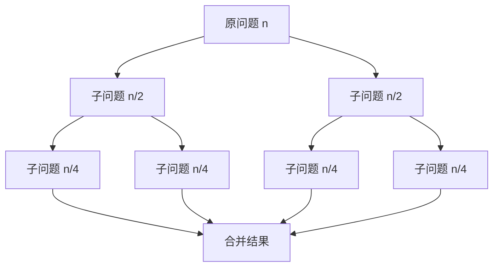

# 分治算法：化繁为简的力量


## 一、什么是分治

**分治（Divide and Conquer）** 将一个问题**递归地分解**为若干个规模更小的**同类子问题**，分别求解后再**合并**结果。

三步曲：
1. **Divide**：将问题拆成若干子问题。
2. **Conquer**：递归解决子问题（足够小时直接求解）。
3. **Combine**：将子问题的解合并为原问题的解。



> 与 DP 的区别：分治的子问题**互不重叠**；DP 的子问题**大量重叠**。

## 二、分治的适用条件

| 条件 | 说明 |
|------|------|
| 可分解 | 问题能拆成规模更小的同类问题 |
| 子问题独立 | 子问题之间无公共子子问题（否则用 DP） |
| 可合并 | 子问题的解能高效合并为原问题的解 |
| 递归基 | 存在足够小的基本情况可直接求解 |

## 三、主定理（Master Theorem）

分治算法的复杂度通常满足递推：

\[T(n) = a \cdot T(n/b) + O(n^d)\]

| 情况 | 条件 | 复杂度 |
|------|------|--------|
| 1 | d < log_b(a) | O(n^{log_b(a)}) |
| 2 | d = log_b(a) | O(n^d · log n) |
| 3 | d > log_b(a) | O(n^d) |

**速记**：

| 算法 | a | b | d | 复杂度 |
|------|---|---|---|--------|
| 归并排序 | 2 | 2 | 1 | O(n log n) |
| 快速排序（平均） | 2 | 2 | 1 | O(n log n) |
| 二分查找 | 1 | 2 | 0 | O(log n) |
| Strassen 矩阵乘法 | 7 | 2 | 2 | O(n^{2.81}) |

## 四、经典案例

### 4.1 归并排序

最经典的分治：拆半 → 递归排序 → 合并。

```java tab
public void mergeSort(int[] arr, int lo, int hi) {
    if (lo >= hi) return;
    int mid = lo + (hi - lo) / 2;
    mergeSort(arr, lo, mid);
    mergeSort(arr, mid + 1, hi);
    merge(arr, lo, mid, hi);
}

private void merge(int[] arr, int lo, int mid, int hi) {
    int[] tmp = new int[hi - lo + 1];
    int i = lo, j = mid + 1, k = 0;
    while (i <= mid && j <= hi) {
        tmp[k++] = arr[i] <= arr[j] ? arr[i++] : arr[j++];
    }
    while (i <= mid) tmp[k++] = arr[i++];
    while (j <= hi)  tmp[k++] = arr[j++];
    System.arraycopy(tmp, 0, arr, lo, tmp.length);
}
```

```typescript tab
function mergeSort(arr: number[], lo: number, hi: number): void {
    if (lo >= hi) return;
    const mid = lo + Math.floor((hi - lo) / 2);
    mergeSort(arr, lo, mid);
    mergeSort(arr, mid + 1, hi);
    merge(arr, lo, mid, hi);
}

function merge(arr: number[], lo: number, mid: number, hi: number): void {
    const tmp: number[] = [];
    let i = lo, j = mid + 1;
    while (i <= mid && j <= hi) {
        tmp.push(arr[i] <= arr[j] ? arr[i++] : arr[j++]);
    }
    while (i <= mid) tmp.push(arr[i++]);
    while (j <= hi) tmp.push(arr[j++]);
    for (let k = 0; k < tmp.length; k++) arr[lo + k] = tmp[k];
}
```

```python tab
def merge_sort(arr: list[int], lo: int, hi: int) -> None:
    if lo >= hi:
        return
    mid = lo + (hi - lo) // 2
    merge_sort(arr, lo, mid)
    merge_sort(arr, mid + 1, hi)
    merge(arr, lo, mid, hi)

def merge(arr: list[int], lo: int, mid: int, hi: int) -> None:
    tmp = []
    i, j = lo, mid + 1
    while i <= mid and j <= hi:
        if arr[i] <= arr[j]:
            tmp.append(arr[i]); i += 1
        else:
            tmp.append(arr[j]); j += 1
    tmp.extend(arr[i:mid + 1])
    tmp.extend(arr[j:hi + 1])
    arr[lo:hi + 1] = tmp
```

- **时间**：O(n log n)，**空间**：O(n)

### 4.2 快速幂

计算 `x^n`，将指数对半分：

```java tab
public double myPow(double x, long n) {
    if (n == 0) return 1.0;
    if (n < 0) { x = 1 / x; n = -n; }
    double half = myPow(x, n / 2);
    return (n % 2 == 0) ? half * half : half * half * x;
}
```

```typescript tab
function myPow(x: number, n: number): number {
    if (n < 0) { x = 1 / x; n = -n; }
    let result = 1;
    while (n > 0) {
        if (n & 1) result *= x;
        x *= x;
        n >>= 1;
    }
    return result;
}
```

```python tab
def my_pow(x: float, n: int) -> float:
    if n < 0:
        x, n = 1 / x, -n
    result = 1.0
    while n > 0:
        if n & 1:
            result *= x
        x *= x
        n >>= 1
    return result
```

- **时间**：O(log n)，**空间**：O(log n)

### 4.3 最近点对

**问题**：平面上 n 个点，找距离最近的一对。

**分治思路**：
1. 按 x 坐标排序，取中线分成左右两半。
2. 递归求左半最近距离 `dL`、右半最近距离 `dR`。
3. `d = min(dL, dR)`。
4. 只需检查中线附近宽度为 `2d` 的带状区域内的跨区点对。

```java tab
// 核心合并步骤（简化）
private double closestInStrip(Point[] strip, double d) {
    Arrays.sort(strip, (a, b) -> Double.compare(a.y, b.y));
    double minD = d;
    for (int i = 0; i < strip.length; i++) {
        for (int j = i + 1; j < strip.length && strip[j].y - strip[i].y < minD; j++) {
            minD = Math.min(minD, dist(strip[i], strip[j]));
        }
    }
    return minD;
}
```

```typescript tab
// 核心合并步骤（简化）
function closestInStrip(strip: Point[], d: number): number {
    strip.sort((a, b) => a.y - b.y);
    let minD = d;
    for (let i = 0; i < strip.length; i++) {
        for (let j = i + 1; j < strip.length && strip[j].y - strip[i].y < minD; j++) {
            minD = Math.min(minD, dist(strip[i], strip[j]));
        }
    }
    return minD;
}
```

```python tab
# 核心合并步骤（简化）
def closest_in_strip(strip: list, d: float) -> float:
    strip.sort(key=lambda p: p.y)
    min_d = d
    for i in range(len(strip)):
        j = i + 1
        while j < len(strip) and strip[j].y - strip[i].y < min_d:
            min_d = min(min_d, dist(strip[i], strip[j]))
            j += 1
    return min_d
```

- **时间**：O(n log n)，**空间**：O(n)

### 4.4 大整数乘法（Karatsuba）

将 n 位数拆成两半：`x = a·10^(n/2) + b`，`y = c·10^(n/2) + d`

传统需要 4 次乘法，Karatsuba 只需 3 次：

```text
z0 = b * d
z2 = a * c
z1 = (a + b) * (c + d) - z0 - z2
结果 = z2 * 10^n + z1 * 10^(n/2) + z0
```

- **时间**：O(n^{1.585})，优于朴素的 O(n²)

### 4.5 数组中的第 K 大元素（QuickSelect）

```java tab
public int findKthLargest(int[] nums, int k) {
    int target = nums.length - k;
    int lo = 0, hi = nums.length - 1;
    while (lo < hi) {
        int pivot = partition(nums, lo, hi);
        if (pivot == target) return nums[pivot];
        else if (pivot < target) lo = pivot + 1;
        else hi = pivot - 1;
    }
    return nums[lo];
}

private int partition(int[] nums, int lo, int hi) {
    int pivot = nums[hi], i = lo;
    for (int j = lo; j < hi; j++) {
        if (nums[j] <= pivot) {
            swap(nums, i, j);
            i++;
        }
    }
    swap(nums, i, hi);
    return i;
}
```

```typescript tab
function findKthLargest(nums: number[], k: number): number {
    const target = nums.length - k;
    let lo = 0, hi = nums.length - 1;
    while (lo < hi) {
        const pivot = partition(nums, lo, hi);
        if (pivot === target) return nums[pivot];
        else if (pivot < target) lo = pivot + 1;
        else hi = pivot - 1;
    }
    return nums[lo];
}

function partition(nums: number[], lo: number, hi: number): number {
    const pivot = nums[hi];
    let i = lo;
    for (let j = lo; j < hi; j++) {
        if (nums[j] <= pivot) {
            [nums[i], nums[j]] = [nums[j], nums[i]];
            i++;
        }
    }
    [nums[i], nums[hi]] = [nums[hi], nums[i]];
    return i;
}
```

```python tab
def find_kth_largest(nums: list[int], k: int) -> int:
    target = len(nums) - k
    lo, hi = 0, len(nums) - 1
    while lo < hi:
        pivot = partition(nums, lo, hi)
        if pivot == target:
            return nums[pivot]
        elif pivot < target:
            lo = pivot + 1
        else:
            hi = pivot - 1
    return nums[lo]

def partition(nums: list[int], lo: int, hi: int) -> int:
    pivot, i = nums[hi], lo
    for j in range(lo, hi):
        if nums[j] <= pivot:
            nums[i], nums[j] = nums[j], nums[i]
            i += 1
    nums[i], nums[hi] = nums[hi], nums[i]
    return i
```

- **平均时间**：O(n)，**最坏**：O(n²)（随机化 pivot 可避免）

## 五、分治 vs 其他策略

| 维度 | 分治 | DP | 贪心 |
|------|------|----|------|
| 子问题 | 独立不重叠 | 重叠 | 无子问题 |
| 求解方式 | 递归 + 合并 | 记忆化/递推 | 逐步选择 |
| 典型应用 | 排序、最近点对 | 背包、LCS | 区间调度 |
| 是否回退 | 否 | 否 | 否 |

## 六、分治的优化方向

1. **减少递归开销**：小规模时切换为插入排序（如 Java Arrays.sort 在 n<47 时用插入排序）。
2. **尾递归优化**：某些分治可改写为迭代（如快速幂的迭代版）。
3. **并行化**：子问题独立 → 天然适合多线程。
4. **减少合并代价**：原地归并（In-place Merge）节省空间。

## 七、面试常见题

- 🟢 快速幂、二分查找、合并有序数组
- 🟡 归并排序、第 K 大元素、翻转对
- 🟠 最近点对、大整数乘法、分治求逆序对
- 🔴 分治 + 线段树、CDQ 分治

## 八、调试技巧

1. **验证 base case**：n=0、n=1 时是否正确返回。
2. **打印分治过程**：输出每次递归的 `[lo, hi]` 范围。
3. **合并逻辑单独测试**：先确保 merge 函数正确。
4. **对拍**：与暴力 O(n²) 对比，n≤20 随机验证。
