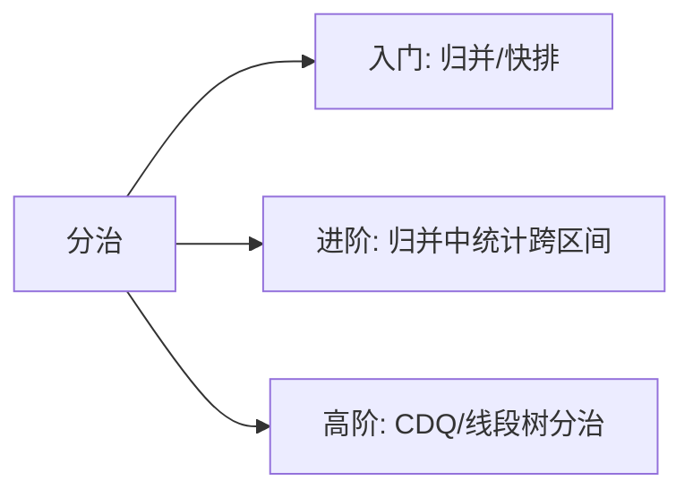

# 分治应用专题：归并排序的隐藏技能

## 一、分治的三重境界



| 层次 | 代表 | 特征 |
|------|------|------|
| 入门 | 归并排序、快排 | 分→治→合，结构清晰 |
| 进阶 | 逆序对、右侧更小元素 | **在归并过程中统计跨区间信息** |
| 高级 | 最近点对、CDQ 分治 | 分治降维 + 排序技巧 |

本文聚焦进阶层：利用归并排序的合并阶段，高效统计"跨越中点的配对关系"。

## 二、核心洞察：归并时统计跨区间对

归并排序合并两个有序子数组时，左右两半的元素**恰好形成所有"跨中点"的配对**。如果左半的 `a[i] > 右半的 b[j]`，那么左半 `i` 及其后面的所有元素都与 `b[j]` 构成逆序对。

```text
左半: [3, 5, 7]    右半: [1, 4, 6]

合并时 b[0]=1 < a[0]=3 → 1 与左半所有元素(3个)构成逆序对
```

这就是 O(n log n) 统计逆序对的原理。

## 三、LC 剑指 51 / 493：逆序对统计

### 3.1 数组中的逆序对

求 `i < j && nums[i] > nums[j]` 的对数。

```java tab
public int reversePairs(int[] nums) {
    return mergeSort(nums, 0, nums.length - 1);
}

private int mergeSort(int[] nums, int lo, int hi) {
    if (lo >= hi) return 0;
    int mid = lo + (hi - lo) / 2;
    int count = mergeSort(nums, lo, mid) + mergeSort(nums, mid + 1, hi);

    // 统计跨区间逆序对
    int[] temp = new int[hi - lo + 1];
    int i = lo, j = mid + 1, k = 0;
    while (i <= mid && j <= hi) {
        if (nums[i] <= nums[j]) {
            temp[k++] = nums[i++];
        } else {
            count += mid - i + 1;  // 关键：左半剩余元素都与 nums[j] 逆序
            temp[k++] = nums[j++];
        }
    }
    while (i <= mid) temp[k++] = nums[i++];
    while (j <= hi) temp[k++] = nums[j++];
    System.arraycopy(temp, 0, nums, lo, temp.length);
    return count;
}
```

```typescript tab
function reversePairs(nums: number[]): number {
    return mergeSort(nums, 0, nums.length - 1);
}

function mergeSort(nums: number[], lo: number, hi: number): number {
    if (lo >= hi) return 0;
    const mid = lo + ((hi - lo) >> 1);
    let count = mergeSort(nums, lo, mid) + mergeSort(nums, mid + 1, hi);

    const temp: number[] = [];
    let i = lo, j = mid + 1;
    while (i <= mid && j <= hi) {
        if (nums[i] <= nums[j]) {
            temp.push(nums[i++]);
        } else {
            count += mid - i + 1;  // 左半 [i..mid] 都与 nums[j] 逆序
            temp.push(nums[j++]);
        }
    }
    while (i <= mid) temp.push(nums[i++]);
    while (j <= hi) temp.push(nums[j++]);
    for (let k = 0; k < temp.length; k++) nums[lo + k] = temp[k];
    return count;
}
```

```python tab
def reversePairs(nums: list[int]) -> int:
    def merge_sort(lo: int, hi: int) -> int:
        if lo >= hi:
            return 0
        mid = (lo + hi) // 2
        count = merge_sort(lo, mid) + merge_sort(mid + 1, hi)

        temp = []
        i, j = lo, mid + 1
        while i <= mid and j <= hi:
            if nums[i] <= nums[j]:
                temp.append(nums[i])
                i += 1
            else:
                count += mid - i + 1
                temp.append(nums[j])
                j += 1
        temp.extend(nums[i:mid+1])
        temp.extend(nums[j:hi+1])
        nums[lo:hi+1] = temp
        return count

    return merge_sort(0, len(nums) - 1)
```

**复杂度**：时间 O(n log n)，空间 O(n)。

### 3.2 LC 493：翻转对（条件变为 nums[i] > 2·nums[j]）

统计与合并**分离**——先统计再合并：

```typescript tab
function reversePairs(nums: number[]): number {
    return mergeSort(nums, 0, nums.length - 1);
}

function mergeSort(nums: number[], lo: number, hi: number): number {
    if (lo >= hi) return 0;
    const mid = lo + ((hi - lo) >> 1);
    let count = mergeSort(nums, lo, mid) + mergeSort(nums, mid + 1, hi);

    // 统计阶段：双指针（两半各自有序）
    let j = mid + 1;
    for (let i = lo; i <= mid; i++) {
        while (j <= hi && nums[i] > 2 * nums[j]) j++;
        count += j - (mid + 1);
    }

    // 合并阶段（标准归并）
    const temp: number[] = [];
    let p = lo, q = mid + 1;
    while (p <= mid && q <= hi) {
        temp.push(nums[p] <= nums[q] ? nums[p++] : nums[q++]);
    }
    while (p <= mid) temp.push(nums[p++]);
    while (q <= hi) temp.push(nums[q++]);
    for (let k = 0; k < temp.length; k++) nums[lo + k] = temp[k];
    return count;
}
```

**为什么统计要独立出来？** 条件 `> 2*nums[j]` 与排序顺序不一致，不能边合并边统计。

## 四、LC 315：计算右侧小于当前元素的个数

`result[i]` = `nums[i]` 右侧比它小的元素个数——本质是**带下标追踪的逆序对**。

### 4.1 归并解法

对 `(value, originalIndex)` 的元组数组做归并排序，统计时累加到原下标：

```typescript tab
function countSmaller(nums: number[]): number[] {
    const n = nums.length;
    const result = new Array(n).fill(0);
    const indexed = nums.map((val, idx) => ({ val, idx }));

    mergeSort(indexed, 0, n - 1, result);
    return result;
}

function mergeSort(
    arr: { val: number; idx: number }[],
    lo: number, hi: number, result: number[]
): void {
    if (lo >= hi) return;
    const mid = lo + ((hi - lo) >> 1);
    mergeSort(arr, lo, mid, result);
    mergeSort(arr, mid + 1, hi, result);

    const temp: { val: number; idx: number }[] = [];
    let i = lo, j = mid + 1;
    while (i <= mid && j <= hi) {
        if (arr[i].val <= arr[j].val) {
            // arr[i] 入列时，右半已入列的 j-(mid+1) 个元素都比它小
            result[arr[i].idx] += j - (mid + 1);
            temp.push(arr[i++]);
        } else {
            temp.push(arr[j++]);
        }
    }
    while (i <= mid) {
        result[arr[i].idx] += hi - mid;  // 右半全部已入列
        temp.push(arr[i++]);
    }
    while (j <= hi) temp.push(arr[j++]);
    for (let k = 0; k < temp.length; k++) arr[lo + k] = temp[k];
}
```

```java tab
public List<Integer> countSmaller(int[] nums) {
    int n = nums.length;
    Integer[] result = new Integer[n];
    Arrays.fill(result, 0);
    int[][] indexed = new int[n][2];  // [value, originalIndex]
    for (int i = 0; i < n; i++) indexed[i] = new int[]{nums[i], i};

    mergeSort(indexed, 0, n - 1, result);
    return Arrays.asList(result);
}

private void mergeSort(int[][] arr, int lo, int hi, Integer[] result) {
    if (lo >= hi) return;
    int mid = lo + (hi - lo) / 2;
    mergeSort(arr, lo, mid, result);
    mergeSort(arr, mid + 1, hi, result);

    int[][] temp = new int[hi - lo + 1][2];
    int i = lo, j = mid + 1, k = 0;
    while (i <= mid && j <= hi) {
        if (arr[i][0] <= arr[j][0]) {
            result[arr[i][1]] += j - mid - 1;
            temp[k++] = arr[i++];
        } else {
            temp[k++] = arr[j++];
        }
    }
    while (i <= mid) {
        result[arr[i][1]] += hi - mid;
        temp[k++] = arr[i++];
    }
    while (j <= hi) temp[k++] = arr[j++];
    System.arraycopy(temp, 0, arr, lo, temp.length);
}
```

### 4.2 树状数组解法（替代方案）

离散化 + 从右往左插入，查询"已插入中比我小的个数"：

```python tab
def countSmaller(nums: list[int]) -> list[int]:
    # 离散化
    sorted_unique = sorted(set(nums))
    rank = {v: i + 1 for i, v in enumerate(sorted_unique)}

    n = len(sorted_unique)
    tree = [0] * (n + 1)

    def update(i: int):
        while i <= n:
            tree[i] += 1
            i += i & (-i)

    def query(i: int) -> int:
        s = 0
        while i > 0:
            s += tree[i]
            i -= i & (-i)
        return s

    result = []
    for num in reversed(nums):
        result.append(query(rank[num] - 1))  # 比当前小的已插入个数
        update(rank[num])
    return result[::-1]
```

## 五、最近点对（经典分治几何题）

平面上 n 个点，求距离最近的两个点。

### 5.1 分治思路

1. 按 x 排序，取中点分为左右两半
2. 递归求左半最小距离 `dL`、右半最小距离 `dR`，取 `d = min(dL, dR)`
3. **关键**：只需检查 x 坐标距中线 < d 的"带状区域"内的点
4. 带状区域内的点按 y 排序，每个点只需与后续最多 7 个点比较

```typescript tab
function closestPair(points: [number, number][]): number {
    points.sort((a, b) => a[0] - b[0]);

    function dist(p1: [number, number], p2: [number, number]): number {
        return Math.hypot(p1[0] - p2[0], p1[1] - p2[1]);
    }

    function solve(lo: number, hi: number): number {
        if (hi - lo <= 2) {
            // 暴力
            let min = Infinity;
            for (let i = lo; i < hi; i++)
                for (let j = i + 1; j <= hi; j++)
                    min = Math.min(min, dist(points[i], points[j]));
            return min;
        }

        const mid = lo + ((hi - lo) >> 1);
        const midX = points[mid][0];
        const d = Math.min(solve(lo, mid), solve(mid + 1, hi));

        // 带状区域
        const strip = points.slice(lo, hi + 1)
            .filter(p => Math.abs(p[0] - midX) < d)
            .sort((a, b) => a[1] - b[1]);

        let min = d;
        for (let i = 0; i < strip.length; i++) {
            for (let j = i + 1; j < strip.length && strip[j][1] - strip[i][1] < min; j++) {
                min = Math.min(min, dist(strip[i], strip[j]));
            }
        }
        return min;
    }

    return solve(0, points.length - 1);
}
```

**复杂度**：T(n) = 2T(n/2) + O(n log n) = O(n log²n)，优化排序可至 O(n log n)。

## 六、LC 53：最大子数组和的分治解法

```text
maxSubArray(lo, hi) = max(
    maxSubArray(lo, mid),           // 完全在左半
    maxSubArray(mid+1, hi),         // 完全在右半
    跨中点的最大和                    // 从中点向两边扩展
)
```

```typescript tab
function maxSubArray(nums: number[]): number {
    function solve(lo: number, hi: number): number {
        if (lo === hi) return nums[lo];
        const mid = lo + ((hi - lo) >> 1);

        // 跨中点：左半后缀最大 + 右半前缀最大
        let leftMax = -Infinity, sum = 0;
        for (let i = mid; i >= lo; i--) { sum += nums[i]; leftMax = Math.max(leftMax, sum); }
        let rightMax = -Infinity; sum = 0;
        for (let i = mid + 1; i <= hi; i++) { sum += nums[i]; rightMax = Math.max(rightMax, sum); }

        return Math.max(solve(lo, mid), solve(mid + 1, hi), leftMax + rightMax);
    }
    return solve(0, nums.length - 1);
}
```

**注**：Kadane 算法 O(n) 更优，分治版价值在于展示"跨区间合并"的思维模式。

## 七、分治统计问题的通用模板

```text
function solve(lo, hi):
    if 递归基: return 基础值

    mid = (lo + hi) / 2
    left = solve(lo, mid)
    right = solve(mid+1, hi)

    cross = 统计跨越 mid 的贡献   // ← 核心难点
    merge(lo, mid, hi)           // 保持有序性供上层使用

    return left + right + cross
```

**何时适用**：问题可以拆成"左半内部 + 右半内部 + 跨越中点"三部分，且跨中点统计能借助有序性在 O(n) 内完成。

## 八、面试常见题

- 🔴 剑指 Offer 51. 数组中的逆序对（超高频hard）
- 🔴 LC 493. 翻转对
- 🔴 LC 315. 计算右侧小于当前元素的个数
- 🟡 LC 53. 最大子数组和（分治解法）
- 🔴 最近点对（竞赛/笔试经典）
- 🟡 LC 241. 为运算表达式设计优先级（表达式分治）

## 九、易错点

1. **统计与合并的顺序**：条件与排序一致（如 `>`）可边合并边统计；不一致（如 `> 2*`）必须先统计再合并。
2. **等号处理**：`nums[i] <= nums[j]` 时不统计，避免相等元素被误计为逆序。
3. **带下标归并忘记追踪原下标**：LC 315 的结果必须写回原始位置。
4. **带状区域遗漏**：最近点对必须按 y 排序后限制比较范围。

## 十、心法口诀

> **分治统计三件套：左半右半跨中点；**
> **归并保持有序性，跨越贡献线性算。**
