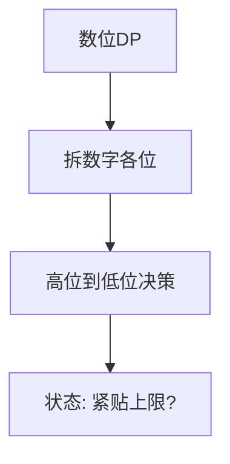

# 数位 DP：按位构造的计数艺术

数位 DP 是一类统计**满足某条件的数的个数**的动态规划方法。核心思路是将数字拆成各位，从高位到低位逐位决策，用"是否紧贴上限"作为状态。

## 一、适用场景



- 求 [L, R] 中满足某性质的整数个数
- 性质与"各位数字"相关（如：不含 4、各位之和为 k、相邻位不等）
- 数据范围通常 10⁹ ~ 10¹⁸，无法枚举

## 二、通用模板（记忆化搜索）

```java tab
// 模板：统计 [0, n] 中满足条件的数的个数
public int countNumbers(int n) {
    char[] digits = String.valueOf(n).toCharArray();
    int len = digits.length;
    int[][] memo = new int[len][/* 状态维度 */];
    for (int[] row : memo) Arrays.fill(row, -1);

    return dfs(digits, 0, /* 初始状态 */, true, memo);
}

// pos: 当前处理到第几位
// state: 题目相关状态（如前一位数字、数字和等）
// tight: 是否受上限约束
int dfs(char[] digits, int pos, int state, boolean tight, int[][] memo) {
    if (pos == digits.length) return 1; // 成功构造一个数

    if (!tight && memo[pos][state] != -1) return memo[pos][state];

    int limit = tight ? digits[pos] - '0' : 9;
    int count = 0;

    for (int d = 0; d <= limit; d++) {
        // 剪枝：跳过不合法的数字
        if (!isValid(d, state)) continue;

        int nextState = transition(state, d);
        count += dfs(digits, pos + 1, nextState, tight && (d == limit), memo);
    }

    if (!tight) memo[pos][state] = count;
    return count;
}
```
```typescript tab
// 模板：统计 [0, n] 中满足条件的数的个数
function countNumbers(n: number): number {
    const digits = String(n).split('').map(Number);
    const len = digits.length;
    const memo: number[][] = Array.from({ length: len }, () => new Array(/* 状态维度 */).fill(-1));

    return dfs(digits, 0, /* 初始状态 */, true, memo);
}

// pos: 当前处理到第几位
// state: 题目相关状态（如前一位数字、数字和等）
// tight: 是否受上限约束
function dfs(digits: number[], pos: number, state: number, tight: boolean, memo: number[][]): number {
    if (pos === digits.length) return 1; // 成功构造一个数

    if (!tight && memo[pos][state] !== -1) return memo[pos][state];

    const limit = tight ? digits[pos] : 9;
    let count = 0;

    for (let d = 0; d <= limit; d++) {
        // 剪枝：跳过不合法的数字
        if (!isValid(d, state)) continue;

        const nextState = transition(state, d);
        count += dfs(digits, pos + 1, nextState, tight && (d === limit), memo);
    }

    if (!tight) memo[pos][state] = count;
    return count;
}
```
```python tab
# 模板：统计 [0, n] 中满足条件的数的个数
def count_numbers(n: int) -> int:
    digits = list(map(int, str(n)))
    length = len(digits)
    memo = [[-1] * (/* 状态维度 */) for _ in range(length)]

    return dfs(digits, 0, /* 初始状态 */, True, memo)

# pos: 当前处理到第几位
# state: 题目相关状态（如前一位数字、数字和等）
# tight: 是否受上限约束
def dfs(digits: list[int], pos: int, state: int, tight: bool, memo: list[list[int]]) -> int:
    if pos == len(digits):
        return 1  # 成功构造一个数

    if not tight and memo[pos][state] != -1:
        return memo[pos][state]

    limit = digits[pos] if tight else 9
    count = 0

    for d in range(limit + 1):
        # 剪枝：跳过不合法的数字
        if not is_valid(d, state):
            continue

        next_state = transition(state, d)
        count += dfs(digits, pos + 1, next_state, tight and (d == limit), memo)

    if not tight:
        memo[pos][state] = count
    return count
```

## 三、经典例题

### 1. 不含数字 4 的数（LeetCode 233 变体）

```java tab
// 统计 [1, n] 中不含数字 4 的正整数个数
public int countWithout4(int n) {
    char[] digits = String.valueOf(n).toCharArray();
    int[][] memo = new int[digits.length][1];
    for (int[] row : memo) Arrays.fill(row, -1);
    return dfs(digits, 0, true, memo) - 1; // 减去 0
}

int dfs(char[] digits, int pos, boolean tight, int[][] memo) {
    if (pos == digits.length) return 1;
    if (!tight && memo[pos][0] != -1) return memo[pos][0];

    int limit = tight ? digits[pos] - '0' : 9;
    int count = 0;
    for (int d = 0; d <= limit; d++) {
        if (d == 4) continue; // 跳过 4
        count += dfs(digits, pos + 1, tight && (d == limit), memo);
    }
    if (!tight) memo[pos][0] = count;
    return count;
}
```
```typescript tab
// 统计 [1, n] 中不含数字 4 的正整数个数
function countWithout4(n: number): number {
    const digits = String(n).split('').map(Number);
    const memo: number[][] = Array.from({ length: digits.length }, () => [-1]);
    return dfs(digits, 0, true, memo) - 1; // 减去 0
}

function dfs(digits: number[], pos: number, tight: boolean, memo: number[][]): number {
    if (pos === digits.length) return 1;
    if (!tight && memo[pos][0] !== -1) return memo[pos][0];

    const limit = tight ? digits[pos] : 9;
    let count = 0;
    for (let d = 0; d <= limit; d++) {
        if (d === 4) continue; // 跳过 4
        count += dfs(digits, pos + 1, tight && (d === limit), memo);
    }
    if (!tight) memo[pos][0] = count;
    return count;
}
```
```python tab
# 统计 [1, n] 中不含数字 4 的正整数个数
def count_without_4(n: int) -> int:
    digits = list(map(int, str(n)))
    memo = [[-1] for _ in range(len(digits))]
    return dfs(digits, 0, True, memo) - 1  # 减去 0

def dfs(digits: list[int], pos: int, tight: bool, memo: list[list[int]]) -> int:
    if pos == len(digits):
        return 1
    if not tight and memo[pos][0] != -1:
        return memo[pos][0]

    limit = digits[pos] if tight else 9
    count = 0
    for d in range(limit + 1):
        if d == 4:
            continue  # 跳过 4
        count += dfs(digits, pos + 1, tight and (d == limit), memo)
    if not tight:
        memo[pos][0] = count
    return count
```

### 2. 各位数字之和等于 K

```java tab
// 状态：pos + 剩余需要的数字和
int dfs(char[] digits, int pos, int remain, boolean tight, int[][] memo) {
    if (pos == digits.length) return remain == 0 ? 1 : 0;
    if (remain < 0) return 0;
    if (!tight && memo[pos][remain] != -1) return memo[pos][remain];

    int limit = tight ? digits[pos] - '0' : 9;
    int count = 0;
    for (int d = 0; d <= limit; d++) {
        count += dfs(digits, pos + 1, remain - d, tight && (d == limit), memo);
    }
    if (!tight) memo[pos][remain] = count;
    return count;
}
```
```typescript tab
// 状态：pos + 剩余需要的数字和
function dfs(digits: number[], pos: number, remain: number, tight: boolean, memo: number[][]): number {
    if (pos === digits.length) return remain === 0 ? 1 : 0;
    if (remain < 0) return 0;
    if (!tight && memo[pos][remain] !== -1) return memo[pos][remain];

    const limit = tight ? digits[pos] : 9;
    let count = 0;
    for (let d = 0; d <= limit; d++) {
        count += dfs(digits, pos + 1, remain - d, tight && (d === limit), memo);
    }
    if (!tight) memo[pos][remain] = count;
    return count;
}
```
```python tab
# 状态：pos + 剩余需要的数字和
def dfs(digits: list[int], pos: int, remain: int, tight: bool, memo: list[list[int]]) -> int:
    if pos == len(digits):
        return 1 if remain == 0 else 0
    if remain < 0:
        return 0
    if not tight and memo[pos][remain] != -1:
        return memo[pos][remain]

    limit = digits[pos] if tight else 9
    count = 0
    for d in range(limit + 1):
        count += dfs(digits, pos + 1, remain - d, tight and (d == limit), memo)
    if not tight:
        memo[pos][remain] = count
    return count
```

### 3. 相邻位不重复

```java tab
// 状态：pos + 前一位数字（0-9, 10表示首位）
int dfs(char[] digits, int pos, int prev, boolean tight, int[][] memo) {
    if (pos == digits.length) return 1;
    if (!tight && memo[pos][prev] != -1) return memo[pos][prev];

    int limit = tight ? digits[pos] - '0' : 9;
    int count = 0;
    for (int d = 0; d <= limit; d++) {
        if (d == prev) continue; // 相邻不重复
        count += dfs(digits, pos + 1, d, tight && (d == limit), memo);
    }
    if (!tight) memo[pos][prev] = count;
    return count;
}
```
```typescript tab
// 状态：pos + 前一位数字（0-9, 10表示首位）
function dfs(digits: number[], pos: number, prev: number, tight: boolean, memo: number[][]): number {
    if (pos === digits.length) return 1;
    if (!tight && memo[pos][prev] !== -1) return memo[pos][prev];

    const limit = tight ? digits[pos] : 9;
    let count = 0;
    for (let d = 0; d <= limit; d++) {
        if (d === prev) continue; // 相邻不重复
        count += dfs(digits, pos + 1, d, tight && (d === limit), memo);
    }
    if (!tight) memo[pos][prev] = count;
    return count;
}
```
```python tab
# 状态：pos + 前一位数字（0-9, 10表示首位）
def dfs(digits: list[int], pos: int, prev: int, tight: bool, memo: list[list[int]]) -> int:
    if pos == len(digits):
        return 1
    if not tight and memo[pos][prev] != -1:
        return memo[pos][prev]

    limit = digits[pos] if tight else 9
    count = 0
    for d in range(limit + 1):
        if d == prev:
            continue  # 相邻不重复
        count += dfs(digits, pos + 1, d, tight and (d == limit), memo)
    if not tight:
        memo[pos][prev] = count
    return count
```

## 四、求区间 [L, R] 的技巧

```java tab
int answer = count(R) - count(L - 1);
```
```typescript tab
const answer = count(R) - count(L - 1);
```
```python tab
answer = count(R) - count(L - 1)
```

利用前缀和思想，将区间问题转化为两次 [0, x] 的计数。

## 五、复杂度分析

- **状态数**：O(位数 × 状态维度) ≈ O(20 × S)
- **转移**：每个状态枚举 0~9，O(10)
- **总复杂度**：O(20 × S × 10)，通常 < 10⁴

## 六、面试要点

1. **tight 的含义**：当前前缀是否等于 n 的对应前缀，决定本位上界
2. **memo 只在 !tight 时缓存**：tight 状态下每个位置的上界不同，不可复用
3. **前导零处理**：若题目不允许前导零，需额外状态标记"是否还在前导零阶段"
4. **LeetCode 高频**：233（数字 1 的个数）、600（不含连续 1）、902（最大为 N 的数字组合）、1012（至少有 1 位重复）
