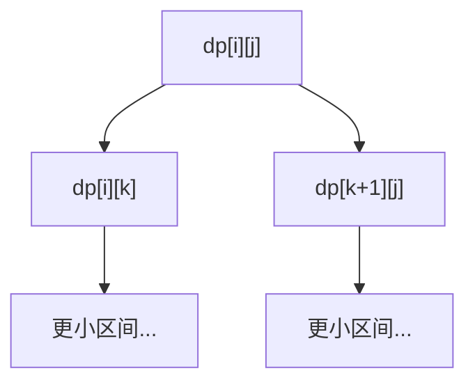

# 区间 DP：合并与分割的艺术


## 一、什么是区间 DP

**区间 DP** 是在一个区间 `[i, j]` 上定义状态，通过**枚举分割点 k** 将大区间拆分为两个小区间来转移的 DP 模型。

核心特征：
- 状态：`dp[i][j]` 表示区间 `[i, j]` 的最优值
- 转移：枚举分割点 `k`，`dp[i][j] = f(dp[i][k], dp[k+1][j])`
- 遍历顺序：按区间**长度从小到大**



## 二、通用模板

```java tab
// 初始化：长度为 1 的区间
for (int i = 0; i < n; i++) dp[i][i] = baseValue;

// 按长度从小到大枚举
for (int len = 2; len <= n; len++) {
    for (int i = 0; i + len - 1 < n; i++) {
        int j = i + len - 1;
        dp[i][j] = INF;   // 或 0，取决于求 min 还是 max
        for (int k = i; k < j; k++) {
            dp[i][j] = Math.min(dp[i][j], dp[i][k] + dp[k+1][j] + cost);
        }
    }
}
```

```typescript tab
// 初始化：长度为 1 的区间
for (let i = 0; i < n; i++) dp[i][i] = baseValue;

// 按长度从小到大枚举
for (let len = 2; len <= n; len++) {
    for (let i = 0; i + len - 1 < n; i++) {
        const j = i + len - 1;
        dp[i][j] = Infinity;   // 或 0，取决于求 min 还是 max
        for (let k = i; k < j; k++) {
            dp[i][j] = Math.min(dp[i][j], dp[i][k] + dp[k + 1][j] + cost);
        }
    }
}
```

```python tab
# 初始化：长度为 1 的区间
for i in range(n):
    dp[i][i] = base_value

# 按长度从小到大枚举
for length in range(2, n + 1):
    for i in range(n - length + 1):
        j = i + length - 1
        dp[i][j] = float('inf')   # 或 0，取决于求 min 还是 max
        for k in range(i, j):
            dp[i][j] = min(dp[i][j], dp[i][k] + dp[k + 1][j] + cost)
```

- **时间**：O(n³)，**空间**：O(n²)

## 三、经典案例

### 3.1 戳气球（LeetCode 312）

**问题**：戳破气球 i 获得 `nums[i-1] * nums[i] * nums[i+1]` 硬币，求最大总硬币。

**关键转化**：不思考"先戳哪个"，而是思考"最后戳哪个"。

```java tab
public int maxCoins(int[] nums) {
    int n = nums.length;
    int[] arr = new int[n + 2];
    arr[0] = arr[n + 1] = 1;   // 虚拟边界
    System.arraycopy(nums, 0, arr, 1, n);

    int[][] dp = new int[n + 2][n + 2];
    for (int len = 1; len <= n; len++) {
        for (int i = 1; i + len - 1 <= n; i++) {
            int j = i + len - 1;
            for (int k = i; k <= j; k++) {
                // k 是区间 [i,j] 中最后一个被戳的
                int coins = arr[i - 1] * arr[k] * arr[j + 1];
                dp[i][j] = Math.max(dp[i][j],
                    dp[i][k - 1] + coins + dp[k + 1][j]);
            }
        }
    }
    return dp[1][n];
}
```

```typescript tab
function maxCoins(nums: number[]): number {
    const n = nums.length;
    const arr = new Array(n + 2).fill(1);   // 虚拟边界
    for (let i = 0; i < n; i++) arr[i + 1] = nums[i];

    const dp: number[][] = Array.from({ length: n + 2 }, () => new Array(n + 2).fill(0));
    for (let len = 1; len <= n; len++) {
        for (let i = 1; i + len - 1 <= n; i++) {
            const j = i + len - 1;
            for (let k = i; k <= j; k++) {
                // k 是区间 [i,j] 中最后一个被戳的
                const coins = arr[i - 1] * arr[k] * arr[j + 1];
                dp[i][j] = Math.max(dp[i][j],
                    dp[i][k - 1] + coins + dp[k + 1][j]);
            }
        }
    }
    return dp[1][n];
}
```

```python tab
def max_coins(nums: list[int]) -> int:
    n = len(nums)
    arr = [1] + nums + [1]   # 虚拟边界

    dp = [[0] * (n + 2) for _ in range(n + 2)]
    for length in range(1, n + 1):
        for i in range(1, n - length + 2):
            j = i + length - 1
            for k in range(i, j + 1):
                # k 是区间 [i,j] 中最后一个被戳的
                coins = arr[i - 1] * arr[k] * arr[j + 1]
                dp[i][j] = max(dp[i][j],
                    dp[i][k - 1] + coins + dp[k + 1][j])
    return dp[1][n]
```

### 3.2 合并石子

**问题**：n 堆石子排成一行，每次合并相邻两堆（代价 = 两堆之和），求最小总代价。

```java tab
public int mergeStones(int[] stones) {
    int n = stones.length;
    int[] prefix = new int[n + 1];
    for (int i = 0; i < n; i++) prefix[i + 1] = prefix[i] + stones[i];

    int[][] dp = new int[n][n];
    for (int len = 2; len <= n; len++) {
        for (int i = 0; i + len - 1 < n; i++) {
            int j = i + len - 1;
            dp[i][j] = Integer.MAX_VALUE;
            for (int k = i; k < j; k++) {
                dp[i][j] = Math.min(dp[i][j], dp[i][k] + dp[k + 1][j]);
            }
            dp[i][j] += prefix[j + 1] - prefix[i];   // 合并代价
        }
    }
    return dp[0][n - 1];
}
```

```typescript tab
function mergeStones(stones: number[]): number {
    const n = stones.length;
    const prefix = new Array(n + 1).fill(0);
    for (let i = 0; i < n; i++) prefix[i + 1] = prefix[i] + stones[i];

    const dp: number[][] = Array.from({ length: n }, () => new Array(n).fill(0));
    for (let len = 2; len <= n; len++) {
        for (let i = 0; i + len - 1 < n; i++) {
            const j = i + len - 1;
            dp[i][j] = Infinity;
            for (let k = i; k < j; k++) {
                dp[i][j] = Math.min(dp[i][j], dp[i][k] + dp[k + 1][j]);
            }
            dp[i][j] += prefix[j + 1] - prefix[i];   // 合并代价
        }
    }
    return dp[0][n - 1];
}
```

```python tab
def merge_stones(stones: list[int]) -> int:
    n = len(stones)
    prefix = [0] * (n + 1)
    for i in range(n):
        prefix[i + 1] = prefix[i] + stones[i]

    dp = [[0] * n for _ in range(n)]
    for length in range(2, n + 1):
        for i in range(n - length + 1):
            j = i + length - 1
            dp[i][j] = float('inf')
            for k in range(i, j):
                dp[i][j] = min(dp[i][j], dp[i][k] + dp[k + 1][j])
            dp[i][j] += prefix[j + 1] - prefix[i]   # 合并代价
    return dp[0][n - 1]
```

### 3.3 最长回文子序列

```java tab
public int longestPalindromeSubseq(String s) {
    int n = s.length();
    int[][] dp = new int[n][n];
    for (int i = 0; i < n; i++) dp[i][i] = 1;

    for (int len = 2; len <= n; len++) {
        for (int i = 0; i + len - 1 < n; i++) {
            int j = i + len - 1;
            if (s.charAt(i) == s.charAt(j)) {
                dp[i][j] = dp[i + 1][j - 1] + 2;
            } else {
                dp[i][j] = Math.max(dp[i + 1][j], dp[i][j - 1]);
            }
        }
    }
    return dp[0][n - 1];
}
```

```typescript tab
function longestPalindromeSubseq(s: string): number {
    const n = s.length;
    const dp: number[][] = Array.from({ length: n }, () => new Array(n).fill(0));
    for (let i = 0; i < n; i++) dp[i][i] = 1;
    for (let len = 2; len <= n; len++) {
        for (let i = 0; i + len - 1 < n; i++) {
            const j = i + len - 1;
            if (s[i] === s[j]) dp[i][j] = dp[i + 1][j - 1] + 2;
            else dp[i][j] = Math.max(dp[i + 1][j], dp[i][j - 1]);
        }
    }
    return dp[0][n - 1];
}
```

```python tab
def longest_palindrome_subseq(s: str) -> int:
    n = len(s)
    dp = [[0] * n for _ in range(n)]
    for i in range(n):
        dp[i][i] = 1
    for length in range(2, n + 1):
        for i in range(n - length + 1):
            j = i + length - 1
            if s[i] == s[j]:
                dp[i][j] = dp[i + 1][j - 1] + 2
            else:
                dp[i][j] = max(dp[i + 1][j], dp[i][j - 1])
    return dp[0][n - 1]
```

### 3.4 矩阵链乘法

**问题**：n 个矩阵相乘，不同的加括号方式导致不同的乘法次数，求最少次数。

```java tab
public int matrixChainOrder(int[] p) {
    int n = p.length - 1;   // n 个矩阵
    int[][] dp = new int[n][n];

    for (int len = 2; len <= n; len++) {
        for (int i = 0; i + len - 1 < n; i++) {
            int j = i + len - 1;
            dp[i][j] = Integer.MAX_VALUE;
            for (int k = i; k < j; k++) {
                int cost = dp[i][k] + dp[k + 1][j] + p[i] * p[k + 1] * p[j + 1];
                dp[i][j] = Math.min(dp[i][j], cost);
            }
        }
    }
    return dp[0][n - 1];
}
```

```typescript tab
function matrixChainOrder(p: number[]): number {
    const n = p.length - 1;   // n 个矩阵
    const dp: number[][] = Array.from({ length: n }, () => new Array(n).fill(0));

    for (let len = 2; len <= n; len++) {
        for (let i = 0; i + len - 1 < n; i++) {
            const j = i + len - 1;
            dp[i][j] = Infinity;
            for (let k = i; k < j; k++) {
                const cost = dp[i][k] + dp[k + 1][j] + p[i] * p[k + 1] * p[j + 1];
                dp[i][j] = Math.min(dp[i][j], cost);
            }
        }
    }
    return dp[0][n - 1];
}
```

```python tab
def matrix_chain_order(p: list[int]) -> int:
    n = len(p) - 1   # n 个矩阵
    dp = [[0] * n for _ in range(n)]

    for length in range(2, n + 1):
        for i in range(n - length + 1):
            j = i + length - 1
            dp[i][j] = float('inf')
            for k in range(i, j):
                cost = dp[i][k] + dp[k + 1][j] + p[i] * p[k + 1] * p[j + 1]
                dp[i][j] = min(dp[i][j], cost)
    return dp[0][n - 1]
```

## 四、区间 DP 的识别信号

| 信号 | 示例 |
|------|------|
| "合并相邻元素" | 合并石子、戳气球 |
| "在区间上操作" | 回文子序列、矩阵链乘 |
| "分割成子区间" | 最优 BST、分割回文串 |
| 状态是 [i, j] 区间 | 任何 dp[i][j] 表示区间 |

## 五、优化方向

| 优化 | 条件 | 效果 |
|------|------|------|
| 四边形不等式 | cost 满足单调性 | O(n³) → O(n²) |
| 记忆化搜索 | 状态稀疏 | 减少无效计算 |
| 环形处理 | 首尾相连 | 数组翻倍（长度 2n） |

### 环形区间 DP

```java tab
// 将数组复制一份，长度变为 2n
// 在 [0, 2n-1] 上做区间 DP
// 答案 = max/min(dp[i][i+n-1]) for i in [0, n-1]
```

```typescript tab
// 将数组复制一份，长度变为 2n
// 在 [0, 2n-1] 上做区间 DP
// 答案 = max/min(dp[i][i+n-1]) for i in [0, n-1]
```

```python tab
# 将数组复制一份，长度变为 2n
# 在 [0, 2n-1] 上做区间 DP
# 答案 = max/min(dp[i][i+n-1]) for i in [0, n-1]
```

## 六、面试常见题

- 🟡 最长回文子序列、分割回文串 II
- 🟠 戳气球、合并石子、矩阵链乘法
- 🔴 移除盒子、奇怪的打印机、环形合并石子

## 七、调试技巧

1. **遍历顺序**：必须按长度从小到大，否则子问题未计算。
2. **分割点范围**：`k` 从 `i` 到 `j-1`（不是 `j`）。
3. **边界初始化**：`dp[i][i]` 是基础，别忘了。
4. **区间越界**：`i + len - 1 < n` 防止越界。
