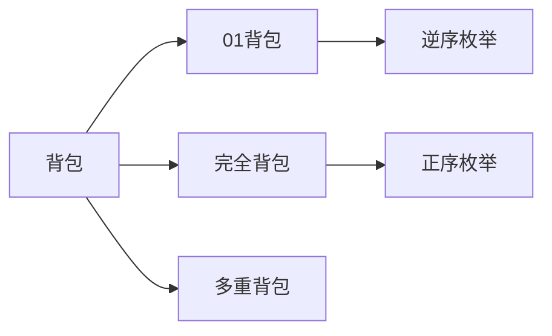

# 背包问题：DP 的经典模型


## 一、背包问题概述



背包问题是动态规划中**最经典的模型族**，面试中出现频率极高。核心形式：

> 有 n 个物品和一个容量为 W 的背包，每个物品有重量 w[i] 和价值 v[i]，如何选择物品使总价值最大？

| 类型 | 每个物品可选次数 | 典型题 |
|------|----------------|--------|
| 0/1 背包 | 0 或 1 | 分割等和子集 |
| 完全背包 | 无限次 | 零钱兑换 |
| 多重背包 | 有限次 | 限定数量的组合 |
| 分组背包 | 每组选一个 | 课程选择 |

## 二、0/1 背包

### 2.1 状态定义

`dp[i][j]` = 考虑前 i 个物品、背包容量为 j 时的最大价值。

### 2.2 转移方程

```text
dp[i][j] = max(
    dp[i-1][j],                    // 不选第 i 个
    dp[i-1][j-w[i]] + v[i]        // 选第 i 个（前提：j >= w[i]）
)
```

### 2.3 二维实现

```java tab
public int knapsack01(int[] weights, int[] values, int W) {
    int n = weights.length;
    int[][] dp = new int[n + 1][W + 1];
    for (int i = 1; i <= n; i++) {
        for (int j = 0; j <= W; j++) {
            dp[i][j] = dp[i - 1][j];
            if (j >= weights[i - 1]) {
                dp[i][j] = Math.max(dp[i][j], dp[i - 1][j - weights[i - 1]] + values[i - 1]);
            }
        }
    }
    return dp[n][W];
}
```

```typescript tab
function knapsack01(weights: number[], values: number[], W: number): number {
    const n = weights.length;
    const dp: number[][] = Array.from({ length: n + 1 }, () => new Array(W + 1).fill(0));
    for (let i = 1; i <= n; i++) {
        for (let j = 0; j <= W; j++) {
            dp[i][j] = dp[i - 1][j];
            if (j >= weights[i - 1]) {
                dp[i][j] = Math.max(dp[i][j], dp[i - 1][j - weights[i - 1]] + values[i - 1]);
            }
        }
    }
    return dp[n][W];
}
```

```python tab
def knapsack01(weights: list[int], values: list[int], W: int) -> int:
    n = len(weights)
    dp = [[0] * (W + 1) for _ in range(n + 1)]
    for i in range(1, n + 1):
        for j in range(W + 1):
            dp[i][j] = dp[i - 1][j]
            if j >= weights[i - 1]:
                dp[i][j] = max(dp[i][j], dp[i - 1][j - weights[i - 1]] + values[i - 1])
    return dp[n][W]
```

### 2.4 一维优化（滚动数组）

```java tab
public int knapsack01(int[] weights, int[] values, int W) {
    int[] dp = new int[W + 1];
    for (int i = 0; i < weights.length; i++) {
        for (int j = W; j >= weights[i]; j--) {   // 逆序！
            dp[j] = Math.max(dp[j], dp[j - weights[i]] + values[i]);
        }
    }
    return dp[W];
}
```

```typescript tab
function knapsack01(weights: number[], values: number[], W: number): number {
    const dp = new Array(W + 1).fill(0);
    for (let i = 0; i < weights.length; i++) {
        for (let j = W; j >= weights[i]; j--) {   // 逆序！
            dp[j] = Math.max(dp[j], dp[j - weights[i]] + values[i]);
        }
    }
    return dp[W];
}
```

```python tab
def knapsack01(weights: list[int], values: list[int], W: int) -> int:
    dp = [0] * (W + 1)
    for i in range(len(weights)):
        for j in range(W, weights[i] - 1, -1):   # 逆序！
            dp[j] = max(dp[j], dp[j - weights[i]] + values[i])
    return dp[W]
```

> **关键**：0/1 背包一维优化必须**逆序**遍历容量，保证每个物品只用一次。

- **时间**：O(nW)，**空间**：O(W)

## 三、完全背包

### 3.1 区别

每个物品可以选**无限次**。

### 3.2 转移方程

```text
dp[j] = max(dp[j], dp[j - w[i]] + v[i])
```

### 3.3 实现

```java tab
public int knapsackComplete(int[] weights, int[] values, int W) {
    int[] dp = new int[W + 1];
    for (int i = 0; i < weights.length; i++) {
        for (int j = weights[i]; j <= W; j++) {   // 正序！
            dp[j] = Math.max(dp[j], dp[j - weights[i]] + values[i]);
        }
    }
    return dp[W];
}
```

```typescript tab
function knapsackComplete(weights: number[], values: number[], W: number): number {
    const dp = new Array(W + 1).fill(0);
    for (let i = 0; i < weights.length; i++) {
        for (let j = weights[i]; j <= W; j++) {   // 正序！
            dp[j] = Math.max(dp[j], dp[j - weights[i]] + values[i]);
        }
    }
    return dp[W];
}
```

```python tab
def knapsack_complete(weights: list[int], values: list[int], W: int) -> int:
    dp = [0] * (W + 1)
    for i in range(len(weights)):
        for j in range(weights[i], W + 1):       # 正序！
            dp[j] = max(dp[j], dp[j - weights[i]] + values[i])
    return dp[W]
```

> **关键**：完全背包一维优化必须**正序**遍历容量，允许同一物品重复使用。

## 四、0/1 vs 完全背包的遍历顺序

| 类型 | 外层 | 内层 | 原因 |
|------|------|------|------|
| 0/1 背包 | 物品 | 容量**逆序** | 防止同一物品重复选 |
| 完全背包 | 物品 | 容量**正序** | 允许重复选 |

## 五、面试中的背包变体

### 5.1 分割等和子集（0/1 背包）

**问题**：数组能否分成两个等和子集？→ 能否凑出 sum/2。

```java tab
public boolean canPartition(int[] nums) {
    int sum = Arrays.stream(nums).sum();
    if (sum % 2 != 0) return false;
    int target = sum / 2;
    boolean[] dp = new boolean[target + 1];
    dp[0] = true;
    for (int num : nums) {
        for (int j = target; j >= num; j--) {
            dp[j] = dp[j] || dp[j - num];
        }
    }
    return dp[target];
}
```

```typescript tab
function canPartition(nums: number[]): boolean {
    const sum = nums.reduce((a, b) => a + b, 0);
    if (sum % 2 !== 0) return false;
    const target = sum / 2;
    const dp = new Array(target + 1).fill(false);
    dp[0] = true;
    for (const num of nums) {
        for (let j = target; j >= num; j--) {
            dp[j] = dp[j] || dp[j - num];
        }
    }
    return dp[target];
}
```

```python tab
def can_partition(nums: list[int]) -> bool:
    total = sum(nums)
    if total % 2 != 0:
        return False
    target = total // 2
    dp = [False] * (target + 1)
    dp[0] = True
    for num in nums:
        for j in range(target, num - 1, -1):
            dp[j] = dp[j] or dp[j - num]
    return dp[target]
```

### 5.2 零钱兑换（完全背包）

**问题**：最少硬币数凑出金额。

```java tab
public int coinChange(int[] coins, int amount) {
    int[] dp = new int[amount + 1];
    Arrays.fill(dp, amount + 1);
    dp[0] = 0;
    for (int coin : coins) {
        for (int j = coin; j <= amount; j++) {
            dp[j] = Math.min(dp[j], dp[j - coin] + 1);
        }
    }
    return dp[amount] > amount ? -1 : dp[amount];
}
```

```typescript tab
function coinChange(coins: number[], amount: number): number {
    const dp = new Array(amount + 1).fill(amount + 1);
    dp[0] = 0;
    for (const coin of coins) {
        for (let j = coin; j <= amount; j++) {
            dp[j] = Math.min(dp[j], dp[j - coin] + 1);
        }
    }
    return dp[amount] > amount ? -1 : dp[amount];
}
```

```python tab
def coin_change(coins: list[int], amount: int) -> int:
    dp = [amount + 1] * (amount + 1)
    dp[0] = 0
    for coin in coins:
        for j in range(coin, amount + 1):
            dp[j] = min(dp[j], dp[j - coin] + 1)
    return -1 if dp[amount] > amount else dp[amount]
```

### 5.3 零钱兑换 II（组合数）

**问题**：凑出金额的组合数（不计顺序）。

```java tab
public int change(int amount, int[] coins) {
    int[] dp = new int[amount + 1];
    dp[0] = 1;
    for (int coin : coins) {           // 外层物品 → 组合（非排列）
        for (int j = coin; j <= amount; j++) {
            dp[j] += dp[j - coin];
        }
    }
    return dp[amount];
}
```

```typescript tab
function change(amount: number, coins: number[]): number {
    const dp = new Array(amount + 1).fill(0);
    dp[0] = 1;
    for (const coin of coins) {           // 外层物品 → 组合（非排列）
        for (let j = coin; j <= amount; j++) {
            dp[j] += dp[j - coin];
        }
    }
    return dp[amount];
}
```

```python tab
def change(amount: int, coins: list[int]) -> int:
    dp = [0] * (amount + 1)
    dp[0] = 1
    for coin in coins:                     # 外层物品 → 组合（非排列）
        for j in range(coin, amount + 1):
            dp[j] += dp[j - coin]
    return dp[amount]
```

> **组合 vs 排列**：外层遍历物品 = 组合；外层遍历容量 = 排列。

### 5.4 目标和

**问题**：给数组元素添加 +/- 使和为 target 的方案数。

转化为：选一部分数使其和 = (sum + target) / 2 → 0/1 背包计数。

```java tab
public int findTargetSumWays(int[] nums, int target) {
    int sum = Arrays.stream(nums).sum();
    if ((sum + target) % 2 != 0 || Math.abs(target) > sum) return 0;
    int bag = (sum + target) / 2;
    int[] dp = new int[bag + 1];
    dp[0] = 1;
    for (int num : nums) {
        for (int j = bag; j >= num; j--) {
            dp[j] += dp[j - num];
        }
    }
    return dp[bag];
}
```

```typescript tab
function findTargetSumWays(nums: number[], target: number): number {
    const sum = nums.reduce((a, b) => a + b, 0);
    if ((sum + target) % 2 !== 0 || Math.abs(target) > sum) return 0;
    const bag = (sum + target) / 2;
    const dp = new Array(bag + 1).fill(0);
    dp[0] = 1;
    for (const num of nums) {
        for (let j = bag; j >= num; j--) {
            dp[j] += dp[j - num];
        }
    }
    return dp[bag];
}
```

```python tab
def find_target_sum_ways(nums: list[int], target: int) -> int:
    total = sum(nums)
    if (total + target) % 2 != 0 or abs(target) > total:
        return 0
    bag = (total + target) // 2
    dp = [0] * (bag + 1)
    dp[0] = 1
    for num in nums:
        for j in range(bag, num - 1, -1):
            dp[j] += dp[j - num]
    return dp[bag]
```

## 六、多重背包（了解）

每个物品最多选 s[i] 次。

- 朴素：拆成 s[i] 个 0/1 背包物品 → O(n·s·W)
- 优化：二进制拆分 → O(n·log(s)·W)
- 进阶：单调队列优化 → O(n·W)

## 七、背包问题识别信号

| 信号 | 对应类型 |
|------|----------|
| "每个元素用一次" | 0/1 背包 |
| "可以重复使用" | 完全背包 |
| "能否恰好凑出" | 可行性背包（boolean） |
| "方案数" | 计数背包（累加） |
| "最大/最小价值" | 最优背包（max/min） |

## 八、面试常见题

- 🟢 分割等和子集、零钱兑换
- 🟡 零钱兑换 II、目标和、一和零
- 🟠 完全平方数、组合总和 IV
- 🔴 多重背包、分组背包、树形背包

## 九、调试技巧

1. **遍历顺序**：0/1 逆序，完全正序——搞混是最常见 bug。
2. **初始化**：求方案数 `dp[0]=1`；求最值 `dp[0]=0`，其余为 INF 或 -INF。
3. **组合 vs 排列**：外层物品=组合，外层容量=排列。
4. **空间优化后不能回溯路径**：需要路径时用二维。
