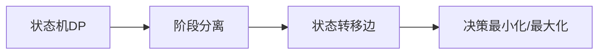

# 状态机 DP

状态机 DP 将问题建模为有限状态之间的转移，每个阶段根据当前状态做出决策并转移到下一状态。它是解决"带约束选择"问题（如股票买卖系列）的通用框架。

## 一、核心思想



将 DP 的"阶段"和"状态"显式分离：
- **阶段**：时间/位置（第 i 天、第 i 个字符）
- **状态**：当前所处的模式（持有/不持有、奇数次/偶数次）

转移 = 在当前状态下做决策 → 进入下一状态。

## 二、股票买卖系列

### 一次交易（LeetCode 121）

状态：0=不持有，1=持有

```java tab
int maxProfit(int[] prices) {
    int hold = -prices[0], cash = 0;
    for (int i = 1; i < prices.length; i++) {
        cash = Math.max(cash, hold + prices[i]); // 卖出
        hold = Math.max(hold, -prices[i]);       // 买入
    }
    return cash;
}
```
```typescript tab
function maxProfit(prices: number[]): number {
    let hold = -prices[0], cash = 0;
    for (let i = 1; i < prices.length; i++) {
        cash = Math.max(cash, hold + prices[i]); // 卖出
        hold = Math.max(hold, -prices[i]);       // 买入
    }
    return cash;
}
```
```python tab
def max_profit(prices: list[int]) -> int:
    hold, cash = -prices[0], 0
    for i in range(1, len(prices)):
        cash = max(cash, hold + prices[i])  # 卖出
        hold = max(hold, -prices[i])        # 买入
    return cash
```

### 无限次交易（LeetCode 122）

```java tab
int maxProfit(int[] prices) {
    int hold = -prices[0], cash = 0;
    for (int i = 1; i < prices.length; i++) {
        int newCash = Math.max(cash, hold + prices[i]);
        int newHold = Math.max(hold, cash - prices[i]);
        cash = newCash;
        hold = newHold;
    }
    return cash;
}
```
```typescript tab
function maxProfit(prices: number[]): number {
    let hold = -prices[0], cash = 0;
    for (let i = 1; i < prices.length; i++) {
        const newCash = Math.max(cash, hold + prices[i]);
        const newHold = Math.max(hold, cash - prices[i]);
        cash = newCash;
        hold = newHold;
    }
    return cash;
}
```
```python tab
def max_profit(prices: list[int]) -> int:
    hold, cash = -prices[0], 0
    for i in range(1, len(prices)):
        new_cash = max(cash, hold + prices[i])
        new_hold = max(hold, cash - prices[i])
        cash = new_cash
        hold = new_hold
    return cash
```

### 最多 k 次交易（LeetCode 188）

状态：(天数, 已交易次数, 是否持有)

```java tab
int maxProfit(int k, int[] prices) {
    int n = prices.length;
    if (k >= n / 2) return greedyProfit(prices); // 退化为无限次

    int[][] hold = new int[n][k + 1];
    int[][] cash = new int[n][k + 1];
    for (int j = 0; j <= k; j++) hold[0][j] = -prices[0];

    for (int i = 1; i < n; i++) {
        for (int j = 1; j <= k; j++) {
            cash[i][j] = Math.max(cash[i-1][j], hold[i-1][j] + prices[i]);
            hold[i][j] = Math.max(hold[i-1][j], cash[i-1][j-1] - prices[i]);
        }
    }
    return cash[n-1][k];
}
```
```typescript tab
function maxProfit(k: number, prices: number[]): number {
    const n = prices.length;
    if (k >= Math.floor(n / 2)) return greedyProfit(prices); // 退化为无限次

    const hold: number[][] = Array.from({ length: n }, () => new Array(k + 1).fill(0));
    const cash: number[][] = Array.from({ length: n }, () => new Array(k + 1).fill(0));
    for (let j = 0; j <= k; j++) hold[0][j] = -prices[0];

    for (let i = 1; i < n; i++) {
        for (let j = 1; j <= k; j++) {
            cash[i][j] = Math.max(cash[i-1][j], hold[i-1][j] + prices[i]);
            hold[i][j] = Math.max(hold[i-1][j], cash[i-1][j-1] - prices[i]);
        }
    }
    return cash[n-1][k];
}
```
```python tab
def max_profit(k: int, prices: list[int]) -> int:
    n = len(prices)
    if k >= n // 2:
        return greedy_profit(prices)  # 退化为无限次

    hold = [[0] * (k + 1) for _ in range(n)]
    cash = [[0] * (k + 1) for _ in range(n)]
    for j in range(k + 1):
        hold[0][j] = -prices[0]

    for i in range(1, n):
        for j in range(1, k + 1):
            cash[i][j] = max(cash[i-1][j], hold[i-1][j] + prices[i])
            hold[i][j] = max(hold[i-1][j], cash[i-1][j-1] - prices[i])
    return cash[n-1][k]
```

### 含冷冻期（LeetCode 309）

三个状态：持有、不持有（冷冻）、不持有（非冷冻）

```java tab
int maxProfit(int[] prices) {
    int hold = -prices[0], frozen = 0, free = 0;
    for (int i = 1; i < prices.length; i++) {
        int newHold = Math.max(hold, free - prices[i]);
        int newFrozen = hold + prices[i]; // 卖出 → 进入冷冻
        int newFree = Math.max(free, frozen); // 冷冻结束
        hold = newHold; frozen = newFrozen; free = newFree;
    }
    return Math.max(frozen, free);
}
```
```typescript tab
function maxProfit(prices: number[]): number {
    let hold = -prices[0], frozen = 0, free = 0;
    for (let i = 1; i < prices.length; i++) {
        const newHold = Math.max(hold, free - prices[i]);
        const newFrozen = hold + prices[i]; // 卖出 → 进入冷冻
        const newFree = Math.max(free, frozen); // 冷冻结束
        hold = newHold; frozen = newFrozen; free = newFree;
    }
    return Math.max(frozen, free);
}
```
```python tab
def max_profit(prices: list[int]) -> int:
    hold, frozen, free = -prices[0], 0, 0
    for i in range(1, len(prices)):
        new_hold = max(hold, free - prices[i])
        new_frozen = hold + prices[i]  # 卖出 → 进入冷冻
        new_free = max(free, frozen)   # 冷冻结束
        hold, frozen, free = new_hold, new_frozen, new_free
    return max(frozen, free)
```

## 三、通用状态机模板

```java tab
// dp[i][state] = 第 i 阶段处于 state 的最优值
for (int i = 1; i <= n; i++) {
    for (int s = 0; s < NUM_STATES; s++) {
        dp[i][s] = -INF;
        for (int prev : transitions[s]) { // 哪些状态能转移到 s
            dp[i][s] = Math.max(dp[i][s], dp[i-1][prev] + gain[i][s]);
        }
    }
}
```
```typescript tab
// dp[i][state] = 第 i 阶段处于 state 的最优值
for (let i = 1; i <= n; i++) {
    for (let s = 0; s < NUM_STATES; s++) {
        dp[i][s] = -INF;
        for (const prev of transitions[s]) { // 哪些状态能转移到 s
            dp[i][s] = Math.max(dp[i][s], dp[i-1][prev] + gain[i][s]);
        }
    }
}
```
```python tab
# dp[i][state] = 第 i 阶段处于 state 的最优值
for i in range(1, n + 1):
    for s in range(NUM_STATES):
        dp[i][s] = -INF
        for prev in transitions[s]:  # 哪些状态能转移到 s
            dp[i][s] = max(dp[i][s], dp[i-1][prev] + gain[i][s])
```

## 四、其他状态机 DP 例题

| 问题 | 状态 |
|------|------|
| 打家劫舍（不能相邻） | 偷/不偷 |
| 正则表达式匹配 | 匹配状态 |
| 编辑距离 | 操作状态 |
| 自动机 DP（数位） | 自动机状态 |
| 颜色交替子序列 | 上一个颜色 |

### 打家劫舍

```java tab
// 状态：0=不偷当前，1=偷当前
int rob(int[] nums) {
    int notRob = 0, rob = nums[0];
    for (int i = 1; i < nums.length; i++) {
        int newRob = notRob + nums[i];
        int newNotRob = Math.max(notRob, rob);
        rob = newRob; notRob = newNotRob;
    }
    return Math.max(rob, notRob);
}
```
```typescript tab
// 状态：0=不偷当前，1=偷当前
function rob(nums: number[]): number {
    let notRob = 0, robVal = nums[0];
    for (let i = 1; i < nums.length; i++) {
        const newRob = notRob + nums[i];
        const newNotRob = Math.max(notRob, robVal);
        robVal = newRob; notRob = newNotRob;
    }
    return Math.max(robVal, notRob);
}
```
```python tab
# 状态：0=不偷当前，1=偷当前
def rob(nums: list[int]) -> int:
    not_rob, rob_val = 0, nums[0]
    for i in range(1, len(nums)):
        new_rob = not_rob + nums[i]
        new_not_rob = max(not_rob, rob_val)
        rob_val, not_rob = new_rob, new_not_rob
    return max(rob_val, not_rob)
```

## 五、状态机 DP vs 普通 DP

| 维度 | 普通 DP | 状态机 DP |
|------|---------|----------|
| 状态 | dp[i] 或 dp[i][j] | dp[i][状态] |
| 转移 | 从前面某个位置 | 从前面某个状态 |
| 适用 | 子问题有明确递推 | 有"模式切换"的约束 |
| 典型 | LIS、背包 | 股票、自动机、约束选择 |

## 六、面试要点

1. **画状态转移图**：明确有哪些状态、哪些转移
2. **股票系列**：hold/cash 两变量滚动
3. **冷冻期/手续费**：增加状态维度
4. **空间优化**：状态数有限 → O(1) 空间
5. **LeetCode**：121/122/123/188/309/714（股票系列）、198/213/337（打家劫舍）
