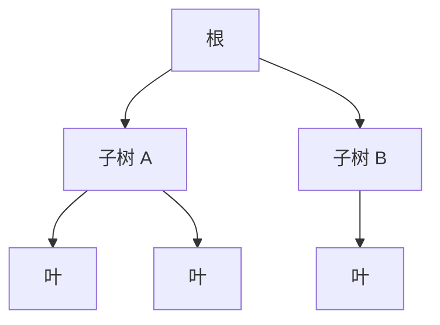

# 树形 DP：在树上做动态规划


## 一、什么是树形 DP

**树形 DP** 是在树结构上进行动态规划。状态定义在**节点**上，转移通过**子节点 → 父节点**（后序遍历）完成。

核心模式：
- 状态：`dp[u]` 表示以节点 u 为根的子树的某个最优值
- 转移：遍历 u 的所有子节点 v，用 `dp[v]` 更新 `dp[u]`
- 遍历顺序：**后序**（先处理子树，再处理当前节点）



> 先算 C、D → 算 A → 算 E → 算 B → 最后算根。

## 二、通用模板

```java tab
void treeDP(TreeNode node) {
    if (node == null) return;
    // 后序：先递归子节点
    treeDP(node.left);
    treeDP(node.right);
    // 用子节点的结果更新当前节点
    dp[node] = f(dp[node.left], dp[node.right]);
}
```

```typescript tab
function treeDP(node: TreeNode | null): void {
    if (!node) return;
    // 后序：先递归子节点
    treeDP(node.left);
    treeDP(node.right);
    // 用子节点的结果更新当前节点
    dp.set(node, f(dp.get(node.left), dp.get(node.right)));
}
```

```python tab
def tree_dp(node) -> None:
    if node is None:
        return
    # 后序：先递归子节点
    tree_dp(node.left)
    tree_dp(node.right)
    # 用子节点的结果更新当前节点
    dp[node] = f(dp[node.left], dp[node.right])
```

## 三、经典案例

### 3.1 二叉树的最大深度

最基础的树形 DP：

```java tab
public int maxDepth(TreeNode root) {
    if (root == null) return 0;
    return 1 + Math.max(maxDepth(root.left), maxDepth(root.right));
}
```

```typescript tab
function maxDepth(root: TreeNode | null): number {
    if (!root) return 0;
    return 1 + Math.max(maxDepth(root.left), maxDepth(root.right));
}
```

```python tab
def max_depth(root) -> int:
    if root is None:
        return 0
    return 1 + max(max_depth(root.left), max_depth(root.right))
```

### 3.2 打家劫舍 III（树形 DP）

**问题**：树上每个节点有金额，不能偷相邻节点，求最大金额。

```java tab
public int rob(TreeNode root) {
    int[] result = dfs(root);
    return Math.max(result[0], result[1]);
}

// 返回 [不偷当前节点的最大值, 偷当前节点的最大值]
private int[] dfs(TreeNode node) {
    if (node == null) return new int[]{0, 0};
    int[] left = dfs(node.left);
    int[] right = dfs(node.right);

    int notRob = Math.max(left[0], left[1]) + Math.max(right[0], right[1]);
    int rob = node.val + left[0] + right[0];

    return new int[]{notRob, rob};
}
```

```typescript tab
function rob(root: TreeNode | null): number {
    const dfs = (node: TreeNode | null): [number, number] => {
        if (!node) return [0, 0];
        const [ln, lr] = dfs(node.left);
        const [rn, rr] = dfs(node.right);
        const notRob = Math.max(ln, lr) + Math.max(rn, rr);
        const robIt = node.val + ln + rn;
        return [notRob, robIt];
    };
    return Math.max(...dfs(root));
}
```

```python tab
def rob(root) -> int:
    def dfs(node):
        if not node:
            return (0, 0)
        left = dfs(node.left)
        right = dfs(node.right)
        not_rob = max(left) + max(right)
        rob_it = node.val + left[0] + right[0]
        return (not_rob, rob_it)
    return max(dfs(root))
```

- **时间**：O(n)，**空间**：O(h)（递归栈）

### 3.3 二叉树的直径

**问题**：任意两节点间最长路径的边数。

```java tab
private int diameter = 0;

public int diameterOfBinaryTree(TreeNode root) {
    depth(root);
    return diameter;
}

private int depth(TreeNode node) {
    if (node == null) return 0;
    int left = depth(node.left);
    int right = depth(node.right);
    diameter = Math.max(diameter, left + right);   // 经过当前节点的最长路径
    return 1 + Math.max(left, right);
}
```

```typescript tab
let diameter = 0;

function diameterOfBinaryTree(root: TreeNode | null): number {
    diameter = 0;
    depth(root);
    return diameter;
}

function depth(node: TreeNode | null): number {
    if (!node) return 0;
    const left = depth(node.left);
    const right = depth(node.right);
    diameter = Math.max(diameter, left + right);
    return 1 + Math.max(left, right);
}
```

```python tab
diameter = 0

def diameter_of_binary_tree(root) -> int:
    global diameter
    diameter = 0

    def depth(node) -> int:
        global diameter
        if node is None:
            return 0
        left = depth(node.left)
        right = depth(node.right)
        diameter = max(diameter, left + right)
        return 1 + max(left, right)

    depth(root)
    return diameter
```

### 3.4 树的最大独立集

**问题**：一般树上选不相邻节点使权值和最大。

```java tab
// dp[u][0] = 不选 u 的最大值
// dp[u][1] = 选 u 的最大值
void dfs(int u, int parent) {
    dp[u][0] = 0;
    dp[u][1] = weight[u];
    for (int v : children[u]) {
        if (v == parent) continue;
        dfs(v, u);
        dp[u][0] += Math.max(dp[v][0], dp[v][1]);
        dp[u][1] += dp[v][0];
    }
}
// 答案 = max(dp[root][0], dp[root][1])
```

```typescript tab
// dp[u][0] = 不选 u 的最大值
// dp[u][1] = 选 u 的最大值
function dfs(u: number, parent: number): void {
    dp[u][0] = 0;
    dp[u][1] = weight[u];
    for (const v of children[u]) {
        if (v === parent) continue;
        dfs(v, u);
        dp[u][0] += Math.max(dp[v][0], dp[v][1]);
        dp[u][1] += dp[v][0];
    }
}
// 答案 = Math.max(dp[root][0], dp[root][1])
```

```python tab
# dp[u][0] = 不选 u 的最大值
# dp[u][1] = 选 u 的最大值
def dfs(u: int, parent: int) -> None:
    dp[u][0] = 0
    dp[u][1] = weight[u]
    for v in children[u]:
        if v == parent:
            continue
        dfs(v, u)
        dp[u][0] += max(dp[v][0], dp[v][1])
        dp[u][1] += dp[v][0]
# 答案 = max(dp[root][0], dp[root][1])
```

### 3.5 树的中心（最小化最大距离）

**问题**：找一个节点使得到所有其他节点的最大距离最小。

```java tab
// 两次 DFS：
// 第一次：求每个节点向下的最长路径 down1[u], down2[u]
// 第二次：求每个节点向上的最长路径 up[u]
// 答案 = min(max(down1[u], up[u]))
```

```typescript tab
// 两次 DFS：
// 第一次：求每个节点向下的最长路径 down1[u], down2[u]
// 第二次：求每个节点向上的最长路径 up[u]
// 答案 = Math.min(Math.max(down1[u], up[u]))
```

```python tab
# 两次 DFS：
# 第一次：求每个节点向下的最长路径 down1[u], down2[u]
# 第二次：求每个节点向上的最长路径 up[u]
# 答案 = min(max(down1[u], up[u]))
```

## 四、树形 DP 的常见状态设计

| 状态形式 | 含义 | 示例 |
|----------|------|------|
| `dp[u]` | 以 u 为根的子树最优值 | 最大深度 |
| `dp[u][0/1]` | 选/不选 u | 打家劫舍、最大独立集 |
| `dp[u][k]` | 以 u 为根，选 k 个节点 | 树形背包 |
| `dp[u][v]` | u 到 v 的路径信息 | 树的直径 |

## 五、树形背包

**问题**：树上每个节点有重量和价值，在总重量限制下选节点（选了子节点必须选父节点），求最大价值。

```java tab
// dp[u][j] = 以 u 为根的子树中选 j 个节点的最大价值
void dfs(int u, int parent) {
    dp[u][1] = value[u];   // 选 u 本身
    int size = 1;
    for (int v : children[u]) {
        if (v == parent) continue;
        dfs(v, u);
        // 合并子树 v 的背包
        for (int j = size + subtreeSize[v]; j >= 2; j--) {
            for (int k = 1; k < j; k++) {
                dp[u][j] = Math.max(dp[u][j], dp[u][j - k] + dp[v][k]);
            }
        }
        size += subtreeSize[v];
    }
}
```

```typescript tab
// dp[u][j] = 以 u 为根的子树中选 j 个节点的最大价值
function dfs(u: number, parent: number): void {
    dp[u][1] = value[u];   // 选 u 本身
    let size = 1;
    for (const v of children[u]) {
        if (v === parent) continue;
        dfs(v, u);
        // 合并子树 v 的背包
        for (let j = size + subtreeSize[v]; j >= 2; j--) {
            for (let k = 1; k < j; k++) {
                dp[u][j] = Math.max(dp[u][j], dp[u][j - k] + dp[v][k]);
            }
        }
        size += subtreeSize[v];
    }
}
```

```python tab
# dp[u][j] = 以 u 为根的子树中选 j 个节点的最大价值
def dfs(u: int, parent: int) -> None:
    dp[u][1] = value[u]  # 选 u 本身
    size = 1
    for v in children[u]:
        if v == parent:
            continue
        dfs(v, u)
        # 合并子树 v 的背包
        for j in range(size + subtree_size[v], 1, -1):
            for k in range(1, j):
                dp[u][j] = max(dp[u][j], dp[u][j - k] + dp[v][k])
        size += subtree_size[v]
```

- **时间**：O(n²)（均摊分析）

## 六、面试常见题

- 🟢 最大深度、最小深度、对称二叉树
- 🟡 打家劫舍 III、二叉树直径、路径总和
- 🟠 二叉树中的最大路径和、监控二叉树
- 🔴 树的最大独立集、树形背包、树的中心

## 七、调试技巧

1. **后序遍历**：确保子节点先于父节点计算。
2. **null 处理**：递归基返回 `{0, 0}` 或 `0`。
3. **全局变量**：直径、最大路径和等用全局变量在递归中更新。
4. **一般树 vs 二叉树**：一般树用邻接表 + parent 参数避免回走。
