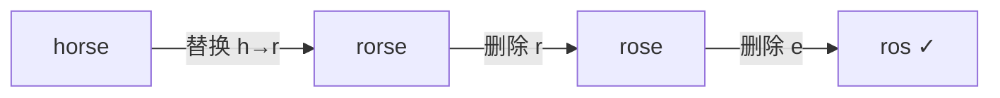

# 编辑距离：二维 DP 的巅峰之作

## 一、问题定义与心智模型

**编辑距离**（Levenshtein Distance）：给定两个字符串 `word1` 和 `word2`，求将 `word1` 转换成 `word2` 所需的**最少操作次数**。允许三种操作：

| 操作 | 含义 | 示例 |
|------|------|------|
| 插入 | 在任意位置插入一个字符 | `ab` → `abc` |
| 删除 | 删除任意一个字符 | `abc` → `ab` |
| 替换 | 将任意字符替换为另一个 | `abc` → `adc` |

**心智模型**：想象你在用编辑器逐字符"对齐"两个字符串。每一步要么让两个指针同时前进（字符相同则免费），要么花 1 次操作消除一个"不对齐"。



> `horse → rorse → rose → ros`，编辑距离 = 3。

## 二、状态定义与转移方程

### 2.1 状态

`dp[i][j]` = 将 `word1` 的前 `i` 个字符转换为 `word2` 的前 `j` 个字符所需的最少操作数。

### 2.2 转移

对于 `word1[i-1]` 和 `word2[j-1]`：

```text
若 word1[i-1] == word2[j-1]：
    dp[i][j] = dp[i-1][j-1]              // 字符相同，无需操作

否则：
    dp[i][j] = 1 + min(
        dp[i-1][j],      // 删除 word1[i-1]
        dp[i][j-1],      // 插入 word2[j-1]
        dp[i-1][j-1]     // 替换 word1[i-1] → word2[j-1]
    )
```

### 2.3 边界条件

```text
dp[0][j] = j    // 空串 → word2 前 j 个字符：插入 j 次
dp[i][0] = i    // word1 前 i 个字符 → 空串：删除 i 次
```

### 2.4 填表过程示例

`word1 = "ab"`, `word2 = "cb"`：

|  | ∅ | c | b |
|--|---|---|---|
| ∅ | 0 | 1 | 2 |
| a | 1 | 1 | 2 |
| b | 2 | 2 | **1** |

`dp[2][2] = 1`（替换 a→c）。

## 三、完整实现

```java tab
public int minDistance(String word1, String word2) {
    int m = word1.length(), n = word2.length();
    int[][] dp = new int[m + 1][n + 1];

    // 边界：空串转换
    for (int i = 0; i <= m; i++) dp[i][0] = i;
    for (int j = 0; j <= n; j++) dp[0][j] = j;

    for (int i = 1; i <= m; i++) {
        for (int j = 1; j <= n; j++) {
            if (word1.charAt(i - 1) == word2.charAt(j - 1)) {
                dp[i][j] = dp[i - 1][j - 1];
            } else {
                dp[i][j] = 1 + Math.min(dp[i - 1][j - 1],
                               Math.min(dp[i - 1][j], dp[i][j - 1]));
            }
        }
    }
    return dp[m][n];
}
```

```typescript tab
function minDistance(word1: string, word2: string): number {
    const m = word1.length, n = word2.length;
    const dp: number[][] = Array.from({ length: m + 1 }, () => new Array(n + 1).fill(0));

    for (let i = 0; i <= m; i++) dp[i][0] = i;
    for (let j = 0; j <= n; j++) dp[0][j] = j;

    for (let i = 1; i <= m; i++) {
        for (let j = 1; j <= n; j++) {
            if (word1[i - 1] === word2[j - 1]) {
                dp[i][j] = dp[i - 1][j - 1];
            } else {
                dp[i][j] = 1 + Math.min(dp[i - 1][j - 1], dp[i - 1][j], dp[i][j - 1]);
            }
        }
    }
    return dp[m][n];
}
```

```python tab
def minDistance(word1: str, word2: str) -> int:
    m, n = len(word1), len(word2)
    dp = [[0] * (n + 1) for _ in range(m + 1)]

    for i in range(m + 1):
        dp[i][0] = i
    for j in range(n + 1):
        dp[0][j] = j

    for i in range(1, m + 1):
        for j in range(1, n + 1):
            if word1[i - 1] == word2[j - 1]:
                dp[i][j] = dp[i - 1][j - 1]
            else:
                dp[i][j] = 1 + min(dp[i - 1][j - 1], dp[i - 1][j], dp[i][j - 1])
    return dp[m][n]
```

**复杂度**：时间 O(m·n)，空间 O(m·n)。

## 四、空间优化（滚动数组）

`dp[i][j]` 只依赖上一行和当前行左侧，可以压缩到 O(n)：

```java tab
public int minDistance(String word1, String word2) {
    int m = word1.length(), n = word2.length();
    int[] dp = new int[n + 1];
    for (int j = 0; j <= n; j++) dp[j] = j;

    for (int i = 1; i <= m; i++) {
        int prev = dp[0];      // 保存 dp[i-1][j-1]
        dp[0] = i;
        for (int j = 1; j <= n; j++) {
            int temp = dp[j];  // 当前 dp[j] 还是 dp[i-1][j]
            if (word1.charAt(i - 1) == word2.charAt(j - 1)) {
                dp[j] = prev;
            } else {
                dp[j] = 1 + Math.min(prev, Math.min(dp[j], dp[j - 1]));
            }
            prev = temp;
        }
    }
    return dp[n];
}
```

```typescript tab
function minDistance(word1: string, word2: string): number {
    const m = word1.length, n = word2.length;
    const dp: number[] = Array.from({ length: n + 1 }, (_, j) => j);

    for (let i = 1; i <= m; i++) {
        let prev = dp[0];
        dp[0] = i;
        for (let j = 1; j <= n; j++) {
            const temp = dp[j];
            dp[j] = word1[i - 1] === word2[j - 1]
                ? prev
                : 1 + Math.min(prev, dp[j], dp[j - 1]);
            prev = temp;
        }
    }
    return dp[n];
}
```

```python tab
def minDistance(word1: str, word2: str) -> int:
    m, n = len(word1), len(word2)
    dp = list(range(n + 1))

    for i in range(1, m + 1):
        prev = dp[0]
        dp[0] = i
        for j in range(1, n + 1):
            temp = dp[j]
            if word1[i - 1] == word2[j - 1]:
                dp[j] = prev
            else:
                dp[j] = 1 + min(prev, dp[j], dp[j - 1])
            prev = temp
    return dp[n]
```

**空间**：O(n)。注意 `prev` 变量保存"左上角"值是滚动数组的经典技巧。

## 五、三种操作的几何直觉

把 `dp` 表格想象成一个网格，从 `(0,0)` 走到 `(m,n)`：

| 移动方向 | 对应操作 | 代价 |
|----------|----------|------|
| 对角线 ↘ | 匹配/替换 | 0 或 1 |
| 向下 ↓ | 删除 word1 的字符 | 1 |
| 向右 → | 插入 word2 的字符 | 1 |

编辑距离 = 从左上到右下的**最短路径**。

## 六、变体问题

### 6.1 只允许插入和删除

此时"替换"不可用。设 LCS 长度为 `l`：

```text
答案 = (m - l) + (n - l) = m + n - 2l
```

删除 word1 中不在 LCS 里的字符，再插入 word2 中不在 LCS 里的字符。

### 6.2 判断编辑距离是否为 1

一次扫描：找到第一个不同位置，然后比较剩余部分：

```typescript tab
function isOneEditDistance(s: string, t: string): boolean {
    const m = s.length, n = t.length;
    if (Math.abs(m - n) > 1) return false;

    for (let i = 0; i < Math.min(m, n); i++) {
        if (s[i] !== t[i]) {
            if (m === n) return s.slice(i + 1) === t.slice(i + 1);   // 替换
            if (m > n) return s.slice(i + 1) === t.slice(i);         // 删除 s[i]
            return s.slice(i) === t.slice(i + 1);                    // 插入
        }
    }
    return m !== n;  // 前缀相同，长度差 1 才行
}
```

### 6.3 回溯具体操作序列

从 `dp[m][n]` 反向追踪每一步的选择：

```typescript tab
function getOperations(word1: string, word2: string): string[] {
    const m = word1.length, n = word2.length;
    const dp: number[][] = Array.from({ length: m + 1 }, () => new Array(n + 1).fill(0));
    for (let i = 0; i <= m; i++) dp[i][0] = i;
    for (let j = 0; j <= n; j++) dp[0][j] = j;
    for (let i = 1; i <= m; i++)
        for (let j = 1; j <= n; j++)
            dp[i][j] = word1[i-1] === word2[j-1]
                ? dp[i-1][j-1]
                : 1 + Math.min(dp[i-1][j-1], dp[i-1][j], dp[i][j-1]);

    const ops: string[] = [];
    let i = m, j = n;
    while (i > 0 || j > 0) {
        if (i > 0 && j > 0 && word1[i-1] === word2[j-1]) { i--; j--; continue; }
        if (i > 0 && j > 0 && dp[i][j] === dp[i-1][j-1] + 1) {
            ops.unshift(`替换 ${word1[i-1]} → ${word2[j-1]}`); i--; j--;
        } else if (i > 0 && dp[i][j] === dp[i-1][j] + 1) {
            ops.unshift(`删除 ${word1[i-1]}`); i--;
        } else {
            ops.unshift(`插入 ${word2[j-1]}`); j--;
        }
    }
    return ops;
}
```

## 七、编辑距离 vs LCS vs 最长公共子串

| 问题 | dp 含义 | 转移核心 |
|------|---------|----------|
| 编辑距离 | 前i→前j 最少操作 | min(删/插/替) |
| LCS | 前i、前j 最长公共子序列 | 相同则 +1，否则 max |
| 最长公共子串 | 以i、j结尾的最长公共子串 | 相同则 +1，不同归零 |

三者共享同一个"二维对齐"框架，只是转移语义不同。

## 八、面试常见题

- 🟡 LeetCode 72. 编辑距离（本题）
- 🟢 LeetCode 583. 两个字符串的删除操作（只删变体）
- 🟢 LeetCode 712. 两个字符串的最小 ASCII 删除和（加权删除）
- 🟡 LeetCode 161. 相隔为 1 的编辑距离
- 🟡 LeetCode 44. 通配符匹配（类编辑距离思维）
- 🔴 LeetCode 10. 正则表达式匹配（加入 `*` 的扩展）

## 九、易错点

1. **下标偏移**：`dp[i][j]` 对应 `word1[i-1]`，写转移时最容易搞混。
2. **边界初始化遗漏**：`dp[i][0]=i` 和 `dp[0][j]=j` 缺一不可。
3. **滚动数组的 prev**：必须在覆盖 `dp[j]` 之前保存旧值，顺序错了结果全错。
4. **相同字符时不加 1**：`dp[i][j] = dp[i-1][j-1]` 而非 `dp[i-1][j-1] + 1`。

## 十、心法口诀

> **两串对齐看末尾，相同免费不同修；**
> **删插替换三选一，边界空串全靠凑。**
