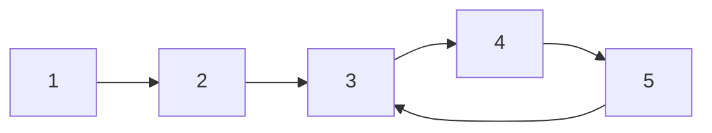

# 快慢指针：环检测与中点定位的利器

## 一、核心思想

快慢指针（Floyd's Tortoise and Hare）：两个指针从同一起点出发，**快指针每次走两步，慢指针每次走一步**。

- 如果存在环：快指针必然追上慢指针（两者在环内相遇）
- 如果无环：快指针先到达终点



> 上图中，快慢指针从节点 1 出发，最终在环内相遇。

**为什么一定能追上？** 进入环后，快指针每步比慢指针多走 1 格，两者距离每步缩小 1，必然相遇。

## 二、LC 141：判断链表是否有环

```java tab
public boolean hasCycle(ListNode head) {
    ListNode slow = head, fast = head;
    while (fast != null && fast.next != null) {
        slow = slow.next;
        fast = fast.next.next;
        if (slow == fast) return true;
    }
    return false;
}
```

```typescript tab
function hasCycle(head: ListNode | null): boolean {
    let slow = head, fast = head;
    while (fast && fast.next) {
        slow = slow!.next;
        fast = fast.next.next;
        if (slow === fast) return true;
    }
    return false;
}
```

```python tab
def hasCycle(head: ListNode) -> bool:
    slow = fast = head
    while fast and fast.next:
        slow = slow.next
        fast = fast.next.next
        if slow is fast:
            return True
    return False
```

**复杂度**：时间 O(n)，空间 O(1)。

**循环条件**：`fast != null && fast.next != null`——快指针走两步，必须保证两步都有效。

## 三、LC 142：找到环的入口节点

### 3.1 数学推导

设：起点到环入口距离为 `a`，环入口到相遇点距离为 `b`，相遇点绕回环入口距离为 `c`。

相遇时：
```text
慢指针走了：a + b
快指针走了：a + b + k(b + c)    // k ≥ 1，快指针在环里多绕了 k 圈
快指针速度是慢指针 2 倍：
    2(a + b) = a + b + k(b + c)
    a = k(b + c) - b = (k-1)(b+c) + c
```

**结论**：从相遇点和起点同时出发各走一步，相遇点就是环入口。

### 3.2 完整实现

```java tab
public ListNode detectCycle(ListNode head) {
    ListNode slow = head, fast = head;
    while (fast != null && fast.next != null) {
        slow = slow.next;
        fast = fast.next.next;
        if (slow == fast) {
            // 第二阶段：找入口
            ListNode ptr = head;
            while (ptr != slow) {
                ptr = ptr.next;
                slow = slow.next;
            }
            return ptr;
        }
    }
    return null;
}
```

```typescript tab
function detectCycle(head: ListNode | null): ListNode | null {
    let slow = head, fast = head;
    while (fast && fast.next) {
        slow = slow!.next;
        fast = fast.next.next;
        if (slow === fast) {
            let ptr = head;
            while (ptr !== slow) {
                ptr = ptr!.next;
                slow = slow!.next;
            }
            return ptr;
        }
    }
    return null;
}
```

```python tab
def detectCycle(head: ListNode) -> ListNode:
    slow = fast = head
    while fast and fast.next:
        slow = slow.next
        fast = fast.next.next
        if slow is fast:
            ptr = head
            while ptr is not slow:
                ptr = ptr.next
                slow = slow.next
            return ptr
    return None
```

## 四、LC 876：链表中间节点

快指针到终点时，慢指针恰好在中间：

```typescript tab
function middleNode(head: ListNode | null): ListNode | null {
    let slow = head, fast = head;
    while (fast && fast.next) {
        slow = slow!.next;
        fast = fast.next.next;
    }
    return slow;
}
```

```java tab
public ListNode middleNode(ListNode head) {
    ListNode slow = head, fast = head;
    while (fast != null && fast.next != null) {
        slow = slow.next;
        fast = fast.next.next;
    }
    return slow;
}
```

**奇偶行为**：
- 奇数个节点：返回正中间
- 偶数个节点：返回**第二个**中间节点（循环条件 `fast && fast.next` 决定）

若要偶数时返回第一个中间节点，条件改为 `fast.next && fast.next.next`。

## 五、LC 19：删除倒数第 N 个节点

快指针先走 n 步，然后快慢同步走，快指针到终点时慢指针在倒数第 n+1 个：

```typescript tab
function removeNthFromEnd(head: ListNode | null, n: number): ListNode | null {
    const dummy = new ListNode(0, head);
    let fast = dummy, slow = dummy;

    // 快指针先走 n+1 步
    for (let i = 0; i <= n; i++) fast = fast!.next;

    // 同步走
    while (fast) {
        fast = fast.next;
        slow = slow!.next;
    }

    // slow 此时在待删节点的前一个
    slow!.next = slow!.next!.next;
    return dummy.next;
}
```

```java tab
public ListNode removeNthFromEnd(ListNode head, int n) {
    ListNode dummy = new ListNode(0, head);
    ListNode fast = dummy, slow = dummy;

    for (int i = 0; i <= n; i++) fast = fast.next;

    while (fast != null) {
        fast = fast.next;
        slow = slow.next;
    }

    slow.next = slow.next.next;
    return dummy.next;
}
```

```python tab
def removeNthFromEnd(head: ListNode, n: int) -> ListNode:
    dummy = ListNode(0, head)
    fast = slow = dummy

    for _ in range(n + 1):
        fast = fast.next

    while fast:
        fast = fast.next
        slow = slow.next

    slow.next = slow.next.next
    return dummy.next
```

**dummy 节点的作用**：处理"删除的是头节点"这一边界。

## 六、LC 202：快乐数

对数字反复求"各位平方和"，最终要么到 1，要么进入循环——本质是**函数迭代的环检测**：

```typescript tab
function isHappy(n: number): boolean {
    const squareSum = (x: number): number => {
        let sum = 0;
        while (x > 0) {
            const d = x % 10;
            sum += d * d;
            x = Math.floor(x / 10);
        }
        return sum;
    };

    let slow = n, fast = squareSum(n);
    while (fast !== 1 && slow !== fast) {
        slow = squareSum(slow);
        fast = squareSum(squareSum(fast));
    }
    return fast === 1;
}
```

```python tab
def isHappy(n: int) -> bool:
    def square_sum(x: int) -> int:
        total = 0
        while x:
            x, d = divmod(x, 10)
            total += d * d
        return total

    slow, fast = n, square_sum(n)
    while fast != 1 and slow != fast:
        slow = square_sum(slow)
        fast = square_sum(square_sum(fast))
    return fast == 1
```

## 七、LC 287：寻找重复数（数组上的环检测）

数组 `nums` 长度为 n+1，值域 [1, n]，必有重复。把 `nums[i]` 看作"i 指向 nums[i]"的链表，重复数就是**环入口**：

```typescript tab
function findDuplicate(nums: number[]): number {
    // 第一阶段：找相遇点
    let slow = nums[0], fast = nums[0];
    do {
        slow = nums[slow];
        fast = nums[nums[fast]];
    } while (slow !== fast);

    // 第二阶段：找入口
    slow = nums[0];
    while (slow !== fast) {
        slow = nums[slow];
        fast = nums[fast];
    }
    return slow;
}
```

```java tab
public int findDuplicate(int[] nums) {
    int slow = nums[0], fast = nums[0];
    do {
        slow = nums[slow];
        fast = nums[nums[fast]];
    } while (slow != fast);

    slow = nums[0];
    while (slow != fast) {
        slow = nums[slow];
        fast = nums[fast];
    }
    return slow;
}
```

**为什么不能排序/哈希？** 题目要求 O(1) 空间且不修改数组——Floyd 算法是唯一解。

## 八、快慢指针应用总结

| 场景 | 指针策略 | 经典题 |
|------|----------|--------|
| 判断有环 | 快2慢1，相遇即有环 | LC 141 |
| 环入口 | 相遇后，头点同速再遇 | LC 142 |
| 链表中点 | 快到头，慢在中 | LC 876 |
| 倒数第 k 个 | 快先走 k 步 | LC 19 |
| 函数迭代环 | 值域映射为"指针" | LC 202, 287 |

## 九、面试常见题

- 🟢 LC 141. 环形链表（超高频）
- 🟡 LC 142. 环形链表 II
- 🟢 LC 876. 链表的中间结点
- 🟡 LC 19. 删除链表的倒数第 N 个结点
- 🟢 LC 202. 快乐数
- 🟡 LC 287. 寻找重复数
- 🟡 LC 234. 回文链表（快慢指针找中点 + 反转后半段）

## 十、易错点

1. **循环条件写错**：`fast && fast.next` 缺一不可，否则空指针异常。
2. **do-while vs while**：LC 287 起点相同，必须先走一步再比较（do-while）。
3. **中点奇偶歧义**：面试时确认偶数长度返回哪个中间节点。
4. **第二阶段起点**：找环入口时，一个从 head 出发，一个从相遇点出发，**同速**走。

## 十一、心法口诀

> **快二慢一终相遇，有环必追无环散；**
> **遇后头点同速走，再遇之处即入口。**
