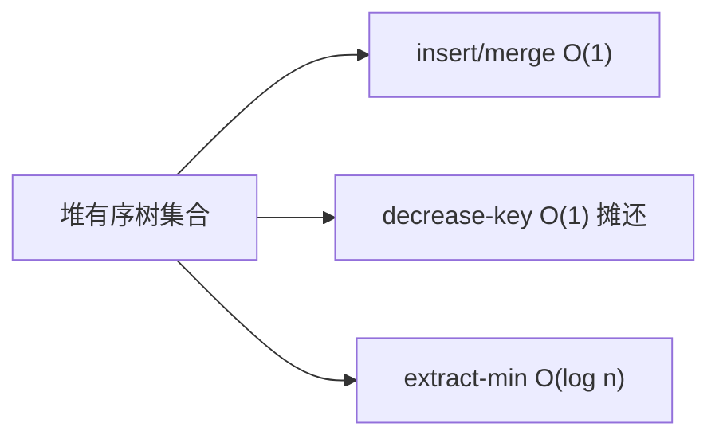

# 斐波那契堆（Fibonacci Heap）

## 一、为什么学斐波那契堆？



斐波那契堆是"惰性"堆，把多次 decrease-key 的代价摊还到 extract-min。理论复杂度极佳：

| 操作 | 二叉堆 | 斐波那契堆 |
|------|--------|-----------|
| insert | O(log n) | O(1) |
| extract-min | O(log n) | O(log n) 摊还 |
| decrease-key | O(log n) | O(1) 摊还 |
| merge | O(n) | O(1) |

这让 **Dijkstra / Prim 的 O(E log V)** 优化到 **O(E + V log V)**（用 decrease-key 版）。

## 二、结构

- 一组**堆有序树**的根用双向循环链表连接
- 每个节点记 degree（孩子数）、mark（是否被切过）
- 维护指向最小根的指针

## 三、核心思想

- **insert / merge**：直接挂到根链表，O(1)
- **decrease-key**：减小后若违反堆序，把该节点"切下"到根链表（级联切断被 mark 的父）
- **extract-min**：删最小根，把其孩子并入根链表，再"两两合并"相同 degree 的根

```java tab
class Node {
    int key, degree; boolean mark;
    Node parent, child, left, right;
}
void link(Node y, Node x) { // 把 y 挂为 x 的孩子
    // 从根链表移除 y，加入 x 的孩子循环链表，x.degree++
}
Node extractMin() {
    Node z = min;
    if (z != null) {
        if (z.child != null) {
            Node c = z.child;
            do { Node next = c.right; c.parent = null; c = next; } while (c != z.child);
        }
        // 将 z 的孩子并入根链表
        Node x = z.right;
        while (x != z) { x.parent = null; x = x.right; }
        // 从根链表移除 z，执行 consolidate()
    }
    return z;
}
```

```typescript tab
class Node {
    key = 0; degree = 0; mark = false;
    parent: Node | null = null; child: Node | null = null;
    left: Node | null = null; right: Node | null = null;
}
function link(y: Node, x: Node) {
    // 从根链表移除 y，加入 x 的孩子循环链表，x.degree++
}
function extractMin(): Node | null {
    const z = min;
    if (z) {
        if (z.child) {
            const start = z.child;
            let c: Node = start;
            do {
                const next = c.right!;
                c.parent = null;
                c = next;
            } while (c !== start);
        }
        let x = z.right;
        while (x !== z) { x.parent = null; x = x.right; }
        // 从根链表移除 z，执行 consolidate()
    }
    return z;
}
```

```python tab
class Node:
    def __init__(self):
        self.key = 0
        self.degree = 0
        self.mark = False
        self.parent = self.child = self.left = self.right = None
def link(y: Node, x: Node):
    # 从根链表移除 y，加入 x 的孩子循环链表，x.degree += 1
    pass
def extract_min():
    z = min_node
    if z:
        if z.child:
            start = z.child
            c = start
            while True:
                nxt = c.right
                c.parent = None
                c = nxt
                if c is start:
                    break
        x = z.right
        while x is not z:
            x.parent = None
            x = x.right
        # 从根链表移除 z，执行 consolidate()
    return z
```

## 四、复杂度

| 操作 | 摊还复杂度 |
|------|-----------|
| insert / merge / decrease-key | O(1) |
| extract-min | O(log n) |

## 五、面试要点

1. 优势在 decrease-key 的 O(1) 摊还，靠"惰性合并 + 级联切断"
2. 常数项大，工程上常用二叉堆/配对堆替代
3. 理论价值高：最优 Dijkstra/Prim 的基础
