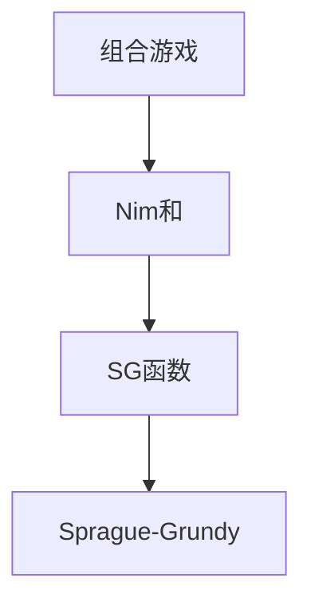

# 博弈论基础

博弈论研究多个理性决策者之间的策略互动。在算法竞赛中，Nim 游戏、SG 函数和 Sprague-Grundy 定理是核心工具，能判定组合游戏的必胜/必败态。

## 一、组合游戏基本模型



- 两人轮流操作
- 信息完全公开
- 无法操作者输（Normal Play）
- 有限步内必结束（无平局）

## 二、必胜态与必败态

- **P 态（Previous/必败）**：当前玩家必败
- **N 态（Next/必胜）**：当前玩家必胜

规则：
1. 终态（无法操作）→ P 态
2. 能到达 P 态 → N 态
3. 所有后继都是 N 态 → P 态

## 三、Nim 游戏

n 堆石子，每堆 aᵢ 个，两人轮流从一堆取任意多个，取完者胜。

### Bouton 定理

**先手必胜 ⟺ a₁ ⊕ a₂ ⊕ ... ⊕ aₙ ≠ 0**

```java tab
boolean firstPlayerWins(int[] piles) {
    int xor = 0;
    for (int pile : piles) xor ^= pile;
    return xor != 0;
}
```

```typescript tab
function firstPlayerWins(piles: number[]): boolean {
    let xor = 0;
    for (const pile of piles) xor ^= pile;
    return xor !== 0;
}
```

```python tab
def first_player_wins(piles: list) -> bool:
    xor = 0
    for pile in piles:
        xor ^= pile
    return xor != 0
```

### 证明思路

1. 终态全 0，异或 = 0（P 态）
2. 异或 ≠ 0 时，一定存在一步使异或变为 0
3. 异或 = 0 时，任何操作都会使异或变为 ≠ 0

## 四、SG 函数（Sprague-Grundy）

### 定义

```
SG(x) = mex({SG(y) | y 是 x 的后继状态})
```

mex = 最小非负整数不在集合中。

### 性质

- SG(x) = 0 ⟺ P 态（必败）
- SG(x) > 0 ⟺ N 态（必胜）

### 计算示例

```java tab
// 一堆石子，每次可取 1、3、4 个
int[] sg = new int[n + 1];
sg[0] = 0;
for (int i = 1; i <= n; i++) {
    Set<Integer> reachable = new HashSet<>();
    if (i >= 1) reachable.add(sg[i - 1]);
    if (i >= 3) reachable.add(sg[i - 3]);
    if (i >= 4) reachable.add(sg[i - 4]);
    sg[i] = mex(reachable);
}

int mex(Set<Integer> s) {
    int m = 0;
    while (s.contains(m)) m++;
    return m;
}
```

```typescript tab
// 一堆石子，每次可取 1、3、4 个
const sg = new Array(n + 1).fill(0);
for (let i = 1; i <= n; i++) {
    const reachable = new Set<number>();
    if (i >= 1) reachable.add(sg[i - 1]);
    if (i >= 3) reachable.add(sg[i - 3]);
    if (i >= 4) reachable.add(sg[i - 4]);
    sg[i] = mex(reachable);
}

function mex(s: Set<number>): number {
    let m = 0;
    while (s.has(m)) m++;
    return m;
}
```

```python tab
# 一堆石子，每次可取 1、3、4 个
sg = [0] * (n + 1)
for i in range(1, n + 1):
    reachable = set()
    if i >= 1:
        reachable.add(sg[i - 1])
    if i >= 3:
        reachable.add(sg[i - 3])
    if i >= 4:
        reachable.add(sg[i - 4])
    sg[i] = mex(reachable)

def mex(s: set) -> int:
    m = 0
    while m in s:
        m += 1
    return m
```

## 五、Sprague-Grundy 定理

**多个独立游戏的组合 = 各游戏 SG 值的异或**

```
SG(游戏1 + 游戏2 + ... + 游戏n) = SG(游戏1) ⊕ SG(游戏2) ⊕ ... ⊕ SG(游戏n)
```

先手必胜 ⟺ 总 SG ≠ 0

## 六、经典博弈模型

| 游戏 | 结论 |
|------|------|
| Nim | 异或 ≠ 0 先手胜 |
| 巴什博弈（一堆，每次取 1~m） | n % (m+1) ≠ 0 先手胜 |
| 威佐夫博弈（两堆） | 黄金比例判定 |
| 阶梯 Nim | 奇数阶异或 |
| 树上删边 | SG = 子树 SG 异或 + 1 |

### 巴什博弈

```java tab
// n 个石子，每次取 1~m 个
boolean bashGame(int n, int m) {
    return n % (m + 1) != 0;
}
```

```typescript tab
// n 个石子，每次取 1~m 个
function bashGame(n: number, m: number): boolean {
    return n % (m + 1) !== 0;
}
```

```python tab
# n 个石子，每次取 1~m 个
def bash_game(n: int, m: int) -> bool:
    return n % (m + 1) != 0
```

## 七、面试要点

1. **Nim 异或**：最核心的结论，必须记住
2. **SG 函数**：mex 定义 + 后继状态集合
3. **组合游戏**：多个独立游戏 → SG 异或
4. **巴什博弈**：n % (m+1) 判定
5. **LeetCode**：292（Nim 游戏）、319（灯泡开关）、877（石子游戏）、1140（石子游戏 II）

## 八、Nim 游戏异或判定模拟

三堆石子 `[3, 4, 5]`，两人轮流从任一堆取任意个，取最后一个者胜：

```
计算异或和：3 ⊕ 4 ⊕ 5
  3 = 011
  4 = 100
  5 = 101
  ⊕ = 010 = 2 ≠ 0 → 先手必胜

先手的必胜策略：找到一堆使其减少后异或和为 0
  对堆 5：5 ⊕ 2 = 7 > 5 不行
  对堆 3：3 ⊕ 2 = 1 < 3 ✓ → 把 3 减为 1（取走2个）
  新局面 [1, 4, 5]：1 ⊕ 4 ⊕ 5 = 0 → 后手必败

无论后手怎么取，都会破坏异或=0 的状态，
先手总能再取回异或=0 → 最终先手取走最后一个 ✓
```

**为什么异或和 = 0 是必败态**：

```
两个关键性质：
  ① 异或和 ≠ 0 → 存在一步操作使其变为 0
  ② 异或和 = 0 → 任何操作都会使其变为 ≠ 0
∴ 面对 0 的人永远只能把非0 局面还给对方，
  而 0,0,…,0（全取完）是异或=0 的终态 → 面对0的人输
```

## 九、SG 函数与 mex

```python tab
# SG(x) = mex{ SG(y) | y 是 x 的后继状态 }
# mex = 不在集合中的最小非负整数
def compute_sg(max_n, moves):
    sg = [0] * (max_n + 1)
    for n in range(1, max_n + 1):
        reachable = set()
        for m in moves:
            if n >= m:
                reachable.add(sg[n - m])
        # mex
        g = 0
        while g in reachable:
            g += 1
        sg[n] = g
    return sg

# 例：每次可取 1 或 2 个 → sg[n] = n % 3
# 多个独立游戏并行：总 SG = 各游戏 SG 的异或
```

**SG 与 Nim 的统一**：任何公平组合游戏都等价于一堆大小为 SG(x) 的 Nim 石子。这就是 Sprague-Grundy 定理的威力——把复杂游戏化归为 Nim。

## 十、思考题

1. LC 292 Nim 游戏（每次取 1~3 个）为什么 `n % 4 == 0` 先手必败？这与巴什博弈公式 n % (m+1) 是什么关系？
2. 如果规则改为“取最后一个石子的人输”（misère 玩法），Nim 的异或结论还成立吗？需要如何调整？（提示：只剩单堆>1 时的特殊处理）
3. SG 函数为什么用 mex 而不是求和或最大值？（提示：保证“能到达 SG=0 的后继”与“SG=0 无 SG=0 后继”两个性质）

> 练习推荐：先理解 LC 292 Nim 游戏的异或结论，再挑战 LC 877 石子游戏（区间 DP 解法）。
