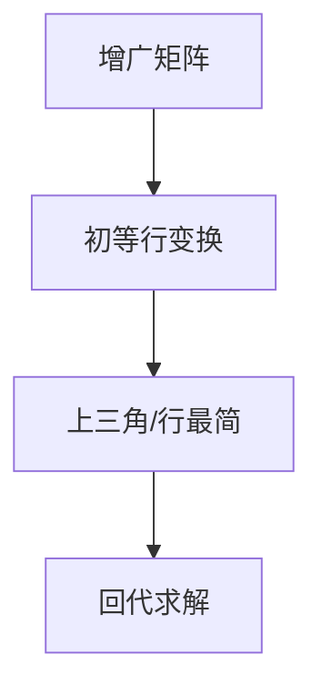

# 高斯消元

高斯消元法是求解线性方程组的经典算法，通过初等行变换将增广矩阵化为上三角（或行最简形），时间复杂度 O(n³)。

## 一、问题形式



求解 n 个未知数、n 个方程的线性方程组：

```
a₁₁x₁ + a₁₂x₂ + ... + a₁ₙxₙ = b₁
a₂₁x₁ + a₂₂x₂ + ... + a₂ₙxₙ = b₂
...
aₙ₁x₁ + aₙ₂x₂ + ... + aₙₙxₙ = bₙ
```

## 二、算法步骤

1. **消元**：将矩阵化为上三角
2. **回代**：从最后一行向上求解

### 代码实现

```java tab
// 高斯消元求解 Ax = b
// a[i][0..n-1] 是系数，a[i][n] 是常数项
// 返回解 x[]，无解/无穷解返回 null
double[] gauss(double[][] a, int n) {
    for (int col = 0; col < n; col++) {
        // 选主元（部分选主元，提高数值稳定性）
        int maxRow = col;
        for (int row = col + 1; row < n; row++) {
            if (Math.abs(a[row][col]) > Math.abs(a[maxRow][col])) {
                maxRow = row;
            }
        }
        // 交换行
        double[] tmp = a[col]; a[col] = a[maxRow]; a[maxRow] = tmp;

        // 主元为 0 → 奇异
        if (Math.abs(a[col][col]) < 1e-9) return null;

        // 消去下方
        for (int row = col + 1; row < n; row++) {
            double factor = a[row][col] / a[col][col];
            for (int j = col; j <= n; j++) {
                a[row][j] -= factor * a[col][j];
            }
        }
    }

    // 回代
    double[] x = new double[n];
    for (int i = n - 1; i >= 0; i--) {
        x[i] = a[i][n];
        for (int j = i + 1; j < n; j++) {
            x[i] -= a[i][j] * x[j];
        }
        x[i] /= a[i][i];
    }
    return x;
}
```

```typescript tab
// 高斯消元求解 Ax = b
// a[i][0..n-1] 是系数，a[i][n] 是常数项
// 返回解 x[]，无解/无穷解返回 null
function gauss(a: number[][], n: number): number[] | null {
    for (let col = 0; col < n; col++) {
        // 选主元（部分选主元，提高数值稳定性）
        let maxRow = col;
        for (let row = col + 1; row < n; row++) {
            if (Math.abs(a[row][col]) > Math.abs(a[maxRow][col])) {
                maxRow = row;
            }
        }
        // 交换行
        [a[col], a[maxRow]] = [a[maxRow], a[col]];

        // 主元为 0 → 奇异
        if (Math.abs(a[col][col]) < 1e-9) return null;

        // 消去下方
        for (let row = col + 1; row < n; row++) {
            const factor = a[row][col] / a[col][col];
            for (let j = col; j <= n; j++) {
                a[row][j] -= factor * a[col][j];
            }
        }
    }

    // 回代
    const x = new Array(n).fill(0);
    for (let i = n - 1; i >= 0; i--) {
        x[i] = a[i][n];
        for (let j = i + 1; j < n; j++) {
            x[i] -= a[i][j] * x[j];
        }
        x[i] /= a[i][i];
    }
    return x;
}
```

```python tab
# 高斯消元求解 Ax = b
# a[i][0..n-1] 是系数，a[i][n] 是常数项
# 返回解 x[]，无解/无穷解返回 None
def gauss(a: list, n: int) -> list:
    for col in range(n):
        # 选主元（部分选主元，提高数值稳定性）
        max_row = col
        for row in range(col + 1, n):
            if abs(a[row][col]) > abs(a[max_row][col]):
                max_row = row
        # 交换行
        a[col], a[max_row] = a[max_row], a[col]

        # 主元为 0 → 奇异
        if abs(a[col][col]) < 1e-9:
            return None

        # 消去下方
        for row in range(col + 1, n):
            factor = a[row][col] / a[col][col]
            for j in range(col, n + 1):
                a[row][j] -= factor * a[col][j]

    # 回代
    x = [0.0] * n
    for i in range(n - 1, -1, -1):
        x[i] = a[i][n]
        for j in range(i + 1, n):
            x[i] -= a[i][j] * x[j]
        x[i] /= a[i][i]
    return x
```

## 三、模意义下的高斯消元

在 mod p（p 为质数）下求解，用模逆元代替除法：

```java tab
int[] gaussMod(int[][] a, int n, int mod) {
    for (int col = 0; col < n; col++) {
        int maxRow = col;
        for (int row = col + 1; row < n; row++)
            if (a[row][col] != 0) { maxRow = row; break; }
        int[] tmp = a[col]; a[col] = a[maxRow]; a[maxRow] = tmp;
        if (a[col][col] == 0) return null;

        int inv = modInverse(a[col][col], mod);
        for (int row = 0; row < n; row++) {
            if (row == col || a[row][col] == 0) continue;
            int factor = (int)((long)a[row][col] * inv % mod);
            for (int j = col; j <= n; j++) {
                a[row][j] = (a[row][j] - (int)((long)factor * a[col][j] % mod) + mod) % mod;
            }
        }
    }
    int[] x = new int[n];
    for (int i = 0; i < n; i++) x[i] = (int)((long)a[i][n] * modInverse(a[i][i], mod) % mod);
    return x;
}
```

```typescript tab
function gaussMod(a: number[][], n: number, mod: number): number[] | null {
    for (let col = 0; col < n; col++) {
        let maxRow = col;
        for (let row = col + 1; row < n; row++)
            if (a[row][col] !== 0) { maxRow = row; break; }
        [a[col], a[maxRow]] = [a[maxRow], a[col]];
        if (a[col][col] === 0) return null;

        const inv = modInverse(a[col][col], mod);
        for (let row = 0; row < n; row++) {
            if (row === col || a[row][col] === 0) continue;
            const factor = a[row][col] * inv % mod;
            for (let j = col; j <= n; j++) {
                a[row][j] = ((a[row][j] - factor * a[col][j]) % mod + mod) % mod;
            }
        }
    }
    const x = new Array(n);
    for (let i = 0; i < n; i++) x[i] = a[i][n] * modInverse(a[i][i], mod) % mod;
    return x;
}
```

```python tab
def gauss_mod(a: list, n: int, mod: int) -> list:
    for col in range(n):
        max_row = col
        for row in range(col + 1, n):
            if a[row][col] != 0:
                max_row = row
                break
        a[col], a[max_row] = a[max_row], a[col]
        if a[col][col] == 0:
            return None

        inv = mod_inverse(a[col][col], mod)
        for row in range(n):
            if row == col or a[row][col] == 0:
                continue
            factor = a[row][col] * inv % mod
            for j in range(col, n + 1):
                a[row][j] = (a[row][j] - factor * a[col][j]) % mod
    x = [0] * n
    for i in range(n):
        x[i] = a[i][n] * mod_inverse(a[i][i], mod) % mod
    return x
```

## 四、判定解的情况

| 情况 | 条件 |
|------|------|
| 唯一解 | 秩 = n（主元个数 = 未知数个数） |
| 无穷多解 | 秩 < n 且无矛盾行 |
| 无解 | 存在 0 = c（c≠0）的行 |

## 五、应用

| 场景 | 说明 |
|------|------|
| 线性方程组 | 直接求解 |
| 行列式 | 消元后对角线乘积 |
| 矩阵求逆 | [A|I] → [I|A⁻¹] |
| 异或方程组 | mod 2 高斯消元（开关问题） |
| 期望 DP | 列方程 → 高斯消元 |

### 异或方程组（开关问题）

```java tab
// mod 2 高斯消元，用 XOR 代替减法
for (int row = col + 1; row < n; row++) {
    if (a[row][col] == 1) {
        for (int j = col; j <= n; j++) {
            a[row][j] ^= a[col][j];
        }
    }
}
```

```typescript tab
// mod 2 高斯消元，用 XOR 代替减法
for (let row = col + 1; row < n; row++) {
    if (a[row][col] === 1) {
        for (let j = col; j <= n; j++) {
            a[row][j] ^= a[col][j];
        }
    }
}
```

```python tab
# mod 2 高斯消元，用 XOR 代替减法
for row in range(col + 1, n):
    if a[row][col] == 1:
        for j in range(col, n + 1):
            a[row][j] ^= a[col][j]
```

## 六、复杂度

| 操作 | 时间 |
|------|------|
| 高斯消元 | O(n³) |
| 回代 | O(n²) |
| 总计 | O(n³) |

## 七、面试要点

1. **选主元**：避免除以接近 0 的数（数值稳定）
2. **回代方向**：从最后一行向上
3. **模意义**：除法 → 乘逆元
4. **异或版本**：XOR 代替减法，用于开关/灯问题
5. **LeetCode**：无直接题，但期望 DP（如 688 骑士概率）可列方程
