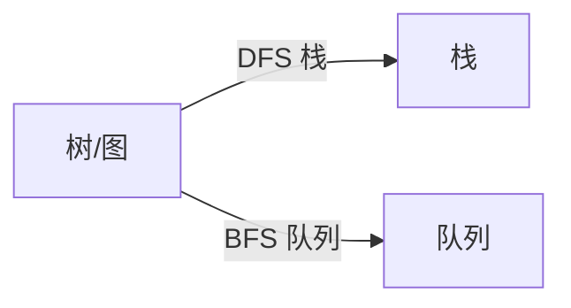

# BFS 与 DFS：图论算法的基础


## 一、核心区别



| 维度 | DFS（深度优先） | BFS（广度优先） |
|------|----------------|----------------|
| 数据结构 | 栈 / 递归 | 队列 |
| 顺序 | 一条路走到黑再回溯 | 按层扩散 |
| 最短路 | ❌ 不保证 | ✅ **无权图**最短路 |
| 空间 | O(深度) | O(宽度) |
| 适用 | 连通块、拓扑序、环检测 | 最短路、层序、扩散 |

## 二、DFS 模板

### 2.1 二叉树 DFS

```java tab
void dfs(TreeNode u) {
    if (u == null) return;
    // 前序位置：进入节点时
    dfs(u.left);
    // 中序位置
    dfs(u.right);
    // 后序位置：离开节点时（子树信息已齐全）
}
```

```typescript tab
function dfs(u: TreeNode | null): void {
    if (u === null) return;
    // 前序位置：进入节点时
    dfs(u.left);
    // 中序位置
    dfs(u.right);
    // 后序位置：离开节点时（子树信息已齐全）
}
```

```python tab
def dfs(u: Optional[TreeNode]) -> None:
    if u is None:
        return
    # 前序位置：进入节点时
    dfs(u.left)
    # 中序位置
    dfs(u.right)
    # 后序位置：离开节点时（子树信息已齐全）
```

> **核心思想**：前序位置"自顶向下"传递参数（路径、深度），后序位置"自底向上"收集返回值。

### 2.2 图 DFS（避免环）

```java tab
void dfs(int u, boolean[] visited) {
    visited[u] = true;
    for (int v : graph[u]) {
        if (!visited[v]) dfs(v, visited);
    }
}
```

```typescript tab
function dfs(u: number, visited: boolean[]): void {
    visited[u] = true;
    for (const v of graph[u]) {
        if (!visited[v]) dfs(v, visited);
    }
}
```

```python tab
def dfs(u: int, visited: list[bool]) -> None:
    visited[u] = True
    for v in graph[u]:
        if not visited[v]:
            dfs(v, visited)
```

### 2.3 显式栈版（避免栈溢出）

```java tab
Deque<int[]> stack = new ArrayDeque<>();
stack.push(new int[]{start, 0});      // {节点, 子节点遍历进度}
while (!stack.isEmpty()) {
    int[] top = stack.peek();
    int u = top[0], idx = top[1];
    if (idx == graph[u].length) {     // 子节点全部遍历完
        stack.pop();
        continue;
    }
    top[1]++;
    int v = graph[u][idx];
    if (!visited[v]) {
        visited[v] = true;
        stack.push(new int[]{v, 0});
    }
}
```

```typescript tab
const stack: [number, number][] = [[start, 0]]; // [节点, 子节点遍历进度]
while (stack.length) {
    const top = stack[stack.length - 1];
    const u = top[0], idx = top[1];
    if (idx === graph[u].length) {    // 子节点全部遍历完
        stack.pop();
        continue;
    }
    top[1]++;
    const v = graph[u][idx];
    if (!visited[v]) {
        visited[v] = true;
        stack.push([v, 0]);
    }
}
```

```python tab
stack = [[start, 0]]  # [节点, 子节点遍历进度]
while stack:
    top = stack[-1]
    u, idx = top[0], top[1]
    if idx == len(graph[u]):          # 子节点全部遍历完
        stack.pop()
        continue
    top[1] += 1
    v = graph[u][idx]
    if not visited[v]:
        visited[v] = True
        stack.append([v, 0])
```

## 三、BFS 模板

### 3.1 二叉树层序

```java tab
List<List<Integer>> levelOrder(TreeNode root) {
    List<List<Integer>> ans = new ArrayList<>();
    if (root == null) return ans;
    Deque<TreeNode> q = new ArrayDeque<>();
    q.offer(root);
    while (!q.isEmpty()) {
        int sz = q.size();
        List<Integer> level = new ArrayList<>(sz);
        for (int i = 0; i < sz; i++) {
            TreeNode u = q.poll();
            level.add(u.val);
            if (u.left != null) q.offer(u.left);
            if (u.right != null) q.offer(u.right);
        }
        ans.add(level);
    }
    return ans;
}
```

```typescript tab
function levelOrder(root: TreeNode | null): number[][] {
    const ans: number[][] = [];
    if (root === null) return ans;
    const q: TreeNode[] = [root];
    while (q.length) {
        const sz = q.length;
        const level: number[] = [];
        for (let i = 0; i < sz; i++) {
            const u = q.shift()!;
            level.push(u.val);
            if (u.left) q.push(u.left);
            if (u.right) q.push(u.right);
        }
        ans.push(level);
    }
    return ans;
}
```

```python tab
from collections import deque

def level_order(root: Optional[TreeNode]) -> list[list[int]]:
    ans = []
    if root is None:
        return ans
    q = deque([root])
    while q:
        sz = len(q)
        level = []
        for _ in range(sz):
            u = q.popleft()
            level.append(u.val)
            if u.left:
                q.append(u.left)
            if u.right:
                q.append(u.right)
        ans.append(level)
    return ans
```

### 3.2 图最短路 BFS

```java tab
int[] dist = new int[n];
Arrays.fill(dist, -1);
Deque<Integer> q = new ArrayDeque<>();
q.offer(start); dist[start] = 0;
while (!q.isEmpty()) {
    int u = q.poll();
    for (int v : graph[u]) {
        if (dist[v] == -1) {
            dist[v] = dist[u] + 1;
            q.offer(v);
        }
    }
}
```

```typescript tab
const dist = new Array(n).fill(-1);
const q: number[] = [start];
dist[start] = 0;
while (q.length) {
    const u = q.shift()!;
    for (const v of graph[u]) {
        if (dist[v] === -1) {
            dist[v] = dist[u] + 1;
            q.push(v);
        }
    }
}
```

```python tab
from collections import deque

dist = [-1] * n
q = deque([start])
dist[start] = 0
while q:
    u = q.popleft()
    for v in graph[u]:
        if dist[v] == -1:
            dist[v] = dist[u] + 1
            q.append(v)
```

### 3.3 多源 BFS

多个起点同时入队。例：矩阵中最短的 0-1 BFS、腐烂的橘子。

```java tab
for (int i = 0; i < n; i++) if (grid[i] == 'O') q.offer(i);
// 之后正常 BFS
```

```typescript tab
for (let i = 0; i < n; i++) if (grid[i] === 'O') q.push(i);
// 之后正常 BFS
```

```python tab
for i in range(n):
    if grid[i] == 'O':
        q.append(i)
# 之后正常 BFS
```

### 3.4 双向 BFS（双向搜索）

起点和终点同时扩展。求 `s → t` 最短路：

```java tab
// 适用：扩展规则对称、状态可哈希（如单词接龙、字母变换）
int bidirectionalBFS(String s, String t, Set<String> dict) {
    if (s.equals(t)) return 0;
    Set<String> head = new HashSet<>(Set.of(s));
    Set<String> tail = new HashSet<>(Set.of(t));
    Set<String> visited = new HashSet<>();
    int step = 0;
    while (!head.isEmpty() && !tail.isEmpty()) {
        // 优化：每次扩展 size 较小的方向
        if (head.size() > tail.size()) {
            Set<String> tmp = head; head = tail; tail = tmp;
        }
        Set<String> next = new HashSet<>();
        for (String cur : head) {
            if (tail.contains(cur)) return step + 1;   // 相遇
            for (String nb : expand(cur, dict)) {
                if (!visited.contains(nb)) {
                    visited.add(nb);
                    next.add(nb);
                }
            }
        }
        head = next;
        step++;
    }
    return -1;
}
```

```typescript tab
// 适用：扩展规则对称、状态可哈希（如单词接龙、字母变换）
function bidirectionalBFS(s: string, t: string, dict: Set<string>): number {
    if (s === t) return 0;
    let head = new Set([s]);
    let tail = new Set([t]);
    const visited = new Set<string>();
    let step = 0;
    while (head.size && tail.size) {
        // 优化：每次扩展 size 较小的方向
        if (head.size > tail.size) {
            [head, tail] = [tail, head];
        }
        const next = new Set<string>();
        for (const cur of head) {
            if (tail.has(cur)) return step + 1;   // 相遇
            for (const nb of expand(cur, dict)) {
                if (!visited.has(nb)) {
                    visited.add(nb);
                    next.add(nb);
                }
            }
        }
        head = next;
        step++;
    }
    return -1;
}
```

```python tab
# 适用：扩展规则对称、状态可哈希（如单词接龙、字母变换）
def bidirectional_bfs(s: str, t: str, word_dict: set) -> int:
    if s == t:
        return 0
    head, tail = {s}, {t}
    visited = set()
    step = 0
    while head and tail:
        # 优化：每次扩展 size 较小的方向
        if len(head) > len(tail):
            head, tail = tail, head
        nxt = set()
        for cur in head:
            if cur in tail:
                return step + 1  # 相遇
            for nb in expand(cur, word_dict):
                if nb not in visited:
                    visited.add(nb)
                    nxt.add(nb)
        head = nxt
        step += 1
    return -1
```

复杂度从 O(b^d) 降到 O(b^(d/2))。**前提**：状态可哈希、扩展规则对称。

## 四、DFS 的高级形态

### 4.1 回溯（Backtracking）

```java tab
void backtrack(int[] nums, int start, List<Integer> path, List<List<Integer>> ans) {
    ans.add(new ArrayList<>(path));
    for (int i = start; i < nums.length; i++) {
        path.add(nums[i]);
        backtrack(nums, i + 1, path, ans);
        path.remove(path.size() - 1);
    }
}
```

```typescript tab
function backtrack(nums: number[], start: number, path: number[], ans: number[][]): void {
    ans.push([...path]);
    for (let i = start; i < nums.length; i++) {
        path.push(nums[i]);
        backtrack(nums, i + 1, path, ans);
        path.pop();
    }
}
```

```python tab
def backtrack(nums: list[int], start: int, path: list[int], ans: list[list[int]]) -> None:
    ans.append(path[:])
    for i in range(start, len(nums)):
        path.append(nums[i])
        backtrack(nums, i + 1, path, ans)
        path.pop()
```

**剪枝（pruning）** 是回溯的灵魂：

- **排序去重**：`if (i > start && nums[i] == nums[i-1]) continue;`
- **剩余不可行**：`if (sum + rest < target) break;`
- **可行性剪枝**：`if (used > budget) return;`

### 4.2 拓扑排序（Kahn）

```java tab
int[] in = new int[n];
for (int[] e : edges) in[e[1]]++;
Deque<Integer> q = new ArrayDeque<>();
for (int i = 0; i < n; i++) if (in[i] == 0) q.offer(i);
while (!q.isEmpty()) {
    int u = q.poll(); order.add(u);
    for (int v : graph[u]) if (--in[v] == 0) q.offer(v);
}
// 检测环：order.size() == n ? 无环 : 有环
```

```typescript tab
const indegree = new Array(n).fill(0);
for (const e of edges) indegree[e[1]]++;
const q: number[] = [];
for (let i = 0; i < n; i++) if (indegree[i] === 0) q.push(i);
while (q.length) {
    const u = q.shift()!; order.push(u);
    for (const v of graph[u]) if (--indegree[v] === 0) q.push(v);
}
// 检测环：order.length === n ? 无环 : 有环
```

```python tab
from collections import deque

indegree = [0] * n
for e in edges:
    indegree[e[1]] += 1
q = deque(i for i in range(n) if indegree[i] == 0)
while q:
    u = q.popleft()
    order.append(u)
    for v in graph[u]:
        indegree[v] -= 1
        if indegree[v] == 0:
            q.append(v)
# 检测环：len(order) == n ? 无环 : 有环
```

### 4.3 Tarjan SCC / 桥 / 割点

> 强连通分量、桥、割点是图论硬通货。基于 **DFS 时间戳 + low 数组**。

```text
low[u] = min{
    dfn[u],
    dfn[v]   for each back-edge (u, v),
    low[w]   for each tree-edge (u, w)
}

if (low[v] > dfn[u])   (u, v) is a bridge
if (low[v] >= dfn[u])  u is an articulation point (in some conditions)
```

## 五、BFS 的高级形态

### 5.1 0-1 BFS

边权为 0/1，用双端队列：权 0 加队首，权 1 加队尾。复杂度 O(V+E)。

### 5.2 Dijkstra（带权最短路）

```java tab
int[] dist = new int[n];
Arrays.fill(dist, Integer.MAX_VALUE);
dist[s] = 0;

// ⚠️ 不要用 (a, b) -> a[1] - b[1]，会整数溢出
PriorityQueue<int[]> pq = new PriorityQueue<>(Comparator.comparingInt(a -> a[1]));
pq.offer(new int[]{s, 0});
while (!pq.isEmpty()) {
    int[] top = pq.poll();
    int u = top[0], d = top[1];
    if (d > dist[u]) continue;     // 跳过过期条目
    for (int[] e : graph[u]) {
        int v = e[0], w = e[1];
        if (dist[u] + w < dist[v]) {
            dist[v] = dist[u] + w;
            pq.offer(new int[]{v, dist[v]});
        }
    }
}
```

```typescript tab
const dist = new Array(n).fill(Infinity);
dist[s] = 0;
const pq: [number, number][] = [[s, 0]];
while (pq.length) {
    pq.sort((a, b) => a[1] - b[1]);  // 简单实现；生产请用 IndexedPriorityQueue
    const [u, d] = pq.shift()!;
    if (d > dist[u]) continue;       // 跳过过期条目
    for (const [v, w] of graph.get(u) ?? []) {
        if (dist[u] + w < dist[v]) {
            dist[v] = dist[u] + w;
            pq.push([v, dist[v]]);
        }
    }
}
```

```python tab
import heapq

dist = [float('inf')] * n
dist[s] = 0
pq = [(0, s)]                            # (距离, 节点)
while pq:
    d, u = heapq.heappop(pq)
    if d > dist[u]:
        continue                         # 跳过过期条目
    for v, w in graph[u]:
        if dist[u] + w < dist[v]:
            dist[v] = dist[u] + w
            heapq.heappush(pq, (dist[v], v))
```

- **复杂度**：O((V + E) log V)
- **不适用负权**：负权环会让最短路为 -∞
- **次短路/第 K 短路**：把 `dist[v]` 存成 `TreeSet<Integer>` 即可。

### 5.3 A* 启发式搜索

Dijkstra + 启发式估价 `f = g + h`。  
要求 `h` 是**可采纳的**（不高于真实代价）。  
例：八数码、地图导航。

## 六、实战选型清单

| 题目特征 | 用什么 |
|---------|--------|
| 求最短路（无权图） | BFS |
| 求最短路（带正权） | Dijkstra |
| 求最短路（带负权） | Bellman-Ford / SPFA |
| 求连通分量 / 环 / 拓扑 | DFS / Kahn |
| 求树深 / 路径 | DFS（递归） |
| 求层序 / 最近距离 | BFS |
| 状态空间小、求最少步数 | BFS |
| 枚举所有解、子集 | DFS + 回溯 |

## 七、调试技巧

1. **打印递归入口/出口**：对 DFS 调试非常有用。
2. **递归深度监控**：栈溢出前 `Math.max(depth, ...)`。
3. **visited 时机**：要么进栈立即置 visited（带环图），要么回溯时撤销（求路径）。
4. **小图手动模拟**：n≤6 的图跑一遍对照结果。
