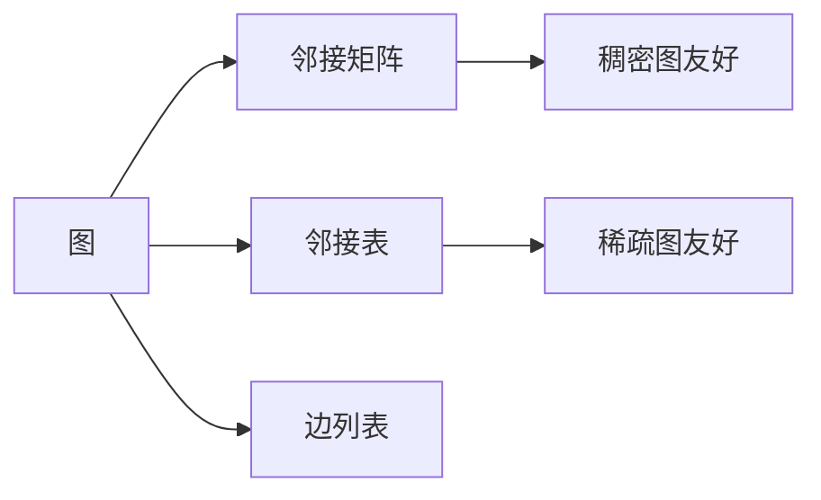

# 图的存储与遍历

图是最灵活也最复杂的数据结构。选择合适的存储方式（邻接矩阵/邻接表/边列表）和遍历策略（DFS/BFS）是解决所有图论问题的基础。

## 一、图的分类



| 维度 | 类型 |
|------|------|
| 方向 | 有向图 / 无向图 |
| 权重 | 有权图 / 无权图 |
| 连通性 | 连通图 / 非连通图 |
| 特殊 | DAG、完全图、二分图、树 |

## 二、存储方式

### 邻接矩阵

```java tab
int[][] adj = new int[n][n]; // adj[i][j] = 权重（0 表示无边）
// 适合稠密图，空间 O(V²)
```

```typescript tab
const adj: number[][] = Array.from({ length: n }, () => new Array(n).fill(0));
// adj[i][j] = 权重（0 表示无边）
// 适合稠密图，空间 O(V²)
```

```python tab
adj = [[0] * n for _ in range(n)]  # adj[i][j] = 权重（0 表示无边）
# 适合稠密图，空间 O(V²)
```

### 邻接表

```java tab
List<Integer>[] adj = new ArrayList[n];
for (int i = 0; i < n; i++) adj[i] = new ArrayList<>();
// 加边
adj[u].add(v);
adj[v].add(u); // 无向图
// 适合稀疏图，空间 O(V+E)
```

```typescript tab
const adj: number[][] = Array.from({ length: n }, () => []);
// 加边
adj[u].push(v);
adj[v].push(u); // 无向图
// 适合稀疏图，空间 O(V+E)
```

```python tab
adj = [[] for _ in range(n)]
# 加边
adj[u].append(v)
adj[v].append(u)  # 无向图
# 适合稀疏图，空间 O(V+E)
```

### 边列表

```java tab
int[][] edges = new int[m][3]; // {from, to, weight}
// 适合 Kruskal、Bellman-Ford 等按边操作的算法
```

```typescript tab
const edges: [number, number, number][] = []; // [from, to, weight]
// 适合 Kruskal、Bellman-Ford 等按边操作的算法
```

```python tab
edges = []  # [(from, to, weight), ...]
# 适合 Kruskal、Bellman-Ford 等按边操作的算法
```

### 选择建议

| 场景 | 推荐 |
|------|------|
| 稠密图（E ≈ V²） | 邻接矩阵 |
| 稀疏图（E << V²） | 邻接表 |
| 需要排序所有边 | 边列表 |
| 需要快速判断边存在 | 邻接矩阵 / HashSet |

## 三、DFS（深度优先搜索）

```java tab
boolean[] visited;

void dfs(int u, List<Integer>[] adj) {
    visited[u] = true;
    // 处理节点 u
    for (int v : adj[u]) {
        if (!visited[v]) {
            dfs(v, adj);
        }
    }
}

// 非连通图：遍历所有连通分量
for (int i = 0; i < n; i++) {
    if (!visited[i]) dfs(i, adj);
}
```

```typescript tab
const visited = new Array(n).fill(false);

function dfs(u: number, adj: number[][]): void {
    visited[u] = true;
    // 处理节点 u
    for (const v of adj[u]) {
        if (!visited[v]) {
            dfs(v, adj);
        }
    }
}

// 非连通图：遍历所有连通分量
for (let i = 0; i < n; i++) {
    if (!visited[i]) dfs(i, adj);
}
```

```python tab
visited = [False] * n

def dfs(u: int, adj: list[list[int]]) -> None:
    visited[u] = True
    # 处理节点 u
    for v in adj[u]:
        if not visited[v]:
            dfs(v, adj)

# 非连通图：遍历所有连通分量
for i in range(n):
    if not visited[i]:
        dfs(i, adj)
```

### 迭代 DFS

```java tab
void dfsIterative(int start, List<Integer>[] adj) {
    Deque<Integer> stack = new ArrayDeque<>();
    stack.push(start);
    while (!stack.isEmpty()) {
        int u = stack.pop();
        if (visited[u]) continue;
        visited[u] = true;
        for (int v : adj[u]) {
            if (!visited[v]) stack.push(v);
        }
    }
}
```

```typescript tab
function dfsIterative(start: number, adj: number[][]): void {
    const stack: number[] = [start];
    while (stack.length) {
        const u = stack.pop()!;
        if (visited[u]) continue;
        visited[u] = true;
        for (const v of adj[u]) {
            if (!visited[v]) stack.push(v);
        }
    }
}
```

```python tab
def dfs_iterative(start: int, adj: list[list[int]]) -> None:
    stack = [start]
    while stack:
        u = stack.pop()
        if visited[u]:
            continue
        visited[u] = True
        for v in adj[u]:
            if not visited[v]:
                stack.append(v)
```

## 四、BFS（广度优先搜索）

```java tab
int[] bfs(int start, List<Integer>[] adj) {
    int n = adj.length;
    int[] dist = new int[n];
    Arrays.fill(dist, -1);
    dist[start] = 0;
    Queue<Integer> queue = new LinkedList<>();
    queue.offer(start);
    while (!queue.isEmpty()) {
        int u = queue.poll();
        for (int v : adj[u]) {
            if (dist[v] == -1) {
                dist[v] = dist[u] + 1;
                queue.offer(v);
            }
        }
    }
    return dist; // 最短距离（无权图）
}
```

```typescript tab
function bfs(start: number, adj: number[][]): number[] {
    const n = adj.length;
    const dist = new Array(n).fill(-1);
    dist[start] = 0;
    const queue: number[] = [start];
    while (queue.length) {
        const u = queue.shift()!;
        for (const v of adj[u]) {
            if (dist[v] === -1) {
                dist[v] = dist[u] + 1;
                queue.push(v);
            }
        }
    }
    return dist; // 最短距离（无权图）
}
```

```python tab
from collections import deque

def bfs(start: int, adj: list[list[int]]) -> list[int]:
    n = len(adj)
    dist = [-1] * n
    dist[start] = 0
    queue = deque([start])
    while queue:
        u = queue.popleft()
        for v in adj[u]:
            if dist[v] == -1:
                dist[v] = dist[u] + 1
                queue.append(v)
    return dist  # 最短距离（无权图）
```

## 五、DFS vs BFS

| 维度 | DFS | BFS |
|------|-----|-----|
| 数据结构 | 栈（递归） | 队列 |
| 遍历顺序 | 深入到底再回溯 | 逐层扩展 |
| 最短路径 | ❌（无权图） | ✅（无权图） |
| 连通分量 | ✅ | ✅ |
| 拓扑排序 | ✅（后序） | ✅（Kahn） |
| 环检测 | ✅（回边） | ✅（入度） |
| 空间 | O(V)（递归栈） | O(V)（队列） |

## 六、经典应用

| 问题 | 方法 |
|------|------|
| 岛屿数量（200） | DFS/BFS 标记连通分量 |
| 课程表（207/210） | 拓扑排序（BFS/DFS） |
| 单词接龙（127） | BFS 最短路 |
| 克隆图（133） | DFS/BFS + HashMap |
| 二分图判定（785） | DFS/BFS 染色 |

## 七、面试要点

1. **建图**：根据输入选择邻接表/矩阵
2. **visited 数组**：防止重复访问（无向图必须）
3. **BFS 求最短路**：无权图首选
4. **DFS 求连通性**：代码简洁
5. **LeetCode**：200、207、210、127、133、785、994（腐烂的橘子）
