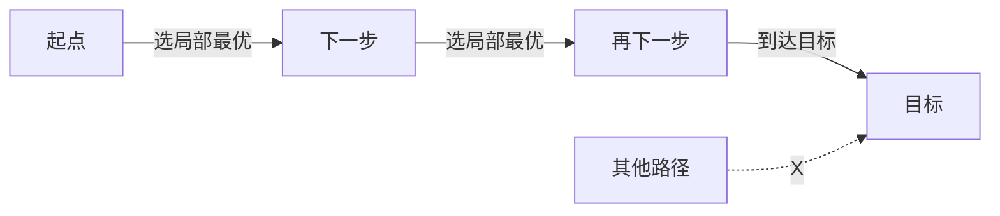

# 贪心算法：从直觉到证明


## 一、什么是贪心

**贪心（Greedy）** 是一种在每一步都采取**当前状态下最优选择**的算法策略，希望通过局部最优得到全局最优。



> 关键：每一步**不可撤销**，像下棋。

它和 DP 的关键区别：
- **贪心**：做选择后**不再回退**（不可撤销）。
- **DP**：保留所有可能的选择，比较后再决定。

## 二、什么时候能用贪心？

贪心不是万能的——用错地方会得到错误答案。判断依据有两个：

### 2.1 贪心选择性质

> 一个全局最优解，可以通过**一系列局部最优选择**得到。

### 2.2 最优子结构

> 问题的最优解包含子问题的最优解。

> **注意**：这两个性质**必须同时**成立。只满足一个的，要么是错的贪心，要么其实是 DP。

## 三、经典案例

### 3.1 区间调度（选最多的不重叠区间）

**问题**：n 个区间 `[s_i, e_i]`，选最多的互不重叠区间。

**贪心策略**：按结束时间排序，每次选结束最早的。

```java tab
Arrays.sort(intervals, (a, b) -> a[1] - b[1]);
int ans = 0, lastEnd = Integer.MIN_VALUE;
for (int[] it : intervals) {
    if (it[0] >= lastEnd) {
        ans++;
        lastEnd = it[1];
    }
}
return ans;
```

```typescript tab
function intervalSchedule(intervals: [number, number][]): number {
    intervals.sort((a, b) => a[1] - b[1]);
    let ans = 0, lastEnd = -Infinity;
    for (const [s, e] of intervals) {
        if (s >= lastEnd) { ans++; lastEnd = e; }
    }
    return ans;
}
```

```python tab
def interval_schedule(intervals: list[list[int]]) -> int:
    intervals.sort(key=lambda x: x[1])           # 按结束时间排序
    ans, last_end = 0, float('-inf')
    for s, e in intervals:
        if s >= last_end:
            ans += 1
            last_end = e
    return ans
```

**为什么对？** 证明思路（交换论证）：

> 假设贪心选了第一个结束最早的区间 `I_1`，而某个最优解选了 `I_1'`（结束更晚）。
> 因为 `I_1` 比 `I_1'` 结束早，用 `I_1` 替换 `I_1'` 后剩余空间更大，剩下的可选区间只会更多不会更少。
> 因此存在最优解包含 `I_1`，递归对剩下区间成立。

### 3.2 跳跃游戏（最少跳跃次数）

```java tab
int jumps = 0, end = 0, farthest = 0;
for (int i = 0; i < n - 1; i++) {
    farthest = Math.max(farthest, i + nums[i]);
    if (i == end) {
        jumps++;
        end = farthest;
    }
}
return jumps;
```

```typescript tab
function jump(nums: number[]): number {
    let jumps = 0, end = 0, farthest = 0;
    for (let i = 0; i < nums.length - 1; i++) {
        farthest = Math.max(farthest, i + nums[i]);
        if (i === end) {
            jumps++;
            end = farthest;
        }
    }
    return jumps;
}
```

```python tab
def jump(nums: list[int]) -> int:
    jumps = end = farthest = 0
    for i in range(len(nums) - 1):
        farthest = max(farthest, i + nums[i])
        if i == end:
            jumps += 1
            end = farthest
    return jumps
```

### 3.3 分糖果 / 分配饼干

> 经典题型：将孩子的需求和糖果大小排序，双指针贪心。

```java tab
// 455. 分发饼干
Arrays.sort(g);   // 胃口
Arrays.sort(s);   // 饼干尺寸
int i = 0, j = 0;
while (i < g.length && j < s.length) {
    if (s[j] >= g[i]) i++;        // 满足一个孩子
    j++;                          // 无论是否满足，都用掉这块饼干
}
return i;
```

```typescript tab
// 455. 分发饼干
function findContentChildren(g: number[], s: number[]): number {
    g.sort((a, b) => a - b);   // 胃口
    s.sort((a, b) => a - b);   // 饼干尺寸
    let i = 0, j = 0;
    while (i < g.length && j < s.length) {
        if (s[j] >= g[i]) i++;        // 满足一个孩子
        j++;                          // 无论是否满足，都用掉这块饼干
    }
    return i;
}
```

```python tab
# 455. 分发饼干
def find_content_children(g: list[int], s: list[int]) -> int:
    g.sort()   # 胃口
    s.sort()   # 饼干尺寸
    i = j = 0
    while i < len(g) and j < len(s):
        if s[j] >= g[i]:
            i += 1        # 满足一个孩子
        j += 1            # 无论是否满足，都用掉这块饼干
    return i
```

### 3.4 哈夫曼编码

每次合并两个最小频率。**反证法**：最小的两个不合并，必定导致某种更优解可构造，矛盾。

```java tab
// 用最小堆（优先队列）实现
PriorityQueue<Node> pq = new PriorityQueue<>((a, b) -> a.freq - b.freq);
for (char c : chars) pq.offer(new Node(c, freq));
while (pq.size() > 1) {
    Node a = pq.poll(), b = pq.poll();
    pq.offer(new Node('\0', a.freq + b.freq, a, b));
}
return pq.poll();   // 根节点
```

```typescript tab
// 用最小堆（优先队列）实现
class MinHeap {
    private heap: Node[] = [];
    push(node: Node) { /* ... */ }
    pop(): Node { /* ... */ }
    get size() { return this.heap.length; }
}

const pq = new MinHeap();
for (const [char, freq] of freqMap) pq.push(new Node(char, freq));
while (pq.size > 1) {
    const a = pq.pop(), b = pq.pop();
    pq.push(new Node('\0', a.freq + b.freq, a, b));
}
return pq.pop();   // 根节点
```

```python tab
# 用最小堆（优先队列）实现
import heapq

heap = [[freq, char] for char, freq in freq_map.items()]
heapq.heapify(heap)
while len(heap) > 1:
    freq_a, a = heapq.heappop(heap)
    freq_b, b = heapq.heappop(heap)
    heapq.heappush(heap, [freq_a + freq_b, None])  # 合并节点
# heap[0] 即为根节点
```

### 3.5 Dijkstra

本质就是贪心：每次从"未确定的点"中选距离最小的那个，之后不再更新。
（在图论章节有完整模板，此处不重复。）

## 四、贪心的证明套路

会写贪心容易，**证贪心**难。面试常问"为什么这样是对的？"

### 套路 1：交换论证（Exchange Argument）

> 假设存在一个最优解 O，跟贪心解 G 在**第一个不同的选择**上不同。
> 把 O 在那个点换成 G 的选择后，O' 仍然是最优解（不更差）。
> 重复直到 O = G。

### 套路 2：反证法

> 假设贪心选择不是最优的，构造一个"交换选择后更优"的最优解，矛盾。

### 套路 3：数学归纳

> 假设前 k 步贪心最优，证明第 k+1 步也最优。

### 套路 4：排序不等式 / 数学恒等

> 直接用数学上的单调性证明。例：分苹果使乘积最大 → 切成 3 优先。

## 五、易错场景（完整反例）

### 5.1 找零钱：贪心不一定对

**例子**：面额 `[1, 3, 4]`，凑出金额 6。

| 策略 | 结果 |
|------|------|
| 贪心（每次选最大） | 4 + 1 + 1 = **3 枚** |
| 最优解 | 3 + 3 = **2 枚** ✅ |

**结论**：非规范币制（如 [1,3,4]）下贪心可能错，必须用 DP 保证最优。  
此类问题必须用 **DP**（无穷背包）。

### 5.2 其他反例表

| 场景 | 错误贪心 | 正确做法 |
|------|----------|----------|
| 找零钱（面值不规则） | 每次选最大 | DP |
| 0/1 背包 | 按价值/重量比贪心 | DP |
| 矩阵中最长递增路径 | 局部选最大的 | DP + 记忆化 |
| 任务调度（带截止时间） | 按时长贪心 | DSU / 倒序安排 |
| 哈密顿路径 | 局部最短 | NP-hard，无多项式算法 |

## 六、贪心 vs DP 怎么选？

1. **能不能举出反例**：随便一组数据，看贪心错没错。
2. **状态空间有多大**：贪心只保留当前最优；DP 保留所有可能。
3. **题目是否要求最优解**：贪心错就给错例；DP 通常不拒题。

> 一句话：**贪心 = 拿一个局部最优可以"安全地"换掉任何最优解中的某些选择**。

## 七、面试常见题

- 🟢 分糖果、跳跃游戏、买卖股票 II
- 🟡 区间调度、任务调度、加油站
- 🟠 拼接最大数、分糖果 II、单调递增的数字
- 🔴 摆动序列 II、最优账单平衡、Candy Hard

## 八、调试技巧

1. **贪心错先想反例**：随便试 n=3、4 个数据，常常就能发现。
2. **小规模对拍**：写一个暴力 + 贪心，n≤8 随机对拍。
3. **画图**：区间问题画图最直观。
