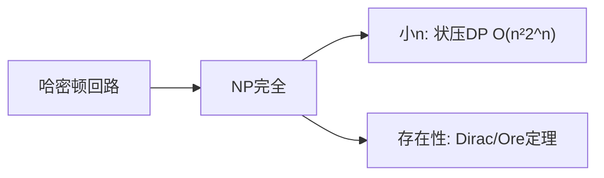

# 哈密顿回路（Hamiltonian Cycle）

## 一、为什么学哈密顿回路？



经过图中**每个顶点恰好一次**并回到起点的回路。与欧拉回路（经过每条边）不同，哈密顿问题是 **NP 完全**的，无多项式通解。

## 二、判定与求法

- **无通解**，常用：状态压缩 DP（小 n）、回溯剪枝、启发式（最近邻、2-opt）。
- **Dirac 定理**：n≥3 的简单图，若每个顶点度数 ≥ n/2，则必存在哈密顿回路（充分非必要）。

## 三、状态压缩 DP（旅行商 TSP 即哈密顿回路最小权）

`dp[S][i]` = 已访问集合 S、当前在 i 的最小代价。

```java tab
// dp[1<<i][i] = 0；答案 min dp[(1<<n)-1][i] + w[i][0]
for (int S = 1; S < (1 << n); S++)
    for (int i = 0; i < n; i++) {
        if ((S & (1 << i)) == 0) continue;
        for (int j = 0; j < n; j++)
            if (j != i && (S & (1 << j)) != 0)
                dp[S][i] = Math.min(dp[S][i], dp[S ^ (1 << i)][j] + w[j][i]);
    }
```

```typescript tab
for (let S = 1; S < 1 << n; S++)
    for (let i = 0; i < n; i++) {
        if ((S & (1 << i)) === 0) continue;
        for (let j = 0; j < n; j++)
            if (j !== i && (S & (1 << j)))
                dp[S][i] = Math.min(dp[S][i], dp[S ^ (1 << i)][j] + w[j][i]);
    }
```

```python tab
for S in range(1, 1 << n):
    for i in range(n):
        if not (S >> i) & 1: continue
        for j in range(n):
            if j != i and (S >> j) & 1:
                dp[S][i] = min(dp[S][i], dp[S ^ (1 << i)][j] + w[j][i])
```

## 四、复杂度

| 方法 | 复杂度 |
|------|--------|
| 状态压缩 DP（TSP） | O(n²·2^n) |
| 回溯（精确） | O(n!) |

## 五、面试要点

1. 哈密顿回路 NP 完全，别想 O(poly) 通解
2. 小 n 用状压 DP（TSP 即其加权版）
3. 存在性可用 Dirac/Ore 定理做充分条件判断
