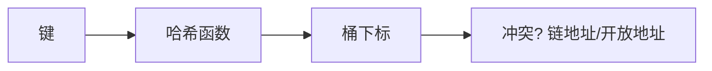

# 哈希冲突与负载因子

哈希表的核心在于哈希函数设计和冲突处理策略。理解链地址法、开放地址法和负载因子的关系，是掌握 HashMap/HashSet 底层原理的关键。

## 一、哈希函数设计



好的哈希函数应满足：
- **均匀性**：输出均匀分布在桶中
- **确定性**：相同输入 → 相同输出
- **高效性**：计算快

### 常见哈希方法

```java tab
// 1. 除留余数法
int hash = key % tableSize; // tableSize 取质数

// 2. 乘法哈希
int hash = (int)((key * 0.6180339887) % 1 * tableSize);

// 3. Java String.hashCode()
int hash = 0;
for (char c : s.toCharArray()) {
    hash = 31 * hash + c; // 31 是质数，且 31*i == (i<<5)-i
}

// 4. Java HashMap 的扰动函数
static int hash(Object key) {
    int h = key.hashCode();
    return h ^ (h >>> 16); // 高 16 位异或低 16 位
}
```

```typescript tab
// 1. 除留余数法
const hash = key % tableSize; // tableSize 取质数

// 2. 乘法哈希
const hash2 = Math.floor((key * 0.6180339887) % 1 * tableSize);

// 3. 字符串哈希（类似 Java String.hashCode）
let hash3 = 0;
for (const c of s) {
    hash3 = (31 * hash3 + c.charCodeAt(0)) | 0; // 31 是质数
}

// 4. 扰动函数
function hash(key: number): number {
    return key ^ (key >>> 16); // 高 16 位异或低 16 位
}
```

```python tab
# 1. 除留余数法
hash_val = key % table_size  # table_size 取质数

# 2. 乘法哈希
hash_val = int((key * 0.6180339887) % 1 * table_size)

# 3. 字符串哈希（类似 Java String.hashCode）
hash_val = 0
for c in s:
    hash_val = (31 * hash_val + ord(c)) & 0xFFFFFFFF  # 31 是质数

# 4. 扰动函数
def hash_key(key: int) -> int:
    return key ^ (key >> 16)  # 高位异或低位
```

## 二、冲突处理

### 链地址法（Separate Chaining）

每个桶是一个链表（Java 8+ 超过 8 个转红黑树）：

```java tab
class HashMap<K, V> {
    Node<K,V>[] table; // 桶数组

    void put(K key, V value) {
        int idx = hash(key) & (table.length - 1);
        Node<K,V> node = table[idx];
        while (node != null) {
            if (node.key.equals(key)) { node.value = value; return; }
            node = node.next;
        }
        table[idx] = new Node<>(key, value, table[idx]); // 头插
    }
}
```

```typescript tab
class HashMap<K, V> {
    table: (Node<K, V> | null)[]; // 桶数组

    put(key: K, value: V): void {
        const idx = this.hash(key) & (this.table.length - 1);
        let node = this.table[idx];
        while (node !== null) {
            if (node.key === key) { node.value = value; return; }
            node = node.next;
        }
        this.table[idx] = new Node(key, value, this.table[idx]); // 头插
    }
}
```

```python tab
class HashMap:
    def __init__(self, capacity=16):
        self.table = [[] for _ in range(capacity)]  # 桶数组

    def put(self, key, value):
        idx = hash(key) % len(self.table)
        for i, (k, v) in enumerate(self.table[idx]):
            if k == key:
                self.table[idx][i] = (key, value)
                return
        self.table[idx].append((key, value))  # 头插/尾插
```

### 开放地址法（Open Addressing）

冲突时按探测序列找下一个空位：

```java tab
// 线性探测
int idx = hash(key) % capacity;
while (table[idx] != null && !table[idx].key.equals(key)) {
    idx = (idx + 1) % capacity;
}

// 二次探测
idx = (hash(key) + i * i) % capacity; // i = 0, 1, 2, ...

// 双重哈希
idx = (hash1(key) + i * hash2(key)) % capacity;
```

```typescript tab
// 线性探测
let idx = hash(key) % capacity;
while (table[idx] !== null && table[idx].key !== key) {
    idx = (idx + 1) % capacity;
}

// 二次探测
idx = (hash(key) + i * i) % capacity; // i = 0, 1, 2, ...

// 双重哈希
idx = (hash1(key) + i * hash2(key)) % capacity;
```

```python tab
# 线性探测
idx = hash(key) % capacity
while table[idx] is not None and table[idx].key != key:
    idx = (idx + 1) % capacity

# 二次探测
idx = (hash(key) + i * i) % capacity  # i = 0, 1, 2, ...

# 双重哈希
idx = (hash1(key) + i * hash2(key)) % capacity
```

### 对比

| 维度 | 链地址法 | 开放地址法 |
|------|---------|----------|
| 删除 | 简单（链表删除） | 复杂（标记删除） |
| 聚集 | 无 | 有（一次/二次聚集） |
| 缓存友好 | 差（指针跳转） | 好（连续内存） |
| 负载因子 | 可以 > 1 | 必须 < 1 |
| 典型实现 | Java HashMap | Python dict, ThreadLocalMap |

## 三、负载因子

```
负载因子 α = 已存元素数 / 桶数
```

| α | 链地址法平均查找 | 开放地址法平均查找 |
|---|----------------|-----------------|
| 0.5 | 1.25 | 1.5 |
| 0.75 | 1.375 | 2.5 |
| 1.0 | 1.5 | ∞（趋于无穷） |

Java HashMap 默认 α = 0.75，超过则扩容（×2）。

## 四、Java HashMap 扩容

```java tab
// 容量必须是 2 的幂
// 扩容：newCap = oldCap << 1
// 重新分配：hash & newCap == 0 → 原位，否则 → 原位 + oldCap

void resize() {
    Node<K,V>[] newTable = new Node[oldCap << 1];
    for (Node<K,V> node : oldTable) {
        // 拆成两条链：留在原位 和 移到 原位+oldCap
        if ((node.hash & oldCap) == 0) → 低位链
        else → 高位链
    }
}
```

```typescript tab
// 容量必须是 2 的幂
// 扩容：newCap = oldCap << 1
// 重新分配：hash & newCap == 0 → 原位，否则 → 原位 + oldCap

function resize(): void {
    const newTable = new Array(oldCap << 1).fill(null);
    for (const node of oldTable) {
        // 拆成两条链：留在原位 和 移到 原位+oldCap
        if ((node.hash & oldCap) === 0) { /* 低位链 */ }
        else { /* 高位链 */ }
    }
}
```

```python tab
# 容量必须是 2 的幂
# 扩容：new_cap = old_cap << 1
# 重新分配：hash & old_cap == 0 → 原位，否则 → 原位 + old_cap

def resize():
    new_table = [[] for _ in range(old_cap << 1)]
    for bucket in old_table:
        for node in bucket:
            # 拆成两条链：留在原位 和 移到 原位+old_cap
            if node.hash & old_cap == 0:  # 低位链
                new_table[node.hash % old_cap].append(node)
            else:  # 高位链
                new_table[node.hash % old_cap + old_cap].append(node)
```

## 五、面试高频问题

### Q1: 为什么容量是 2 的幂？

`hash & (capacity - 1)` 等价于 `hash % capacity`，但位运算更快。

### Q2: 为什么用红黑树？

链表长度 > 8 时退化为 O(n)，转红黑树 O(log n)。退化阈值 8 基于泊松分布（概率 < 10⁻⁶）。

### Q3: 为什么负载因子是 0.75？

时间和空间的折中。太小浪费空间，太大冲突增多。

### Q4: HashMap 线程安全吗？

不安全。并发用 ConcurrentHashMap（分段锁 / CAS）。

## 六、面试要点

1. **扰动函数**：高 16 位 ^ 低 16 位，减少冲突
2. **链地址 + 红黑树**：Java 8 的优化
3. **扩容 rehash**：2 的幂使 rehash 只需看一位
4. **负载因子 0.75**：时空折中
5. **LeetCode**：705/706（设计 HashSet/HashMap）、146（LRU）
