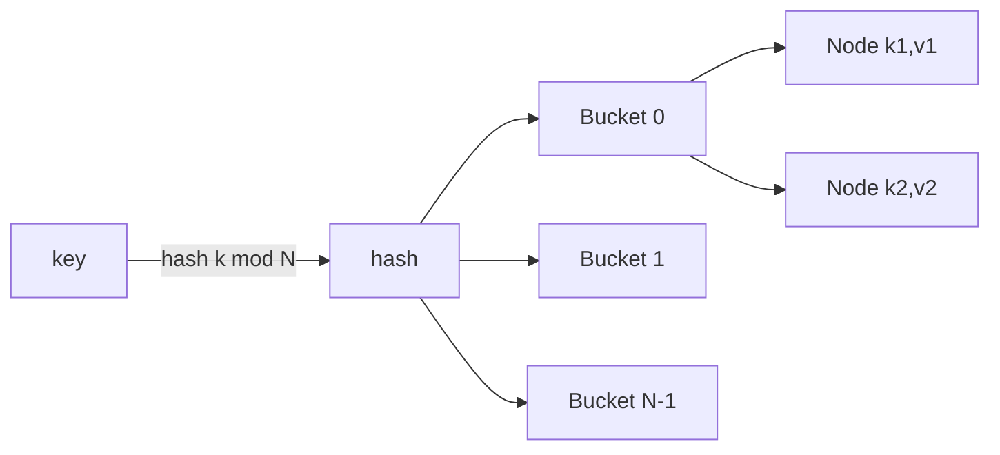

# 哈希表


## 一、什么是哈希表？

**哈希表（Hash Table）** 是一种通过哈希函数将键（Key）映射到值（Value）的数据结构，提供 O(1) 平均时间复杂度的查找、插入和删除操作。



## 二、哈希函数

哈希函数将任意大小的输入转换为固定大小的输出：

```text
hash("apple") → 183
hash("banana") → 456
```

## 三、哈希冲突

当两个不同的键产生相同的哈希值时，发生**哈希冲突**。

### 解决冲突的方法

1. **链地址法（Separate Chaining）**：在每个槽位存储链表
2. **开放地址法（Open Addressing）**：探测其他空槽位

## 四、代码实现（链地址法）

```java tab
public class HashMap<K, V> {
    private static class Node<K, V> {
        K key;
        V value;
        Node<K, V> next;
        
        Node(K key, V value) {
            this.key = key;
            this.value = value;
        }
    }
    
    private Node<K, V>[] buckets;
    private int size;
    private static final int DEFAULT_CAPACITY = 16;
    
    public HashMap() {
        buckets = new Node[DEFAULT_CAPACITY];
        size = 0;
    }
    
    private int hash(K key) {
        return key == null ? 0 : key.hashCode() & 0x7fffffff % buckets.length;
    }
    
    public void put(K key, V value) {
        int index = hash(key);
        Node<K, V> node = buckets[index];
        
        while (node != null) {
            if (Objects.equals(node.key, key)) {
                node.value = value;
                return;
            }
            node = node.next;
        }
        
        Node<K, V> newNode = new Node<>(key, value);
        newNode.next = buckets[index];
        buckets[index] = newNode;
        size++;
    }
    
    public V get(K key) {
        int index = hash(key);
        Node<K, V> node = buckets[index];
        
        while (node != null) {
            if (Objects.equals(node.key, key)) {
                return node.value;
            }
            node = node.next;
        }
        return null;
    }
}
```

```typescript tab
interface Node<K, V> {
    key: K;
    value: V;
    next: Node<K, V> | null;
}

class HashMap<K, V> {
    private buckets: (Node<K, V> | null)[];
    private size: number;
    private static readonly DEFAULT_CAPACITY = 16;

    constructor() {
        this.buckets = new Array(HashMap.DEFAULT_CAPACITY).fill(null);
        this.size = 0;
    }

    private hash(key: K): number {
        const str = String(key);
        let h = 0;
        for (let i = 0; i < str.length; i++) {
            h = (h * 31 + str.charCodeAt(i)) | 0;
        }
        return (h & 0x7fffffff) % this.buckets.length;
    }

    put(key: K, value: V): void {
        const index = this.hash(key);
        let node = this.buckets[index];

        while (node !== null) {
            if (node.key === key) {
                node.value = value;
                return;
            }
            node = node.next;
        }

        const newNode: Node<K, V> = { key, value, next: this.buckets[index] };
        this.buckets[index] = newNode;
        this.size++;
    }

    get(key: K): V | null {
        const index = this.hash(key);
        let node = this.buckets[index];

        while (node !== null) {
            if (node.key === key) {
                return node.value;
            }
            node = node.next;
        }
        return null;
    }
}
```

```python tab
class Node:
    def __init__(self, key, value):
        self.key = key
        self.value = value
        self.next = None


class HashMap:
    DEFAULT_CAPACITY = 16

    def __init__(self):
        self.buckets = [None] * self.DEFAULT_CAPACITY
        self.size = 0

    def _hash(self, key) -> int:
        return hash(key) % len(self.buckets)

    def put(self, key, value):
        index = self._hash(key)
        node = self.buckets[index]

        while node is not None:
            if node.key == key:
                node.value = value
                return
            node = node.next

        new_node = Node(key, value)
        new_node.next = self.buckets[index]
        self.buckets[index] = new_node
        self.size += 1

    def get(self, key):
        index = self._hash(key)
        node = self.buckets[index]

        while node is not None:
            if node.key == key:
                return node.value
            node = node.next
        return None
```

## 五、时间复杂度

| 操作 | 平均 | 最坏 |
|------|------|------|
| 查找 | O(1) | O(n) |
| 插入 | O(1) | O(n) |
| 删除 | O(1) | O(n) |

**为什么平均 O(1)**：哈希函数将 key 均匀分散到 m 个桶，每个桶期望 n/m 个元素。当负载因子 α = n/m 保持常数时，链长期望为 O(1)。

## 六、负载因子与扩容

```
负载因子 α = 已存元素数 / 桶数

HashMap 的扩容机制（Java）：
- 默认容量 16，负载因子阈值 0.75
- 元素数 > 16 × 0.75 = 12 时，容量翻倍 → 32
- 所有元素重新哈希分配（rehash）

扩容过程：
  旧桶[0..15]                    新桶[0..31]
  ┌───┐                          ┌───┐
  │ A→B │  hash(A)=3 ────────→  │ A │  (3 < 16, 留在原位)
  └───┘                          └───┘
  hash(B)=19 ──────────────→  [19] (3+16=19, 移到新位置)

规律：容量为 2 的幂时，rehash 只需检查新增的一个 bit：
元素要么留在原下标，要么移动到 原下标+旧容量
```

**为什么容量必须是 2 的幂**：`index = hash & (capacity - 1)` 用位运算替代取模，且保证 rehash 时元素只移动一位。

## 七、链地址法 vs 开放地址法

| 维度 | 链地址法 | 开放地址法 |
|------|----------|------------|
| 存储方式 | 桶 + 链表/红黑树 | 全部存在数组内 |
| 冲突处理 | 挂到链表尾部 | 线性/二次探测下一个空位 |
| 负载因子 | 可以 > 1 | 必须 < 1（通常 < 0.7） |
| 缓存友好 | 较差（指针跳转） | 好（连续内存） |
| 删除 | 简单（链表删除） | 复杂（惰性删除标记） |
| 典型应用 | Java HashMap | Go map、Python dict、线程局部缓存 |

```
开放地址法（线性探测）示意：

插入 key=7 (hash=7):  slots[7] 已占 → 探测 slots[8] → 空，放入

[_, _, _, _, _, _, _, X, 7, _, _]
                      ↑  ↑
                   hash=7 实际存于8

问题：聚集（clustering）—— 连续占用区域越来越长
解决：二次探测 / 双重哈希
```

## 八、哈希表的经典用法

### 两数之和（LC 1）

```python tab
def two_sum(nums: list[int], target: int) -> list[int]:
    seen = {}  # 值 → 下标
    for i, num in enumerate(nums):
        complement = target - num
        if complement in seen:
            return [seen[complement], i]
        seen[num] = i
    return []
# 一次遍历，O(n) 时间 O(n) 空间
```

### 哈希表思维模板

```
“看到 O(n²) 双层循环，想想能否用哈希表降维”：

1. 查找配对：两数之和、快乐数、同构字符串
2. 计数统计：字母异位词、出现频率、众数
3. 去重判断：重复元素、无重复字符的最长子串
4. 映射关系：字典序、同构字符串、单词规律
```

## 九、面试真题

| 题目 | 难度 | 核心思路 |
|------|------|----------|
| 两数之和（LC 1） | 🟢 Easy | 哈希存已遍历值 |
| 存在重复元素（LC 217） | 🟢 Easy | Set 去重 |
| 字母异位词分组（LC 49） | 🟡 Medium | 排序后的串做 key |
| 无重复字符的最长子串（LC 3） | 🟡 Medium | 哈希 + 滑动窗口 |
| 设计哈希映射（LC 706） | 🟢 Easy | 手写链地址法 |
| O(1) 时间插入/删除/随机获取（LC 380） | 🟡 Medium | 哈希 + 数组 |

## 十、易错点分析

**1. 哈希表的“O(1)”是均摎意义**

最坏情况（所有 key 落入同一桶）退化为 O(n)。面试中要说明“平均 O(1)，最坏 O(n)”。

**2. 自定义对象做 key 必须同时重写 hashCode 和 equals**

```java
// ❌ 只重写 equals 不重写 hashCode
// → 两个“相等”的对象可能落入不同桶，永远找不到
@Override
public int hashCode() { return Objects.hash(name, age); }
@Override
public boolean equals(Object o) { /* ... */ }
```

**3. 遍历时修改导致 ConcurrentModificationException**

Java 中不能一边 for-each 遍历 HashMap 一边 put/remove，要用 Iterator.remove() 或先收集再修改。

## 十一、思考题

1. 为什么 Java 8 的 HashMap 在链表长度超过 8 时转为红黑树？为什么阈值是 8 而不是 2？（提示：泊松分布）
2. 哈希表能做范围查询吗？如果不能，什么结构可以？（提示：有序性）
3. 分布式系统中如何用哈希把数据均匀分到多台机器？key 变了怎么办？（提示：一致性哈希）

> 练习推荐：先完成 [设计哈希映射（LC 706）] 理解底层，再用哈希思维刷 LC 1、LC 49。

## 十二、应用场景

- 缓存系统（Redis 的 dict）
- 数据库索引（等值查询）
- 查找表（如两数之和）
- 字符串匹配、去重、计数
- 一致性哈希（分布式负载均衡）
