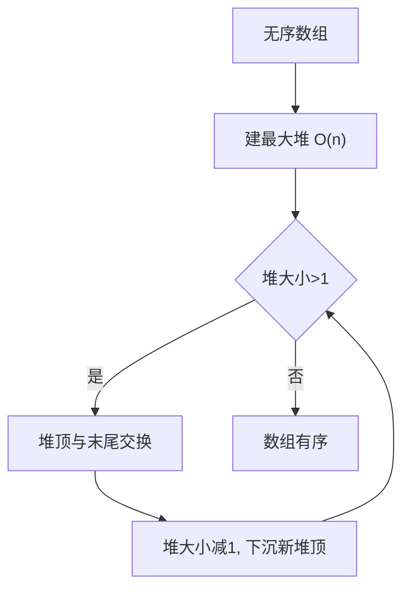

# 堆排序

堆排序（Heap Sort）是利用**堆**这种数据结构设计的排序算法。它是选择排序的改进版，通过维护最大堆（或最小堆）逐步取出极值，实现 O(n log n) 的原地排序。

## 一、核心思想



1. **建堆（Build Heap）**：将无序数组构建成最大堆，O(n)
2. **交换 + 下沉（Extract Max）**：将堆顶（最大值）与末尾交换，堆大小减 1，对新堆顶执行下沉，O(log n)
3. **重复**：直到堆大小为 1，数组有序

> 堆排序 = 建堆 O(n) + n 次取极值 O(n log n) = O(n log n)

## 二、堆的数组表示

堆是一棵完全二叉树，用数组存储时下标关系为：

```
对于下标 i 的节点：
- 父节点：(i - 1) / 2
- 左孩子：2i + 1
- 右孩子：2i + 2

数组:  [90, 70, 80, 50, 60, 30, 40]

对应的完全二叉树:
              90
            /    \
          70      80
         / \     / \
       50  60  30  40

最大堆性质：每个节点 ≥ 其孩子（堆顶是全局最大值）
```

**为什么是完全二叉树**：只有完全二叉树才能用数组无空隙存储，且保证树高严格为 ⌊log₂n⌋。

## 三、排序过程图解

以 `[4, 10, 3, 5, 1]` 为例：

```
第1步：建最大堆（从最后一个非叶节点开始下沉）

  初始数组: [4, 10, 3, 5, 1]
      4                4               10
     / \     →        / \     →       / \
   10   3           5   3           5    3
   / \              / \             / \
  5   1            4   1           4   1
  (i=1: 10>4不动)  (i=0: 4与10换)   堆建好！

  堆数组: [10, 5, 3, 4, 1]

第2步：反复取堆顶

  [10,5,3,4,1] → 交换首尾 → [1|5,3,4,10] → 下沉 → [5,4,3,1|10]
  [5,4,3,1]    → 交换首尾 → [1|4,3,5,10] → 下沉 → [4,1,3|5,10]
  [4,1,3]      → 交换首尾 → [3|1,4,5,10] → 下沉 → [3,1|4,5,10]
  [3,1]        → 交换首尾 → [1|3,4,5,10] → 完成

  最终: [1, 3, 4, 5, 10] ✓
```

**关键观察**：每次交换后，数组被分为两部分——左边是堆（大小递减），右边是已排好的后缀（递增）。

## 四、代码实现

```java tab
public class HeapSort {

    public static void heapSort(int[] arr) {
        int n = arr.length;
        // 建堆：从最后一个非叶节点开始
        for (int i = n / 2 - 1; i >= 0; i--) {
            siftDown(arr, i, n);
        }
        // 排序：反复取堆顶
        for (int i = n - 1; i > 0; i--) {
            swap(arr, 0, i);       // 堆顶（最大值）放到末尾
            siftDown(arr, 0, i);   // 堆大小减1，恢复堆性质
        }
    }

    private static void siftDown(int[] arr, int i, int heapSize) {
        while (2 * i + 1 < heapSize) {
            int child = 2 * i + 1;
            if (child + 1 < heapSize && arr[child + 1] > arr[child]) child++;
            if (arr[i] >= arr[child]) break;
            swap(arr, i, child);
            i = child;
        }
    }

    private static void swap(int[] arr, int i, int j) {
        int tmp = arr[i]; arr[i] = arr[j]; arr[j] = tmp;
    }
}
```
```typescript tab
function heapSort(arr: number[]): void {
    const n = arr.length;
    // 建堆：从最后一个非叶节点开始
    for (let i = Math.floor(n / 2) - 1; i >= 0; i--) {
        siftDown(arr, i, n);
    }
    // 排序：反复取堆顶
    for (let i = n - 1; i > 0; i--) {
        [arr[0], arr[i]] = [arr[i], arr[0]];
        siftDown(arr, 0, i);
    }
}

function siftDown(arr: number[], i: number, heapSize: number): void {
    while (2 * i + 1 < heapSize) {
        let child = 2 * i + 1;
        if (child + 1 < heapSize && arr[child + 1] > arr[child]) child++;
        if (arr[i] >= arr[child]) break;
        [arr[i], arr[child]] = [arr[child], arr[i]];
        i = child;
    }
}
```
```python tab
def heap_sort(arr: list[int]) -> None:
    n = len(arr)
    # 建堆：从最后一个非叶节点开始
    for i in range(n // 2 - 1, -1, -1):
        sift_down(arr, i, n)
    # 排序：反复取堆顶
    for i in range(n - 1, 0, -1):
        arr[0], arr[i] = arr[i], arr[0]
        sift_down(arr, 0, i)

def sift_down(arr: list[int], i: int, heap_size: int) -> None:
    while 2 * i + 1 < heap_size:
        child = 2 * i + 1
        if child + 1 < heap_size and arr[child + 1] > arr[child]:
            child += 1
        if arr[i] >= arr[child]:
            break
        arr[i], arr[child] = arr[child], arr[i]
        i = child
```

## 五、建堆为什么是 O(n)？

直觉上 n 个节点各下沉 O(log n) 应该是 O(n log n)，但实际上：

- 最底层 n/2 个节点下沉 0 层
- 倒数第二层 n/4 个节点下沉 1 层
- 倒数第三层 n/8 个节点下沉 2 层
- ...

总操作数 = \(\sum_{k=0}^{\log n} \frac{n}{2^{k+1}} \cdot k = O(n)\)

**直觉解释**：大部分节点在底层（不需要怎么动），只有少数节点在顶层（需要下沉很多）。级数 \(\sum k/2^k\) 收敛到常数，所以总量是线性的。

**对比：逐个插入建堆是 O(n log n)**——每次插入从底部上浮，底层节点反而要移动最多。所以自底向上 siftDown 建堆才是正确姿势。

## 六、复杂度分析

| 指标 | 值 |
|------|-----|
| 最好时间 | O(n log n) |
| 平均时间 | O(n log n) |
| 最坏时间 | O(n log n) |
| 空间 | O(1)（原地） |
| 稳定性 | ❌ 不稳定 |

**不稳定的原因**：交换堆顶和末尾时，相等元素的相对顺序可能改变。例如 `[5a, 5b, 3]` 建堆后 5b 可能在 5a 前面被取到。

## 七、堆排序 vs 快速排序

| 维度 | 堆排序 | 快速排序 |
|------|--------|---------|
| 最坏保证 | ✅ O(n log n) | ❌ O(n²)（可随机化规避） |
| 缓存友好 | ❌ 跳跃访问 | ✅ 顺序访问 |
| 实际常数 | 较大（~2n log n 次比较） | 较小（~1.39n log n 次比较） |
| 稳定性 | 不稳定 | 不稳定 |
| 自适应 | 无（有序输入不加速） | 无（固定 pivot 有序输入反而退化 O(n²)） |
| 工程选择 | IntroSort 的兜底 | 主力算法 |

> 堆排序虽然最坏保证好，但因缓存不友好（父子节点在内存中距离远），实际速度通常慢快排 2~5 倍。工程中堆排序主要作为 IntroSort 的安全网——快排递归过深时切换过来，保证最坏 O(n log n)。

## 八、堆的实战应用

### Top-K 问题

维护大小为 K 的**最小堆**：遍历数据，比堆顶大才入堆。最终堆中就是最大的 K 个元素。

```java tab
public int[] topK(int[] nums, int k) {
    PriorityQueue<Integer> minHeap = new PriorityQueue<>();
    for (int num : nums) {
        minHeap.offer(num);
        if (minHeap.size() > k) minHeap.poll();  // 弹出最小的
    }
    return minHeap.stream().mapToInt(Integer::intValue).toArray();
}
// 时间 O(n log k)，空间 O(k) —— 适合海量数据流
```
```typescript tab
// 使用最小堆类（或手写）
function topK(nums: number[], k: number): number[] {
    const heap = new MinHeap();
    for (const num of nums) {
        heap.push(num);
        if (heap.size() > k) heap.pop();
    }
    return heap.toArray();
}
// 时间 O(n log k)，空间 O(k)
```
```python tab
import heapq

def top_k(nums: list[int], k: int) -> list[int]:
    return heapq.nlargest(k, nums)
    # 等价于维护大小为k的最小堆
    # 时间 O(n log k)
```

### 数据流中位数（对顶堆）

用最大堆存较小的一半、最小堆存较大的一半，堆顶就是中位数：

```python tab
import heapq

class MedianFinder:
    def __init__(self):
        self.small = []  # 最大堆（取反模拟）
        self.large = []  # 最小堆

    def add_num(self, num: int) -> None:
        heapq.heappush(self.small, -num)
        heapq.heappush(self.large, -heapq.heappop(self.small))
        if len(self.large) > len(self.small):
            heapq.heappush(self.small, -heapq.heappop(self.large))

    def find_median(self) -> float:
        if len(self.small) > len(self.large):
            return -self.small[0]
        return (-self.small[0] + self.large[0]) / 2
```

### 合并 K 个有序链表

将每个链表的头节点放入最小堆，每次弹出最小值接到结果，再将其后继入堆：

```
时间：O(N log k)，N 为总节点数，k 为链表数
空间：O(k) 堆

对比两两归并：O(N log k) 相同，但堆版本代码更简洁
```

## 九、面试高频问题

1. **Top-K 问题**：维护大小为 K 的最小堆，O(n log K)
2. **堆排序为什么不稳定**：交换堆顶和末尾时，相等元素的相对顺序可能改变
3. **如何建最小堆**：把 `>` 改为 `<` 即可
4. **PriorityQueue 底层**：Java 的 `PriorityQueue` 就是最小堆，`heapSort` 可用它实现但非原地
5. **建堆方向**：必须自底向上（siftDown），自顶向下（siftUp）是 O(n log n)
6. **堆排序的自适应**：无。即使输入已有序，仍需完整执行所有步骤

### 面试真题

| 题目 | 难度 | 核心思路 |
|------|------|----------|
| 数组中的第K个最大元素（LC 215） | 🟡 Medium | 最小堆 O(n log k) 或快速选择 O(n) |
| 前 K 个高频元素（LC 347） | 🟡 Medium | 频率统计 + 大小为K的堆 |
| 数据流的中位数（LC 295） | 🔴 Hard | 对顶堆 |
| 合并K个升序链表（LC 23） | 🔴 Hard | 最小堆存各链表头 |
| 丑数 II（LC 264） | 🟡 Medium | 最小堆去重生成 |
| 超级丑数（LC 313） | 🟡 Medium | 堆 or 多指针 |
| 滑动窗口最大值（LC 239） | 🔴 Hard | 单调队列（堆的替代） |

## 十、易错点分析

**1. 建堆起点写错**

```java
// ❌ 从 n-1 开始（叶节点不需要下沉，浪费）
// ❌ 从 n/2 开始（下标越界风险）
// ✅ 最后一个非叶节点是 n/2 - 1
for (int i = n / 2 - 1; i >= 0; i--)
```

**2. siftDown 中选较大孩子时忘记边界检查**

```java
// ❌ 右孩子可能不存在
if (arr[child + 1] > arr[child]) child++;
// ✅ 先检查存在性
if (child + 1 < heapSize && arr[child + 1] > arr[child]) child++;
```

**3. 排序阶段堆大小传错**

```java
// ❌ siftDown(arr, 0, n) —— 会把已排好的尾部也纳入堆
// ✅ 堆大小是 i（交换后末尾 i 个元素已有序）
swap(arr, 0, i);
siftDown(arr, 0, i);
```

**4. Top-K 用错堆的方向**

求最大的 K 个 → 用**最小堆**（堆顶是"门槛"，比它小的淘汰）。求最小的 K 个 → 用最大堆。方向搞反是最常见的错误。
