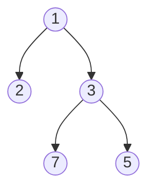

# 堆和优先队列


## 一、什么是堆？

**堆（Heap）** 是一种特殊的**完全二叉树**，满足**堆序性**：

- **最大堆（Max Heap）**：父节点 ≥ 子节点，根节点是最大值。
- **最小堆（Min Heap）**：父节点 ≤ 子节点，根节点是最小值。



数组表示：`[1, 3, 2, 7, 5]`，下标 0-4。

## 二、堆的数组表示

**完全二叉树** 用数组存储**没有空间浪费**（下标从 0）：

| 关系 | 公式 |
|------|------|
| 父节点 | `parent(i) = (i - 1) / 2` |
| 左孩子 | `left(i) = 2*i + 1` |
| 右孩子 | `right(i) = 2*i + 2` |

如果下标从 1 开始（更简洁）：

| 关系 | 公式 |
|------|------|
| 父节点 | `parent(i) = i / 2` |
| 左孩子 | `left(i) = 2*i` |
| 右孩子 | `right(i) = 2*i + 1` |

## 三、堆的基本操作

| 操作 | 说明 | 时间 |
|------|------|------|
| `insert` | 插入 + sift-up | O(log n) |
| `extractMax/Min` | 取堆顶 + sift-down | O(log n) |
| `peek` | 查看堆顶 | O(1) |
| `heapify` | 数组建堆 | O(n) |
| `decrease-key` / `increase-key` | 改某个位置的值 | O(log n) |

> **decrease-key**（关键能力）：
>
> 1. 减小某节点的值 → 用 sift-up（因为新值更小，可能要往上浮）。
> 2. 增大某节点的值 → 用 sift-down（可能往下沉）。
>
> Java 的 `PriorityQueue` **不支持** decrease-key，需要**删除 + 重新插入**，或者**用索引堆**（自己实现）。
>
> 在 **Dijkstra** 中，如果要优化"重复入队的旧条目"必须用索引堆，否则 O((V+E) log V) 退化成 O(V² log V)。

## 四、核心操作详解

### 4.1 Sift-up（上浮，插入用）

```java tab
private void siftUp(int i) {
    while (i > 0 && heap[i] < heap[parent(i)]) {  // 最小堆
        swap(i, parent(i));
        i = parent(i);
    }
}
```
```typescript tab
private siftUp(i: number): void {
    while (i > 0 && this.heap[i] < this.heap[this.parent(i)]) {  // 最小堆
        this.swap(i, this.parent(i));
        i = this.parent(i);
    }
}
```
```python tab
def sift_up(self, i: int) -> None:
    while i > 0 and self.heap[i] < self.heap[self.parent(i)]:  # 最小堆
        self.swap(i, self.parent(i))
        i = self.parent(i)
```

### 4.2 Sift-down（下沉，删除用）

```java tab
private void siftDown(int i) {
    int n = size;
    while (true) {
        int l = left(i), r = right(i), smallest = i;
        if (l < n && heap[l] < heap[smallest]) smallest = l;
        if (r < n && heap[r] < heap[smallest]) smallest = r;
        if (smallest == i) break;
        swap(i, smallest);
        i = smallest;
    }
}
```
```typescript tab
private siftDown(i: number): void {
    const n = this.size;
    while (true) {
        const l = this.left(i), r = this.right(i);
        let smallest = i;
        if (l < n && this.heap[l] < this.heap[smallest]) smallest = l;
        if (r < n && this.heap[r] < this.heap[smallest]) smallest = r;
        if (smallest === i) break;
        this.swap(i, smallest);
        i = smallest;
    }
}
```
```python tab
def sift_down(self, i: int) -> None:
    n = self.size
    while True:
        l, r, smallest = self.left(i), self.right(i), i
        if l < n and self.heap[l] < self.heap[smallest]:
            smallest = l
        if r < n and self.heap[r] < self.heap[smallest]:
            smallest = r
        if smallest == i:
            break
        self.swap(i, smallest)
        i = smallest
```

### 4.3 Heapify（数组建堆）

从最后一个非叶子节点 `(n/2 - 1)` 向前，逐个 sift-down：

```java tab
public void heapify(int[] arr) {
    this.heap = arr;
    this.size = arr.length;
    for (int i = size / 2 - 1; i >= 0; i--) siftDown(i);
}
```
```typescript tab
heapify(arr: number[]): void {
    this.heap = arr;
    this.size = arr.length;
    for (let i = Math.floor(this.size / 2) - 1; i >= 0; i--) this.siftDown(i);
}
```
```python tab
def heapify(self, arr: list[int]) -> None:
    self.heap = arr
    self.size = len(arr)
    for i in range(self.size // 2 - 1, -1, -1):
        self.sift_down(i)
```

**为什么是 O(n) 而不是 O(n log n)？**  
因为大部分节点都在底层，sift-down 的代价很低。数学证明：

> `T(n) = Σ_{i=0}^{h} (节点数 at level i) × (h - i) ≤ n`

## 五、代码实现（完整最小堆）

```java tab
public class MinHeap {
    private int[] heap;
    private int size;

    public MinHeap(int capacity) { heap = new int[capacity]; }

    public void insert(int value) {
        if (size == heap.length) resize();
        heap[size] = value;
        siftUp(size++);
    }

    public int extractMin() {
        if (size == 0) throw new NoSuchElementException();
        int min = heap[0];
        heap[0] = heap[--size];
        siftDown(0);
        return min;
    }

    public int peek() {
        if (size == 0) throw new NoSuchElementException();
        return heap[0];
    }

    public int size() { return size; }

    private void siftUp(int i) {
        while (i > 0 && heap[i] < heap[(i - 1) / 2]) {
            swap(i, (i - 1) / 2);
            i = (i - 1) / 2;
        }
    }

    private void siftDown(int i) {
        while (true) {
            int l = 2 * i + 1, r = 2 * i + 2, smallest = i;
            if (l < size && heap[l] < heap[smallest]) smallest = l;
            if (r < size && heap[r] < heap[smallest]) smallest = r;
            if (smallest == i) break;
            swap(i, smallest);
            i = smallest;
        }
    }

    private void swap(int i, int j) { int t = heap[i]; heap[i] = heap[j]; heap[j] = t; }
    private void resize() { heap = Arrays.copyOf(heap, heap.length * 2); }
}
```
```typescript tab
class MinHeap {
    private heap: number[];
    private _size: number;

    constructor(capacity: number) {
        this.heap = new Array(capacity);
        this._size = 0;
    }

    insert(value: number): void {
        if (this._size === this.heap.length) this.resize();
        this.heap[this._size] = value;
        this.siftUp(this._size++);
    }

    extractMin(): number {
        if (this._size === 0) throw new Error("Heap is empty");
        const min = this.heap[0];
        this.heap[0] = this.heap[--this._size];
        this.siftDown(0);
        return min;
    }

    peek(): number {
        if (this._size === 0) throw new Error("Heap is empty");
        return this.heap[0];
    }

    get size(): number { return this._size; }

    private siftUp(i: number): void {
        while (i > 0 && this.heap[i] < this.heap[(i - 1) >> 1]) {
            this.swap(i, (i - 1) >> 1);
            i = (i - 1) >> 1;
        }
    }

    private siftDown(i: number): void {
        while (true) {
            const l = 2 * i + 1, r = 2 * i + 2;
            let smallest = i;
            if (l < this._size && this.heap[l] < this.heap[smallest]) smallest = l;
            if (r < this._size && this.heap[r] < this.heap[smallest]) smallest = r;
            if (smallest === i) break;
            this.swap(i, smallest);
            i = smallest;
        }
    }

    private swap(i: number, j: number): void {
        [this.heap[i], this.heap[j]] = [this.heap[j], this.heap[i]];
    }
    private resize(): void { this.heap.length *= 2; }
}
```
```python tab
import heapq  # 实际开发直接用 heapq

class MinHeap:
    def __init__(self, capacity: int):
        self.heap = [0] * capacity
        self.size = 0

    def insert(self, value: int) -> None:
        if self.size == len(self.heap):
            self.heap.extend([0] * len(self.heap))
        self.heap[self.size] = value
        self._sift_up(self.size)
        self.size += 1

    def extract_min(self) -> int:
        if self.size == 0:
            raise IndexError("Heap is empty")
        min_val = self.heap[0]
        self.size -= 1
        self.heap[0] = self.heap[self.size]
        self._sift_down(0)
        return min_val

    def peek(self) -> int:
        if self.size == 0:
            raise IndexError("Heap is empty")
        return self.heap[0]

    def _sift_up(self, i: int) -> None:
        while i > 0 and self.heap[i] < self.heap[(i - 1) // 2]:
            self._swap(i, (i - 1) // 2)
            i = (i - 1) // 2

    def _sift_down(self, i: int) -> None:
        while True:
            l, r, smallest = 2 * i + 1, 2 * i + 2, i
            if l < self.size and self.heap[l] < self.heap[smallest]:
                smallest = l
            if r < self.size and self.heap[r] < self.heap[smallest]:
                smallest = r
            if smallest == i:
                break
            self._swap(i, smallest)
            i = smallest

    def _swap(self, i: int, j: int) -> None:
        self.heap[i], self.heap[j] = self.heap[j], self.heap[i]
```

## 六、内置优先队列

Java 提供堆实现：

```java tab
// 默认是最小堆
PriorityQueue<Integer> minPQ = new PriorityQueue<>();
minPQ.offer(50); minPQ.offer(30); minPQ.offer(70);
minPQ.poll();   // 30

// 自定义最大堆
PriorityQueue<Integer> maxPQ = new PriorityQueue<>((a, b) -> b - a);

// 自定义比较器
PriorityQueue<int[]> pq = new PriorityQueue<>((a, b) -> a[0] - b[0]);   // 按第一个字段排序
```
```typescript tab
// 使用 @datastructures-js/priority-queue
import { MinPriorityQueue, MaxPriorityQueue } from '@datastructures-js/priority-queue';

// 默认最小堆
const minPQ = new MinPriorityQueue<number>();
minPQ.enqueue(50); minPQ.enqueue(30); minPQ.enqueue(70);
minPQ.dequeue().element;   // 30

// 最大堆
const maxPQ = new MaxPriorityQueue<number>();

// 自定义比较器（按元组第一个字段排序）
const pq = new MinPriorityQueue<number[]>({ compare: (a, b) => a[0] - b[0] });
```
```python tab
import heapq

# 默认是最小堆
min_pq = []
heapq.heappush(min_pq, 50); heapq.heappush(min_pq, 30); heapq.heappush(min_pq, 70)
heapq.heappop(min_pq)   # 30

# 最大堆（取负技巧）
max_pq = []
heapq.heappush(max_pq, -50)  # 存负值
-heapq.heappop(max_pq)       # 50

# 自定义排序（按元组第一个字段）
pq = []
heapq.heappush(pq, (3, 'a'))
heapq.heappush(pq, (1, 'b'))   # 按第一个字段排序
```

> 注意：`PriorityQueue` 不允许 null，迭代顺序**不保证有序**（要顺序遍历请用 `poll`）。

## 七、堆排序

利用堆的 extractMin 反复取出最小值：

```java tab
public void heapSort(int[] arr) {
    int n = arr.length;
    // 1. 建堆
    for (int i = n / 2 - 1; i >= 0; i--) siftDown(arr, n, i);
    // 2. 反复取堆顶，放到末尾
    for (int i = n - 1; i > 0; i--) {
        swap(arr, 0, i);
        siftDown(arr, i, 0);
    }
}

private void siftDown(int[] arr, int n, int i) {
    while (true) {
        int l = 2*i + 1, r = 2*i + 2, smallest = i;
        if (l < n && arr[l] < arr[smallest]) smallest = l;
        if (r < n && arr[r] < arr[smallest]) smallest = r;
        if (smallest == i) break;
        swap(arr, i, smallest);
        i = smallest;
    }
}
```
```typescript tab
function heapSort(arr: number[]): void {
    const n = arr.length;
    // 1. 建堆
    for (let i = Math.floor(n / 2) - 1; i >= 0; i--) siftDown(arr, n, i);
    // 2. 反复取堆顶，放到末尾
    for (let i = n - 1; i > 0; i--) {
        [arr[0], arr[i]] = [arr[i], arr[0]];
        siftDown(arr, i, 0);
    }
}

function siftDown(arr: number[], n: number, i: number): void {
    while (true) {
        const l = 2*i + 1, r = 2*i + 2;
        let smallest = i;
        if (l < n && arr[l] < arr[smallest]) smallest = l;
        if (r < n && arr[r] < arr[smallest]) smallest = r;
        if (smallest === i) break;
        [arr[i], arr[smallest]] = [arr[smallest], arr[i]];
        i = smallest;
    }
}
```
```python tab
def heap_sort(arr: list[int]) -> None:
    n = len(arr)
    # 1. 建堆
    for i in range(n // 2 - 1, -1, -1):
        sift_down(arr, n, i)
    # 2. 反复取堆顶，放到末尾
    for i in range(n - 1, 0, -1):
        arr[0], arr[i] = arr[i], arr[0]
        sift_down(arr, i, 0)

def sift_down(arr: list[int], n: int, i: int) -> None:
    while True:
        l, r, smallest = 2*i + 1, 2*i + 2, i
        if l < n and arr[l] < arr[smallest]:
            smallest = l
        if r < n and arr[r] < arr[smallest]:
            smallest = r
        if smallest == i:
            break
        arr[i], arr[smallest] = arr[smallest], arr[i]
        i = smallest
```

- **时间**：O(n log n)
- **空间**：O(1)
- **不稳定排序**

## 八、典型应用

### 8.1 Top K 问题

求前 K 大元素：

```java tab
// 用最小堆维护 K 个最大元素
PriorityQueue<Integer> pq = new PriorityQueue<>();
for (int x : nums) {
    pq.offer(x);
    if (pq.size() > k) pq.poll();      // 把最小的扔掉
}
return pq.peek();
```
```typescript tab
// 用最小堆维护 K 个最大元素
import { MinPriorityQueue } from '@datastructures-js/priority-queue';
const pq = new MinPriorityQueue<number>();
for (const x of nums) {
    pq.enqueue(x);
    if (pq.size() > k) pq.dequeue();   // 把最小的扔掉
}
return pq.front().element;
```
```python tab
# 用最小堆维护 K 个最大元素
import heapq
pq = []
for x in nums:
    heapq.heappush(pq, x)
    if len(pq) > k:
        heapq.heappop(pq)              # 把最小的扔掉
return pq[0]
```

**复杂度**：O(n log k)，空间 O(k)。当 k << n 时远优于排序。

### 8.2 第 K 大/小元素

快速选择（QuickSelect）更快（O(n)），但实现复杂。堆解法 O(n log k) 更简单。

### 8.3 数据流的中位数

```java tab
// 双堆：最大堆存较小一半，最小堆存较大一半
PriorityQueue<Integer> maxHeap = new PriorityQueue<>((a, b) -> b - a);  // 较小一半
PriorityQueue<Integer> minHeap = new PriorityQueue<>();                // 较大一半

void addNum(int num) {
    maxHeap.offer(num);
    minHeap.offer(maxHeap.poll());
    if (maxHeap.size() < minHeap.size()) maxHeap.offer(minHeap.poll());
}

double findMedian() {
    return maxHeap.size() > minHeap.size() 
        ? maxHeap.peek() 
        : (maxHeap.peek() + minHeap.peek()) / 2.0;
}
```
```typescript tab
// 双堆：最大堆存较小一半，最小堆存较大一半
import { MinPriorityQueue, MaxPriorityQueue } from '@datastructures-js/priority-queue';
const maxHeap = new MaxPriorityQueue<number>();  // 较小一半
const minHeap = new MinPriorityQueue<number>();  // 较大一半

function addNum(num: number): void {
    maxHeap.enqueue(num);
    minHeap.enqueue(maxHeap.dequeue().element);
    if (maxHeap.size() < minHeap.size()) maxHeap.enqueue(minHeap.dequeue().element);
}

function findMedian(): number {
    return maxHeap.size() > minHeap.size()
        ? maxHeap.front().element
        : (maxHeap.front().element + minHeap.front().element) / 2.0;
}
```
```python tab
# 双堆：最大堆存较小一半，最小堆存较大一半
import heapq
max_heap = []  # 较小一半（存负值模拟最大堆）
min_heap = []  # 较大一半

def add_num(num: int) -> None:
    heapq.heappush(max_heap, -num)
    heapq.heappush(min_heap, -heapq.heappop(max_heap))
    if len(max_heap) < len(min_heap):
        heapq.heappush(max_heap, -heapq.heappop(min_heap))

def find_median() -> float:
    if len(max_heap) > len(min_heap):
        return -max_heap[0]
    return (-max_heap[0] + min_heap[0]) / 2.0
```

**复杂度**：插入 O(log n)，查询 O(1)。

### 8.4 Dijkstra 最短路

详见图论专题——优先队列取当前距离最小的节点。

### 8.5 哈夫曼编码

每次合并两个最小频率节点 → 用最小堆优化到 O(n log n)。

### 8.6 任务调度

CPU 调度、按优先级处理任务。

## 九、复杂度汇总

| 操作 | 时间 |
|------|------|
| 插入 | O(log n) |
| 取堆顶 | O(1) |
| 删除堆顶 | O(log n) |
| Heapify | O(n) |
| 堆排序 | O(n log n) |

## 十、易错点

1. **数组下标**：从 0 还是从 1 开始，公式不同。
2. **比较器方向**：最小堆用 `a < b`；最大堆用 `a > b`。
3. **堆不是有序数组**：迭代 `PriorityQueue` 输出**不一定有序**。
4. **重复元素**：堆允许重复，按比较器排序。
5. **空堆操作**：`peek` / `poll` 空堆会抛异常，要先 `isEmpty()`。

## 十一、堆 vs 其他数据结构

| 场景 | 推荐 |
|------|------|
| 频繁取最大/最小 | 堆 |
| 范围查询 | BST |
| 队列先来先服务 | 普通队列 |
| 滑动窗口最值 | 单调队列 |
| Top K | 堆 / QuickSelect |

## 十二、刷题清单

| 难度 | 题目 | 类型 |
|------|------|------|
| 🟢 | 数据流中第 K 大元素 | Top K |
| 🟢 | 数组中的第 K 个最大元素 | 堆排序 |
| 🟡 | 前 K 个高频元素 | 堆 + 哈希 |
| 🟡 | 数据流的中位数 | 双堆 |
| 🟡 | 滑动窗口中位数 | 平衡树 |
| 🟠 | 接雨水 II | 优先队列 BFS |
| 🟠 | 丑数 II | 堆 / 三指针 |
| 🟠 | 超级丑数 | 堆 / 指针 |
| 🔴 | IPO | 堆 + 贪心 |

## 十三、心法

> **堆 = 优先队列的底层**。  
> 看到"取最大/最小"想堆；看到"Top K"想堆。  
> 不想手写就用 `PriorityQueue`，但要知道 sift-up / sift-down 的原理。
