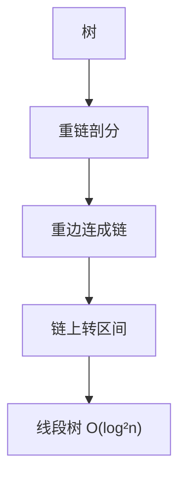

# 树链剖分

树链剖分（Heavy-Light Decomposition, HLD）将树上的路径操作转化为 O(log n) 次区间操作，配合线段树实现高效的树上路径查询与修改。

## 一、核心思想



将树的边分为**重边**和**轻边**：
- 重儿子：子树最大的儿子
- 重链：沿重边向下形成的链

性质：从任意节点到根，最多经过 O(log n) 条轻边 → O(log n) 条重链。

```
        1
       / \
      2*  3       (* = 重儿子)
     / \
    4*  5
   /
  6*

重链: 1→2→4→6, 3, 5
```

## 二、两次 DFS

```java tab
int[] size, heavy, depth, parent, top, dfn, rank;
int timer = 0;

// 第一次 DFS：求子树大小、重儿子、深度、父节点
void dfs1(int u, int p, int d) {
    parent[u] = p;
    depth[u] = d;
    size[u] = 1;
    int maxSub = 0;
    for (int v : adj[u]) {
        if (v == p) continue;
        dfs1(v, u, d + 1);
        size[u] += size[v];
        if (size[v] > maxSub) {
            maxSub = size[v];
            heavy[u] = v;
        }
    }
}

// 第二次 DFS：分配 dfn（重链优先）
void dfs2(int u, int topNode) {
    top[u] = topNode;
    dfn[u] = ++timer;
    rank[timer] = u;
    if (heavy[u] == 0) return; // 叶子
    dfs2(heavy[u], topNode);   // 重儿子先走，同一条链
    for (int v : adj[u]) {
        if (v == parent[u] || v == heavy[u]) continue;
        dfs2(v, v); // 轻儿子开新链
    }
}
```

```typescript tab
let size: number[], heavy: number[], depth: number[], parent: number[];
let top: number[], dfn: number[], rank: number[];
let timer = 0;

// 第一次 DFS：求子树大小、重儿子、深度、父节点
function dfs1(u: number, p: number, d: number): void {
    parent[u] = p;
    depth[u] = d;
    size[u] = 1;
    let maxSub = 0;
    for (const v of adj[u]) {
        if (v === p) continue;
        dfs1(v, u, d + 1);
        size[u] += size[v];
        if (size[v] > maxSub) {
            maxSub = size[v];
            heavy[u] = v;
        }
    }
}

// 第二次 DFS：分配 dfn（重链优先）
function dfs2(u: number, topNode: number): void {
    top[u] = topNode;
    dfn[u] = ++timer;
    rank[timer] = u;
    if (heavy[u] === 0) return; // 叶子
    dfs2(heavy[u], topNode);   // 重儿子先走，同一条链
    for (const v of adj[u]) {
        if (v === parent[u] || v === heavy[u]) continue;
        dfs2(v, v); // 轻儿子开新链
    }
}
```

```python tab
size, heavy, depth, parent = [], [], [], []
top, dfn, rank = [], [], []
timer = 0

# 第一次 DFS：求子树大小、重儿子、深度、父节点
def dfs1(u: int, p: int, d: int) -> None:
    parent[u] = p
    depth[u] = d
    size[u] = 1
    max_sub = 0
    for v in adj[u]:
        if v == p:
            continue
        dfs1(v, u, d + 1)
        size[u] += size[v]
        if size[v] > max_sub:
            max_sub = size[v]
            heavy[u] = v

# 第二次 DFS：分配 dfn（重链优先）
def dfs2(u: int, top_node: int) -> None:
    global timer
    top[u] = top_node
    timer += 1
    dfn[u] = timer
    rank[timer] = u
    if heavy[u] == 0:
        return  # 叶子
    dfs2(heavy[u], top_node)  # 重儿子先走，同一条链
    for v in adj[u]:
        if v == parent[u] or v == heavy[u]:
            continue
        dfs2(v, v)  # 轻儿子开新链
```

## 三、路径操作

### LCA（最近公共祖先）

```java tab
int lca(int u, int v) {
    while (top[u] != top[v]) {
        if (depth[top[u]] < depth[top[v]]) v = parent[top[v]];
        else u = parent[top[u]];
    }
    return depth[u] < depth[v] ? u : v;
}
```

```typescript tab
function lca(u: number, v: number): number {
    while (top[u] !== top[v]) {
        if (depth[top[u]] < depth[top[v]]) v = parent[top[v]];
        else u = parent[top[u]];
    }
    return depth[u] < depth[v] ? u : v;
}
```

```python tab
def lca(u: int, v: int) -> int:
    while top[u] != top[v]:
        if depth[top[u]] < depth[top[v]]:
            v = parent[top[v]]
        else:
            u = parent[top[u]]
    return u if depth[u] < depth[v] else v
```

### 路径求和（配合线段树）

```java tab
long queryPath(int u, int v) {
    long res = 0;
    while (top[u] != top[v]) {
        if (depth[top[u]] < depth[top[v]]) {
            int tmp = u; u = v; v = tmp;
        }
        res += segTree.query(dfn[top[u]], dfn[u]);
        u = parent[top[u]];
    }
    if (depth[u] > depth[v]) { int tmp = u; u = v; v = tmp; }
    res += segTree.query(dfn[u], dfn[v]);
    return res;
}
```

```typescript tab
function queryPath(u: number, v: number): number {
    let res = 0;
    while (top[u] !== top[v]) {
        if (depth[top[u]] < depth[top[v]]) {
            [u, v] = [v, u];
        }
        res += segTree.query(dfn[top[u]], dfn[u]);
        u = parent[top[u]];
    }
    if (depth[u] > depth[v]) [u, v] = [v, u];
    res += segTree.query(dfn[u], dfn[v]);
    return res;
}
```

```python tab
def query_path(u: int, v: int) -> int:
    res = 0
    while top[u] != top[v]:
        if depth[top[u]] < depth[top[v]]:
            u, v = v, u
        res += seg_tree.query(dfn[top[u]], dfn[u])
        u = parent[top[u]]
    if depth[u] > depth[v]:
        u, v = v, u
    res += seg_tree.query(dfn[u], dfn[v])
    return res
```

### 路径修改

```java tab
void updatePath(int u, int v, int val) {
    while (top[u] != top[v]) {
        if (depth[top[u]] < depth[top[v]]) {
            int tmp = u; u = v; v = tmp;
        }
        segTree.update(dfn[top[u]], dfn[u], val);
        u = parent[top[u]];
    }
    if (depth[u] > depth[v]) { int tmp = u; u = v; v = tmp; }
    segTree.update(dfn[u], dfn[v], val);
}
```

```typescript tab
function updatePath(u: number, v: number, val: number): void {
    while (top[u] !== top[v]) {
        if (depth[top[u]] < depth[top[v]]) {
            [u, v] = [v, u];
        }
        segTree.update(dfn[top[u]], dfn[u], val);
        u = parent[top[u]];
    }
    if (depth[u] > depth[v]) [u, v] = [v, u];
    segTree.update(dfn[u], dfn[v], val);
}
```

```python tab
def update_path(u: int, v: int, val: int) -> None:
    while top[u] != top[v]:
        if depth[top[u]] < depth[top[v]]:
            u, v = v, u
        seg_tree.update(dfn[top[u]], dfn[u], val)
        u = parent[top[u]]
    if depth[u] > depth[v]:
        u, v = v, u
    seg_tree.update(dfn[u], dfn[v], val)
```

## 四、复杂度

| 操作 | 时间 |
|------|------|
| 预处理（两次 DFS） | O(n) |
| 路径查询/修改 | O(log²n)（log n 条链 × 线段树 log n） |
| 子树查询/修改 | O(log n)（dfn 连续） |
| LCA | O(log n) |

## 五、子树操作

由于 dfs2 中子树的 dfn 是连续的，子树操作直接转化为区间操作：

```java tab
// 子树求和
long querySubtree(int u) {
    return segTree.query(dfn[u], dfn[u] + size[u] - 1);
}
```

```typescript tab
// 子树求和
function querySubtree(u: number): number {
    return segTree.query(dfn[u], dfn[u] + size[u] - 1);
}
```

```python tab
# 子树求和
def query_subtree(u: int) -> int:
    return seg_tree.query(dfn[u], dfn[u] + size[u] - 1)
```

## 六、面试要点

1. **重链性质**：任意路径被分成 O(log n) 段连续区间
2. **dfn 编号**：重链上节点编号连续 → 线段树区间操作
3. **与 LCA 的关系**：树剖可以 O(log n) 求 LCA，比倍增更实用
4. **适用场景**：树上路径/子树的动态查询与修改
5. **LeetCode**：无直接题，竞赛常用（洛谷 P3384）
